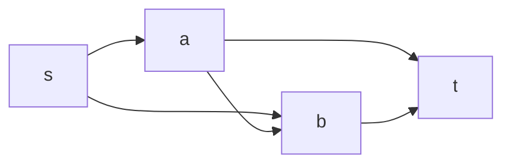

Picture a network of one-way pipes. Each pipe has a capacity — litres per second it can carry. Water enters at one node, the **source** `s`, and leaves at another, the **sink** `t`. At every other node, what flows in must flow out. Question: what's the maximum rate you can get from `s` to `t`?

This is the **maximum flow** problem, and it's worth caring about because a surprising number of things that don't look like plumbing *are* plumbing: assigning workers to jobs, scheduling planes to routes, choosing which pixels are foreground, deciding which projects to fund. This post builds the algorithm from one idea — find a path with slack and push more water down it — and then explains the theorem that makes flow a Swiss Army knife.

## Flows and the obvious greedy trap

A **flow** assigns each edge `(u, v)` a value `f(u, v)` with `0 ≤ f(u, v) ≤ capacity(u, v)`, and for every node except `s` and `t`, total inflow equals total outflow. The **value** of the flow is the net amount leaving `s`. We want to maximise it.

The naive greedy: find any `s → t` path where every edge still has spare capacity, push as much as its tightest edge allows, repeat. Sometimes this works. Often it strands you: an early path saturates an edge that a better solution needed to use *the other way*, and now there's no augmenting path even though the flow isn't maximal.

The fix is to let the algorithm **take flow back**.

## The residual graph

For a current flow `f`, build a **residual graph**. For each original edge `(u, v)` with capacity `c` carrying flow `f`:

- a **forward** residual edge `(u, v)` with capacity `c - f` — the room still available;
- a **backward** residual edge `(v, u)` with capacity `f` — permission to cancel up to `f` units already sent.

An **augmenting path** is any `s → t` path in the residual graph. Its **bottleneck** is the smallest residual capacity along it. Push that much: add it to forward edges, subtract it from backward edges. Cancelling flow on a backward edge is the "take it back" move — it reroutes water that a greedy step committed prematurely.



Run out of augmenting paths and you're done. That's the **Ford–Fulkerson method** — a *method*, not an algorithm, because it doesn't say *which* augmenting path to pick, and that choice decides everything.

## Making the path choice matter

**Plain Ford–Fulkerson** (any path, e.g. via DFS). Each augmentation raises the flow by at least 1 if capacities are integers, so it terminates in at most `F` iterations where `F` is the max-flow value — `O(E·F)`. That `F` is a problem: a graph with capacities in the millions and an adversarial path choice can take millions of iterations to move what two iterations should. With *irrational* capacities it can fail to terminate at all.

**Edmonds–Karp** — pick the augmenting path with the **fewest edges**, found by [BFS](/citadel/algorithms/PathFinding). This removes capacities from the complexity entirely. The shortest `s → t` distance in the residual graph never decreases across augmentations, and each edge can become the bottleneck only `O(V)` times, giving `O(V·E)` augmentations and **`O(V·E²)`** overall. Ten lines more than DFS, and now the runtime is polynomial in the graph size alone.

```python
from collections import deque

def edmonds_karp(capacity, s, t):
    n = len(capacity)
    flow = [[0] * n for _ in range(n)]
    total = 0
    while True:
        parent = [-1] * n
        parent[s] = s
        q = deque([s])
        while q and parent[t] == -1:
            u = q.popleft()
            for v in range(n):
                residual = capacity[u][v] - flow[u][v]
                if residual > 0 and parent[v] == -1:
                    parent[v] = u
                    q.append(v)
        if parent[t] == -1:
            return total, flow                 # no augmenting path: done
        # bottleneck along the path
        bottleneck, v = float("inf"), t
        while v != s:
            u = parent[v]
            bottleneck = min(bottleneck, capacity[u][v] - flow[u][v])
            v = u
        v = t
        while v != s:
            u = parent[v]
            flow[u][v] += bottleneck
            flow[v][u] -= bottleneck           # backward edge
            v = u
        total += bottleneck
```

**Dinic's algorithm** — the one to use in practice. Each phase does a BFS to compute a **level graph** (each node's distance from `s`), then finds a **blocking flow** — a maximal set of augmenting paths that only ever go one level deeper — in a single DFS pass with edge pointers. The level distance strictly increases each phase, so there are `O(V)` phases, each `O(V·E)`, for **`O(V²·E)`**. On unit-capacity graphs it collapses to `O(E·√E)`, and on bipartite matching graphs to `O(E·√V)` — the Hopcroft–Karp bound, for free.

For very dense graphs, **push–relabel** (`O(V²·√E)` or `O(V³)`) is the other workhorse; it abandons augmenting paths for local "push excess toward the sink, relabel stuck nodes" moves.

## Max-flow min-cut

An **`s`–`t` cut** partitions the nodes into a set `S` containing `s` and a set `T` containing `t`. Its **capacity** is the total capacity of edges going *from `S` to `T`* (backward edges don't count). Every unit of flow must cross every cut, so:

> **max-flow value ≤ capacity of any `s`–`t` cut.**

The **max-flow min-cut theorem** says this is tight: the maximum flow *equals* the minimum cut capacity. The proof falls out of the algorithm. When Ford–Fulkerson stops, let `S` be the nodes still reachable from `s` in the residual graph. Then `t ∉ S`; every edge from `S` to `T` is saturated (or it'd extend the residual reachability); every edge from `T` to `S` carries zero flow. So the flow across this cut equals its capacity, and no cut can be smaller. Read the min cut straight off the final residual graph with one BFS from `s`.

This duality is why flow is everywhere.

## What flow secretly solves

- **Bipartite matching.** Left vertices, right vertices, an edge for each allowed pairing. Add `s → each left` and `each right → t`, all capacity 1. Max flow = maximum matching; **König's theorem** (min vertex cover = max matching in bipartite graphs) is just min-cut in disguise.
- **Vertex-disjoint / edge-disjoint paths.** Max number of edge-disjoint `s → t` paths = max flow with all capacities 1 (**Menger's theorem**).
- **Project selection / image segmentation.** Each project has a profit and prerequisites; each pixel wants to be foreground or background with per-pixel and neighbour-agreement costs. Model as a min-cut: the cut you're forced to make is the optimal partition. This is how graph-cut segmentation works.
- **Scheduling and assignment** with capacities — planes to flights, shifts to staff, bandwidth to demands.
- **Minimum-cost max flow.** Give edges a per-unit cost as well as a capacity and push the *cheapest* max flow, by augmenting along shortest paths under a cost metric (Bellman–Ford or Johnson-reweighted Dijkstra). This subsumes the [assignment problem](/citadel/algorithms/MinimumSpanningTree) and transportation problems.

The modelling move is always the same: capacity-1 edges encode "pick this or don't," `s`/`t` gadgets encode the two sides of a decision, and the min cut is the optimal choice.

## The one idea to keep

Max flow is greedy done right: push water down any path with slack, but keep a *residual* backward edge on every used pipe so a later step can undo a premature commitment — and choose augmenting paths by BFS so capacity magnitudes never enter the running time. The payoff is the max-flow min-cut theorem: the most you can push equals the cheapest set of pipes that severs source from sink, and that equivalence is what lets you recast matching, disjoint paths, and segmentation as flow.
