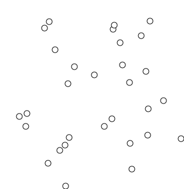

You need to connect a set of towns with fibre so every town can reach every other, using the least total cable. That's a **minimum spanning tree**: given a connected, undirected, edge-weighted graph, find the subset of edges that keeps everything connected, has no cycles, and has minimum total weight. It has $|V| - 1$ edges, and it's unique when all edge weights are distinct.

Two greedy algorithms find it, and both are justified by the same fact.

## The cut property

Split the vertices into any two non-empty groups. Among all edges that cross the split, the cheapest one is in *some* MST. (If an MST didn't contain it, adding it would create a cycle; that cycle also crosses the split via a second, no-cheaper edge, which you can remove for an MST that's no worse and now contains the cheap edge.) Every greedy step below is an application of this.

## Kruskal's algorithm

Consider edges from cheapest to most expensive; add an edge unless it would connect two vertices already connected (which would make a cycle). "Already connected?" is answered by a **disjoint-set union** (union-find) structure.

```python
def kruskal(n, edges):                       # n vertices 0..n-1; edges: (weight, u, v)
    parent = list(range(n))

    def find(x):
        while parent[x] != x:
            parent[x] = parent[parent[x]]    # path compression
            x = parent[x]
        return x

    mst, total = [], 0
    for w, u, v in sorted(edges):
        ru, rv = find(u), find(v)
        if ru != rv:                         # different components: no cycle
            parent[ru] = rv
            mst.append((u, v, w))
            total += w
    return mst, total


edges = [(1, 0, 1), (4, 0, 2), (3, 1, 2), (2, 1, 3), (5, 2, 3)]
_, total = kruskal(4, edges)
assert total == 6                            # edges 0-1(1), 1-3(2), 1-2(3)
```

Each cheapest edge that joins two components is the lightest edge across the cut between those components, so the cut property puts it in an MST.



## Prim's algorithm

Grow one tree from an arbitrary root. Repeatedly add the cheapest edge that connects a vertex in the tree to one outside it. A min-heap keyed on "cheapest known edge to the tree" makes each step fast.

```python
import heapq

def prim(n, adj):                            # adj[u] = list of (weight, v)
    in_tree = [False] * n
    heap = [(0, 0)]                          # (edge weight, vertex), start at vertex 0
    total = 0
    while heap:
        w, u = heapq.heappop(heap)
        if in_tree[u]:
            continue
        in_tree[u] = True
        total += w
        for weight, v in adj[u]:
            if not in_tree[v]:
                heapq.heappush(heap, (weight, v))
    return total


adj = [[(1, 1), (4, 2)], [(1, 0), (3, 2), (2, 3)], [(4, 0), (3, 1), (5, 3)], [(2, 1), (5, 2)]]
assert prim(4, adj) == 6
```

The edge Prim adds is the lightest across the cut between "in the tree" and "not yet" — the cut property again. Prim is structurally Dijkstra's algorithm with "edge weight" in place of "distance from source".


## Cost

| Algorithm | Time | Notes |
| --- | --- | --- |
| Kruskal | $O(E \log E)$ | Dominated by sorting edges; union-find adds only $O(E\,\alpha(V))$, effectively linear. |
| Prim, binary heap | $O(E \log V)$ | Good general default with an adjacency list. |
| Prim, array scan | $O(V^2)$ | Simple; best for dense graphs where $E \approx V^2$. |
| Prim, Fibonacci heap | $O(E + V \log V)$ | Theoretical best; large constants. |

Space is $O(V + E)$ for either. Rule of thumb: Kruskal for sparse graphs, Prim (array version) for dense ones.

## The takeaway

Both algorithms are greedy and both are proved correct by the cut property — they differ only in *which* cut they apply it to (Kruskal: whatever cut a candidate edge happens to cross; Prim: the tree-versus-rest cut). MSTs show up as a subroutine well beyond networking: delete the heaviest MST edges to cluster data, and use an MST to build a 2-approximation for the [travelling salesman problem](/citadel/algorithms/HamiltonianCycle). Prim shares its priority-queue engine with [Huffman coding](/citadel/algorithms/HuffmanCoding) and [Dijkstra's shortest paths](/citadel/algorithms/PathFinding).
