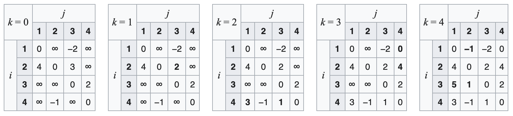

Hey everyone, and welcome back to the blog! Whether it's your GPS app finding the quickest route through traffic, a character in a video game intelligently navigating a complex map, or data packets zipping across the internet, **pathfinding** is at the heart of it all. Pathfinding is the process of plotting the shortest or most optimal route between two points in a graph or network.

It's a fundamental concept in graph theory with countless practical applications. Today, let's explore three classic algorithms that tackle this challenge: Dijkstra's Algorithm, the Bellman-Ford Algorithm, and the Floyd-Warshall Algorithm. Each has its strengths and is suited for different types of pathfinding problems.

## What is Pathfinding? Charting the Optimal Route ️

**Pathfinding** in graph theory involves identifying a path between a starting vertex (source) and an ending vertex (target) in a graph. Often, the goal is to find the **shortest path**, where "shortest" can mean minimum distance, least cost, fastest time, or some other relevant metric represented by edge weights in the graph.

The properties of a good pathfinding algorithm often include:

* Finding the shortest (or optimal) path based on defined criteria.
* Applicability to various optimization problems, like routing in transportation or data networks, or robot motion planning.

## Applications Galore!

Pathfinding algorithms are crucial in many fields:

* **Robotics:** Planning the most efficient path for a robot to move through an environment, avoiding obstacles and minimizing travel time or energy consumption.
* **Video Games:** Creating realistic and intelligent non-player characters (NPCs) that can navigate complex game worlds, find players, or reach objectives.
* **Network Routing:** Determining the most efficient route for data packets to travel through a computer network (like the internet or an internal LAN) to minimize latency and congestion.
* **Logistics and Supply Chain:** Optimizing delivery routes for vehicles.
* **Geographic Information Systems (GIS):** Powering "directions" features in mapping services.

---
## Dijkstra's Algorithm: Finding the Shortest Path (Non-Negative Weights)

Dijkstra's algorithm, conceived by Edsger W. Dijkstra in 1956, is one of the most famous algorithms for finding the shortest paths from a single source vertex to all other vertices in a graph with **non-negative edge weights**.

### How Dijkstra's Works (Conceptual):


1. **Initialization:**

   * For each visited node `v`, `dist[v]` will store the shortest distance found so far from the source `s` to `v`. For each unvisited node `u`, `dist[u]` stores the shortest distance from `s` to `u` when traveling *only via already visited nodes* (or infinity if no such path exists yet).
   * Set the distance to the source vertex `s` as 0 (`s.d = 0`).
   * Set the distance to all other vertices as infinity (`v.d = ∞`).
   * Maintain a set (or priority queue `Q`) of unvisited vertices. Initially, it contains all vertices.
   * For each vertex, store its predecessor `v.π` in the shortest path from `s` (initially NIL).
2. **Iteration:**

   * While `Q` is not empty:
     * Select the vertex `u` in `Q` that has the minimum distance `u.d` (this is the greedy choice).
     * Remove `u` from `Q` (mark `u` as visited; its shortest path is now considered final).
     * For each neighbor `v` of `u` that is still in `Q` (unvisited):
       * **Relaxation Step:** If the distance to `u` plus the weight of the edge `(u, v)` is less than the current known distance to `v` (i.e., `u.d + w(u, v) < v.d`), then we've found a shorter path to `v` through `u`.
       * Update `v.d = u.d + w(u, v)`.
       * Set `v.π = u` (u is the predecessor of v on this shorter path).
       * (If `Q` is a priority queue, update `v`'s priority).
3. **Result:** After the algorithm finishes (when `Q` is empty), the `d` values for all visited vertices represent their shortest distance from the source `s`, and the `π` values can be used to reconstruct the shortest paths.

A great way to visualize this is the animation you linked from Wikipedia, showing how the algorithm explores outwards from the source.

### Pseudocode for Dijkstra's Algorithm:

```pseudocode
function Dijkstra(Graph G, Vertex s): // s is the source vertex
    // Initialize distances and predecessors
    for each vertex v in G.V: // G.V is the set of vertices in G
        v.d = ∞      // Estimated shortest distance from s to v
        v.π = NIL    // Predecessor of v in the shortest path from s
    s.d = 0

    // Q is a min-priority queue of vertices, ordered by their d values
    Q = G.V
 
    while Q is not empty:
        u = vertex in Q with minimum u.d // Extract vertex with smallest distance
        remove u from Q

        // For each neighbor v of u that is still in Q
        for each vertex v in G.Adj[u]: // G.Adj[u] is the set of neighbors of u
            if v is in Q: // Process only if v has not been finalized
                // Relaxation step
                if v.d > u.d + weight(u, v): // weight(u,v) is cost of edge (u,v)
                    v.d = u.d + weight(u, v)
                    v.π = u
                    // (If Q is a priority queue, an implicit DECREASE-KEY operation on v happens here)
           
    return G // G now contains shortest path distances (d) and predecessors (π)
```

### Correctness (Intuition):

Dijkstra's algorithm is greedy. It always selects the unvisited vertex with the smallest known distance from the source. The correctness proof (often by contradiction, as outlined in your provided text) relies on the non-negative edge weights. It shows that when a vertex `u` is extracted from the priority queue, `u.d` is indeed the shortest path distance to `u`. If a shorter path existed through some other unvisited node `w`, then `w` (or an earlier node on that path) would have had a smaller distance and would have been selected before `u`.

---
## Bellman-Ford Algorithm: Handling Negative Edge Weights

Dijkstra's algorithm fails if the graph contains negative edge weights. The **Bellman-Ford algorithm** can handle graphs with negative edge weights and can also detect negative-weight cycles (a cycle whose edges sum to a negative value), which would mean shortest paths are ill-defined (you could keep traversing the cycle to make the path infinitely short).

### How Bellman-Ford Works (Conceptual):


1. **Initialization:** Similar to Dijkstra's, initialize distances to all vertices as infinity, and the distance to the source as 0.
2. **Iterative Relaxation:** Relax all edges in the graph repeatedly. Specifically, iterate $|V|-1$ times (where $|V|$ is the number of vertices). In each iteration, go through every edge $(u,v)$ and update `v.d` if a shorter path is found via `u` (i.e., if `v.d > u.d + weight(u,v)`).
3. **Check for Negative-Weight Cycles:** After $|V|-1$ iterations, perform one more iteration over all edges. If any distance `v.d` can still be shortened, it means there is a negative-weight cycle reachable from the source.

### Pseudocode for Bellman-Ford Algorithm:

```pseudocode
function BellmanFord(Graph G, Vertex s): // s is the source vertex
    // Initialize distances and predecessors
    for each vertex v in G.V:
        v.d = ∞
        v.π = NIL
    s.d = 0
 
    // Relax all edges |V|-1 times
    for i = 1 to |G.V| - 1:
        for each edge (u, v) with weight w_uv in G.E: // G.E is the set of edges
            if v.d > u.d + w_uv:
                v.d = u.d + w_uv
                v.π = u
           
    // Check for negative-weight cycles
    for each edge (u, v) with weight w_uv in G.E:
        if v.d > u.d + w_uv:
            return false // Negative-weight cycle detected
         
    return true // No negative-weight cycles, shortest paths found
```

### Correctness (Intuition):

The Bellman-Ford algorithm works because shortest paths can have at most $|V|-1$ edges (if there are no cycles). The algorithm iteratively finds shortest paths of increasing edge counts. After 1 iteration, it finds all shortest paths of length 1. After 2 iterations, all shortest paths of length at most 2, and so on. After $|V|-1$ iterations, it has found all shortest paths that don't involve cycles. The final loop checks if any further relaxation is possible; if so, a negative-weight cycle must exist. Your provided text gives a more formal inductive proof.

---
## Floyd-Warshall Algorithm: All-Pairs Shortest Paths

While Dijkstra's and Bellman-Ford find shortest paths from a single source, the Floyd-Warshall algorithm finds the shortest paths between all pairs of vertices in a weighted graph (which can have positive or negative edge weights, but no negative-weight cycles).

### How Floyd-Warshall Works (Conceptual):




It's a dynamic programming algorithm. It considers all possible intermediate vertices for each pair of start and end vertices.
Let `dist[i][j]` be the shortest distance from vertex `i` to vertex `j`.
The algorithm iterates through all vertices `k` (from 1 to N, where N is the number of vertices). In each iteration `k`, it updates the shortest path between every pair of vertices `(i, j)` by considering if going from `i` to `k` and then from `k` to `j` yields a shorter path than the currently known shortest path from `i` to `j`.
That is: `dist[i][j] = min(dist[i][j], dist[i][k] + dist[k][j])`.

### Pseudocode for Floyd-Warshall Algorithm:

```pseudocode
function FloydWarshall(Graph G): // G provides vertices and edge weights w(u,v)
    num_vertices = |G.V|
    // dist[i][j] stores the shortest distance from vertex i to vertex j
    // Initialize with edge weights or infinity if no direct edge
    dist = array of size num_vertices × num_vertices

    for i = 0 to num_vertices - 1:
        for j = 0 to num_vertices - 1:
            if i == j:
                dist[i][j] = 0
            else if edge (i, j) exists in G.E:
                dist[i][j] = weight(i, j)
            else:
                dist[i][j] = ∞
 
    // Consider each vertex k as an intermediate vertex
    for k = 0 to num_vertices - 1:
        // For every possible source vertex i
        for i = 0 to num_vertices - 1:
            // For every possible destination vertex j
            for j = 0 to num_vertices - 1:
                // If path from i to j through k is shorter
                if dist[i][k] + dist[k][j] < dist[i][j]:
                    dist[i][j] = dist[i][k] + dist[k][j]
                    // Optionally, store predecessor information here to reconstruct paths
 
    return dist // Matrix of shortest path distances between all pairs
```

### Correctness (Intuition):

The correctness relies on the recursive formula you provided: `shortestPath(i, j, k)` (shortest path from `i` to `j` using intermediate vertices only from `{1...k}`) is the minimum of `shortestPath(i, j, k-1)` (not using k) and `shortestPath(i, k, k-1) + shortestPath(k, j, k-1)` (using `k`). The algorithm iteratively builds this up for `k` from 0 to $N$.

---
## Complexity Comparison: Dijkstra's, Bellman-Ford, and Floyd-Warshall

| Algorithm      | Time Complexity (V=vertices, E=edges)                                         | Space Complexity | Handles Negative Edges?                 | Finds All-Pairs?   |
| -------------- | ----------------------------------------------------------------------------- | ---------------- | --------------------------------------- | ------------------ |
| Dijkstra's     | O((V + E) log V) or O(E log V) with binary heap; O(V²) with adjacency matrix | O(V)             | No                                      | No (Single Source) |
| Bellman-Ford   | O(V * E)                                                                      | O(V)             | Yes (and detects negative cycles)       | No (Single Source) |
| Floyd-Warshall | O(V³)                                                                        | O(V²)           | Yes (but not negative cycles for paths) | Yes                |

---
## Conclusion: Charting the Best Course

Pathfinding is a fundamental algorithmic problem with profound practical applications across robotics, video games, network routing, logistics, and many other fields.

* **Dijkstra's algorithm** is a popular and efficient choice for finding the shortest path from a single source in graphs with non-negative edge weights.
* The **Bellman-Ford algorithm** offers robustness by handling graphs with negative-weight edges and an essential capability to detect negative-weight cycles.
* The **Floyd-Warshall algorithm** provides a powerful solution for finding the shortest paths between all pairs of vertices in a graph.

Each of these algorithms has its specific strengths, use cases, and complexity trade-offs, making them suitable for different types of pathfinding problems. Understanding them equips us to build more intelligent and efficient systems.
