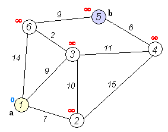
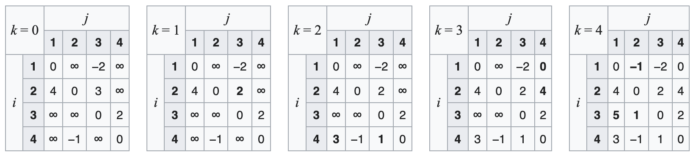

"Shortest path" in a weighted graph — least distance, lowest cost, fastest time — is one problem with three standard answers, and the right one depends on the graph. Are the weights all non-negative? Do you need paths from one source or between every pair? This covers Dijkstra, Bellman-Ford, and Floyd-Warshall, and where each fits.

All three rest on **relaxation**: if `dist[u] + w(u, v) < dist[v]`, you've found a shorter route to `v`, so lower `dist[v]`. The algorithms differ only in the order they relax edges.

## Dijkstra: one source, non-negative weights

Edsger Dijkstra's 1956 algorithm is greedy. Keep a tentative distance to every vertex; repeatedly take the unfinalized vertex with the smallest tentative distance, finalize it, and relax its outgoing edges. Once a vertex is finalized, its distance is settled — which only holds because no edge can later *reduce* a path (weights are non-negative).



```python
import heapq

def dijkstra(adj, source):                   # adj[u] = list of (v, weight >= 0)
    dist = {source: 0}
    heap = [(0, source)]
    while heap:
        d, u = heapq.heappop(heap)
        if d > dist.get(u, float("inf")):
            continue                          # stale heap entry
        for v, w in adj[u]:
            nd = d + w
            if nd < dist.get(v, float("inf")):
                dist[v] = nd
                heapq.heappush(heap, (nd, v))
    return dist


g = {0: [(1, 4), (2, 1)], 1: [(3, 1)], 2: [(1, 2), (3, 5)], 3: []}
assert dijkstra(g, 0) == {0: 0, 2: 1, 1: 3, 3: 4}
```

With a binary heap this is $O((V + E) \log V)$; an array-scan version is $O(V^2)$, better for dense graphs. It's structurally [Prim's MST algorithm](/citadel/algorithms/MinimumSpanningTree) with "distance from source" swapped for "distance to the tree".

## Bellman-Ford: negative edges allowed

A negative edge breaks Dijkstra's "finalized means done" assumption. Bellman-Ford instead relaxes **every edge, $|V| - 1$ times**. A shortest path visits at most $|V| - 1$ edges (more would repeat a vertex), and after pass $k$ every shortest path of $k$ edges is correct, so $|V| - 1$ passes settle them all. One extra pass that still relaxes something means a **negative-weight cycle** exists, and shortest paths are undefined.


```python
def bellman_ford(n, edges, source):          # edges: list of (u, v, weight)
    dist = [float("inf")] * n
    dist[source] = 0
    for _ in range(n - 1):
        for u, v, w in edges:
            if dist[u] + w < dist[v]:
                dist[v] = dist[u] + w
    for u, v, w in edges:                     # one more pass: any change => negative cycle
        if dist[u] + w < dist[v]:
            raise ValueError("negative-weight cycle")
    return dist


edges = [(0, 1, 4), (0, 2, 5), (1, 2, -3), (2, 3, 2)]
assert bellman_ford(4, edges, 0) == [0, 4, 1, 3]
```

Cost is $O(V \cdot E)$ — slower than Dijkstra, bought back as robustness.

## Floyd-Warshall: all pairs at once

For the shortest path between *every* pair, Floyd-Warshall is a dynamic program over which vertices a path may pass through. Let `dist[i][j]` start as the direct edge weight (or $\infty$). Then for each vertex `k` in turn, allow `k` as an intermediate: `dist[i][j] = min(dist[i][j], dist[i][k] + dist[k][j])`. After every `k` has been considered, `dist` holds all shortest-path distances. Negative edges are fine; negative cycles are not (a negative entry appears on the diagonal).



```python
INF = float("inf")

def floyd_warshall(dist):                     # dist: n x n matrix, INF where no edge
    n = len(dist)
    dist = [row[:] for row in dist]
    for k in range(n):
        for i in range(n):
            for j in range(n):
                if dist[i][k] + dist[k][j] < dist[i][j]:
                    dist[i][j] = dist[i][k] + dist[k][j]
    return dist


start = [[0, INF, -2, INF],
         [4, 0, 3, INF],
         [INF, INF, 0, 2],
         [INF, -1, INF, 0]]
assert floyd_warshall(start) == [[0, -1, -2, 0],
                                 [4, 0, 2, 4],
                                 [5, 1, 0, 2],
                                 [3, -1, 1, 0]]
```

Cost is $O(V^3)$ time, $O(V^2)$ space — and for a dense graph where you want all pairs, that beats running Dijkstra from every vertex.

## Choosing

| | Weights | Sources | Time | Detects negative cycle |
| --- | --- | --- | --- | --- |
| Dijkstra | non-negative | single | $O(E \log V)$ | no |
| Bellman-Ford | any | single | $O(VE)$ | yes |
| Floyd-Warshall | any (no neg. cycle) | all pairs | $O(V^3)$ | yes (diagonal) |

All three are polynomial — shortest path is an *easy* problem. Ask for the shortest *tour* visiting every vertex and you're in [NP-hard](/citadel/algorithms/ComplexityClasses) territory ([the travelling salesman / Hamiltonian cycle](/citadel/algorithms/HamiltonianCycle)). Add a goal-directed heuristic to Dijkstra and you get A\*, covered in [AI search](/citadel/algorithms/AISearch).
