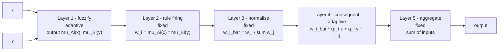

A [fuzzy inference system](/citadel/artificial-intelligence/fuzzy-theory) has rules you can read — `IF pressure IS high THEN valve IS mostly_open` — but no way to *learn* those rules or tune their membership functions from data; a human writes them. An [artificial neural network](/citadel/artificial-intelligence/ann) learns everything from data but its weights mean nothing to a human. The **Adaptive Neuro-Fuzzy Inference System** (ANFIS), from Jang in 1993, gets both: it lays a fuzzy system out as a layered network so gradient-based learning can tune it, while the network still corresponds, layer for layer, to fuzzification, rule firing, and defuzzification.

## What ANFIS is

ANFIS implements a **Sugeno-type** fuzzy system as a five-layer feedforward network. Take a two-input system with rules of the form

$$R_k:\quad \text{IF } x \text{ is } A_i \text{ AND } y \text{ is } B_i \quad\text{THEN}\quad f_k = p_k x + q_k y + r_k$$

Some layers hold **adaptive nodes** (parameters that get trained); the rest hold **fixed nodes** (a fixed computation). Two parameter groups are learned:

- **Premise parameters** — the shape of the input membership functions $\mu_{A_i}, \mu_{B_i}$ (e.g. centre and width of a Gaussian). These enter non-linearly.
- **Consequent parameters** — the coefficients $p_k, q_k, r_k$ of each rule's linear output. These enter linearly.

## The five layers

- **Layer 1 — fuzzification (adaptive).** Each node applies one input membership function, outputting the grade $\mu_{A_i}(x)$ or $\mu_{B_i}(y)$. The MF parameters here are the premise parameters.
- **Layer 2 — rule firing (fixed).** Each node multiplies the incoming grades to get a rule's **firing strength** $w_i = \mu_{A_i}(x)\,\mu_{B_i}(y)$ — the product t-norm for the rule's `AND`.
- **Layer 3 — normalisation (fixed).** Each node computes the **normalised firing strength** $\bar{w}_i = w_i / \sum_j w_j$.
- **Layer 4 — consequent (adaptive).** Each node outputs $\bar{w}_i (p_i x + q_i y + r_i)$. The coefficients are the consequent parameters.
- **Layer 5 — aggregation (fixed).** One node sums all incoming signals, giving the overall output $\sum_i \bar{w}_i f_i = \frac{\sum_i w_i f_i}{\sum_i w_i}$ — the Sugeno weighted average, which is also the defuzzification.

## Hybrid learning

ANFIS trains with a two-pass **hybrid** algorithm per epoch, exploiting the split between linear and non-linear parameters:

1. **Forward pass.** Feed the training batch forward, computing layer outputs up to Layer 4. With the premise parameters held fixed, the overall output is *linear* in the consequent parameters $p_k, q_k, r_k$, so those are solved directly by **least-squares estimation** — a one-shot optimal fit, no iteration.
2. **Backward pass.** Compute the output error against the targets and propagate it back. Update the **premise parameters** (the MF shapes) by **gradient descent**, exactly as in [neural-network training](/citadel/artificial-intelligence/dl).

Solving the linear parameters exactly each pass, and only doing gradient descent on the non-linear ones, converges far faster than running gradient descent on everything.

## Strengths and limits

ANFIS earns its use where you want both adaptation and some interpretability:

- It fuses data-driven learning with fuzzy, rule-based knowledge.
- Generalisation is competitive with plain neural networks.
- It takes crisp inputs and produces crisp outputs, ready for real systems.
- The learned rules can offer some insight into the modelled system.

The limits are about scale:

- Training is computationally expensive — a complex structure plus iterative gradient descent.
- The rule count grows *exponentially* with the number of inputs (grid partitioning of the input space), so ANFIS hits the curse of dimensionality quickly. It's a small-input-count method.
- It has many tunable parameters — both MF and consequent — and needs enough data and enough training budget to fit them all.

## The one idea to keep

ANFIS is a fuzzy inference system drawn as a network. The drawing isn't cosmetic: it exposes which parameters are linear (rule consequents — solve them by least squares) and which are non-linear (membership functions — train them by gradient descent), and that split is exactly what makes the hybrid learning fast. The price is that the grid of rules blows up with more than a handful of inputs.
