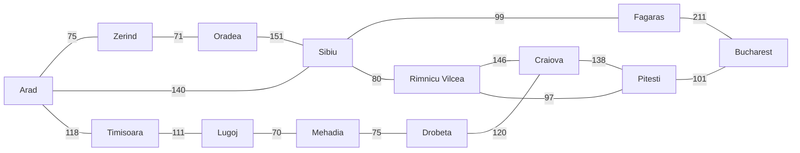

A [goal-based agent](/citadel/artificial-intelligence/ai) wants a *sequence* of actions that carries it from where it is to where it wants to be. It has no rule that says "do this next" — it has to look ahead, imagine action sequences, and check whether any of them reach the goal. That look-ahead is **search**: systematic, simulated exploration of the possibilities before committing to the first move.

The obstacle is size. A 15-puzzle has about $10^{13}$ configurations; a chess game, more positions than atoms in the observable universe. You can't enumerate the space, so the whole subject is about exploring it in a disciplined order and stopping early. This post covers how to state a problem so it can be searched, the strategies for doing the searching, and how a good heuristic changes everything.

## Stating a problem

Formally, a problem is four parts:

1. **Initial state** — where the agent starts.
2. **Actions**, given by a **successor function** $\text{SF}(x)$: the set of states reachable from $x$ by one action. The initial state plus the successor function define the **state space** — every state reachable from the start.
3. **Goal test** — does this state count as a solution?
4. **Path cost** — a number assigned to a path (a sequence of states linked by actions), usually a sum of per-step costs. The cost of a solution is the cost of its path.

A **solution** is a path from the initial state to a state that passes the goal test; an **optimal** solution is a least-cost one.

The state space is almost always an **abstraction**. "Drive from Arad to Zerind" stands in for thousands of real actions — steering, accelerating, avoiding potholes. The abstraction is valid as long as any abstract solution can be expanded into a real one, and each abstract step is easier to carry out than solving the whole original problem.

## Three benchmark problems

**Route finding (Romania).** Goal: be in Bucharest. Initial state: in Arad. States: cities. Actions: drive along a road to an adjacent city. Path cost: kilometres. A solution is a city sequence like Arad → Sibiu → Fagaras → Bucharest. This is the running example for heuristic search because straight-line distance to Bucharest gives an obvious, useful estimate.



Road distances in km (the standard AIMA map). The two routes from Sibiu — through Fagaras (99 + 211 = 310) or through Rimnicu Vilcea and Pitesti (80 + 97 + 101 = 278) — are what make it a good heuristic-search example: greedy search takes the Fagaras road because Fagaras *looks* closer, and A\* corrects it.

**Vacuum world.** States: which square the robot is in, and whether each square is dirty (e.g. `[A, Dirty]`). Actions: `Left`, `Right`, `Suck`, `NoOp`. Goal test: every square clean. Path cost: 1 per action.

**The 8-puzzle** (and its $n$-puzzle family). States: tile arrangements on the board. Actions: slide the blank `Up`, `Down`, `Left`, `Right`. Goal test: tiles in the target arrangement. Path cost: 1 per move. Finding an *optimal* solution for the general $n$-puzzle is NP-hard, so it's a standard testbed for heuristics that get close fast.

## The search tree

Search builds a tree over the state space. A **node** is a bookkeeping record — the state it holds, its parent, the action that produced it, the path cost so far, and its depth. Nodes and states aren't the same: two different nodes can hold the same state, reached by different paths.

The algorithm keeps a **frontier** (or fringe) of generated-but-not-yet-expanded nodes. Each iteration: pull a node off the frontier, goal-test it, and if it isn't a goal, **expand** it — generate its successors and add them to the frontier.

```text
function TREE-SEARCH(problem):
    frontier ← { node for the initial state }
    loop:
        if frontier is empty: return failure
        node ← remove a node from frontier      # which one = the strategy
        if problem.GOAL-TEST(node.state): return the path to node
        add EXPAND(node, problem) to frontier
```

Which node you remove *is* the strategy — everything below is a choice of frontier ordering.

**Repeated states** are the trap. The same state reached by many paths can turn a linear problem exponential. **Graph search** fixes this by keeping an *explored set* and refusing to expand a state twice, at the cost of $O(b^d)$ memory to store it.

## Judging a strategy

Four questions:

- **Complete?** Does it find a solution whenever one exists?
- **Time** — how many nodes get generated?
- **Space** — how many nodes are held in memory at once?
- **Optimal?** Does it return a least-cost solution?

Costs are stated in terms of three numbers: $b$, the **branching factor** (max successors of a state); $d$, the **depth of the shallowest goal**; and $m$, the **maximum depth** of the state space (possibly infinite).

## Uninformed search

**Uninformed** (blind) strategies use only the problem definition — they can generate successors and recognise a goal, nothing more. The [companion post on AI search algorithms](/citadel/algorithms/AISearch) has runnable implementations; here is what each one guarantees.

**Breadth-first (BFS).** FIFO frontier: expand the root, then all depth-1 nodes, then all depth-2 nodes. Complete if $b$ is finite. Time and space both $O(b^d)$ — and the space, holding every node, is what kills it in practice. Optimal when path cost is a non-decreasing function of depth (e.g. unit step costs).

**Uniform-cost (UCS).** Priority-queue frontier ordered by path cost $g(n)$ — always expand the cheapest node so far. Complete if every step costs at least some $\epsilon > 0$. Time and space $O(b^{\lceil C^*/\epsilon \rceil})$ where $C^*$ is the optimal solution cost — potentially far worse than $b^d$. Optimal, because nodes come off in increasing order of $g$. (This is [Dijkstra's algorithm](/citadel/algorithms/PathFinding) in agent clothing.)

**Depth-first (DFS).** LIFO frontier: always expand the deepest node. Space is only $O(bm)$ — a single root-to-leaf path plus siblings — which is its whole appeal. But time is $O(b^m)$, it's not optimal, and it's not complete in infinite or looping spaces.

**Depth-limited (DLS).** DFS with a cutoff depth $\ell$: treat nodes at depth $\ell$ as having no successors. Complete only if $\ell \ge d$; not optimal; time $O(b^\ell)$, space $O(b\ell)$.

**Iterative deepening (IDS).** Run DLS with $\ell = 0, 1, 2, \dots$ until a solution appears. Re-expanding shallow nodes sounds wasteful but isn't: with $b = 10, d = 5$ the overhead is about 11%, because the last layer dominates the count. Complete and optimal like BFS, with DFS's $O(bd)$ memory. This is the default when solution depth is unknown.

| | BFS | UCS | DFS | DLS | IDS |
| --- | --- | --- | --- | --- | --- |
| Complete? | yes¹ | yes¹˒² | no | if $\ell \ge d$ | yes¹ |
| Time | $O(b^d)$ | $O(b^{\lceil C^*/\epsilon \rceil})$ | $O(b^m)$ | $O(b^\ell)$ | $O(b^d)$ |
| Space | $O(b^d)$ | $O(b^{\lceil C^*/\epsilon \rceil})$ | $O(bm)$ | $O(b\ell)$ | $O(bd)$ |
| Optimal? | yes³ | yes | no | no | yes³ |

¹ if $b$ is finite ² if step costs $\ge \epsilon > 0$ ³ if path cost is non-decreasing with depth

## Informed search

**Informed** (heuristic) search adds problem-specific knowledge to rank non-goal states by promise. The knowledge lives in a **heuristic function** $h(n)$ — an estimate of the cheapest cost from $n$'s state to a goal. $h$ is where your understanding of the problem enters.

**Greedy best-first search** expands the node with the smallest $h(n)$ — whatever *looks* closest to the goal. Fast when $h$ is good, but not complete (it can loop) and not optimal (it can commit to a path that starts well and ends long).

**A\* search** orders the frontier by

$$f(n) = g(n) + h(n)$$

the cost to reach $n$ plus the estimated cost from $n$ onward — an estimate of the best total cost of a solution through $n$. A\* is complete, and it is **optimal** provided the heuristic meets a condition, described next. Its weakness is memory: like BFS it keeps every generated node.

## Admissible and consistent heuristics

$h(n)$ is **admissible** if it never overestimates the true cost to the goal: $h(n) \le h^*(n)$ for every $n$. It's optimistic. Straight-line distance is admissible for route finding — a road is never shorter than the crow-flies distance. A\* with tree search is optimal whenever $h$ is admissible.

$h(n)$ is **consistent** (monotone) if for every node $n$ and every successor $n'$ via action $a$,

$$h(n) \le \text{cost}(n, a, n') + h(n')$$

which makes $f$ non-decreasing along any path. Consistency implies admissibility, and A\* with *graph* search needs consistency to stay optimal.

The reliable way to build an admissible heuristic is to solve a **relaxed problem** — the same problem with some action restrictions dropped — and use its optimal cost. For the 8-puzzle:

- $h_1$ = number of misplaced tiles (relaxation: a tile can teleport anywhere).
- $h_2$ = sum of Manhattan distances of tiles from their goal positions (relaxation: a tile can move onto any adjacent square, occupied or not).

Both are admissible; $h_2$ dominates $h_1$ (it's always at least as large, never overestimating), so A\* with $h_2$ expands fewer nodes.

## Local search

When you only care about the goal state, not the path to it — put $n$ queens on a board, schedule these jobs — you can throw away the search tree and keep just the current state. **Hill-climbing** repeatedly moves to the best-valued neighbour and stops when no neighbour is better. It uses almost no memory and often works, but it gets stuck at:

- **Local maxima** — better than every neighbour, worse than the global best.
- **Plateaus** — flat regions where no neighbour is better, so there's no gradient to follow.
- **Ridges** — a sequence of local maxima that no single move can climb along.

The standard escape is **random restart**: run hill-climbing from many random starting states and keep the best result. [Simulated annealing](/citadel/algorithms/AISearch) — sometimes accepting a worse move, with a probability that shrinks over time — is the other common fix.

## Online search

Everything so far is **offline**: compute a full solution, then act. An **online search agent** interleaves the two — take one action, observe the result, decide the next. This is forced when the environment is unknown (the agent doesn't know the state space or its actions' effects), only partially observable, or dynamic (it changes on its own). A rover on an unmapped planet has to search online: every move is also a measurement. The core tension is **exploration versus exploitation** — spend a step learning the terrain, or spend it heading for the goal on what you already know.

## The one idea to keep

Search turns "what should I do?" into "which node do I expand next?". Uninformed strategies differ only in frontier order and buy their guarantees with time or memory; iterative deepening is the safe default. A single admissible heuristic collapses the search — A\* with a good $h$ is the workhorse — and building that heuristic is usually a matter of finding the right relaxation of your problem.
