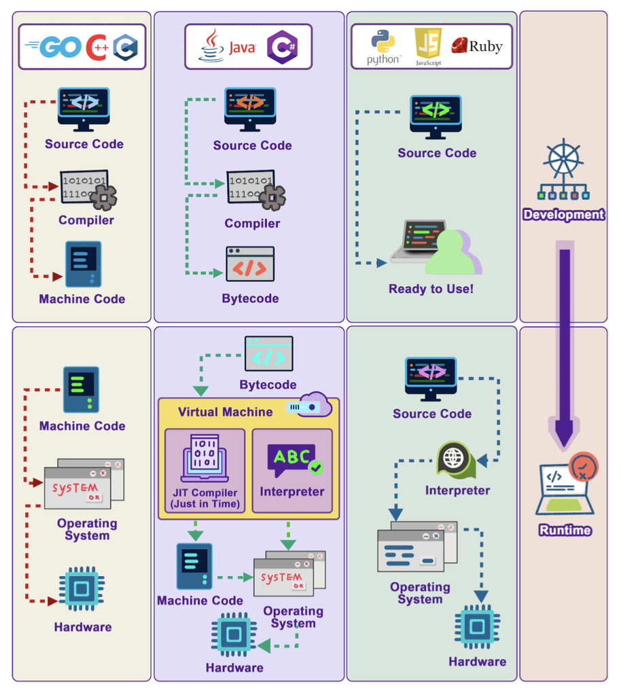

Hey everyone, and welcome back to the blog! As software developers, we spend our days crafting intricate instructions in languages like Python, Java, C++, or JavaScript. We write code that *we* can understand. But how does that human-readable text get transformed into something that a computer's processor – which only really understands ones and zeros – can execute? This crucial translation process is where the concepts of **compiled** and **interpreted** languages come into play.

Here in Bengaluru, where developers work with a myriad of languages to build everything from tiny IoT applications to massive enterprise systems, understanding these fundamental differences is key. It affects performance, portability, and even the development workflow. Let's dive into how these language types work their magic!

## The Core Problem: Human Code vs. Machine Code

At the most basic level, a computer's Central Processing Unit (CPU) executes **machine code** – a sequence of binary instructions specific to that CPU's architecture. The source code we write in high-level languages is designed for human readability and productivity. The journey from our source code to executable machine code can take different paths.

## Compiled Languages: Ahead-of-Time Translation

Compiled languages are those where the source code is entirely translated into machine code by a program called a **compiler** *before* the program is executed by the end-user.

* **The Process:**
  1. A developer writes the source code (e.g., in C++).
  2. This source code is then fed into a compiler specific to the target platform (e.g., a C++ compiler for Windows on an x86 CPU).
  3. The compiler meticulously checks the code for syntax errors and often performs various optimizations to make the resulting code faster or more efficient.
  4. If the compilation is successful, the compiler generates an **executable file** containing native machine code. This executable is the "Ready to Use!" artifact.
* **Execution:**
  When you run the program, the operating system loads this pre-compiled machine code directly into memory, and the CPU executes it.
* **Characteristics & Benefits:**
  * **Performance:** Compiled languages generally run faster than interpreted languages. This is because the translation to optimized machine code happens once, ahead of time. The CPU can execute these native instructions directly without the overhead of runtime interpretation.
  * **Early Error Detection:** Many errors, especially syntax errors and type errors (in statically-typed compiled languages like C++ or Go), are caught during the compilation phase, before the program ever reaches the user.
* **Drawbacks:**
  * **Platform Dependency:** The machine code generated by a compiler is typically specific to a particular operating system and CPU architecture. To run the program on a different platform, you usually need to recompile the source code with a compiler for that new platform.
  * **Slower Development Cycle (Compilation Step):** The compilation step itself can take time, especially for large projects. This can sometimes slow down the develop-test-debug cycle compared to interpreted languages where you can often make a change and run it immediately.
* **Examples:** C, C++, Go, Rust, Swift.

## Interpreted Languages: On-the-Fly Translation
Interpreted languages take a different approach. Instead of being fully translated to machine code beforehand, the source code is read and executed more directly by a program called an **interpreter** *at runtime*.

* **The Process:**
  1. A developer writes the source code (e.g., in Python or JavaScript).
  2. When the program is run, the interpreter reads the source code, often line by line or statement by statement.
  3. The interpreter translates each statement into machine operations and executes it immediately before moving to the next one.
* **Characteristics & Benefits:**
  * **Platform Independence (Portability):** This is a major advantage. The same source code script can often run on any platform (Windows, macOS, Linux) as long as a compatible interpreter for that language is installed on the platform. JavaScript, for instance, is interpreted by JavaScript engines built into web browsers.
  * **Faster Development Cycle (No Separate Compilation Step):** Developers can often make changes and see the results immediately without waiting for a lengthy compilation process. This makes for a quicker and more interactive development experience.
  * **Dynamic Typing (Common):** Many interpreted languages are dynamically typed, meaning variable types are checked at runtime. This can offer greater flexibility during development.
* **Drawbacks:**
  * **Performance:** Interpreted languages are generally slower than compiled languages because the process of reading, translating, and executing code happens at runtime for each execution. This interpretation overhead adds up.
  * **Runtime Errors:** Many errors, particularly type errors in dynamically-typed languages or syntax errors in parts of the code not immediately executed, might only be discovered when that specific line of code is encountered by the interpreter during execution.
* **Examples:** Python, JavaScript, Ruby, PHP, Perl.

## The Hybrid Approach: Bytecode, Virtual Machines, and JIT Compilation  híbrido

Many modern languages, like Java and C#, use a hybrid approach that combines elements of both compilation and interpretation to get the best of both worlds – primarily portability and good performance.

* **The Process (e.g., Java):**
  1. A developer writes source code (e.g., a `.java` file).
  2. The Java compiler (`javac`) compiles this source code not into platform-specific machine code, but into an intermediate, platform-independent form called **bytecode** (e.g., a `.class` file).
  3. This bytecode is then executed by a **Virtual Machine (VM)** – for Java, this is the Java Virtual Machine (JVM); for C#, it's the Common Language Runtime (CLR). The VM is a piece of software specific to each operating system and hardware platform.
  4. The VM reads the bytecode, interprets it, and translates it into native machine code that the underlying CPU can execute.
* **Just-In-Time (JIT) Compilation:**
  To boost performance, many modern VMs (including JVMs and JavaScript engines like V8 ) employ **Just-In-Time (JIT) compilation**.
  * During runtime, the JIT compiler identifies "hot spots" in the bytecode – sections of code that are executed frequently.
  * It then compiles these hot spots directly into native machine code *on the fly*. This compiled machine code can then be executed much faster on subsequent calls, significantly improving performance for those parts of the program. Sometimes JIT compilers even compile the entire source code into machine code to speed up execution.
* **Characteristics & Benefits:**
  * **Portability ("Write Once, Run Anywhere"):** The compiled bytecode is platform-independent. As long as there's a VM for a particular platform, the bytecode can run on it.
  * **Good Performance:** While there's still an initial interpretation or JIT compilation overhead, the performance of JIT-compiled bytecode can approach that of natively compiled languages for long-running applications, especially for frequently executed code paths.
  * **Security & Management:** The VM can provide a managed execution environment, offering features like automatic memory management (garbage collection) and security sandboxing.
* **Examples:** Java, C#, Scala, Kotlin (which also targets the JVM).

## Key Differences Summarized

| Feature                            | Compiled Languages (e.g., C++, Go) | Interpreted Languages (e.g., Python, JS)   | Hybrid/Bytecode (e.g., Java, C#)                                 |
| :--------------------------------- | :--------------------------------- | :----------------------------------------- | :--------------------------------------------------------------- |
| **Translation Time**         | Before runtime (AOT)               | During runtime                             | Before runtime (to bytecode) + During runtime (VM/JIT)           |
| **Output of Initial Step**   | Machine Code                       | None (direct execution)                    | Bytecode                                                         |
| **Execution Speed**          | Generally Fastest                  | Generally Slower                           | Often between Compiled & Interpreted (can be very fast with JIT) |
| **Platform Dependence**      | High (compiled code is specific)   | Low (interpreter handles platform details) | Low (bytecode is portable; VM is platform-specific)              |
| **Error Detection (Syntax)** | Compile-time                       | Runtime                                    | Compile-time (for source to bytecode)                            |
| **Development Cycle**        | Can be slower (compilation step)   | Often faster (immediate execution)         | Compile to bytecode + runtime                                    |

## Key Takeaways

* **Compiled languages** translate source code to machine code *before* execution, generally offering the best performance but often tied to a specific platform.
* **Interpreted languages** translate and execute code *during* runtime, offering great portability and often a faster development experience, but typically at a performance cost.
* **Hybrid languages** (like Java and C#) first compile source code to an intermediate bytecode, which is then executed by a Virtual Machine. Modern VMs use Just-In-Time (JIT) compilation to convert frequently used bytecode to native machine code for improved performance, blending portability with speed.

The lines can sometimes blur, as modern interpreters often include JIT compilers (like JavaScript's V8 engine). However, understanding these fundamental approaches helps in choosing the right language for a task, appreciating performance characteristics, and understanding the underlying execution model of the software we build and use every day.
