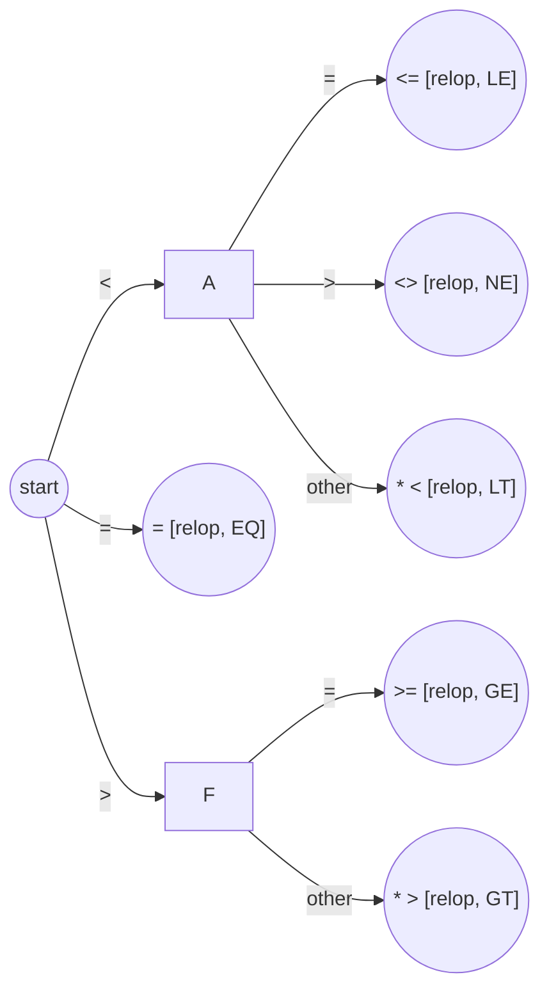

Welcome back to our journey into the fascinating world of compiler design! In our previous post, "Unmasking the Magic: A Beginner's Guide to Compilers & How They Work," we saw the big picture of how your source code gets transformed into an executable program. Now, it's time to zoom in on the very first crucial step in this transformation: **Lexical Analysis**.

Imagine you're reading a sentence. Your brain effortlessly breaks it down into words, ignoring spaces and punctuation to understand the individual components. A lexical analyzer, often called a **lexer** or **scanner**, does something very similar for your code. It's the compiler's diligent front-line worker, meticulously scanning your raw source code and chopping it up into a sequence of meaningful units.

Ready to see how this initial, yet vital, phase sets the stage for everything that follows? Let's get started!

### The Role of the Lexical Analyzer: More Than Just a Character Counter

The lexical analyzer is the first phase of a compiler. Its main task is to read the input stream of characters that make up your source program and group them into meaningful sequences called **lexemes**. For each lexeme it identifies, it produces a **token** as output, which is then passed on to the next phase, the Syntax Analyzer (or parser).

Think of it this way:
* **Source Code:** `if (x1 * x2 < 1.0) {`
* **Lexemes:** `if`, `(`, `x1`, `*`, `x2`, `<`, `1.0`, `)`, `{`
* **Tokens:** ``<keyword, if>``, ``<lparen>``, ``<id, x1>``, ``<op, multiply>``, ``<id, x2>``, ``<op, less_than>``, ``<float_literal, 1.0>``, ``<rparen>``, ``<lbrace>``

Beyond this primary task of tokenization, the lexical analyzer often handles other important duties:

* **Stripping out Comments and Whitespace:** Blanks, newlines, tabs, and comments are usually insignificant for the subsequent phases of compilation (except, for example, within string literals). The lexer removes them.
* **Correlating Error Messages:** It keeps track of line numbers and sometimes column numbers, so if the compiler finds an error later, it can report it with a precise location in the source code.
* **Interacting with the Symbol Table:** When the lexer encounters an identifier (like a variable or function name), it needs to enter that lexeme into the **Symbol Table**. The token for an identifier often includes a pointer or index to its entry in the symbol table.
* **Handling Macros:** If the source language uses a macro preprocessor, the expansion of macros might also be performed by the lexical analyzer.

Sometimes, lexical analysis is itself divided into two sub-processes:
1.  **Scanning:** The actual process of reading the input characters and performing tasks like whitespace removal.
2.  **Lexical Analysis Proper:** Converting the sequence of characters (after scanning) into tokens.

### Tokens, Lexemes, and Patterns: The Building Blocks

Let's clarify these three important terms:

* **Token:** A token is a pair consisting of a *token name* and an optional *attribute value*. The token name is an abstract symbol representing a kind of lexical unit (e.g., `keyword`, `identifier`, `operator`, `number`). The attribute value provides additional information about the specific instance of the token (e.g., for an `identifier` token, the attribute might be a pointer to its symbol table entry; for a `number` token, it might be the numeric value itself).
    * Example: ``<id, "score">``, ``<number, 3.14159>``, ``<keyword, "if">``
* **Lexeme:** A lexeme is a sequence of characters in the source program that matches the pattern for a token and is identified by the lexical analyzer as an instance of that token.
    * Example: `score` is a lexeme for the token `id`. `3.14159` is a lexeme for the token `number`. `if` is a lexeme for the token `keyword`.
* **Pattern:** A pattern is a description of the form that the lexemes of a token may take. It's a rule that defines the set of strings that can represent a particular token.
    * Example: For the token `identifier`, a pattern might be "a letter followed by zero or more letters or digits." For the token `if` (keyword), the pattern is simply the sequence of characters `i` followed by `f`.

Here's a table illustrating this:

| TOKEN NAME | INFORMAL DESCRIPTION OF PATTERN        | SAMPLE LEXEMES |
| :--------- | :------------------------------------- | :------------- |
| `if`       | characters `i`, `f`                    | `if`           |
| `else`     | characters `e`, `l`, `s`, `e`          | `else`         |
| `id`       | letter followed by letters and digits  | `pi`, `score`, `D2` |
| `number`   | any numeric constant                   | `3.14159`, `0`, `6.02e23` |
| `literal`  | anything but `"` surrounded by `"`'s | `"core dumped"` |
| `relop`    | `<`, `>`, `<=`, `>=`, `==`, `!=`      | `<=`, `!=`     |

(Based on PDF, Page 34)

### Input Buffering: Efficiently Reading the Source Code

Lexical analyzers need to scan the input characters, sometimes looking ahead one or more characters beyond the current lexeme to decide where one lexeme ends and the next begins (e.g., to distinguish between `<` and `<=`). Reading one character at a time from the disk or input stream can be very inefficient due to the overhead of system calls.

To optimize this, **input buffering** techniques are used:

* **Buffer Pairs (Two-Buffer Scheme):** A common approach is to use two buffers of equal size (e.g., 4096 characters each). One buffer is filled with a chunk of source code. The lexer scans this buffer using two pointers:
    * `lexemeBegin`: Points to the start of the current lexeme being identified.
    * `forward`: Scans ahead character by character until a pattern is matched.
    When the `forward` pointer reaches the end of one buffer, the other buffer is automatically filled from the input. This allows the lexer to "look ahead" without frequently waiting for I/O.
* **Sentinels:** To simplify checking if the `forward` pointer has reached the end of a buffer, a special character called a **sentinel** (which cannot appear in a valid program, often `EOF` - End Of File marker) is placed at the end of each buffer. This way, the lexer only needs one check (is it the sentinel?) instead of two (is it the end of buffer? or is it the end of file?).

This two-buffer scheme with sentinels significantly speeds up the process of reading and tokenizing the source code.

### Specification of Tokens: Regular Expressions to the Rescue!

How does a lexical analyzer know what constitutes a valid identifier, a number, a keyword, or an operator? This is where **Regular Expressions (REs)** come into play. Regular expressions provide a precise and formal way to specify the patterns for tokens.

A **regular definition** gives names to certain regular expressions and uses these names in subsequent expressions, making complex patterns easier to define and understand.

**Basic Notations for Regular Expressions:**

* **Alternation (`|`):** `a|b` means "either `a` or `b`".
* **Concatenation:** `ab` means "`a` followed by `b`".
* **Kleene Closure (`*`):** `a*` means "zero or more occurrences of `a`".
* **Positive Closure (`+`):** `a+` means "one or more occurrences of `a`".
* **Optional (`?`):** `a?` means "zero or one occurrence of `a`" (equivalent to `a|ε`, where `ε` is the empty string).
* **Character Classes (`[]`):** `[a-z]` means any lowercase letter. `[0-9]` means any digit.

**Example: Regular Definitions for Identifiers and Numbers**

Let's define patterns for simple identifiers and unsigned numbers:

```
letter_ -> [a-zA-Z_]  // A letter or an underscore
digit  -> [0-9]       // A digit

id     -> letter_ (letter_ | digit)* // An identifier starts with letter_
// followed by zero or more letter_ or digits

digits -> digit+                     // One or more digits
optionalFraction -> ('.' digits)?    // An optional fractional part (e.g., .123)
optionalExponent -> ('E' ('+'|'-')? digits)? // An optional exponent (e.g., E+5, e-10)
number -> digits optionalFraction optionalExponent // A numeric constant
```

For example, using these definitions:
* `count1` matches `id`.
* `_value` matches `id`.
* `123` matches `number`.
* `3.14` matches `number`.
* `1.5E-2` matches `number`.

Keywords like `if`, `else`, `while` can be defined by their literal character sequences:
`if -> i f`
`else -> e l s e`

### Recognizing Tokens: Finite State Machines (FSMs)

Once we have specified tokens using regular expressions, how does the lexer actually *recognize* these patterns in the input stream? This is where **Finite State Machines (FSMs)**, also known as **Finite Automata (FA)**, are used.

A regular expression can be converted into a finite automaton that recognizes the language (set of strings) defined by that RE. These FSMs are often depicted as **Transition Diagrams**.

**What is a Transition Diagram?**

A transition diagram is essentially a directed graph:
* **States:** Represented by circles. Each state signifies a certain point in the process of recognizing a lexeme.
* **Transitions (Edges):** Represented by arrows between states. Each edge is labeled with an input character (or a set of characters) that causes the transition from one state to another.
* **Start State:** One state is designated as the start state (often indicated by an arrow labeled "start").
* **Accepting/Final States:** One or more states are designated as accepting or final states (often indicated by a double circle). Reaching an accepting state means a lexeme for a particular token has been successfully recognized.
* **Retraction (`*`):** Sometimes, the automaton might read one character too many to recognize a lexeme. In such cases, an accepting state might be marked with a `*`, indicating that the input pointer needs to be retracted by one position.

**Example: Transition Diagram for Relational Operators**

Consider relational operators like `<`, `<=`, `=`, `!=`, `>`, `>=`.
A simplified transition diagram might look like this (token types added for clarity):



From the start state, if we see `<`, we go to state A.

From state A, if we see `=`, we've found the lexeme `<=` (token `relop, LE`). This is an accepting state.

From state A, if we see `>`, we've found `<>` (token `relop, NE`). Accepting state.

From state A, if we see any other character, it means we've just recognized `<` (token `relop, LT`). We need to retract the input pointer (indicated by `*`) because the "other" character belongs to the next lexeme. This is an accepting state.

Similar logic applies for `=`, `>`, and `>=`.

**How Lexers Use Transition Diagrams:**

The lexer simulates the transition diagram. It starts in the start state. For each input character, it follows the transition corresponding to that character. If it reaches an accepting state and can't make further valid transitions for the current lexeme, it has found a token. If it gets stuck (no valid transition for the current input character from the current state) before reaching an accepting state, it signals a lexical error.

### Recognizing Keywords vs. Identifiers:

A common challenge is distinguishing keywords (like if) from identifiers (like if_variable). Two main approaches:

Pre-install Keywords in Symbol Table: When an identifier-like lexeme is found, the symbol table is checked. If the lexeme is present as a keyword, the keyword token is returned; otherwise, an identifier token is returned (after potentially adding the new identifier to the symbol table).

Separate Transition Diagrams: Create specific transition diagrams for each keyword. These are given priority over the general identifier diagram. If the input matches a keyword diagram, that token is returned. Otherwise, the identifier diagram is attempted.

### Key Takeaways

- Lexical Analysis is the First Pass: It reads raw source code and outputs a stream of tokens.
- Tokens, Lexemes, Patterns: Tokens are (name, attribute) pairs, lexemes are the actual text, and patterns (defined by regular expressions) describe valid lexemes.
- Essential Tasks: Besides tokenization, lexers handle whitespace/comment removal, error message correlation, and symbol table interaction.
- Input Buffering: Techniques like two-buffer schemes with sentinels make character processing efficient.
- Regular Expressions Specify Tokens: They provide a formal way to define the patterns for different kinds of tokens.
- Finite Automata Recognize Tokens: Transition diagrams (a form of FSM) are used to implement the logic for matching patterns and identifying lexemes.
