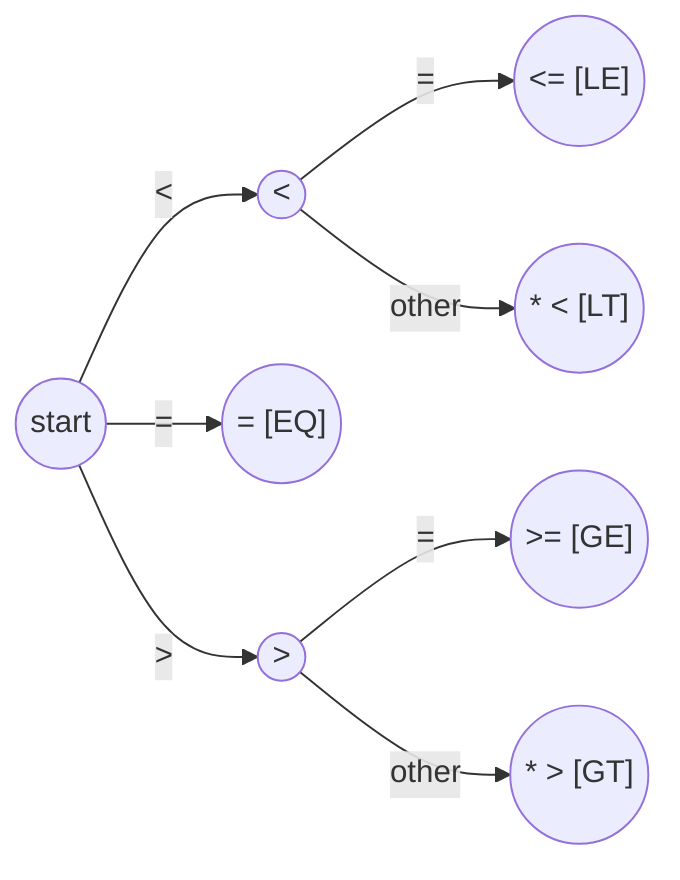

Before a [compiler](/citadel/compiler-design/cd) can reason about your program's structure, it has to decide where one "word" ends and the next begins. Given `if (x1*x2 < 1.0) {`, it needs to see the keyword `if`, the identifier `x1`, the operator `*`, the float literal `1.0` — not a stream of 18 characters. That is **lexical analysis**, done by a **scanner** (or **lexer**), the first phase of the front end.

The scanner reads the source character by character, groups the characters into meaningful units, and hands the next phase a stream of tokens. This post covers what a token actually is, how the scanner reads efficiently, and how token shapes are specified and recognised.

## What the scanner produces

A **lexeme** is a run of characters in the source that forms one unit — `score`, `3.14159`, `if`. A **token** is what the scanner emits for a lexeme: a token *name* (an abstract category like `id`, `number`, `keyword`) plus an optional *attribute value* (for an `id`, a pointer to its symbol-table entry; for a `number`, the numeric value). A **pattern** is the rule describing which lexemes belong to a token — "a letter followed by letters and digits" for `id`.

| Token name | Pattern (informal) | Example lexemes |
| --- | --- | --- |
| `if` | the characters `i`, `f` | `if` |
| `id` | letter, then letters and digits | `pi`, `score`, `D2` |
| `number` | a numeric constant | `3.14159`, `0`, `6.02e23` |
| `literal` | anything but `"`, inside `"…"` | `"core dumped"` |
| `relop` | `<`, `>`, `<=`, `>=`, `==`, `!=` | `<=`, `!=` |

So `if (x1*x2 < 1.0) {` becomes `<keyword,if> <lparen> <id,x1> <op,*> <id,x2> <relop,LT> <number,1.0> <rparen> <lbrace>`.

Beyond tokenising, the scanner also:

- strips comments and whitespace (except inside string literals);
- tracks line and column numbers so later phases can point errors at a source location;
- enters identifiers into the [symbol table](/citadel/compiler-design/symbol-tables);
- expands macros, if the language has a preprocessor the scanner handles.

It is sometimes split into **scanning** (read characters, remove whitespace) and **lexical analysis proper** (turn the cleaned stream into tokens).

## Input buffering

To decide where a lexeme ends, the scanner often has to look one character *past* it — you do not know `<` is the whole operator until you see the next character is not `=`. Reading one character at a time from disk makes that lookahead expensive.

The standard fix is a **two-buffer scheme**. Two equal-size buffers (say 4096 bytes) hold consecutive chunks of source. Two pointers walk them: `lexemeBegin` marks the start of the current lexeme, `forward` scans ahead until a pattern matches. When `forward` runs off the end of one buffer, the other is refilled from input, so lookahead never blocks on I/O mid-lexeme.

Checking "did `forward` hit the end of a buffer?" on every character is itself overhead. A **sentinel** — a character that cannot appear in valid source, usually `EOF` — is placed at the end of each buffer. Now the inner loop makes one test (is this the sentinel?) instead of two (end of buffer? end of input?), and only stops to think when it actually sees the sentinel.

## Specifying tokens with regular expressions

How the scanner knows a valid identifier from a number is written as **regular expressions**. A **regular definition** names sub-expressions so larger patterns stay readable:

```text
letter_ -> [A-Za-z_]
digit   -> [0-9]

id      -> letter_ (letter_ | digit)*

digits           -> digit+
optionalFraction -> ( . digits )?
optionalExponent -> ( E (+|-)? digits )?
number           -> digits optionalFraction optionalExponent
```

Under these, `count1` and `_value` match `id`; `123`, `3.14`, and `1.5E-2` match `number`. The notation is the usual one: `|` alternation, juxtaposition concatenation, `*` zero-or-more, `+` one-or-more, `?` optional, `[a-z]` a character class. Keywords are just fixed character sequences: `if -> i f`.

## Recognising tokens with finite automata

A regular expression compiles to a **finite automaton** that accepts exactly the strings the expression describes — the [equivalence](/citadel/automata/regular-languages) between regular expressions and finite automata is what makes lexer generators possible. In a lexer the automaton is usually drawn as a **transition diagram**: states as circles, a start state, double-circle accepting states, and edges labelled with the input character that triggers each move. Reaching an accepting state means a lexeme for some token has been recognised.

One wrinkle: to recognise `<` as its own operator, the scanner must read the character *after* it and find it is not `=`. That trailing character belongs to the next lexeme, so the accepting state is marked to **retract** the input pointer by one.


```mermaid
graph LR
  S(("start")) -- "&lt;" --> A(("&lt;"))
  A -- "=" --> B(("&lt;= [LE]"))
  A -- "other" --> C(("* &lt; [LT]"))
  S -- "=" --> D(("= [EQ]"))
  S -- "&gt;" --> E(("&gt;"))
  E -- "=" --> F(("&gt;= [GE]"))
  E -- "other" --> G(("* &gt; [GT]"))
```

The scanner simulates the diagram: start at the start state, follow the edge for each character, and when it reaches an accepting state with no valid move left, it has a token. Getting stuck with no valid transition before any accepting state is a lexical error.

### Keywords versus identifiers

`if` matches the `id` pattern too, so the scanner needs a tie-breaker. Two approaches:

1. **Pre-load keywords into the symbol table.** When an identifier-shaped lexeme is scanned, look it up; if it is present as a keyword, emit the keyword token, otherwise treat it as an identifier (adding it if new).
2. **Separate transition diagrams per keyword**, checked with priority over the general `id` diagram.

The first is more common because it keeps the automaton small.

## The one idea to keep

Lexical analysis is where the compiler's theory pays off most directly: token patterns are regular expressions, regular expressions are finite automata, and a finite automaton is a tiny state machine that a `switch` inside a loop implements. The scanner's real engineering is the boring part — buffering and sentinels — because it runs once per character of every file the compiler ever sees.
