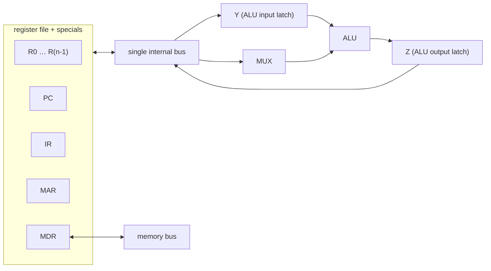

The [fetch-execute cycle](/citadel/computer-architecture/coa) describes what a processor does in the abstract. Down at the wires, "execute an add" is not one event — it's a fixed sequence of tiny transfers: move this register onto a bus, latch it here, tell the ALU to add, latch the result there, move it to the destination. Something has to produce those control signals in exactly the right order, once per clock tick.

This post is the two parts that do that work: the **datapath** — the registers, ALU, and buses the data actually flows through — and the **control unit** — the logic that drives the datapath, built either as fixed hardware or as a tiny program in its own memory.

## Two phases, many micro-operations

Every instruction runs in two phases. **Fetch**: load the word the PC points at into the instruction register (`IR ← [[PC]]`), then advance the PC (`PC ← [PC] + 4`). **Execute**: decode the IR and do what it says.

Both phases break down into four kinds of **micro-operation** — the smallest steps the hardware takes, one or a few per clock cycle:

- transfer data between two processor registers (or a register and the ALU),
- perform an ALU operation and latch the result,
- read from memory into a register (via the MDR),
- write from a register to memory (via the MDR).

Everything the processor does is some ordering of those four. The datapath decides how many can happen at once.

## The single-bus datapath

The cheapest layout: one internal bus, and every component hangs off it.



Only one value sits on the bus at a time. Each register has a pair of control signals: `Rkout` gates its contents onto the bus, `Rkin` latches whatever is on the bus into it, both timed by the clock.

**A register transfer** (`R3 ← [R1]`) is one step: assert `R1out` and `R3in` together.

**An ALU operation** (`R3 ← [R1] + [R2]`) takes three, because only one operand can cross the bus per step:

1. `R1out, Yin` — R1's value into the ALU's input latch Y.
2. `R2out, SelectY, Add, Zin` — R2 onto the bus as the other ALU input, ALU adds, result latched in Z.
3. `Zout, R3in` — result from Z back to R3.

**A memory read** (`R2 ← [LOC]`, address already in MAR): `MARout, Read` puts the address on the memory bus and requests a read; the processor waits for the memory's *function-complete* signal (`WMFC`); `MDRinE` latches the returned data; `MDRout, R2in` moves it to R2.

A whole instruction is these strung together. `Add (R3), R1` — add the memory word pointed to by R3 into R1 — runs about seven steps: fetch, use R3 as an address, read the operand, add, store back. A branch is roughly two steps after the fetch: compute `PC + offset`, load it into the PC.

The cost is obvious from the picture: **one transfer per step**, so multi-operand work is slow.

## Multiple buses

Give the datapath three buses — call them A, B, C — and the register file two read ports, and both ALU operands can leave the register file at once while the result returns on bus C. A dedicated incrementer updates the PC in parallel.

Now `Add R4, R5, R6` is a *single* execute step:

```
R4outA, R5outB, SelectA, Add, R6in, End
```

Read R4 onto bus A, R5 onto bus B, add, write bus C into R6 — done. The three-step single-bus ALU operation collapses to one. That parallelism is what pipelined and superscalar processors are built on; see [pipelining](/citadel/computer-architecture/pipelining) and [instruction-level parallelism](/citadel/computer-architecture/ilp).

## Generating the control signals

Who actually asserts `R1out`, `Yin`, `Add`, `Read`, `WMFC`, `End` — in that order, for this instruction, this cycle? The **control unit**, and there are two ways to build one.

### Hardwired control

Signals come straight out of combinational logic. The unit holds:

- an **instruction decoder** reading the opcode in the IR,
- a **step counter** producing timing signals T1, T2, T3, … for the successive steps of an instruction,
- **encoder logic** that ANDs together the decoded opcode, the current step, the condition-code flags, and external inputs like MFC to produce each control signal.

Every signal is a Boolean expression. `Zin` might be `T1 + (ADD · T6) + (BRANCH · T4) + …` — active on step 1 for the PC increment, on step 6 of an add, on step 4 of a branch, and so on. `End` fires on the last step of whichever instruction is running.

Fast, because it's just gates. But hard to design and test, and *rigid* — adding an instruction means reworking the logic.

### Microprogrammed control

Store the control signals instead. A special fast memory, the **control store**, holds **microinstructions** (also called control words): one per clock cycle, each bit position corresponding to a datapath control signal. The sequence of microinstructions for one machine instruction is a **microroutine**.

Executing `Add (R3), R1` means fetching and running its microroutine:

- a **micro-program counter (μPC)** holds the address of the next microinstruction,
- a **microinstruction register (μIR)** holds the current one — its bits *are* the control lines,
- a **starting-address generator** maps the opcode in the IR to the address of that instruction's microroutine.

The μPC normally just increments, but a microinstruction can branch — conditionally, on a flag or on MFC. That's how a wait loop like "keep checking until MFC arrives" is expressed *inside* the control unit.

Microinstruction formats trade width against decoding:

- **Horizontal** — one bit per control signal. Wide words, zero decoding, maximum flexibility.
- **Vertical / encoded** — signals grouped into fields (a 3-bit field picks one of 8 registers to gate onto the bus). Narrow words, but decoders are needed to expand the fields. Most real designs encode.

The payoff is flexibility: fix a bug or add an instruction by rewriting microcode, and *emulate* another architecture by writing a microprogram for its instruction set. The cost is speed — every step now includes a control-store fetch before any datapath signal moves.

Modern high-performance CPUs go hybrid: hardwired paths for the common simple instructions, microcode for the rare complex ones.

## The one idea to keep

An instruction is a schedule of register transfers, and the control unit is what enforces the schedule cycle by cycle. Widen the datapath and each instruction needs fewer steps; that's the lever every performance technique in this series pulls. Build the control unit from gates and it's fast but frozen; build it from a microprogram and it's slow but rewritable — which is exactly why complex instruction sets lean on microcode and simple ones don't need it.
