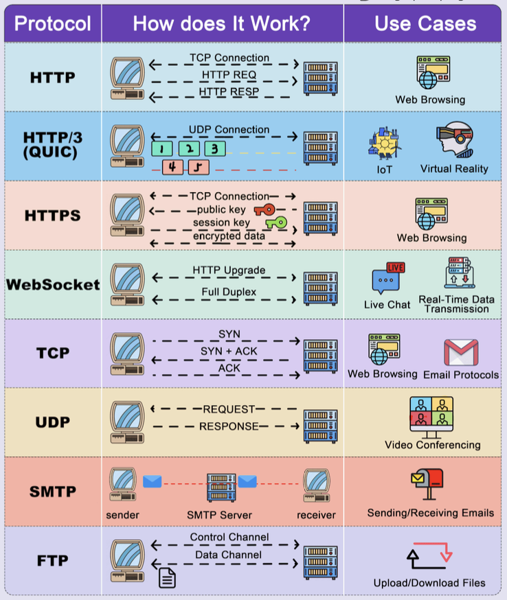
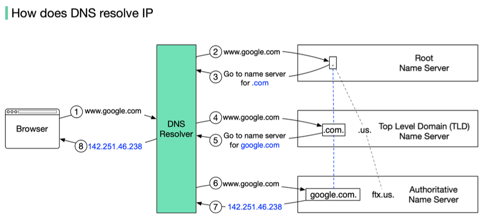

Welcome back, network navigators! In our last adventure, we journeyed through the foundational concepts of computer networks. Now, let's ascend to the highest level of the TCP/IP and OSI models: the **Application Layer**. This is where the rubber meets the road, or rather, where your software meets the network! It's the layer you interact with most directly – think web Browse, sending emails, or sharing files.

So, grab your virtual magnifying glass, and let's explore the architectures, protocols, and services that make our digital lives possible.

---
## Principles of Network Applications: The Blueprint

Network applications are the reason we use networks in the first place! They provide the services we rely on daily. Understanding their architecture is key.

### Application Architectures: How Apps Talk

There are three main ways network applications are structured:

1.  **Client-Server Architecture:**
    * This is a classic model where a **client** (your device/software) initiates communication and requests services from a central, always-on **server**.
    * Think of the Web: your browser (client) requests a webpage from a web server. Email and FTP also follow this model.
    * Servers typically have fixed, well-known IP addresses, while clients can have dynamic IPs.
    * While common, this can be infrastructure-intensive, as the server needs to handle requests from many clients.

2.  **Peer-to-Peer (P2P) Architecture:**
    * In P2P, there's no central server. End systems (called **peers**) communicate directly with each other.
    * This is great for tasks like file distribution (e.g., BitTorrent) or some forms of IPTV.
    * Peers can join and leave the network, and often have dynamic IP addresses.
    * P2P is cost-effective as it doesn't rely on massive server infrastructure, but it can be more complex to design and manage.

3.  **Hybrid of Client-Server and P2P:**
    * This model blends elements of both. For instance, an initial contact might be made with a server to find other peers or manage user information, after which direct P2P communication occurs.
    * Skype and many instant messaging applications use this approach.

### Application Protocols: The Rules of Engagement

Regardless of the architecture, applications need a set of rules to communicate. These are **application protocols**. They define:
* **Types of messages exchanged:** e.g., request messages, response messages.
* **Message syntax:** What fields are in the messages and how they are structured.
* **Message semantics:** The meaning of the information in those fields.
* **Rules for when and how processes send and respond to messages.**

Many application protocols also have a companion protocol that specifies the format of the data being exchanged (e.g., HTML is a companion to HTTP; RFC 822 and MIME define email message formats for SMTP).

Application programs (like Chrome, Firefox, or Outlook) use these protocols to achieve their intended tasks. These processes are typically identified on a network by a combination of an IP address and a **port number**. Popular services use well-known port numbers (e.g., port 80 for web servers, port 25 for email servers).

---
## The World Wide Web and HTTP: Browse the Internet

The Web is arguably one of the most popular network applications. It consists of **web pages**, which are often made up of a base HTML file and several referenced objects (like images, scripts, or CSS files). Each object is addressable by a **URL (Uniform Resource Locator)**.

### HyperText Transfer Protocol (HTTP)
HTTP is the application protocol that powers the web.
* It's based on a **client-server model**: your browser (client) requests web objects from a web server.
* The server responds with a status code and, if successful, the requested object.
* HTTP typically uses **TCP (Transmission Control Protocol)** as its underlying transport protocol, operating on server port 80.
* A key characteristic of HTTP is that it's a **stateless protocol**. This means the server doesn't store any information about past client requests. (We'll see how "state" is managed with cookies later!)

#### HTTP Connections: Persistent vs. Non-Persistent

* **HTTP/1.0 (Non-Persistent Connections):**
    * At most, one object is sent over a single TCP connection. If a page has 10 images, it would require 11 separate TCP connections (1 for the HTML, 10 for the images).
    * This can be inefficient due to the overhead of establishing many TCP connections. Response time per object is roughly $2 \times RTT + \text{transmission time}$ (RTT is Round-Trip Time).

* **HTTP/1.1 (Persistent Connections):**
    * The server leaves the TCP connection open after sending a response, allowing subsequent requests and responses for the same client-server pair to use the same connection.
    * This reduces TCP-related overhead.
    * **Non-pipelined mode:** A new request is sent only after the previous response is fully received.
    * **Pipelined mode (default):** Multiple requests can be sent without waiting for each response, further improving efficiency. Minimum total time for a page with multiple objects can be significantly reduced.

#### Web Caches (Proxy Servers)
To improve performance and reduce network traffic, **web caches** or **proxy servers** are often used.
* A proxy server is an intermediary that can store copies of recently requested web objects.
* When a browser requests an object, the request might go to a proxy.
    * If the proxy has the object cached and it's fresh, it returns the object directly to the client without contacting the origin server.
    * Otherwise, the proxy requests the object from the origin server, caches it, and then returns it to the client.
* **Advantages:** Reduces response time for clients, saves bandwidth, and can even enable "poor" content providers to deliver content more effectively.
* **Stale Cache Problem:** How does the proxy know if its cached object is up-to-date? HTTP/1.1 uses cache-control headers (e.g., `max-age`, `no-cache`) to manage this.

#### Cookies: Adding State to a Stateless Protocol
Since HTTP is stateless, cookies provide a way for websites to remember information about you.
* When you first visit a site, the server can send a small piece of data (the cookie) to be stored by your browser.
* On subsequent visits to the same domain, your browser sends the cookie back to the server.
* This allows servers to remember login status, shopping cart contents, user preferences, etc.
* A cookie typically contains a name, value, expiry date, path, and domain.

---
## FTP (File Transfer Protocol): Moving Files Across Networks

FTP is a venerable protocol used for transferring files between hosts.
* It operates on a **client-server architecture**.
* It uses **TCP** for reliable transfer, with the server typically listening on port 21 for control connections.
* A unique feature of FTP is its use of **two separate TCP connections**:
    * **Control Connection (Port 21):** Used for sending commands (like username, password, list files, retrieve file) and receiving server replies. This connection remains open for the duration of the session.
    * **Data Connection:** Used for the actual file transfer. A new data connection is typically opened for each file transferred and closed afterwards.
* FTP maintains **state** throughout a session (e.g., the user's current directory on the server).

#### FTP Modes: Active vs. Passive

* **Active Mode:**
    1.  Client initiates control connection to server port 21.
    2.  Client sends `PORT` command, telling the server its IP and a port number it will listen on for the data connection.
    3.  Server *initiates* the data connection back to the client on the specified port (from server port 20).
    * This can be problematic with firewalls that block incoming connections to clients.

* **Passive Mode (PASV):**
    1.  Client initiates control connection to server port 21.
    2.  Client sends `PASV` command.
    3.  Server replies with its IP address and a port number it's listening on for the data connection.
    4.  Client *initiates* the data connection to the server on the port specified by the server.
    * This mode is generally more firewall-friendly as the client initiates both connections.

---
## Electronic Mail (Email): SMTP, POP3, and IMAP

Email is a cornerstone of digital communication, involving several components and protocols.

### Major Components:
1.  **User Agents (Mail Readers):** These are the applications you use to compose, send, read, and manage emails (e.g., Microsoft Outlook, Mozilla Thunderbird, or web-based clients like Gmail).
2.  **Mail Servers:** These are the workhorses of the email system.
    * Each user has a **mailbox** on a mail server where incoming messages are stored.
    * Mail servers also maintain a **message queue** for outgoing mail messages.
    * They use SMTP to send and receive messages between servers.

### Simple Mail Transfer Protocol (SMTP)
* SMTP is the primary protocol for **sending** email messages between mail servers, and from a user agent to its mail server. It's a "push" protocol.
* It uses **TCP** for reliable transfer and operates on port 25.
* SMTP communication involves three phases:
    1.  **Handshaking:** Greeting and establishing the connection.
    2.  **Transfer of messages:** One or more messages can be sent.
    3.  **Closure:** Terminating the connection.
    * Commands are ASCII text, and responses are status codes and phrases.

### Mail Access Protocols: POP3 and IMAP
Once an email arrives at your mail server and sits in your mailbox, your user agent needs a way to retrieve it. This is where mail access protocols come in – they are "pull" protocols.

1.  **Post Office Protocol - Version 3 (POP3):**
    * A very simple protocol with limited functionality.
    * Typically, emails are downloaded from the server to the client device, often deleted from the server, and then read offline.
    * It's largely stateless across sessions (though it has authorization, transaction, and update phases within a session).
    * Uses TCP and operates on port 110.
    * Its main disadvantage is poor support for accessing mail from multiple devices, as emails are typically tied to one device once downloaded.

2.  **Internet Message Access Protocol (IMAP):**
    * A more advanced protocol that allows users to manage emails directly on the server.
    * Emails are typically organized into multiple folders (mailboxes) on the server.
    * IMAP **maintains user state across sessions** (e.g., folder names, which messages have been read).
    * It permits multiple clients to simultaneously connect to the same mailbox, making it ideal for users who access email from multiple devices.
    * It allows for server-side searches.
    * IMAP servers listen on port 143 (IMAPS, or IMAP over SSL, uses port 993).

A common web-based email service like Gmail or Outlook.com uses HTTP between your browser (user agent) and the web server, but behind the scenes, their mail servers use SMTP to exchange mail with other mail servers, and they manage your mailbox using sophisticated server-side systems that might be conceptually similar to IMAP.

### Email Message Format
* **RFC 822** is the standard for text message format. An email message consists of:
    * **Header:** Contains control information like `From:`, `To:`, `Subject:`, `Date:`, `Message-ID:`, `CC:`, `BCC:`. Header lines are ASCII text, typically a type and value separated by a colon.
    * **Body:** The actual content of the message.
    * A blank line separates the header from the body.

### MIME (Multipurpose Internet Mail Extensions)
Early email was limited to English text in ASCII. MIME was developed to extend email capabilities:
* Supports non-ASCII character sets (for different languages).
* Allows for non-text attachments (images, documents, audio, video).
* It adds new header lines to the email, such as:
    * `MIME-Version`: Identifies the MIME version.
    * `Content-Type`: Specifies the type of data in the message (e.g., `text/plain`, `image/jpeg`, `application/msword`, `message/mixed` for multipart messages).
    * `Content-Transfer-Encoding`: Indicates how the data is encoded (e.g., 7bit, Base64 for binary data).
    * `Content-Description`: An ASCII string describing the content.
    * `Content-ID`: A unique identifier.

---
## DNS (Domain Name System): The Internet's Phonebook

Humans prefer memorable names like `www.google.com`, but network devices communicate using numerical IP addresses (e.g., `172.217.160.142`). The **Domain Name System (DNS)** is the distributed database and application protocol that translates human-friendly hostnames into IP addresses.

### Key DNS Services:
1.  **Hostname to IP Address Translation:** This is its primary function.
2.  **Host Aliasing:** A single host can have multiple names (aliases). For example, `www.example.com` might be an alias for a canonical (true) hostname like `server1.examplehosting.com`. DNS can map aliases to canonical names, and then the canonical name to an IP address. This helps, for instance, in running multiple services from the same server.
3.  **Mail Server Aliasing:** DNS can specify the mail server(s) for a given domain (e.g., what server handles mail for `@example.com`).
4.  **Load Distribution:** For busy websites, a single hostname can be associated with multiple IP addresses (for replicated servers). DNS can rotate the order of these IP addresses in responses to distribute the load.

### DNS Architecture: Hierarchical and Distributed
A centralized DNS would be a single point of failure, a traffic bottleneck, and a maintenance nightmare. Instead, DNS uses a hierarchical and distributed architecture:

* **Root DNS Servers:** There are 13 logical root server clusters (many physical servers) managed by ICANN. They don't know the IP address for every hostname but know where to find the TLD servers.
* **Top-Level Domain (TLD) Servers:** These are responsible for top-level domains like `.com`, `.org`, `.net`, `.edu`, and country-specific TLDs like `.uk`, `.in`. For example, Verisign manages TLD servers for `.com`. They know the authoritative servers for second-level domains (e.g., `google.com`).
* **Authoritative DNS Servers:** Every organization that has hosts on the internet must provide publicly accessible authoritative DNS servers that hold the DNS records for their hosts. An organization can manage its own or use a service provider.
* **Local DNS Server (Resolver):** This is typically the first DNS server your computer queries. It's often provided by your ISP or organization. It doesn't strictly belong to the hierarchy but is crucial. When you request a hostname, your local DNS server might:
    * Have the IP address cached from a previous request.
    * If not, it will perform a series of queries (iterative or recursive) starting with the root servers, then TLD servers, then authoritative servers, to find the IP address. It then caches this mapping for a certain period (defined by a TTL - Time to Live).

**Example Query Flow (simplified):**

1.  Your host asks your Local DNS Server: "What's the IP for `www.example.com`?"
2.  Local DNS Server asks a Root Server: "Where can I find `.com` servers?" Root replies with TLD server IPs.
3.  Local DNS Server asks a `.com` TLD Server: "Where can I find authoritative servers for `example.com`?" TLD replies with `example.com`'s authoritative server IPs.
4.  Local DNS Server asks `example.com`'s Authoritative Server: "What's the IP for `www.example.com`?" Authoritative server replies with the IP.
5.  Local DNS Server gives the IP to your host and caches it.

### DNS Resource Records (RRs)
DNS servers store information in **Resource Records (RRs)**. Each RR is a tuple: `[Name, Value, Type, TTL]`.
* **Type A:** `Name` is a hostname, `Value` is its IPv4 address. (e.g., `[server1.example.com, 192.0.2.1, A, 3600]`)
* **Type AAAA:** `Name` is a hostname, `Value` is its IPv6 address.
* **Type NS:** `Name` is a domain (e.g., `example.com`), `Value` is the hostname of an authoritative name server for that domain.
* **Type CNAME (Canonical Name):** `Name` is an alias hostname, `Value` is the canonical hostname. (e.g., `[www.example.com, server1.example.com, CNAME, 3600]`)
* **Type MX (Mail Exchange):** `Name` is a domain, `Value` is the canonical name of a mail server for that domain (also includes a preference value).

An authoritative name server for a host will always contain its Type A (or AAAA) record. Non-authoritative servers might cache these or have NS records pointing towards the authoritative servers.

DNS primarily uses **UDP** for queries (for speed) on port 53, but can also use TCP for larger responses (like zone transfers).

---
## Automating Configuration: DHCP (Dynamic Host Configuration Protocol)

When a new device (a host) connects to a network, it needs several pieces of information to communicate: at a minimum, an IP address. It might also need the network prefix (subnet mask), the address of a default router, and the address of a DNS server. Manually configuring this for every device is tedious and error-prone, especially in large networks or for mobile devices.

**DHCP** automates this process. It allows IP addresses to be assigned on-demand and supports mobility. While older protocols like RARP and BOOTP existed, DHCP is the widely used standard today.

### DHCP Functionality & Operation
* DHCP uses a **client-server architecture**.
* It operates at the **application layer** using **UDP** as its transport protocol.
* It uses two well-known ports: client port 68 and server port 67.

**The typical message exchange is a four-step process (DORA):**

1.  **DHCP Discover (Client to Server - Broadcast):**
    * A newly booted or attached host (DHCP client) needs an IP address. Since it doesn't have one, it broadcasts a `DHCPDISCOVER` message on its local network.
    * The source IP is `0.0.0.0` and the destination IP is `255.255.255.255` (limited broadcast).

2.  **DHCP Offer (Server to Client - Broadcast or Unicast):**
    * One or more DHCP servers on the network may respond with a `DHCPOFFER` message. This message includes a proposed IP address for the client, lease duration, subnet mask, router IP, DNS server IP, etc..
    * The server might broadcast this offer or, if it knows the client's MAC address (from the Discover message's `chaddr` field), it might unicast it if the client is capable of receiving unicast packets at this stage.

3.  **DHCP Request (Client to Server - Broadcast):**
    * The client chooses one of the offers (usually the first one it receives) and broadcasts a `DHCHPREQUEST` message, indicating which server's offer it's accepting and the offered IP address.
    * Broadcasting is necessary so that any other DHCP servers that made offers know their offers were declined.

4.  **DHCP Acknowledge (Server to Client - Broadcast or Unicast):**
    * The selected DHCP server finalizes the lease and sends a `DHCPACK` message to the client, confirming the IP address and other configuration parameters.
    * If the offer is no longer valid for some reason, the server might send a `DHCPNAK` (Negative Acknowledgment).

Once the client receives the `DHCPACK`, it can configure its network interface with the assigned IP address and other parameters. The assigned IP address is typically "leased" for a specific duration. The client is responsible for renewing the lease before it expires (often starting at 50% of the lease time, T1, and then again at 87.5%, T2, using unicast `DHCPREQUEST` messages to the leasing server). If it can't renew with the original server, it will try to rebind by broadcasting a `DHCPREQUEST` once T2 is reached. If the lease expires, the client must stop using the IP address and start the discovery process again.

The DHCP message format is quite detailed, including fields for operation code (request/reply), hardware type, transaction ID, client IP address (`ciaddr`), your IP address (`yiaddr` - the one being offered), server IP address (`siaddr`), gateway IP address (`giaddr`), client hardware address (`chaddr`), server name, boot file name, and options.

---
## P2P Applications: The Power of Peers

As discussed in the architecture section, P2P applications allow direct communication and resource sharing between end systems (peers) without relying heavily on central servers.

### File Distribution: Client-Server vs. P2P
Consider distributing a large file of size $F$ from one server to $N$ peers.
* **Client-Server Approach:**
    * The server must sequentially send $N$ copies of the file. If server upload bandwidth is $u_s$, this takes $N \times F / u_s$ time.
    * Each client $i$ takes $F / d_i$ time to download (where $d_i$ is its download bandwidth).
    * The total time is $\text{max} \{ N \times F / u_s, F / \text{min}(d_i) \}$. This time increases linearly with $N$.

* **P2P Approach:**
    * The server still needs to upload at least one copy: $F / u_s$ time.
    * Each client $i$ still takes $F / d_i$ time to download.
    * However, once a peer receives a piece of the file, it can also start uploading that piece to other peers.
    * The total $N \times F$ bits must be downloaded, but the aggregate upload capacity is now the server's upload speed ($u_s$) *plus* the sum of all peer upload speeds ($\sum u_i$).
    * The total time is $\text{max} \{ F / u_s, F / \text{min}(d_i), N \times F / (u_s + \sum u_i) \}$.
    * For large $N$, P2P distribution time is significantly lower than client-server because it scales much better.

### How BitTorrent Works (A Popular P2P File Distribution System)
BitTorrent is a great example of P2P file distribution.
1.  **Torrent Descriptor File (.torrent):** A user wanting to share a file first creates a small `.torrent` file. This file contains metadata about the shared file(s), including:
    * The URL of a **tracker** (a server that helps peers find each other).
    * Information about the files: names, lengths, piece length.
    * SHA-1 hash codes for each piece of the file (to verify integrity).
2.  **Seed:** The original sharer makes the file available through a BitTorrent client acting as a **seed** (a peer with the complete file).
3.  **Peers/Leechers:** Users who have the `.torrent` file can use their BitTorrent clients to download the file. Their clients:
    * Connect to the tracker specified in the `.torrent` file.
    * The tracker provides a list of other peers (including seeds and other leechers) that are currently sharing/downloading the file.
    * The client then connects to these peers to download various pieces of the file.
4.  **Sharing Pieces:** As a peer downloads pieces, it can also start uploading those pieces to other peers in the **swarm** (the collection of all peers involved with a particular torrent).
    * BitTorrent uses strategies like "rarest piece first" to ensure pieces are well-distributed and "tit-for-tat" to incentivize uploading (peers tend to upload more to those who upload back to them).

This distributed approach makes BitTorrent highly efficient and resilient for distributing large files to many users.

---
## Summary: The Application Layer in Action

The Application Layer is where human interaction and network services truly come alive.
* It's built upon different **architectures** like Client-Server, P2P, and hybrids.
* Relies on **application protocols** (the rules of communication) like:
    * **HTTP** for the Web, handling requests and responses for web objects.
    * **FTP** for robust file transfer, using separate control and data connections.
    * **SMTP, POP3, IMAP** for managing the complex world of Electronic Mail.
    * **DNS** as the Internet's directory service, translating names to IP addresses.
* Enables powerful **P2P applications**, like BitTorrent, which leverage the collective power of peers for efficient resource sharing.

Each of these protocols and architectures plays a vital role in making the internet the versatile and indispensable tool it is today.

