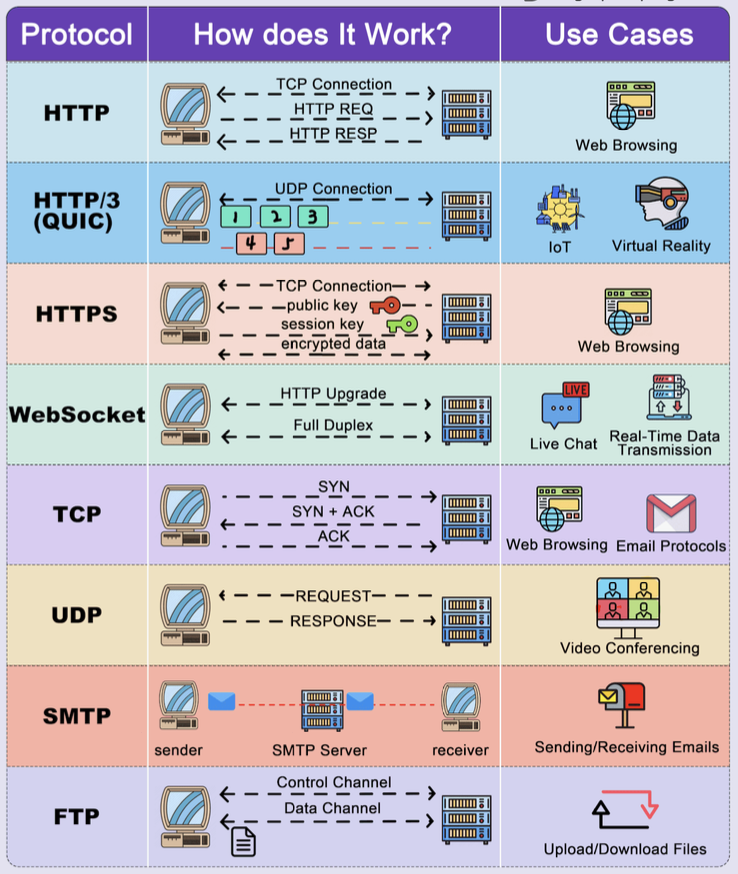
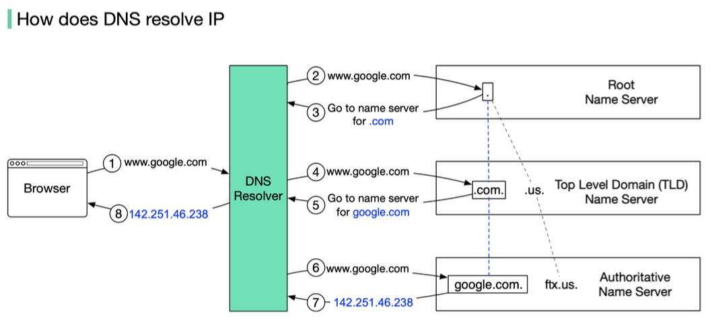

The [transport layer](/citadel/computer-networks/transport-layer) hands your program a pipe to another program on another host. The application layer is the conversation you have over that pipe — the request and response formats, the sequence of messages, the meaning of each field. It's the only layer most developers touch directly.

This post covers the shapes those conversations take (client-server, peer-to-peer), then the protocols that matter: HTTP for the web, FTP for files, the three-protocol tangle behind email, DNS as the internet's name lookup, DHCP for auto-configuration, and the peer-to-peer model that makes distributing a huge file to a million people practical.

## Application architectures

- **Client-server.** A **client** initiates; an always-on **server** with a fixed, well-known address responds. The web, email, FTP. The server side is infrastructure-heavy — it must handle every client at once.
- **Peer-to-peer (P2P).** No central server; **peers** talk directly, joining and leaving freely, often with changing addresses. Cheap, and capacity grows with the peer count — but coordination is harder.
- **Hybrid.** A server handles discovery and user management; the actual data flows peer-to-peer afterward. Skype and most messaging apps.

An **application protocol** defines the message *types* (request, response), their *syntax* (fields and layout), their *semantics* (what the fields mean), and the *rules* for when each side sends and replies. Many pair with a companion format spec — HTML alongside HTTP, RFC 822 and MIME alongside SMTP. A process is identified on a host by its IP address plus a **port number**, with well-known services on fixed ports (80 for HTTP, 25 for SMTP).

## HTTP and the web

A web page is a base HTML file plus referenced objects (images, scripts, stylesheets), each addressed by a **URL**. **HTTP** carries them, client-server, over **TCP on port 80**, and it's **stateless** — the server keeps nothing about past requests on its own.

**Connections.** HTTP/1.0 used **non-persistent** connections: one object per TCP connection, so a page with 10 images needs 11 connections. Each object costs roughly $2 \times \text{RTT} + \text{transmit time}$ (one round trip to set up TCP, one for the request/response). HTTP/1.1 uses **persistent** connections — the server holds the TCP connection open for further requests. *Non-pipelined*, the client waits for each response before the next request; *pipelined*, it fires requests back-to-back, collapsing the per-object round trips.

**Web caches (proxies).** A proxy sits between browser and origin server and keeps copies of recent objects. A hit is served locally — lower latency, less upstream bandwidth. The staleness question (is my copy still current?) is handled by HTTP/1.1 cache-control headers like `max-age` and `no-cache`. This is the same principle a [CDN](/citadel/interview/cdn) scales up.

**Cookies.** Since HTTP is stateless, the server sends a small token (name, value, expiry, path, domain) that the browser stores and returns on later requests to the same domain — enough to reconstruct login state, a cart, preferences.

The [HTTP](/citadel/interview/http) and [HTTPS](/citadel/interview/https) interview posts go deeper on methods, headers, and [status codes](/citadel/interview/http-codes).

## FTP

**FTP** transfers files, client-server, and is unusual in using **two TCP connections**:

- a **control connection** on port 21, open for the whole session, carrying commands (login, list, retrieve) and replies;
- a **data connection**, opened fresh for each file transfer and closed after.

FTP is **stateful** — it remembers the current directory. Two modes decide who opens the data connection:

- **Active** — the client sends `PORT` with an address it's listening on, and the *server* connects back (from port 20). Blocked by firewalls that reject inbound connections to clients.
- **Passive (`PASV`)** — the server names a port it's listening on, and the *client* connects to it. Firewall-friendly, since the client opens both connections.

## Email: SMTP, POP3, IMAP

Three components: **user agents** (Outlook, Thunderbird, webmail) to read and compose; **mail servers**, each holding users' **mailboxes** and an outgoing **message queue**; and the protocols between them.

- **SMTP** — the **push** protocol that moves mail from a user agent to its server and between servers. TCP port 25, three phases (handshake, message transfer, closure), ASCII commands with numeric status replies.
- **POP3** — a **pull** access protocol, TCP port 110. Typically downloads messages to one device and deletes them from the server; nearly stateless between sessions. Poor for multi-device access.
- **IMAP** — a richer pull protocol, TCP port 143 (993 over TLS). Messages stay on the server in folders, state (folder names, read flags) persists across sessions, multiple clients can attach at once, and searches run server-side. Built for reading mail from several devices.

Webmail uses **HTTP** between browser and provider, but the provider's servers still speak **SMTP** to the outside world.

**Message format.** RFC 822: a **header** of `Type: value` lines (`From:`, `To:`, `Subject:`, `Date:`, `Message-ID:`, `CC:`, `BCC:`), a blank line, then the **body**. **MIME** extends this for non-ASCII text and attachments, adding headers: `MIME-Version`, `Content-Type` (`text/plain`, `image/jpeg`, `multipart/mixed`), `Content-Transfer-Encoding` (`7bit`, `Base64` for binary — see [encoding](/citadel/interview/encoding)), `Content-Description`, `Content-ID`.

## DNS

Humans use `www.google.com`; routers forward on `172.217.160.142`. **DNS** is the distributed database and protocol that translates between them. Beyond plain lookup it provides **host aliasing** (a friendly name mapped to a canonical one), **mail-server designation** (which host handles `@example.com`), and **load distribution** (one name, several IPs, rotated in replies).

It's hierarchical and distributed — a single server would be a bottleneck and a single point of failure:

- **Root servers** — 13 logical clusters (many physical machines), coordinated by ICANN; they know where the TLD servers are.
- **Top-level domain (TLD) servers** — `.com`, `.org`, country codes; they know the authoritative servers for each second-level domain.
- **Authoritative servers** — hold the actual records for an organisation's hosts.
- **Local resolver** — usually your ISP's; the first server your host asks. It caches answers with a **TTL** and, on a miss, walks the hierarchy (root → TLD → authoritative).

1. Host asks the local resolver for `www.example.com`.
2. Resolver asks a root server; gets the `.com` TLD servers.
3. Resolver asks a `.com` TLD server; gets `example.com`'s authoritative servers.
4. Resolver asks an authoritative server; gets the IP.
5. Resolver returns the IP to the host and caches it.

**Resource records** are tuples `[Name, Value, Type, TTL]`:

| Type | Name | Value |
| --- | --- | --- |
| A | hostname | IPv4 address |
| AAAA | hostname | IPv6 address |
| NS | domain | authoritative name server's hostname |
| CNAME | alias hostname | canonical hostname |
| MX | domain | mail server's hostname (+ preference) |

DNS runs over **UDP port 53** for speed, falling back to TCP for large responses and zone transfers.

## DHCP

A host joining a network needs, at minimum, an IP address — and usually also the subnet mask, default router, and DNS server. **DHCP** hands those out automatically. It's an application-layer protocol over **UDP**, client port 68, server port 67, and the exchange is four steps (**DORA**):

1. **Discover** — the host, with no address yet, broadcasts `DHCPDISCOVER` (source `0.0.0.0`, destination `255.255.255.255`).
2. **Offer** — one or more servers reply with `DHCPOFFER`: a proposed address, lease time, mask, router, DNS.
3. **Request** — the host broadcasts `DHCPREQUEST` naming the offer it accepts (broadcast so the other servers know their offers were declined).
4. **Acknowledge** — the chosen server sends `DHCPACK` finalising the lease (or `DHCPNAK` if the offer lapsed).

The address is **leased**. The client renews by unicast at 50% of the lease (T1) and again at 87.5% (T2), then rebinds by broadcast; if the lease expires it must stop using the address. Key message fields: `ciaddr` (client's current IP), `yiaddr` (the offered one), `siaddr` (server), `giaddr` (relay gateway), `chaddr` (client hardware address).

## P2P file distribution

Distribute a file of size $F$ to $N$ peers. Client-server, the server uploads $N$ copies, so the time is

$$T_{cs} = \max\left\{ \frac{NF}{u_s},\ \frac{F}{\min_i d_i} \right\}$$

which grows linearly with $N$ ($u_s$ is server upload rate, $d_i$ each peer's download rate). P2P lets every peer re-upload pieces it already has, so the aggregate upload capacity is $u_s + \sum_i u_i$:

$$T_{p2p} = \max\left\{ \frac{F}{u_s},\ \frac{F}{\min_i d_i},\ \frac{NF}{u_s + \sum_i u_i} \right\}$$

The third term barely grows with $N$, because each new peer adds demand *and* supply.

**BitTorrent** is the canonical implementation. A `.torrent` file holds the **tracker** URL, file metadata, and a SHA-1 hash per piece. The original sharer runs a **seed** (has the whole file); downloaders (**leechers**) contact the tracker, get a list of peers in the **swarm**, and trade pieces — **rarest piece first** to keep the swarm's pieces balanced, **tit-for-tat** to reward peers who upload back.

## The one idea to keep

Every application protocol here is solving the same shape of problem — name a thing, request it, get it back — under different constraints. HTTP optimises for many small objects from one server (persistent connections, caching). DNS optimises for a namespace too big and too churny for any one machine (hierarchy, caching, TTLs). BitTorrent optimises for one huge object wanted by everyone (turn every downloader into an uploader). The transport layer below just moves bytes; the cleverness is in how each protocol structures the conversation.
