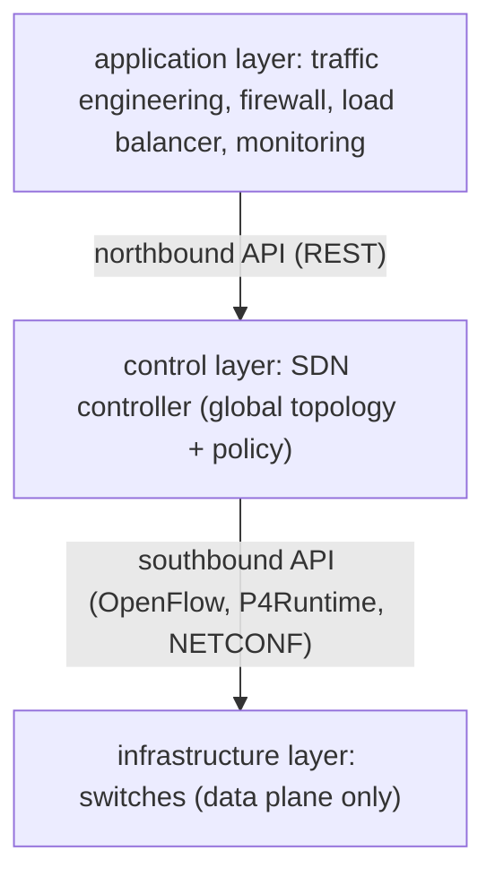

A conventional router or switch is two things fused together: a **data plane** that forwards packets at line rate, and a **control plane** that decides *how* to forward them — running routing protocols, building forwarding tables, reacting to link failures. Every box does both, and its control logic is proprietary firmware. To change how the network behaves you log into each device and edit its config, in its vendor's CLI, one at a time.

**Software-defined networking** splits those two planes apart. The data plane stays in the switches (they still forward fast), but the control plane moves to a logically **centralised controller** — software, running on ordinary servers, that has a global view of the network and programs every switch's forwarding table over an open protocol. The network stops being a collection of independently-configured boxes and becomes a system you write software against.

## The architecture

Three layers, connected by two APIs:

- **Infrastructure layer** — the switches. They hold **flow tables** and forward packets according to them, but no longer decide the table contents themselves.
- **Control layer** — the controller. It discovers the topology, holds the policy, computes forwarding state, and pushes it down. Logically one entity; physically a cluster (for scale and fault tolerance) that keeps its network view consistent via [consensus](/citadel/interview/consensus).
- **Application layer** — programs that express *intent* ("isolate tenant A's traffic", "route video around the congested link", "mirror all traffic to the IDS") by calling the controller's northbound API.

The **southbound API** is how the controller talks to switches; the **northbound API** is how apps talk to the controller (usually REST/gRPC, not standardised).

## OpenFlow

The protocol that started SDN (2008). A switch's forwarding logic becomes a pipeline of **flow tables**, each a list of entries:

- **Match** — on any combination of header fields: ingress port, MAC, VLAN, IP addresses, protocol, TCP/UDP ports, and more. Wildcards allowed.
- **Priority** — highest-priority matching entry wins.
- **Actions** — forward to a port, drop, send to the controller, rewrite a header field, decrement TTL, push/pop a tag, go to another table.
- **Counters** — packets and bytes matched, for monitoring.

When a packet matches no entry (a **table miss**), the switch (by configured policy) either drops it or sends it to the controller as a `PacketIn`. The controller decides what to do, installs a flow entry so future packets of that flow are handled in hardware, and (optionally) sends the packet back out. This is **reactive** flow setup; **proactive** setup pushes all the rules in advance so nothing ever hits the controller on the fast path (essential at scale — a controller round trip per new flow doesn't survive a data centre).

## Programmable data planes: P4

OpenFlow fixes *what fields* a switch can match on. **P4** goes further: it's a language for describing the packet-processing pipeline itself — you define the headers, the parser, the tables, and the actions, and compile that to the target (a programmable ASIC like Intel Tofino, a SmartNIC, or a software switch). The control plane then populates the tables at runtime via **P4Runtime**. This lets you support a new protocol or a custom telemetry format without waiting for a chip vendor. The **PISA** architecture (protocol-independent switch architecture) is the hardware model P4 targets.

## Controllers

- **ONOS** and **OpenDaylight** — the big open-source carrier-grade controllers, clustered, with rich northbound APIs.
- **Ryu**, **Faucet** — lighter, Python-based, popular for research and smaller deployments.
- **Cloud SDN** — the hyperscalers built their own (Google's B4 for WAN traffic engineering, Azure's VFP) rather than use OpenFlow directly.

The controller is the obvious concern: it's a central point, so it must be replicated, and its consistency model matters — different replicas seeing a stale topology can install conflicting rules. It's also a security target: compromise the controller and you own every forwarding decision in the network.

## Network Function Virtualization

Related but distinct. **NFV** takes network *functions* that used to be dedicated hardware appliances — firewalls, load balancers, NAT boxes, WAN accelerators, cellular core components — and runs them as software (**VNFs**) on commodity servers, often in VMs or containers.

- **Service function chaining** — steer a flow through an ordered list of VNFs (firewall → IDS → load balancer) by tagging packets and having the network forward accordingly. SDN is what does the steering.
- **MANO** (management and orchestration) — the layer that instantiates, scales, heals, and connects VNFs (ETSI's reference architecture).

SDN changes *how packets are forwarded*; NFV changes *what the middleboxes are made of*. Together they let a telco spin up a customer's firewall + VPN as software in minutes instead of shipping an appliance.

## What it buys, and the trade-offs

- **Centralised optimisation** — the controller sees the whole topology, so it can do globally optimal traffic engineering (Google's B4 runs WAN links at ~90% utilisation, where traditional networks stay near 30–40% to leave failover headroom).
- **Automation and agility** — network changes are API calls, versioned and tested like code; multi-tenant isolation and per-app policy become straightforward.
- **Vendor independence** — buy plain "white-box" switches and run your own control software.

Against that: the controller is a new single point of failure and attack; a controller–switch partition needs a sane fallback (switches keep forwarding on their last-known rules); reactive flow setup adds latency and a controller bottleneck; and standardisation is uneven (OpenFlow adoption stalled; the northbound API never standardised). Most production "SDN" today is inside data centres and WANs run by one operator, and often uses overlays rather than pure OpenFlow.

## Overlays

The common practical form: **VXLAN** / **GRE** / **Geneve** tunnels encapsulate tenant traffic and carry it over an unmodified IP fabric, with a controller distributing the tunnel endpoints and mappings. The physical network stays simple; all the tenant-specific logic lives in the overlay's virtual switches (Open vSwitch) at the hosts. This is how Kubernetes CNIs, OpenStack Neutron, and cloud VPCs actually implement isolation — SDN principles applied at the host edge rather than in the core switches.

## The one idea to keep

SDN separates the control plane from the data plane: switches keep forwarding fast, but a centralised controller with a global view computes their forwarding tables and installs them over an open protocol (OpenFlow, or P4Runtime for fully programmable pipelines). That makes the network programmable — traffic engineering, isolation, and monitoring become software against the controller's API — at the cost of a central component you must replicate and defend. NFV is the companion idea: middleboxes become software you orchestrate, with SDN steering flows through them.
