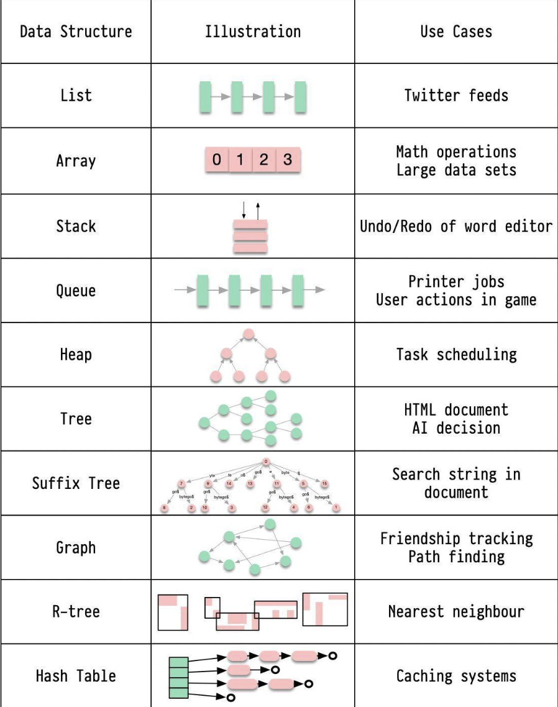

Hey everyone, and welcome back to the blog! As software engineers, whether we're building the next big thing or working on intricate systems, our primary job is to solve problems efficiently. And at the very heart of efficient problem-solving and robust software design lie **Data Structures**.

Choosing the right data structure for a task can be the difference between an application that flies and one that crawls. They are the fundamental building blocks that organize, manage, and store data in a way that allows for efficient access and modification. Today, let's embark on a detailed journey through some of the most common and crucial data structures, exploring their characteristics, typical time complexities for key operations, and fascinating real-world use cases. As engineers, we should be aware of these data structures and their use cases to create effective and efficient solutions.

---
## Why Data Structures Matter

Before we dive in, why this obsession with how data is organized?

* **Efficiency:** The right data structure can lead to significantly faster algorithms.
* **Resource Management:** They help in managing memory and processing resources effectively.
* **Problem Solving:** Understanding them provides a toolbox for tackling complex problems.
* **Scalability:** The choice of data structure profoundly impacts how well a system can scale.

---
## A. Fundamental Linear Data Structures

These structures arrange data in a sequential manner.

### 1. Arrays

* **What it is:** A collection of items stored at contiguous memory locations. Elements can be accessed directly using an index.
* **Key Characteristics:**
  * Stores elements of the same data type (in many statically-typed languages).
  * Fixed size (in many implementations like C++/Java arrays, though dynamic arrays/lists in Python or `ArrayList` in Java resize).
  * Elements are indexed (usually 0-based).
  * Contiguous memory allocation.
* **Common Operations & Time Complexities:**
  * **Access (by index):** O(1)
  * **Search (linear):** O(n)
  * **Search (if sorted, binary search):** O(log n)
  * **Insertion (at end, if space):** O(1) (amortized O(1) for dynamic arrays)
  * **Insertion (at beginning/middle):** O(n) (due to shifting elements)
  * **Deletion (at end):** O(1) (amortized O(1) for dynamic arrays)
  * **Deletion (at beginning/middle):** O(n) (due to shifting elements)
* **Use Cases:**
  * Storing collections of similar items where size is known or access by index is frequent.
  * Used as building blocks for other data structures (e.g., stacks, queues, hash tables).
  * Math operations on large datasets.
* **Pros:** Fast random access. Space efficient (no overhead for pointers per element).
* **Cons:** Fixed size (for static arrays). Costly insertions/deletions in the middle.
* **Reference**: [Array](https://github.com/54nd339/Data-Structures/blob/master/1array.c)

### 2. Linked Lists

* **What it is:** A linear collection of data elements (nodes), where each node points to the next node in the sequence. Unlike arrays, elements are not stored in contiguous memory locations.
* **Key Characteristics:**
  * Dynamic size.
  * Elements (nodes) contain data and a pointer (or link) to the next node (and possibly a previous node in a doubly linked list).
  * Non-contiguous memory allocation.
* **Common Operations & Time Complexities (Singly Linked List):**
  * **Access (by index/value):** O(n) (requires traversal)
  * **Search:** O(n)
  * **Insertion (at beginning):** O(1)
  * **Insertion (at end, if tail pointer kept):** O(1), otherwise O(n)
  * **Insertion (in middle, given pointer to previous node):** O(1)
  * **Deletion (at beginning):** O(1)
  * **Deletion (at end, if doubly linked with tail pointer):** O(1), otherwise O(n) for singly linked
  * **Deletion (in middle, given pointer to node/previous node):** O(1) (if node given for doubly, previous for singly)
* **Use Cases:**
  * Implementing stacks and queues.
  * Situations requiring frequent insertions/deletions at the beginning/end.
  * Managing lists where the size changes dynamically.
  * Twitter feeds could be conceptualized as a list-like structure where new items are added. (Though actual implementation is more complex).
  * Redis uses Linked Lists for its List data type.
* **Pros:** Dynamic size. Efficient insertions/deletions at known positions (especially ends).
* **Cons:** Slow random access (O(n)). Extra memory overhead for pointers.
* **References**:
  - [Linked List](https://github.com/54nd339/Data-Structures/blob/master/2slnklst.c)
  - [Doubly Linked List](https://github.com/54nd339/Data-Structures/blob/master/3dlnklst.c)
  - [Circular Linked List](https://github.com/54nd339/Data-Structures/blob/master/4clnklst.c)
  - [Doubly Circular Linked List](https://github.com/54nd339/Data-Structures/blob/master/5dclist.c)

### 3. Stacks (LIFO - Last-In, First-Out)

* **What it is:** A linear data structure that follows the LIFO principle. Operations happen at one end, called the "top."
* **Key Characteristics:**
  * Can be implemented using arrays or linked lists.
  * Operations: Push (add to top), Pop (remove from top), Peek/Top (view top element).
* **Common Operations & Time Complexities:**
  * **Push:** O(1)
  * **Pop:** O(1)
  * **Peek/Top:** O(1)
  * **Search:** O(n)
* **Use Cases:**
  * Function call management (call stack).
  * Undo/Redo functionality in editors.
  * Expression evaluation (e.g., converting infix to postfix).
  * Backtracking algorithms.
* **Pros:** Simple to implement, fast operations for push/pop/peek.
* **Cons:** Limited access (only top element is directly accessible).
* **References**:
  - [Stack using Array](https://github.com/54nd339/Data-Structures/blob/master/6stackar.c)
  - [Stack using Linked List](https://github.com/54nd339/Data-Structures/blob/master/7stackll.c)

### 4. Queues (FIFO - First-In, First-Out)

* **What it is:** A linear data structure that follows the FIFO principle. Elements are added at one end (rear/enqueue) and removed from the other end (front/dequeue).
* **Key Characteristics:**
  * Can be implemented using arrays or linked lists.
  * Operations: Enqueue (add to rear), Dequeue (remove from front), Peek/Front (view front element).
* **Common Operations & Time Complexities:**
  * **Enqueue:** O(1)
  * **Dequeue:** O(1)
  * **Peek/Front:** O(1)
  * **Search:** O(n)
* **Use Cases:**
  * Managing requests in order (e.g., printer jobs, tasks in a system).
  * Breadth-First Search (BFS) in graphs.
  * Buffering data (e.g., in I/O operations).
  * User actions in a game queue.
* **Pros:** Simple to implement, fair processing of items in order of arrival.
* **Cons:** Limited access (only front/rear elements directly accessible for add/remove).
* **References**:
  - [Queue using Array](https://github.com/54nd339/Data-Structures/blob/master/8QAR.c)
  - [Queue using Linked List](https://github.com/54nd339/Data-Structures/blob/master/9QLL.c)

---
## B. Non-Linear Data Structures

These structures arrange data in a non-sequential, often hierarchical or networked manner.

### 5. Hash Tables (Hash Maps / Dictionaries)

* **What it is:** A data structure that stores key-value pairs. It uses a hash function to compute an index (or "bucket") into an array from which the desired value can be found.
* **Key Characteristics:**
  * Unordered (typically).
  * Fast lookups, insertions, and deletions (on average).
  * Relies on a good hash function to minimize collisions (when multiple keys map to the same index). Collision resolution strategies include chaining or open addressing.
* **Common Operations & Time Complexities:**
  * **Access/Search (by key):** Average O(1), Worst-case O(n) (due to collisions)
  * **Insertion:** Average O(1), Worst-case O(n)
  * **Deletion:** Average O(1), Worst-case O(n)
* **Use Cases:**
  * Implementing associative arrays or dictionaries in programming languages.
  * Database indexing (Hash Index ).
  * Caching systems  (e.g., associating a URL with its webpage content).
  * Symbol tables in compilers.
  * Redis uses Hash Tables for its Hash data type.
* **Pros:** Very fast average-case performance for lookups, insertions, and deletions.
* **Cons:** Worst-case performance can be poor with bad hash functions or many collisions. Unordered. Can use more memory than arrays due to overhead for hash function and collision resolution.
* **References**: [Hash Table](https://en.wikipedia.org/wiki/Hash_table)

### 6. Trees

* **What it is:** A hierarchical data structure consisting of nodes connected by edges. Each tree has a root node, and every node (except the root) has one parent. Nodes can have zero or more child nodes.
* **Key Characteristics:** Non-linear, hierarchical.
* **Use Cases (General):**
  * Representing hierarchical data (e.g., file systems, organization charts).
  * HTML Document Object Model (DOM).
  * AI decision trees.

#### a. Binary Search Trees (BSTs)

    ***Concept:** A binary tree where each node has at most two children (left and right). For any node, all values in its left subtree are less than the node's value, and all values in its right subtree are greater.
    * **Time Complexities (Balanced BST, e.g., AVL, Red-Black Tree):**
        * Access/Search: Average O(log n), Worst-case O(log n)
        * Insertion: Average O(log n), Worst-case O(log n)
        * Deletion: Average O(log n), Worst-case O(log n)
        *(For unbalanced BST, worst-case can degrade to O(n))*
    * **Use Cases:** Implementing dynamic sets, lookup tables where data needs to be ordered.
    * **Pros:** Efficient search, insertion, deletion (if balanced). Keeps data sorted.
    * **Cons:** Can become unbalanced (skewed), leading to O(n) performance if not self-balancing.

#### b. Heaps (Priority Queues)

    ***Concept:** A specialized tree-based data structure that satisfies the heap property: in a max-heap, for any given node C, if P is a parent node of C, then the value of P is greater than or equal to the value of C. In a min-heap, the value of P is less than or equal to the value of C. Often implemented as an array.
    * **Time Complexities:**
        * Insertion (add element): O(log n)
        * Deletion (extract min/max): O(log n)
        * Peek (find min/max): O(1)
    * **Use Cases:**
        * Implementing priority queues.
        * Heap sort algorithm.
        * Task scheduling in operating systems.
    * **Pros:** Efficiently finds min/max element. Good for priority-based scheduling.
    * **Cons:** Searching for an arbitrary element is O(n).
    * **Reference:** [Heap](https://github.com/54nd339/Algorithms/blob/master/Heap.c)

#### c. B-Trees / B+ Trees

    ***Concept:** Self-balancing tree data structures that maintain sorted data and allow searches, sequential access, insertions, and deletions in logarithmic time. They are optimized for systems that read and write large blocks of data (like disks). B+ trees are a variation where all data is stored in leaf nodes, and leaf nodes are linked for efficient sequential access.
    * **Time Complexities:** Search, Insertion, Deletion are typically O(log n), where n is the number of keys. The base of the logarithm is related to the order (fanout) of the tree, which can be large, making them very efficient for disk-based operations.
    * **Use Cases:**
        * Standard for indexing in most relational database management systems (RDBMS).
        * File systems.
    * **Pros:** Efficient for disk-based storage due to high fanout (reducing tree height). Consistent read/write performance. Good for range queries (especially B+ trees).
    * **Cons:** More complex to implement than simpler trees.

#### d. Tries (Prefix Trees) & Suffix Trees

    ***Trie (Prefix Tree):** A tree-like data structure that stores a dynamic set or associative array where the keys are usually strings. Nodes do not store the key associated with that node; instead, its position in the tree defines the key it's associated with.
    * **Suffix Tree:** A compressed trie containing all the suffixes of a given text as their keys and positions in the text as their values.
    * **Time Complexities (Trie):**
        * Insertion: O(L) where L is the length of the string.
        * Search: O(L)
    * **Use Cases:**
        * Autocomplete / typeahead features.
        * Spell checkers.
        * IP routing (longest prefix match).
        * Suffix Trees: String searching in a document, bioinformatics. Suffix trees are mentioned for string pattern search.
    * **Pros:** Very fast prefix-based searches. Space-efficient for sets of strings with many common prefixes.
    * **Cons:** Can be space-intensive if strings don't share common prefixes.

#### e. R-Trees

    ***Concept:** Tree data structures used for indexing multi-dimensional information, such as geographical coordinates or rectangles. Each node in an R-tree corresponds to a minimum bounding rectangle (MBR) that encloses its child nodes.
    * **Time Complexities:** Search, Insertion, Deletion are typically logarithmic on average, but can be worse depending on data distribution and tree structure.
    * **Use Cases:**
        * Spatial databases for indexing geographical data.
        * Finding the nearest neighbor.
        * Geospatial queries like "find all restaurants within this map area."
    * **Pros:** Efficient for multi-dimensional range queries and nearest neighbor searches.
    * **Cons:** Can be complex to implement and balance. Performance can degrade with high-dimensional data.

### 7. Graphs

* **What it is:** A non-linear data structure consisting of a set of nodes (or vertices) and a set of edges that connect pairs of nodes. Edges can be directed or undirected, weighted or unweighted.
* **Key Characteristics:** Represents relationships between objects. Can contain cycles.
* **Common Operations:**
  * Adding/removing vertices/edges.
  * Graph traversal (Breadth-First Search - BFS, Depth-First Search - DFS).
  * Finding shortest paths (e.g., Dijkstra's, Bellman-Ford).
  * Detecting cycles.
* **Time Complexities:** Vary widely depending on the specific operation, graph representation (adjacency matrix vs. adjacency list), and algorithm used (e.g., BFS/DFS is O(V+E) with adjacency list).
* **Use Cases:**
  * Social networks (tracking friendships, connections).
  * Pathfinding in maps or networks (e.g., navigation systems).
  * Recommendation engines.
  * Modeling dependencies (e.g., task scheduling, compiler analysis).
* **Pros:** Excellent for modeling complex relationships and networks.
* **Cons:** Algorithms can be complex. No single "best" way to represent a graph for all operations.
* **References**:
  - [Graph using Adjacency Matrix](https://github.com/54nd339/Algorithms/blob/master/Graph.c)
  - [Graph using Adjacency List](https://github.com/54nd339/Algorithms/blob/master/graphll.c)

---
## C. Specialized Data Structures for Performance & Databases

These are often used internally by databases or high-performance systems.

### 8. Skip Lists

* **What it is:** A probabilistic data structure that allows fast search within an ordered sequence of elements. It uses multiple layers of linked lists, with each successive layer having fewer elements that "skip over" elements in the layer below.
* **Time Complexities:**
  * Search, Insertion, Deletion: Average O(log n)
* **Use Cases:**
  * A common in-memory index type.
  * Used in Redis for implementing Sorted Sets.
  * Concurrent dictionaries.
* **Pros:** Simpler to implement than balanced trees (like Red-Black trees) while providing similar average-case performance. Good for concurrent access.
* **Cons:** Probabilistic nature means worst-case can be O(n) though highly unlikely. Uses more memory than a simple linked list due to multiple pointers.

### 9. LSM Trees (Log-Structured Merge-Trees)

* **What it is:** A data structure optimized for high write throughput. Writes are initially batched in an in-memory sorted structure (often a skiplist or balanced tree, called a memtable). When the memtable fills up, it's flushed to disk as an immutable, sorted file called an SSTable (Sorted String Table). Reads might need to check the memtable and several SSTables on disk. SSTables are periodically merged and compacted in the background.
* **Time Complexities:**
  * Writes: Very fast, often O(1) or O(log N_memtable) to the in-memory component.
  * Reads: Can be slower, O(log N_memtable + K * log N_SSTable_block) where K is number of SSTables, as it may need to check multiple SSTables. Bloom filters are often used to speed up checks for non-existence.
* **Use Cases:**
  * Databases requiring high write throughput, like Apache Cassandra, HBase, RocksDB, LevelDB. (Combines Skiplist + SSTable ).
* **Pros:** Excellent write performance. Good for write-heavy workloads.
* **Cons:** Read performance can be variable or slower than B-trees if data is spread across many SSTables (before compaction). Compaction process can consume resources.

### 10. Inverted Indexes

* **What it is:** A data structure that maps content, such as words or numbers, to its locations in a document or a set of documents. Instead of listing documents and their words, it lists words and the documents they appear in.
* **Time Complexities:**
  * Lookup (finding documents containing a term): Very fast, often O(1) or O(log N_postings) depending on the implementation.
  * Indexing new documents: Can be relatively expensive.
* **Use Cases:**
  * Search engines (like Lucene, Elasticsearch, Solr) for full-text search.
  * Document retrieval systems.
* **Pros:** Extremely fast for searching terms within a large corpus of documents.
* **Cons:** Building and maintaining the index can be resource-intensive. Updates to documents require index updates.

## Key Takeaways

* Data structures are the fundamental organizational units for data in computer science, crucial for efficient algorithm design.
* The choice of data structure depends heavily on the specific operations you need to perform (access, search, insert, delete), the nature of the data (ordered, unique, spatial), and performance requirements (time and space complexity).
* From simple arrays and lists to complex trees, graphs, and specialized database indexes like B-Trees and LSM Trees, each has its unique strengths and trade-offs.
* Understanding these trade-offs is key to building performant and scalable software.

As engineers, constantly asking "What's the best way to store and access this data?" is a critical part of our problem-solving process. The answer often lies in selecting and applying the right data structure.
