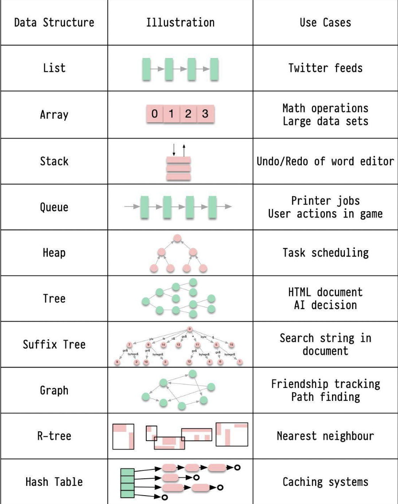

Choosing the data structure is choosing which operations are cheap. An array makes indexed access $O(1)$ and middle-insertion $O(n)$; a linked list swaps those. A hash table makes lookup $O(1)$ on average and ordered iteration impossible. There's no best one — there's the one whose fast operations match what your code does most.

This is a catalogue of the structures worth knowing, in three groups: **linear** (sequential), **non-linear** (hierarchical or networked), and **storage-engine specialised** (the ones databases use internally). Each entry lists what it makes fast, what it makes slow, and a system that leans on it.

## Linear structures

| Structure | Fast | Slow | Used for |
| --- | --- | --- | --- |
| **Array** | index access $O(1)$; append amortised $O(1)$; binary search $O(\log n)$ if sorted | insert/delete in the middle $O(n)$ (shifting); fixed capacity for static arrays | the backing store for almost everything else — stacks, queues, hash tables, heaps |
| **Linked list** | insert/delete at a known position, especially the ends, $O(1)$; grows without reallocation | random access $O(n)$ (must traverse); one pointer of overhead per node | queue and stack internals; Redis's List type; anywhere splicing at the ends dominates |
| **Stack** (LIFO) | push, pop, peek all $O(1)$ | reaching anything but the top | the call stack; undo/redo; expression evaluation; iterative [backtracking](/citadel/algorithms/Algorithms) |
| **Queue** (FIFO) | enqueue, dequeue, peek all $O(1)$ | reaching the middle | task and request buffering; breadth-first traversal; producer/consumer pipelines |

An array stores elements in contiguous memory, so element $i$ is a single address calculation away — that's the $O(1)$ access. A linked list stores each element in its own node with a pointer to the next, so it never has to shift or reallocate, but it also can't jump to element $i$ without walking there. Stacks and queues are usually one of these two underneath, restricted to a disciplined access pattern.

## Non-linear structures

### Hash tables

A **hash table** stores key-value pairs by running the key through a hash function to pick an array slot ("bucket"). Lookup, insert, and delete are $O(1)$ on average. Two keys can hash to the same slot — a *collision* — resolved by **chaining** (a linked list per bucket) or **open addressing** (probe for the next free slot). With a poor hash function or a full table, worst case degrades to $O(n)$. There's no order, so you can't iterate keys sorted.

Used for: language dictionaries and sets, database hash indexes, [caches](/citadel/interview/caching), compiler symbol tables, Redis's Hash type.

### Trees

Hierarchical: a root, and every other node with one parent. The [trees post](/citadel/data-structures/trees) covers these in depth; in brief:

| Tree | Operation cost | Note |
| --- | --- | --- |
| Binary search tree | $O(\log n)$ balanced, $O(n)$ skewed | ordered; degenerates on sorted input |
| Balanced BST (AVL, red-black) | $O(\log n)$ guaranteed | self-restructuring; used for `std::map`, `TreeMap`, OS schedulers |
| [B-tree / B+ tree](/citadel/data-structures/b-tree) | $O(\log n)$, few disk reads | high fanout; the standard database and filesystem index |
| Heap | insert/extract $O(\log n)$, peek $O(1)$ | priority queues, heapsort; arbitrary search is $O(n)$ |
| [Trie](/citadel/data-structures/trie) | $O(\text{string length})$ | prefix search; autocomplete, spell check, IP routing |
| R-tree | $\sim O(\log n)$ average | bounding-rectangle index for spatial data — "restaurants in this map area", nearest-neighbour |

### Graphs

A **graph** is vertices plus edges connecting them; edges can be directed or undirected, weighted or not, and cycles are allowed. Stored as an **adjacency list** (each vertex holds its neighbours — compact for sparse graphs) or an **adjacency matrix** ($V \times V$ booleans — fine for dense graphs, $O(1)$ edge test). Traversal (BFS, DFS) is $O(V + E)$ with an adjacency list. Beyond traversal: [shortest paths](/citadel/algorithms/PathFinding), cycle detection, topological order.

Used for: social networks, map and network routing, recommendation engines, dependency and build graphs.

## Storage-engine structures

These solve problems that show up when data is large, on disk, or written heavily.

**Skip list.** A stack of linked lists: the bottom holds every element in order, each layer above holds a random subset that lets you "skip" ahead. Search, insert, and delete average $O(\log n)$ — the same as a balanced tree, but simpler to implement and friendlier to concurrent access. Redis uses skip lists for its Sorted Set type. More in the [advanced structures roundup](/citadel/algorithms/advanced).

**LSM tree (log-structured merge-tree).** Optimised for write throughput. Writes go to an in-memory sorted structure (the *memtable*); when it fills, it's flushed to disk as an immutable sorted file (an *SSTable*). Reads check the memtable and then the SSTables, newest first — [Bloom filters](/citadel/data-structures/bloom-filters) skip SSTables that definitely lack the key. Background *compaction* merges SSTables to keep reads from touching too many. Writes are very fast; reads are slower and more variable than a B-tree's. This is what [Cassandra, ScyllaDB](/citadel/system-design/discord), RocksDB, and LevelDB run on.

**Inverted index.** Maps each term to the list of documents containing it — the reverse of listing each document's words. A full-text query becomes a lookup per term plus a merge of the resulting document lists, which is why [search engines](/citadel/system-design/search-engine) (Lucene, Elasticsearch, Solr) can rank a query against millions of documents in milliseconds. Building and updating the index is the expensive part.

## Key takeaways

- The choice is about *which* operations are cheap: match the structure's fast path to your hot path.
- **Linear** — arrays for indexed access, linked lists for end-splicing, stacks and queues for disciplined LIFO/FIFO.
- **Non-linear** — hash tables for unordered $O(1)$ lookup, trees for ordered $O(\log n)$ operations and hierarchy, graphs for relationships.
- **Storage-engine** — skip lists as a simpler balanced structure, LSM trees for write-heavy stores, inverted indexes for full-text search.

Reference implementations in C are on [GitHub](https://github.com/54nd339/Data-Structures).
