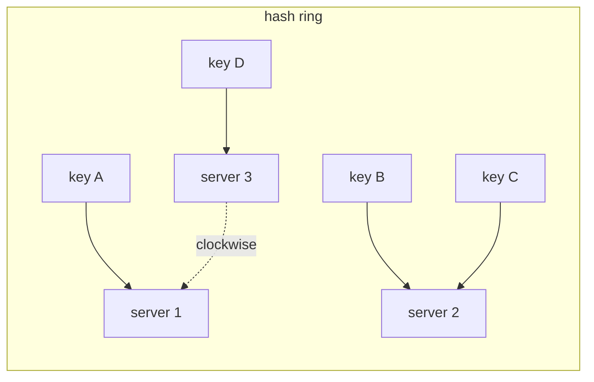

You have ten million user records and a username. You want the record now, not after a scan. An array gives you O(1) access *by position* — but you have a name, not a position. A hash table is the trick that turns the name into a position: run the key through a function, get an integer, use it as an array index, done.

The catch is that a function from "every possible username" to "a slot in a 16-million-entry array" cannot be injective — some pairs of keys collide on the same slot. Everything interesting about hash tables is how they handle that collision, and how they keep it rare. This post covers the two resolution strategies, the one number that governs performance, and how the same hashing idea distributes keys across machines.

## From key to slot

A hash table stores key–value pairs in an array of `m` slots (called **buckets**). A **hash function** `h` maps a key to a bucket index in `[0, m)`. Lookup, insert, and delete all start the same way: compute `h(key)`, go to that bucket.

A good hash function has three properties:

- **Uniform** — keys spread evenly across all `m` buckets. Clumping means long collision chains and slow lookups.
- **Avalanche** — flipping one bit of the key flips about half the bits of the output, so near-identical keys (`user_1001`, `user_1002`) don't land next to each other.
- **Fast** — it runs on every operation. A lookup that spends more time hashing than a tree spends comparing is a bad trade.

For hash *tables*, you want a fast non-cryptographic mixer: [FNV](https://en.wikipedia.org/wiki/Fowler%E2%80%93Noll%E2%80%93Vo_hash_function), MurmurHash, xxHash, or wyhash. Cryptographic hashes (SHA-256) are overkill and slow here — you only need them when an adversary might craft keys to force collisions, which is a real attack (**hash flooding**) that language runtimes defend against with a per-process random seed (**SipHash** in Python, Rust, Ruby).

There is a theoretical backstop: a **universal** family of hash functions is a set from which, picking `h` at random, any two distinct keys collide with probability at most `1/m`. Randomising the choice at startup means no fixed set of keys is worst-case.

## Collisions, resolved two ways

However good the function, two keys will eventually share a bucket. There are two schools of thought.

### Separate chaining

Each bucket holds a pointer to a small container — usually a linked list — of all entries that hashed there.

```python
class ChainingHashTable:
    def __init__(self, m=16):
        self.buckets = [[] for _ in range(m)]
        self.m = m
        self.n = 0

    def _idx(self, key):
        return hash(key) % self.m

    def put(self, key, value):
        chain = self.buckets[self._idx(key)]
        for i, (k, _) in enumerate(chain):
            if k == key:
                chain[i] = (key, value)      # overwrite existing
                return
        chain.append((key, value))
        self.n += 1

    def get(self, key):
        for k, v in self.buckets[self._idx(key)]:
            if k == key:
                return v
        raise KeyError(key)
```

If `n` entries are spread over `m` buckets, the average chain length is the **load factor** `α = n / m`. A successful lookup scans about `α/2` entries, an unsuccessful one about `α`. Keep `α` near 1 and every operation is O(1) on average. Java's `HashMap` promotes a bucket from a list to a balanced tree once it holds eight entries, so a pathological bucket degrades to O(log n) instead of O(n).

Chaining is simple, tolerates load factors above 1, and deletion is just a list removal. The costs are a pointer per entry and poor cache behaviour — each chain node is a separate heap allocation, so a lookup that follows three links is three cache misses.

### Open addressing

Store every entry *in the array itself*. On a collision, follow a deterministic **probe sequence** to the next candidate slot until you find the key or an empty slot.

- **Linear probing** — try `h(k)`, then `h(k)+1`, `h(k)+2`, … (mod `m`). Simple and extremely cache-friendly (you scan contiguous memory), but it suffers **primary clustering**: once a run of filled slots forms, any key hashing anywhere into it makes it longer, and runs merge.
- **Quadratic probing** — try `h(k) + 1²`, `h(k) + 2²`, `h(k) + 3²`, … This breaks up primary clusters but still has **secondary clustering**: keys with the same initial hash follow the same probe path.
- **Double hashing** — the step size itself comes from a second hash: `h(k) + i·g(k)`. Different keys probe with different strides, which eliminates both clustering effects at the cost of a second hash computation and worse cache locality than linear.

```python
class OpenAddressingHashTable:
    _EMPTY, _DELETED = object(), object()

    def __init__(self, m=16):
        self.keys = [self._EMPTY] * m
        self.vals = [None] * m
        self.m, self.n = m, 0

    def _probe(self, key):
        i = hash(key) % self.m
        while True:
            yield i
            i = (i + 1) % self.m          # linear probing

    def put(self, key, value):
        if (self.n + 1) / self.m > 0.7:
            self._resize(self.m * 2)
        first_deleted = None
        for i in self._probe(key):
            if self.keys[i] is self._EMPTY:
                target = first_deleted if first_deleted is not None else i
                self.keys[target], self.vals[target] = key, value
                self.n += 1
                return
            if self.keys[i] is self._DELETED:
                first_deleted = first_deleted if first_deleted is not None else i
            elif self.keys[i] == key:
                self.vals[i] = value
                return
```

Open addressing has no per-entry pointers and keeps everything in one contiguous block, so it wins on memory and cache misses — which is why modern high-performance tables (Google's **SwissTable**, Facebook's **F14**, Rust's `hashbrown`) are all open-addressed, with a compact metadata byte per slot that lets SIMD instructions scan sixteen slots at once.

Two prices. First, performance collapses as `α → 1`: at `α = 0.9`, an unsuccessful linear-probing lookup averages ~50 probes. Open-addressed tables resize at `α` around 0.7–0.85, so they waste more space than chaining. Second, **deletion is awkward** — you can't just blank a slot, because that would break the probe chain for some other key that probed past it. You write a **tombstone** (the `_DELETED` marker above): treat it as occupied when searching, reusable when inserting. Tombstones accumulate and slow lookups until a rehash clears them.

## The load factor rules everything

Both strategies have the same knob. As `α` climbs, chains lengthen and probe sequences stretch; average O(1) quietly becomes O(α) and then worse. The fix is to **resize**: allocate a bigger array (typically 2×), then re-insert every entry, because `h(key) % m` changes when `m` changes.

A resize is O(n). Amortised over the n insertions that triggered it, it adds O(1) per insertion — the same [amortised argument](/citadel/algorithms/ComplexityClasses) as a dynamic array doubling. But a single `put` can still stall for milliseconds while ten million entries move, which is unacceptable for a latency-sensitive service. **Incremental resizing** spreads the work: keep both tables, move a few buckets on every subsequent operation, and route reads to whichever table holds the key until the old one is drained. Redis does exactly this.

> Shrinking is usually *not* done automatically. A table that grew to handle a spike and then emptied stays large, because a delete-heavy workload could otherwise thrash between grow and shrink. Shrink on an explicit signal, not on load factor alone.

## Robin Hood and cuckoo

Two refinements worth knowing.

**Robin Hood hashing** is open addressing with one rule added: during insertion, track how far each entry is from its ideal slot (its **probe distance**). If the entry you're trying to place has probed further than the entry currently sitting in a slot, evict the sitting entry and carry it onward — "take from the rich, give to the poor". This doesn't lower the *average* probe distance, but it slashes the *variance*: every entry ends up roughly equally far from home, so the worst-case lookup is close to the average. Tables that need predictable tail latency use it.

**Cuckoo hashing** uses two tables and two hash functions. Every key lives in exactly one of its two slots — `h1(k)` in table 1 or `h2(k)` in table 2 — so a lookup checks **exactly two slots, worst case**. Insertion places the key in one slot; if it's taken, kick out the occupant and re-place *that* key in its alternate slot, repeating (like a cuckoo chick evicting eggs) until everything settles or a cycle forces a rehash. Constant-time worst-case lookup is the prize; the cost is insertions that can cascade and a hard load-factor ceiling around 50% for two tables (higher with more).

## Scaling out: consistent hashing

Now the keys don't fit on one machine. Put `S` servers in a row and send key `k` to server `hash(k) % S`. It works — until you add or remove a server. Then `S` changes, `hash(k) % S` changes for *almost every key*, and the entire dataset reshuffles across the network.

**Consistent hashing** fixes this. Hash both the servers and the keys onto the same space — think of it as points on a circle, `[0, 2³²)`. A key belongs to the first server found walking clockwise from the key's position.



Add a server and it slots in at one point on the ring, taking over only the arc of keys between it and the previous server — roughly `1/S` of the data moves, and only from one neighbour. Remove a server and its arc passes to the next one clockwise. Nobody else is touched.

Two practical additions:

- **Virtual nodes.** One point per server gives lumpy arcs — some servers own far more of the ring than others, and removing a server dumps its entire load on a single neighbour. Instead give each physical server a few hundred points scattered around the ring. Arcs even out, and a departing server's load spreads across many others. This also lets a bigger machine carry proportionally more points.
- **Bounded loads.** Even with virtual nodes, a viral key or an unlucky distribution can overload one server. The *consistent hashing with bounded loads* variant caps any server at `(1 + ε)` times the average and spills overflow to the next server clockwise.

A lighter alternative is **rendezvous hashing** (highest random weight): for a key, compute `hash(key, server)` for every server and pick the highest. Adding or removing a server only changes the winner for keys where that server was involved — same minimal-movement property, no ring to maintain, at the cost of an O(S) computation per lookup (fine for small S).

Consistent hashing is how [distributed key-value stores](/citadel/system-design/key-value-store) partition data, how a [distributed cache](/citadel/system-design/distributed-cache) shards keys, and how CDNs and load balancers pin a client to a backend.

## The one idea to keep

A hash table is an array plus a function that pretends your key was a number all along. It gives you O(1) as long as the load factor stays low enough that collisions are rare — so the real engineering is picking a collision strategy (chaining for simplicity and high load, open addressing for cache locality and memory) and resizing before `α` gets close to 1. Push the same idea out to a ring of machines and you get consistent hashing, where the whole point is that adding a node moves `1/n` of the keys instead of all of them.
