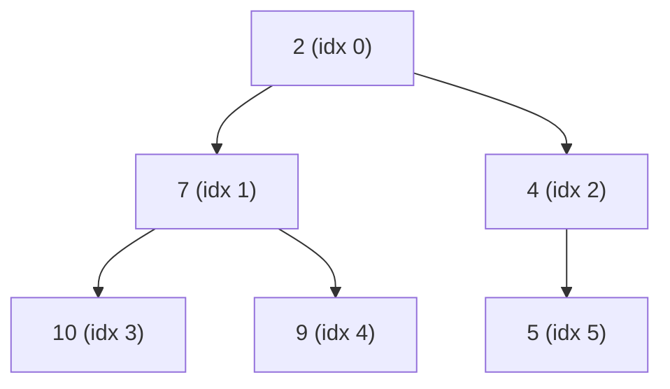

A hospital triage desk doesn't serve patients first-come-first-served. It serves the most urgent one next, and urgency keeps changing as new patients arrive and existing ones deteriorate. You need a structure that always knows the current maximum-priority item, lets you add items cheaply, and lets you pull the top one out cheaply.

A sorted array knows the top instantly but costs O(n) to insert into. An unsorted array inserts in O(1) but costs O(n) to find the top. A **heap** splits the difference: both operations in O(log n), using nothing but an array and a simple rule about parents and children. This post builds the binary heap from that rule, then looks at when its O(log n) isn't good enough and what replaces it.

## The heap property

A **binary heap** is a binary tree with two constraints:

1. **Shape** — every level is completely filled except possibly the last, which fills left to right. The tree is as short and balanced as a binary tree can be: height `⌊log₂ n⌋`.
2. **Order** — every node's key is `≤` both its children's keys (a **min-heap**; flip the comparison for a max-heap). This says nothing about siblings — only the parent–child relationship is constrained, which is exactly why a heap is cheaper to maintain than a fully sorted structure.

Together these mean the minimum is always at the root, and you can restore the property after a change by moving one element up or down a single root-to-leaf path.

Because the shape is so regular, you don't need actual tree nodes. Pack the tree into an array level by level. The node at index `i` has:

- parent at `(i - 1) // 2`
- children at `2i + 1` and `2i + 2`

No pointers, perfect cache locality, and the "tree" is a fiction over a flat array.



## Two operations, one path each

**Insert** (`push`). Append the new key at the end of the array — that's the only spot the shape rule allows. It may be smaller than its parent, violating order. **Sift up**: while the key is smaller than its parent, swap them. Each swap moves the key one level toward the root, so at most `log n` swaps.

**Extract-min** (`pop`). The answer is at index 0. You can't just delete it — that leaves a hole at the root. Move the *last* element into the root (preserving shape), then **sift down**: while it's larger than its smaller child, swap with that child. Again at most `log n` swaps.

```python
class MinHeap:
    def __init__(self):
        self.a = []

    def push(self, x):
        self.a.append(x)
        i = len(self.a) - 1
        while i > 0:
            parent = (i - 1) // 2
            if self.a[parent] <= self.a[i]:
                break
            self.a[parent], self.a[i] = self.a[i], self.a[parent]
            i = parent

    def pop(self):
        top = self.a[0]
        last = self.a.pop()
        if self.a:
            self.a[0] = last
            i, n = 0, len(self.a)
            while True:
                l, r, smallest = 2 * i + 1, 2 * i + 2, i
                if l < n and self.a[l] < self.a[smallest]:
                    smallest = l
                if r < n and self.a[r] < self.a[smallest]:
                    smallest = r
                if smallest == i:
                    break
                self.a[i], self.a[smallest] = self.a[smallest], self.a[i]
                i = smallest
        return top
```

Peeking at the minimum is `self.a[0]` — O(1). Python's `heapq` is this exact structure (functions over a list rather than a class); Java's `PriorityQueue` and C++'s `std::priority_queue` are the same idea.

## Build-heap in O(n), and heapsort

Given `n` items already in an array, you could `push` them one at a time: O(n log n). But there's a faster way. Start from the last non-leaf node (`n//2 - 1`) and sift *down* each node moving toward the root:

```python
def heapify(a):
    for i in range(len(a) // 2 - 1, -1, -1):
        _sift_down(a, i, len(a))
```

This looks like O(n log n) too, but it isn't. Half the nodes are leaves and sift down zero levels; a quarter sift at most one level; an eighth at most two. The sum `Σ (n / 2^(h+1)) · h` converges to **O(n)**. Building a heap from scratch is linear.

That gives **heapsort**: `heapify` the array into a max-heap in O(n), then repeatedly swap the root to the end and sift down the reduced heap — `n` extractions at O(log n) each, O(n log n) total, in place, no recursion. It loses to [quicksort](/citadel/algorithms/SortingSearching) in practice because its swaps jump all over the array (bad for cache) and it isn't stable, but its guaranteed O(n log n) worst case with O(1) extra space makes it the fallback inside introsort.

## d-ary heaps

Nothing forces two children per node. A **d-ary heap** gives each node `d` children (indices `d·i + 1` through `d·i + d`). The tree gets shorter — height `log_d n` — so `push` and `decrease-key` do fewer swaps. The price is `pop`, which must now find the minimum among `d` children per level instead of 2, so it does `d · log_d n` comparisons.

A 4-ary heap is often faster than binary in practice: the shorter tree helps, and four contiguous children fit neatly in a cache line. Tune `d` up when the workload is insert-heavy and pop-light.

## When O(log n) per operation isn't enough

[Dijkstra's shortest-path algorithm](/citadel/algorithms/PathFinding) and [Prim's MST](/citadel/algorithms/MinimumSpanningTree) both do the same thing: keep a priority queue of vertices keyed by tentative distance, extract the closest, and then *lower the key* of each of its neighbours when a shorter path is found. On a graph with `V` vertices and `E` edges that's `V` extract-mins and up to `E` decrease-keys.

A binary heap does `decrease-key` in O(log n) (sift the lowered element up), giving `O((V + E) log V)` overall. For a dense graph where `E ≈ V²`, the `E log V` term dominates. Can decrease-key be made cheaper?

**Binomial heap.** A forest of *binomial trees* (a binomial tree `B_k` has `2^k` nodes and is built from two `B_{k-1}`s). At most one tree of each order, so at most `log n` trees. The payoff is **merge** in O(log n) — you add two binomial heaps like binary numbers, combining equal-order trees with carries. Insert, extract-min, and decrease-key are all O(log n), same as a binary heap, but a *meld* of two heaps is also O(log n) instead of O(n). Useful when you combine priority queues often.

**Fibonacci heap.** Also a forest of trees, but lazy: `insert` and `meld` just concatenate root lists in **O(1)**, and `decrease-key` is **O(1) amortised** — cut the node loose with its subtree and drop it into the root list, marking its parent so that a parent losing two children gets cut too (**cascading cuts**), which keeps the trees from degenerating. All the deferred cleanup is charged to `extract-min`, which stays O(log n) amortised. That makes Dijkstra `O(E + V log V)` — asymptotically optimal for a comparison-based approach.

The catch, and it's a big one: Fibonacci heaps have large constant factors, heavy pointer chasing, and terrible cache behaviour. On real inputs a binary or 4-ary heap usually beats them. They matter for the theoretical bound and for graphs large and dense enough that the asymptotics win. A **pairing heap** is the practical compromise — much simpler, O(1) actual insert/meld, decrease-key that's O(log n) proven but near-O(1) observed, and it holds up in benchmarks.

## The one idea to keep

A binary heap is a sorted structure that only bothers to sort along parent–child edges, which is why it costs O(log n) instead of O(n log n) to maintain — and since it's really just an array with an index-arithmetic rule, it's fast and simple enough to be the default priority queue everywhere. Reach past it only when a specific operation dominates your workload: frequent melding points at binomial heaps, and a decrease-key-heavy graph algorithm is the textbook case for Fibonacci heaps — though you should benchmark a pairing heap or a plain 4-ary heap before believing the asymptotics.
