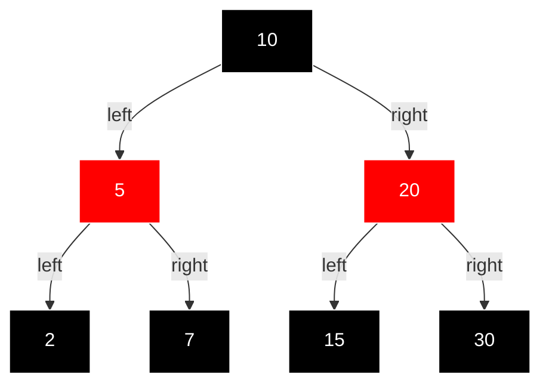

Hey everyone, and welcome back to the blog! We've previously talked about AVL trees and their strict balancing act. Today, let's explore another champion in the world of self-balancing binary search trees: the **Red-Black Tree**. If `y`ou've ever wondered how data structures like `std::set` or `std::map` in C++, or Java's `TreeMap` and `TreeSet`, manage to provide efficient search, insertion, and deletion operations even with large amounts of data, chances are a Red-Black Tree is working its magic under the hood!

Invented by Rudolf Bayer (though the red/black color convention came a bit later from work by Leonidas J. Guibas and Robert Sedgewick), Red-Black Trees are a fascinating type of binary search tree that uses a clever coloring scheme for its nodes (either red or black) to ensure the tree remains approximately balanced, guaranteeing logarithmic time complexity for key operations. They are a cornerstone in many libraries, applications, and even operating systems.

## The Coloring Rules: Properties of a Red-Black Tree

A Red-Black Tree is a binary search tree that satisfies the following five properties, which collectively ensure its balance:

1. **Color Property:** Every node is either red or black.
2. **Root Property:** The root of the tree is always black.
3. **Leaf Property:** Every leaf node (typically represented by NIL or null sentinels) is black. These NIL leaves are often conceptual and don't store data.
4. **Red Property (No Red-Red Parent-Child):** If a node is red, then both its children must be black. This means `y`ou cannot have two red nodes directly connected in a parent-child relationship.
5. **Black-Height Property (Uniform Black Depth):** Every simple path from a given node to any of its descendant NIL leaves contains the same number of black nodes. This is often referred to as the "black-height" of the path.

These rules might seem a bit arbitrary at first, but they work together to ensure that the longest path from the root to any leaf is no more than twice as long as the shortest path. This keeps the tree "bushy" enough to guarantee O(log n) performance for its operations.

Here's a conceptual look at a Red-Black Tree node:

```pseudocode
class Node:
    key     // The value stored in the node
    left    // Pointer to the left child
    right   // Pointer to the right child
    parent  // Pointer to the parent node
    color   // RED or BLACK
    // T.nil represents a sentinel NIL node (black)
```

## Maintaining Balance: Rotations

Just like AVL trees, Red-Black Trees use rotations to maintain balance when insertions or deletions might violate the red-black properties. These rotations restructure the tree locally to preserve the BST property and help satisfy the red-black rules. The parent pointer in each node is crucial for performing these rotations efficiently and for the fix-up logic.

* **Left Rotate:** If `x` is a node and `y` is its right child, `left_rotate(T, x)` makes `y` the new root of the subtree, with `x` becoming `y`'s left child. `y`'s original left child becomes `x`'s new right child.

  ```pseudocode
  // T is the tree object, often holding T.root and T.nil (sentinel leaf)
  function left_rotate(T, x):
      y = x.right             // Set y
      x.right = y.left        // Turn y's left subtree into x's right subtree
      if y.left != T.nil:
          y.left.parent = x
      y.parent = x.parent     // Link x's parent to y
      if x.parent == T.nil:   // x was root
          T.root = y
      else if x == x.parent.left:
          x.parent.left = y
      else:
          x.parent.right = y
      y.left = x              // Put x on y's left
      x.parent = y
  ```
* **Right Rotate:** The right rotation is the mirror image of the left rotation. If `y` is a node and `x` is its left child, `right_rotate(T, `y `)` makes `x` the new root of the subtree, with `y` becoming `x`'s right child. `x`'s original right child becomes `y`'s new left child.

  ```pseudocode
  function right_rotate(T, y):
      x = y.left              // Set x
      y.left = x.right        // Turn x's right subtree into y's left subtree
      if x.right != T.nil:
          x.right.parent = y
      x.parent = y.parent     // Link y's parent to x
      if y.parent == T.nil:   // y was root
          T.root = x
      else if y == y.parent.left:
          y.parent.left = x
      else:
          y.parent.right = x
      x.right = y             // Put y on x's right
      y.parent = x
  ```

## Key Operations in Red-Black Trees

Red-Black trees support the standard binary search tree operations like search, insertion, and deletion, all while maintaining their balance properties.

### Insertion

* **Goal:** Insert a new node with a given key while preserving all red-black properties.
* **Process:**
  1. The new node `z` is inserted using the standard BST insertion procedure, and it is initially colored **RED**. (Coloring it red is less likely to violate the black-height property initially).
  2. After insertion, the red-black properties might be violated (e.g., a red node might have a red parent, or the root might be red).
  3. An `insert_fixup(T, `z `)` procedure is called to restore these properties. This fixup involves a series of color changes (recoloring) and tree rotations. The fixup logic examines the color of `z`'s parent and uncle (parent's sibling) to decide the appropriate action. There are several cases:
     * **Case 1 (Uncle is RED):** Recolor `z`'s parent, uncle, and grandparent. Move `z` up to the grandparent and repeat.
     * **Case 2 (Uncle is BLACK, and `z` is an "inner" grandchild - forming a triangle):** Perform a rotation on `z`'s parent to transform it into Case 3.
     * **Case 3 (Uncle is BLACK, and `z` is an "outer" grandchild - forming a line):** Recolor parent and grandparent, then perform a rotation on the grandparent.
  4. The loop in `insert_fixup` continues until `z`'s parent is black or `z` becomes the root. Finally, the root of the tree is always set to black to ensure property 2.
* **Time Complexity:** O(log n). The initial BST insertion is O(log n). The `insert_fixup` procedure involves a loop that moves up the tree, and each iteration takes O(1) time (recoloring or at most two rotations). Since the tree height is O(log n), the fixup is also O(log n).
* **Space Complexity:** O(1) for iterative implementations (or O(log n) for recursive insertion part if not tail-call optimized). The fixup procedure itself can be iterative.

```pseudocode
// Standard BST-like insertion, new node `z` is colored RED
function insert(T, z):    // z is the new node with key, color=RED, left=nil, right=nil
    y = T.nil             // y will be parent of x
    x = T.root          // x is current node, start from root
 
    while x != T.nil:
        y = x
        if z.key < x.key:
            x = x.left
        else:
            x = x.right
   
    z.parent = y
    if y == T.nil:     // Tree was empty
        T.root = z
    else if z.key < y.key:
        y.left = z
    else:
        y.right = z
 
    z.left = T.nil      // Set sentinel leaves for the new node
    z.right = T.nil
    z.color = RED       // New nodes are initially RED
    insert_fixup(T, z)  // Call fixup procedure

function insert_fixup(T, z):
    while z.parent.color == RED: // Loop as long as z's parent is RED (violates Red Property if z is also RED)
        if z.parent == z.parent.parent.left: // If z's parent is a left child
            y = z.parent.parent.right // y is z's uncle
            if y.color == RED: // Case 1: Uncle y is RED
                z.parent.color = BLACK
                y.color = BLACK
                z.parent.parent.color = RED
                z = z.parent.parent // Move z up to grandparent
            else: // Uncle y is BLACK
                if z == z.parent.right: // Case 2: z is a right child (triangle)
                    z = z.parent
                    left_rotate(T, z)
                // Case 3: z is a left child (line) - also reached from Case 2
                z.parent.color = BLACK
                z.parent.parent.color = RED
                right_rotate(T, z.parent.parent)
        else: // Symmetric to above: z's parent is a right child
            y = z.parent.parent.left // y is z's uncle
            if y.color == RED: // Case 1: Uncle y is RED
                z.parent.color = BLACK
                y.color = BLACK
                z.parent.parent.color = RED
                z = z.parent.parent
            else: // Uncle y is BLACK
                if z == z.parent.left: // Case 2: z is a left child (triangle)
                    z = z.parent
                    right_rotate(T, z)
                // Case 3: z is a right child (line) - also reached from Case 2
                z.parent.color = BLACK
                z.parent.parent.color = RED
                left_rotate(T, z.parent.parent)
    T.root.color = BLACK // Ensure root is always BLACK
```

### Deletion

* **Goal:** Delete a node with a given key while preserving all red-black properties.
* **Process:**
  1. The deletion starts similar to a standard BST deletion. The node to be physically removed (`y`) is either the node `z` itself (if `z` has 0 or 1 child) or `z`'s in-order successor (if `z` has 2 children). Let `x` be the child that takes `y`'s original position.
  2. If the color of the physically removed node `y` was **BLACK**, then its removal might violate the black-height property (property 5) or the root property (property 2 if `y` was root and `x` is red). A `delete_fixup(T, x)` procedure is called to restore these properties. If `y` was RED, the properties remain intact.
  3. The `delete_fixup` logic is more complex than insertion fixup. It iteratively tries to resolve a "double black" or "red-and-black" issue at node `x` by considering the color of x's sibling w and w's children. It involves recoloring and rotations through several cases to push the "extra blackness" up the tree or eliminate it.
     * **Case 1 (Sibling `w` is RED):** Recolor `w` and parent, rotate parent. Transforms to Case 2, 3, or 4.
     * **Case 2 (Sibling `w` is BLACK, both of w's children are BLACK):** Recolor `w` to RED, move `x` up to its parent.
     * **Case 3 (Sibling `w` is BLACK, w's child far from `x` is BLACK, but w's child near `x` is RED):** Recolor `w` and its near child, rotate w. Transforms to Case 4.
     * **Case 4 (Sibling `w` is BLACK, w's child far from `x` is RED):** Recolor `w` and parent, set w's far child to BLACK, rotate parent. Terminates the loop.
* **Time Complexity:** O(log n). BST deletion is O(log n). The `delete_fixup` procedure involves a loop that moves up the tree at most O(log n) times, and each iteration performs a constant number of recolorings and at most three rotations.
* **Space Complexity:** O(1) for iterative implementations.
  (The transplant(T, u, v) helper function simply replaces subtree rooted at u with subtree rooted at v.)

```pseudocode
function transplant(T, u, v):
    if u.parent == T.nil:
        T.root = v
    else if u == u.parent.left:
        u.parent.left = v
    else:
        u.parent.right = v
    v.parent = u.parent // Even if v is T.nil

// (get_min_value_node is needed for finding successor, assumed from BST context)
// function get_min_value_node(node): ...

function delete(T, z): // z is the node to be deleted
    y = z
    y_original_color = y.color
    if z.left == T.nil:
        x = z.right
        transplant(T, z, z.right)
    else if z.right == T.nil:
        x = z.left
        transplant(T, z, z.left)
    else:
        y = get_min_value_node(z.right) // y is z's successor
        y_original_color = y.color
        x = y.right // x is y's right child (could be T.nil)
        if y.parent == z:
            x.parent = y // Important if x is T.nil
        else:
            transplant(T, y, y.right)
            y.right = z.right
            y.right.parent = y
        transplant(T, z, y)
        y.left = z.left
        y.left.parent = y
        y.color = z.color

    ify_original_color == BLACK:
        delete_fixup(T, x)

function delete_fixup(T, x):
    while x != T.root and x.color == BLACK:
        if x == x.parent.left: // x is a left child
            w = x.parent.right // w is x's sibling
            if w.color == RED: // Case 1: x's sibling w is red
                w.color = BLACK
                x.parent.color = RED
                left_rotate(T, x.parent)
                w = x.parent.right // New sibling
            // Sibling w is now black
            if w.left.color == BLACK and w.right.color == BLACK: // Case 2: w is black, both children black
                w.color = RED
                x = x.parent // Move "extra black" up
            else:
                if w.right.color == BLACK: // Case 3: w is black, w.left is RED, w.right is BLACK
                    w.left.color = BLACK
                    w.color = RED
                    right_rotate(T, w)
                    w = x.parent.right // New sibling
                // Case 4: w is black, w.right is RED
                w.color = x.parent.color
                x.parent.color = BLACK
                w.right.color = BLACK
                left_rotate(T, x.parent)
                x = T.root // Terminate loop
        else: // x is a right child (symmetric to above)
            w = x.parent.left // w is x's sibling
            if w.color == RED: // Case 1
                w.color = BLACK
                x.parent.color = RED
                right_rotate(T, x.parent)
                w = x.parent.left
            if w.right.color == BLACK and w.left.color == BLACK: // Case 2
                w.color = RED
                x = x.parent
            else:
                if w.left.color == BLACK: // Case 3
                    w.right.color = BLACK
                    w.color = RED
                    left_rotate(T, w)
                    w = x.parent.left
                // Case 4
                w.color = x.parent.color
                x.parent.color = BLACK
                w.left.color = BLACK
                right_rotate(T, x.parent)
                x = T.root
    x.color = BLACK
```

### Search

* **Goal:** Find a node with a given key.
* **Process:** This is exactly the same as a standard Binary Search Tree search, as the BST property is maintained.
* **Time Complexity:** O(log n) due to the balanced nature.
* **Space Complexity:** O(log n) for recursion or O(1) for iteration.

```pseudocode
function search(T, key):
    x = T.root
    while x != T.nil:
        if key == x.key:
            return x // Found the node
        elif key < x.key:
            x = x.left
        else:
            x = x.right
    return T.nil // Not found
```

### Visualizing Red-Black Trees

To visualize a Red-Black Tree, consider the following example:



This diagram shows a Red-Black Tree with nodes colored according to their properties. The root is black, and no two red nodes are adjacent, maintaining the balance required by the Red-Black properties.

## Where Red-Black Trees Are Found: Applications

Red-Black trees are widely used in scenarios where efficient dynamic set operations (search, insert, delete) are needed, and guaranteed logarithmic worst-case performance is important. Their balance is slightly less strict than AVL trees, which can sometimes lead to fewer rotations on average for insertions and deletions, making them a good practical choice.

Some prominent applications include:

* **Implementing Sets and Maps:** They are famously used in the C++ STL (Standard Template Library) to implement std::set and std::map classes.
* **Process Scheduling:** The Linux kernel uses Red-Black trees in its Completely Fair Scheduler (CFS) to manage process scheduling, ensuring efficient selection of the next task to run.
* **Java Collections:** The Java TreeMap and TreeSet classes are implemented using Red-Black trees.
* **Database Indexing:** While B-trees are more common for on-disk database indexes, Red-Black trees can be used for in-memory indexes or certain types of specialized database indexing.
* **Implementing Associative Arrays:** Used in various programming languages to implement associative arrays (dictionaries/maps).
* **Computational Geometry:** Used in various geometric data structures and algorithms.
* **Apache Cassandra:** This NoSQL database uses Red-Black trees (among other structures) for managing its memtables (in-memory write buffers).

## Key Takeaways

* Red-Black Trees are self-balancing binary search trees that use node coloring (red or black) and specific rules to ensure the tree remains approximately balanced.
* This balancing guarantees O(log n) time complexity for search, insertion, and deletion operations.
* Balance is maintained through recoloring nodes and performing tree rotations (at most two for insertion, at most three for deletion in the fixup phase).
* They are slightly more relaxed in their balancing criteria than AVL trees, which can lead to faster insertions and deletions on average due to fewer rotations, though their maximum height might be slightly larger.
* Widely used in standard libraries (C++ STL, Java Collections), operating systems (Linux kernel), and databases for their reliable performance.

Red-Black Trees are a beautiful example of how a few simple rules can lead to a highly efficient and robust data structure, forming a critical part of the toolkit for software developers and system designers.
