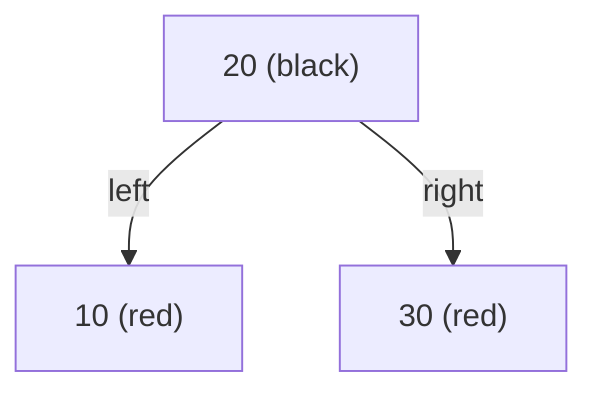

If you've used `std::map` in C++, `TreeMap` in Java, or looked at how the Linux scheduler picks the next task to run, you've used a red-black tree. It's the self-balancing [binary search tree](/citadel/data-structures/trees) that standard libraries reach for, because its balancing is loose enough to keep insertions and deletions cheap while still guaranteeing $O(\log n)$.

Where an [AVL tree](/citadel/data-structures/avl-tree) keeps every node's two subtrees within one level of each other, a red-black tree allows more slack: the longest path from the root to a leaf can be up to twice the shortest. It buys that slack with a colour bit per node and five rules that, together, bound the height. Fewer rotations per update is the payoff.

## The five rules

Every node is coloured **red** or **black**. Null child slots are treated as black **NIL** leaves — a single shared sentinel node, not real storage. A red-black tree is a BST where:

1. Every node is red or black.
2. The root is black.
3. Every NIL leaf is black.
4. A red node's children are both black. (No two reds in a row on any path.)
5. Every path from a given node down to a NIL leaf passes through the same number of black nodes. (This count is the node's **black-height**.)

Rules 4 and 5 do the work. Rule 5 says all root-to-leaf paths have equal black-height $b$. Rule 4 says reds can't be consecutive, so on any path at most half the nodes are red — the longest possible path (alternating black-red) is at most twice the length of the shortest (all black). Height is therefore $O(\log n)$, and so are search, insert, and delete.

The node needs a **parent** pointer as well as two children, because the fix-up procedures walk back up the tree.

```python
RED, BLACK = "RED", "BLACK"

class Node:
    def __init__(self, key, color, nil):
        self.key = key
        self.color = color
        self.left = self.right = self.parent = nil

class RedBlackTree:
    def __init__(self):
        self.nil = Node(None, BLACK, None)        # the one sentinel leaf
        self.nil.left = self.nil.right = self.nil.parent = self.nil
        self.root = self.nil
```

## Rotations

Same primitive as in an AVL tree — a local restructuring that preserves BST order — but here it also fixes up parent pointers and the root reference.

```python
    def _left_rotate(self, x):
        y = x.right
        x.right = y.left
        if y.left is not self.nil:
            y.left.parent = x
        y.parent = x.parent
        if x.parent is self.nil:
            self.root = y
        elif x is x.parent.left:
            x.parent.left = y
        else:
            x.parent.right = y
        y.left = x
        x.parent = y

    def _right_rotate(self, y):
        x = y.left
        y.left = x.right
        if x.right is not self.nil:
            x.right.parent = y
        x.parent = y.parent
        if y.parent is self.nil:
            self.root = x
        elif y is y.parent.left:
            y.parent.left = x
        else:
            y.parent.right = x
        x.right = y
        y.parent = x
```

## Insertion

Insert the new node `z` exactly as in a plain BST, then colour it **red**. Red is the safe choice: it can't break rule 5 (black-heights are unchanged), only possibly rule 4 (if `z`'s parent is also red). A fix-up loop repairs that.

The fix-up looks at `z`'s **uncle** — the parent's sibling — and hits one of three cases (each with a mirror image, depending on whether the parent is a left or right child):

- **Case 1, uncle is red.** Recolour the parent and uncle black and the grandparent red, then move `z` up to the grandparent and repeat. This pushes the possible violation two levels up without any rotation.
- **Case 2, uncle is black, `z` is an "inner" grandchild** (parent and `z` zig-zag). Rotate the parent to turn this into Case 3.
- **Case 3, uncle is black, `z` is an "outer" grandchild** (parent and `z` form a straight line). Recolour parent black and grandparent red, then rotate the grandparent. This terminates the loop.

```python
    def insert(self, key):
        z = Node(key, RED, self.nil)
        y, x = self.nil, self.root
        while x is not self.nil:
            y = x
            x = x.left if z.key < x.key else x.right
        z.parent = y
        if y is self.nil:
            self.root = z
        elif z.key < y.key:
            y.left = z
        else:
            y.right = z
        self._insert_fixup(z)

    def _insert_fixup(self, z):
        while z.parent.color == RED:
            if z.parent is z.parent.parent.left:
                y = z.parent.parent.right              # uncle
                if y.color == RED:                     # Case 1
                    z.parent.color = BLACK
                    y.color = BLACK
                    z.parent.parent.color = RED
                    z = z.parent.parent
                else:
                    if z is z.parent.right:            # Case 2 -> Case 3
                        z = z.parent
                        self._left_rotate(z)
                    z.parent.color = BLACK             # Case 3
                    z.parent.parent.color = RED
                    self._right_rotate(z.parent.parent)
            else:                                      # mirror image
                y = z.parent.parent.left
                if y.color == RED:
                    z.parent.color = BLACK
                    y.color = BLACK
                    z.parent.parent.color = RED
                    z = z.parent.parent
                else:
                    if z is z.parent.left:
                        z = z.parent
                        self._right_rotate(z)
                    z.parent.color = BLACK
                    z.parent.parent.color = RED
                    self._left_rotate(z.parent.parent)
        self.root.color = BLACK
```

Each loop iteration is $O(1)$ and either terminates or climbs two levels, so the fix-up — and the whole insert — is $O(\log n)$, with **at most two rotations**.

### A walkthrough

Insert **10, 20, 30**:

- `10` → the root, coloured red, then forced black by the last line. Tree: `10(B)`.
- `20` → red, becomes `10`'s right child. Its parent `10` is black, so the fix-up loop doesn't run. Tree: `10(B)` — `20(R)`.
- `30` → red, becomes `20`'s right child. Now `20(R)` has a red child: rule 4 is violated. The uncle (`10`'s left, a NIL) is black, and `30` is an outer grandchild (`10` → right → right, a straight line) — Case 3. Recolour `20` black and `10` red, then left-rotate at `10`. Result: `20(B)` at the root with `10(R)` and `30(R)` as children. Every path now has black-height 2.


```mermaid
graph TD
    A["20 (black)"] -->|left| B["10 (red)"]
    A -->|right| C["30 (red)"]
```

## Deletion

Deletion starts like BST deletion, using a `_transplant` helper that swaps one subtree in for another and fixes the parent link.

The subtlety: if the node that physically leaves the tree was **black**, its removal drops the black-count on every path through its position, breaking rule 5. The removed slot is conceptually assigned an "extra black" that has to be discharged, which `_delete_fixup` does by examining the sibling `w` of the affected node `x`:

- **Case 1, sibling `w` is red.** Recolour `w` and the parent, rotate the parent; now `x` has a black sibling — fall into Case 2, 3, or 4.
- **Case 2, `w` is black with two black children.** Colour `w` red (removing a black from the sibling's paths too) and move the extra black up to the parent; loop.
- **Case 3, `w` is black, its child nearer `x` is red, farther is black.** Recolour and rotate `w` to convert to Case 4.
- **Case 4, `w` is black, its farther child is red.** Recolour, set that child black, rotate the parent — the extra black is absorbed and the loop ends.

```python
    def _transplant(self, u, v):
        if u.parent is self.nil:
            self.root = v
        elif u is u.parent.left:
            u.parent.left = v
        else:
            u.parent.right = v
        v.parent = u.parent

    def _minimum(self, x):
        while x.left is not self.nil:
            x = x.left
        return x

    def delete(self, key):
        z = self.root
        while z is not self.nil and z.key != key:
            z = z.left if key < z.key else z.right
        if z is self.nil:
            return
        y = z
        y_color = y.color
        if z.left is self.nil:
            x = z.right
            self._transplant(z, z.right)
        elif z.right is self.nil:
            x = z.left
            self._transplant(z, z.left)
        else:
            y = self._minimum(z.right)               # in-order successor
            y_color = y.color
            x = y.right
            if y.parent is z:
                x.parent = y
            else:
                self._transplant(y, y.right)
                y.right = z.right
                y.right.parent = y
            self._transplant(z, y)
            y.left = z.left
            y.left.parent = y
            y.color = z.color
        if y_color == BLACK:                          # a black node left the tree
            self._delete_fixup(x)

    def _delete_fixup(self, x):
        while x is not self.root and x.color == BLACK:
            if x is x.parent.left:
                w = x.parent.right
                if w.color == RED:                    # Case 1
                    w.color = BLACK
                    x.parent.color = RED
                    self._left_rotate(x.parent)
                    w = x.parent.right
                if w.left.color == BLACK and w.right.color == BLACK:   # Case 2
                    w.color = RED
                    x = x.parent
                else:
                    if w.right.color == BLACK:        # Case 3
                        w.left.color = BLACK
                        w.color = RED
                        self._right_rotate(w)
                        w = x.parent.right
                    w.color = x.parent.color          # Case 4
                    x.parent.color = BLACK
                    w.right.color = BLACK
                    self._left_rotate(x.parent)
                    x = self.root
            else:                                     # mirror image
                w = x.parent.left
                if w.color == RED:
                    w.color = BLACK
                    x.parent.color = RED
                    self._right_rotate(x.parent)
                    w = x.parent.left
                if w.right.color == BLACK and w.left.color == BLACK:
                    w.color = RED
                    x = x.parent
                else:
                    if w.left.color == BLACK:
                        w.right.color = BLACK
                        w.color = RED
                        self._left_rotate(w)
                        w = x.parent.left
                    w.color = x.parent.color
                    x.parent.color = BLACK
                    w.left.color = BLACK
                    self._right_rotate(x.parent)
                    x = self.root
        x.color = BLACK
```

Delete fix-up climbs the tree at most $O(\log n)$ times and does **at most three rotations** total.

## Search

Unchanged from a plain BST — the colours don't affect the ordering.

```python
    def search(self, key):
        x = self.root
        while x is not self.nil and x.key != key:
            x = x.left if key < x.key else x.right
        return x is not self.nil
```

```python
t = RedBlackTree()
for k in [10, 20, 30, 15, 25, 5, 1]:
    t.insert(k)
assert t.search(15) and not t.search(99)
t.delete(20)
# in-order traversal stays sorted; all five rules hold after every operation
```

## Cost, and the one idea to keep

Search, insert, delete: $O(\log n)$ time, $O(n)$ space, one colour bit and one parent pointer per node. Insert does at most 2 rotations, delete at most 3 — fewer than an AVL tree's. That is the whole trade: the five colour rules only force the longest root-to-leaf path to be within *twice* the shortest, a looser bound than AVL's within-one, so the tree can be slightly taller but each update rebalances with fewer rotations. That balance point is why it is the default ordered-map structure in standard libraries:

- **C++ STL** `std::set` and `std::map`.
- **Java** `TreeMap` and `TreeSet`.
- **Linux kernel** — the Completely Fair Scheduler keeps runnable tasks in a red-black tree keyed by virtual runtime, so picking the next task is a leftmost-node lookup.
- **In-memory indexes**, and structures like **Cassandra's** memtables.

For an index that lives on disk, the branching factor of a binary tree is too low — each level is a separate disk seek. That's the [B-tree's](/citadel/data-structures/b-tree) domain. In memory, when you read far more than you write, [AVL's](/citadel/data-structures/avl-tree) tighter balance wins on lookup speed.
