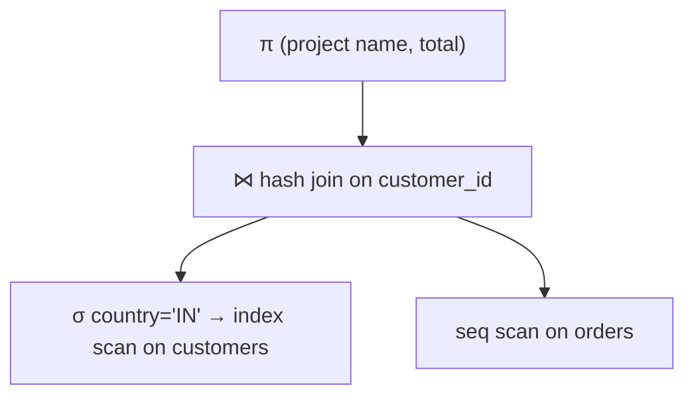

`SELECT c.name, o.total FROM customers c JOIN orders o ON o.customer_id = c.id WHERE c.country = 'IN'` is a *declaration* — it says what you want, not how to get it. Between that string and the rows coming back, the database builds a **plan**: a tree of physical operators, each of which knows how to produce rows, wired together so the root's output is your result.

The same query has many valid plans that differ in cost by orders of magnitude. Choosing among them — which join algorithm, which access path, what order to join four tables — is the query optimizer's job, and it's where database performance is won or lost.

## The iterator model

Most databases use the **Volcano** (iterator) model. Every operator implements the same interface:

- `open()` — set up.
- `next()` — return the next row, or a sentinel when done.
- `close()` — tear down.

An operator calls `next()` on its child (or children) to get input rows. The root operator is called repeatedly by the executor; each call **pulls** one row up through the tree, each operator doing its bit of work. Nothing is materialized unless an operator has to — a `SELECT ... LIMIT 10` stops after ten `next()` calls, and the scan at the bottom never reads the rest of the table.

Two execution styles layered on this:

- **Pipelining** — rows flow straight through without buffering (filter, project, nested-loop join). Low memory, results start immediately.
- **Materialization / pipeline breakers** — an operator that must see *all* its input before producing any output (sort, hash-join build side, aggregation). It buffers, possibly spilling to disk.

Modern analytical engines replace row-at-a-time with **vectorized execution** (process a batch of ~1000 rows per `next()` call, so the per-row interpreter overhead is amortized and the inner loops vectorize) or **compiled execution** (JIT the plan to machine code). Both can be an order of magnitude faster than classic Volcano on scan-heavy work.

## Access paths

How an operator gets rows out of a table:

- **Sequential scan** — read every page. Best when you need most of the table, or there's no useful index.
- **Index scan** — walk a B-tree index to find matching keys, then fetch each row by pointer. Great for high selectivity (few rows match); terrible for low selectivity, because each row is a random I/O and thousands of random I/Os lose to one sequential scan.
- **Index-only scan** — if the index contains every column the query needs, skip the table entirely.
- **Bitmap scan** — for a medium-selectivity predicate: scan the index building a bitmap of matching row locations, sort the bitmap, then read the table pages in physical order (turning random I/O back into sequential). Also lets you AND/OR bitmaps from several indexes.

The optimizer's selectivity estimate (below) decides between these; a bad estimate here is the classic "why is it doing a seq scan" performance bug.

## Join algorithms

Three, and the optimizer picks per join based on input sizes, sort order, and available memory.

### Nested-loop join

For each row of the outer input, scan the inner input for matches.

- **Naive** — inner is re-scanned per outer row: O(N·M). Only acceptable when the inner is tiny or when the outer is tiny.
- **Index nested-loop** — the inner has an index on the join key, so "find matches" is an index lookup, not a scan: O(N·log M). Excellent when the outer is small (after filtering) and the inner is large and indexed. This is the workhorse for OLTP point-ish queries.
- **Block nested-loop** — load a chunk of the outer into memory, scan the inner once per chunk.

### Sort-merge join

Sort both inputs on the join key (or use inputs already sorted, e.g. from index scans), then merge with two cursors advancing in lockstep. O(N log N + M log M) dominated by the sorts; O(N + M) if both are already sorted. Handles inequality joins and produces sorted output (useful if there's an `ORDER BY` on the join key). External merge sort spills to disk when an input doesn't fit in memory.

### Hash join

Build a hash table on the join key from the **smaller** input (the build side), then **probe** it with each row of the larger input. O(N + M), no sorting, and usually the fastest for large unsorted equi-joins. If the build side doesn't fit in memory, **grace hash join** partitions both inputs by a hash of the key into buckets that do fit, then joins bucket by bucket. Equi-joins only (you can't hash an inequality).

Rough rule: **index nested-loop** when one side is small after filtering and the other is indexed; **hash join** for large unsorted equi-joins; **sort-merge** when inputs are already sorted or the output needs to be.

## Aggregation and sorting

- **Sort-based aggregation** — sort on the `GROUP BY` keys, then a single pass emitting one row per group as the key changes.
- **Hash aggregation** — a hash table keyed by the group keys, accumulating each aggregate; one pass, no sort, spills to disk if the group count is huge.
- **External merge sort** for `ORDER BY` on data larger than memory: sort memory-sized runs, write them out, then merge the runs (a k-way merge with a [heap](/citadel/data-structures/heaps)).

## Cost-based optimization

The optimizer enumerates candidate plans and picks the cheapest by an estimated cost.

- **Cardinality estimation** — how many rows will each operator emit? Driven by table statistics: row counts, and per-column **histograms** and distinct-value counts to estimate predicate selectivity. `country = 'IN'` on a 10M-row table with 40 distinct countries roughly non-uniformly distributed → the histogram gives the estimate. **Errors compound**: a 2× error on each of three joins is an 8× error at the top, and wrong cardinalities are the number-one cause of bad plans.
- **Join ordering** — for `n` tables there are exponentially many orders; the classic **System R** approach uses dynamic programming over subsets of tables to find the best left-deep tree in O(3ⁿ)-ish, with heuristics (or genetic search) past ~12 tables.
- **Cost model** — combines estimated CPU (rows processed) and I/O (sequential vs random pages) into one number.

You can inspect the result: `EXPLAIN` shows the plan, `EXPLAIN ANALYZE` runs it and shows estimated vs actual rows per operator — a large mismatch tells you which statistic is stale or which correlation the optimizer missed.

## The one idea to keep

A query plan is a tree of iterator operators that pull rows on demand; the executor pulls the root and work flows up, with sorts, hash builds, and aggregations breaking the pipeline. The optimizer's leverage is in two choices: the join algorithm (index nested-loop for a small filtered side against an indexed side, hash join for big unsorted equi-joins, sort-merge when order already exists or is needed) and the join order, both driven by cardinality estimates from histograms — which is why a stale statistic can turn a 10 ms query into a 10 minute one.
