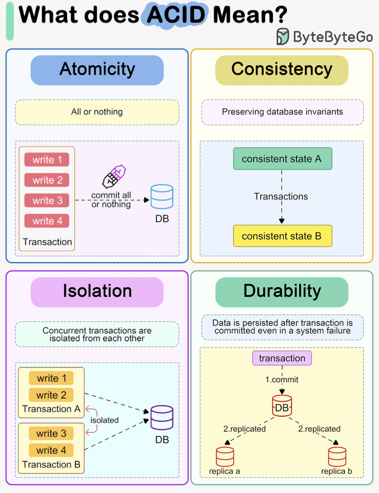

Hey database guardians! So far, we've designed our database schemas and learned how to query them. But what happens when multiple users try to access and modify data *at the same time*? Or worse, what if the system crashes mid-operation? How does the database ensure data remains correct, consistent, and available?

Today, we're tackling the backbone of database reliability: **Transaction Processing**. We'll explore:

* What **transactions** are and why they're fundamental.
* The non-negotiable **ACID properties** that guarantee reliability.
* The challenges of **Concurrency Control** and how locking helps manage simultaneous access.
* How databases **Recover** from failures using clever logging techniques.

Let's dive into how DBMS ensure our precious data stays safe and sound!

## What's a Transaction, Anyway?

Think of a **transaction** as a sequence of database operations (like reading data, updating it, inserting new records – often one or more SQL statements) that represents a single **logical unit of work**.

* **Example:** Transferring funds from account A to account B involves multiple steps: read A's balance, decrease A's balance, write A's new balance, read B's balance, increase B's balance, write B's new balance. All these steps form *one* transaction.
* **Goal:** A transaction should always transform the database from one **consistent state** to another consistent state. The fund transfer, if successful, should maintain the overall balance consistency (even if individual account balances change).

Conceptually, transactions often involve basic operations like `Read(X)` (bringing data item X into the transaction's local buffer) and `Write(X)` (transferring the modified data item X back to the database).

## The ACID Test: Guarantees for Reliable Transactions

To be considered reliable, database transactions must adhere to the **ACID properties**. These are four crucial guarantees provided by the DBMS:

1. **Atomicity ('All or Nothing')**

   * **What:** A transaction is an indivisible unit. Either *all* of its operations are completed successfully and reflected in the database, or *none* of them are. If any part fails, the entire transaction is rolled back, leaving the database in its state *before* the transaction started.
   * **Why:** Prevents partial updates that could leave the database inconsistent (e.g., money debited from A but not credited to B).
   * **Who:** Handled by the DBMS's **Transaction Management** and **Recovery** components.
2. **Consistency ('Correctness Preserved')**

   * **What:** A transaction must ensure that it takes the database from one valid state to another valid state. It must preserve all predefined integrity constraints (like primary keys, foreign keys, domain constraints, etc.).
   * **Why:** Ensures the database always reflects a logical, correct state according to its defined rules.
   * **Who:** Ensuring the *logic* of a single transaction maintains consistency is primarily the **application programmer's** job. The **DBMS** helps by enforcing the defined constraints.
3. **Isolation ('As If Alone')**

   * **What:** Even though multiple transactions may run concurrently (interleaved), the system guarantees that each transaction executes as if it were the *only* transaction running. Each transaction is generally unaware of other transactions executing concurrently.
   * **Why:** Prevents interference between concurrent transactions that could lead to errors like lost updates or dirty reads.
   * **Who:** Handled by the DBMS's **Concurrency Control** component.
4. **Durability ('Surviving Failures')**

   * **What:** Once a transaction has successfully completed (committed), its changes are made permanent and will survive any subsequent system failures (like power outages or crashes).
   * **Why:** Ensures that committed data is never lost.
   * **Who:** Handled by the DBMS's **Recovery Management** component.

ACID properties are the foundation upon which reliable data processing is built.

## The Concurrency Challenge: Juggling Multiple Users

Modern databases serve many users simultaneously. Running transactions one after another (**serial execution**) is simple but incredibly slow and inefficient. **Concurrent execution**, where operations from multiple transactions are interleaved, offers significant advantages:

* **Improved Throughput:** More transactions completed per unit of time.
* **Better Resource Utilization:** CPU and I/O devices are kept busier.
* **Reduced Waiting Time:** Users don't have to wait as long for their transactions to start.

However, uncontrolled interleaving can violate the **Isolation** property and lead to chaos!

**Common Concurrency Problems:**

1. **Lost Update Problem:** Two transactions read the same value, both modify it, and then write it back. The second write overwrites the first, effectively "losing" the first transaction's update.
2. **Temporary Update (Dirty Read) Problem:** Transaction T1 modifies a data item, then T2 reads this *uncommitted* change. If T1 subsequently aborts and rolls back its change, T2 has read data that never officially existed ("dirty" data).
3. **Incorrect Summary Problem:** An aggregate function (like SUM or AVG) runs concurrently with transactions updating the data being aggregated. The function might read some values *before* they are updated and others *after*, leading to an incorrect summary.

**Concurrency Control: The Traffic Cop**

To prevent these issues, the DBMS employs **Concurrency Control** mechanisms. The goal is to ensure that any concurrent execution schedule (the actual order of interleaved operations) is **serializable**.

* **Serializable Schedule:** A concurrent schedule whose outcome (effect on the database) is equivalent to *some* serial execution of the same transactions. Since serial schedules preserve consistency (assuming individual transactions do), serializable schedules also preserve consistency.
* **Conflict Serializability:** A common, practical form of serializability. A schedule is conflict serializable if it can be transformed into a serial schedule by swapping adjacent, *non-conflicting* operations. Operations conflict if they are by different transactions on the same data item, and at least one is a Write. Cycles in a "precedence graph" (showing which transaction must come before another due to conflicts) indicate a schedule is *not* conflict serializable.

## Locking It Down: Lock-Based Concurrency Control

**Locking** is the most widely used technique for concurrency control. Transactions acquire locks on data items before accessing them, preventing other transactions from causing conflicts.

**Lock Modes:**

* **Shared Lock (S-Lock or Read Lock):** Acquired for reading data. Multiple transactions can hold an S-lock on the same item simultaneously. Prevents any transaction from acquiring an X-lock.
* **Exclusive Lock (X-Lock or Write Lock):** Acquired for writing (or reading and writing) data. Only *one* transaction can hold an X-lock on an item at any time. Prevents any other transaction from acquiring *any* lock (S or X) on the same item.

**Basic Locking Rules:**

1. A transaction must request and be granted the appropriate lock (Lock-S or Lock-X) before performing the operation (`Read` or `Write`).
2. If a conflicting lock is already held by another transaction, the requesting transaction must wait.
3. A transaction releases its locks using an `Unlock` operation.

**Locking Protocols: Rules for Locking and Unlocking**

Simply acquiring and releasing locks isn't enough; we need rules about *when* to do so. Releasing locks too early can lead to non-serializable schedules (and the concurrency problems mentioned earlier). Holding locks for too long can lead to poor performance and **deadlock**.

* **Deadlock:** A situation where two or more transactions are waiting indefinitely for each other to release locks. (e.g., T1 locks A and waits for B; T2 locks B and waits for A). Deadlock requires separate detection/prevention mechanisms.
* **Starvation:** A transaction repeatedly loses the race for a lock and waits indefinitely. Lock managers typically use fair queuing to prevent this.

### Two-Phase Locking (2PL): The Standard Protocol

2PL guarantees conflict serializability. It divides a transaction's life into two phases:

1. **Growing Phase:** The transaction acquires all the locks it needs. It can acquire locks (Lock-S, Lock-X) and upgrade locks (S to X), but it **cannot release any locks**.
2. **Shrinking Phase:** The transaction starts releasing locks. It can release locks (Unlock) and downgrade locks (X to S), but it **cannot acquire any new locks**.

The **Lock Point** is the moment the transaction acquires its final lock (end of the growing phase).

**Variations of 2PL:**

* **Basic 2PL:** Guarantees serializability but is vulnerable to deadlocks and **cascading rollbacks** (if T2 reads data written by T1 in its shrinking phase, and T1 later aborts, T2 must also abort, potentially causing a chain reaction).
* **Strict 2PL:** A modification where a transaction holds all its **Exclusive (X) locks** until it commits or aborts. This prevents other transactions from reading "dirty" data written by this transaction, thus avoiding cascading rollbacks caused by writes.
* **Rigorous 2PL:** Even stricter. Holds **all locks (S and X)** until commit or abort. Simplifies implementation and ensures transactions are serializable in the order they commit. This is implemented by most database systems.

### An Alternative: Timestamp-Based Protocols

While locking is common, it's not the only way to manage concurrency. **Timestamp-Based Protocols** offer an alternative approach that avoids locks entirely, thus eliminating the possibility of deadlock (though not necessarily starvation).

* **Concept:** Instead of using locks to make transactions wait, timestamp methods detect potential conflicts and **roll back** transactions involved in the conflict, restarting them later (usually with a new timestamp).
* **Timestamps:** Each transaction `Ti` is assigned a unique **timestamp** `TS(Ti)` when it starts (using the system clock or a logical counter). Older transactions generally get priority. `TS(Ti) < TS(Tj)` means `Ti` started before `Tj`.
* **Data Item Timestamps:** Each data item `Q` keeps track of:
  * `W-Timestamp(Q)`: The timestamp of the last transaction that *successfully wrote* to `Q`.
  * `R-Timestamp(Q)`: The timestamp of the last transaction that *successfully read* `Q`.

**Timestamp Ordering Protocol Rules:**

This protocol ensures conflicting operations are processed in timestamp order:

1. **If Transaction `Ti` issues `Read(Q)`:**
   * If `TS(Ti) < W-Timestamp(Q)`: `Ti` is trying to read a value (`Q`) that has already been overwritten by a *later* transaction. This read is too late! **Roll back `Ti`**.
   * If `TS(Ti) ≥ W-Timestamp(Q)`: The read is okay. Execute the read. Update `R-Timestamp(Q) = max(R-Timestamp(Q), TS(Ti))`.
2. **If Transaction `Ti` issues `Write(Q)`:**
   * If `TS(Ti) < R-Timestamp(Q)`: `Ti` is trying to write a value that should have been read by an *earlier* transaction (`Tj` with `TS(Tj) = R-Timestamp(Q)`) which read an older version. `Ti`'s write would invalidate that previous read. **Roll back `Ti`**.
   * If `TS(Ti) < W-Timestamp(Q)`: `Ti` is trying to write an *obsolete* value (a later transaction `Tj` with `TS(Tj) = W-Timestamp(Q)` already wrote `Q`). This write is too late. **Roll back `Ti`**. (*Note:* Thomas's Write Rule modifies this step).
   * Otherwise: The write is okay. Execute the write. Update `W-Timestamp(Q) = TS(Ti)`.

**Thomas' Write Rule (Modification):**

The basic timestamp protocol can reject writes that might actually be harmless. Thomas' Write Rule optimizes the `Write(Q)` case:

* If `TS(Ti) < R-Timestamp(Q)`: Still roll back `Ti`.
* If `TS(Ti) < W-Timestamp(Q)`: Instead of rolling back `Ti`, simply **ignore** `Ti`'s write operation. The later write by `Tj` (where `TS(Tj) = W-Timestamp(Q)`) has already made `Ti`'s write obsolete, so just pretend it never happened. This allows for schedules that are *view serializable* but not *conflict serializable*.
* Otherwise: Execute the write and update `W-Timestamp(Q) = TS(Ti)`.

**Timestamp Protocol Characteristics:**

* **Guarantees:** Conflict serializability (basic protocol) or view serializability (with Thomas' Write Rule).
* **Deadlock-Free:** Transactions never wait for locks.
* **Potential Issues:**
  * **Starvation:** Long transactions might repeatedly get rolled back by short conflicting transactions.
  * **Recoverability:** Basic timestamp ordering doesn't guarantee recoverable schedules (Tj might read from Ti, Ti aborts, but Tj commits). Requires modifications like buffering writes until commit or ensuring reads only access committed data.

## Bouncing Back: Recovery and Logging

Failures are inevitable. The **Recovery Manager** is responsible for ensuring Atomicity and Durability despite failures.

**Types of Failures:**

* **Transaction Failure:** Logical errors, system errors (like deadlock). Transaction needs to be aborted.
* **System Crash:** Power loss, software/hardware crash. Volatile memory (main memory, buffers) is lost. Non-volatile storage (disk) usually survives. Active transactions are interrupted.
* **Disk Failure:** Data loss on disk. Requires restoring from backups or replicas.

### An Early Alternative: Shadow Copy Scheme

Before sophisticated log-based recovery became standard, simpler schemes existed, like the **Shadow Copy** scheme (primarily for single-transaction environments):

* **Idea:** The database is considered a single file (or set of pages). A `db-pointer` points to the current, consistent copy of the database on disk.
* **During Transaction:** When a transaction starts, updates are made to a *copy* (the shadow copy) of the database pages, not the original ones pointed to by `db-pointer`.
* **Commit:** If the transaction completes successfully, the `db-pointer` is updated to point to the modified shadow copy pages, making them the new current version. The old version becomes the shadow.
* **Abort/Crash:** If the transaction aborts or a crash occurs before the commit, the modified shadow copy is simply discarded, and the `db-pointer` still points to the original, consistent version. No undo logging is needed.
* **Drawbacks:** Extremely inefficient for large databases (copying large amounts of data), doesn't easily support concurrent transactions. Not practical for modern systems but illustrates a basic recovery concept.

### Log-Based Recovery: The Audit Trail

The most common recovery technique relies on maintaining a **Log** file.

* **Log:** A sequence of **log records** stored on **stable storage** (designed to survive system crashes, e.g., disk or NVRAM). It records *all* significant events and update activities.
* **Log Records:** Contain information like:
  * Transaction ID (`Ti`)
  * Record Type (`<Ti start>`, `<Ti commit>`, `<Ti abort>`)
  * Update Info (`<Ti, DataItem, OldValue, NewValue>`) - Old/New values depend on the specific recovery strategy.
* **Write-Ahead Logging (WAL):** The golden rule! Before a modified data page in the buffer is written back to the database disk, the corresponding log record(s) describing that modification *must* be written to the stable log file first. This ensures we can always undo or redo changes if a crash occurs.

**Recovery Methods Using Logs:**

1. **Deferred Database Modification:**

   * **Idea:** Log all changes, but *delay* writing the actual data modifications to disk until the transaction is ready to commit (`<Ti commit>` log record is written).
   * **Logging:** Needs `<Ti start>`, `<Ti commit>`, and update records like `<Ti, X, V_new>` (no old value needed in log).
   * **Recovery:** If a crash occurs, scan the log.
     * If a transaction has both `<Ti start>` and `<Ti commit>` records in the log, **REDO** its operations using the `V_new` values from the log to ensure its changes are on disk.
     * If a transaction only has `<Ti start>` (no commit), ignore it – its changes never made it to the database disk. No **UNDO** needed.
   * **Idempotency:** REDO operations must be idempotent (applying them multiple times has the same effect as applying them once).
2. **Immediate Database Modification:**

   * **Idea:** Allow modified data blocks to be written to the database disk *before* the transaction commits. These are "uncommitted modifications."
   * **Logging:** Needs `<Ti start>`, `<Ti commit>`, `<Ti abort>`, and update records including *both* old and new values: `<Ti, X, V_old, V_new>`. The `V_old` is crucial for undoing.
   * **Recovery:** If a crash occurs, scan the log.
     * Transactions with `<Ti start>` but no `<Ti commit>`/`<Ti abort>` must be **UNDONE** (rolled back) using the `V_old` values from the log to restore the database to its state before the transaction began.
     * Transactions with both `<Ti start>` and `<Ti commit>` must be **REDONE** using the `V_new` values from the log to ensure their changes definitely survived the crash.
   * **Idempotency:** Both UNDO and REDO must be idempotent.

### Checkpoints: Reducing Recovery Time

Scanning the entire log from the beginning after a crash can be very time-consuming. **Checkpoints** optimize this:

* **Process:** Periodically, the DBMS performs a checkpoint:
  1. Suspends processing updates temporarily.
  2. Forces all log records currently held in memory buffers out to the stable log file.
  3. Forces all *modified data blocks* currently held in memory buffers out to the database disk.
  4. Writes a special `<checkpoint>` record to the stable log file.
  5. Resumes processing.
* **Recovery with Checkpoints:** After a crash, the Recovery Manager finds the *most recent* `<checkpoint>` record in the log. It only needs to analyze the log *from that checkpoint forward* (plus potentially a bit earlier to identify transactions active *during* the checkpoint).
  * It identifies transactions that were active at the checkpoint or started after it.
  * It performs UNDO for active/later transactions that *did not* commit before the crash.
  * It performs REDO for active/later transactions that *did* commit before the crash.
  * This significantly reduces the amount of log that needs processing, speeding up recovery.

## Conclusion: The Unseen Effort for Reliability

Transaction processing, ACID properties, concurrency control, and recovery are complex but vital mechanisms working tirelessly behind the scenes in any robust DBMS. They ensure that multiple users can interact with the database concurrently without corrupting data, and that the system can recover gracefully from failures, preserving data integrity and availability. Understanding these concepts gives us a deeper appreciation for the engineering involved in making databases the reliable workhorses they are.

Thank you for joining this interactive journey into the world of transaction processing. Keep exploring, keep questioning, and happy databasing!
