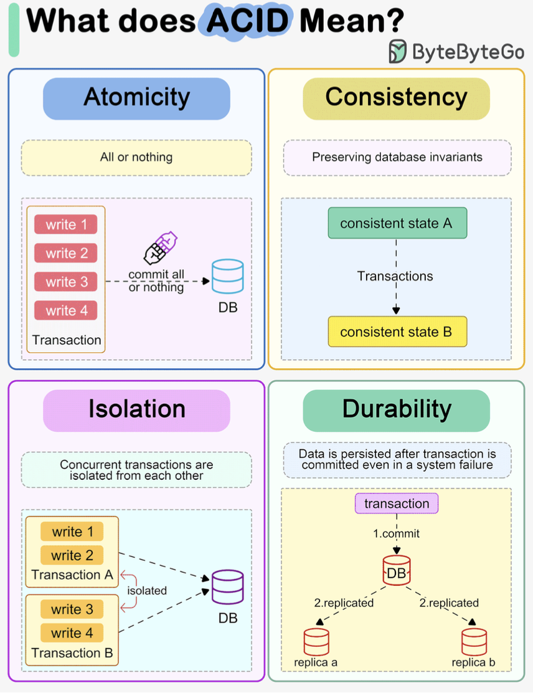

Transferring money is six operations: read A's balance, subtract, write it, read B's balance, add, write it. If the system crashes after step 3, money has vanished. If another transfer runs interleaved with this one, both can read the same starting balance and one update is lost. A **transaction** is the abstraction that makes those six operations behave as one — indivisible, isolated from other transactions, and durable once done.

This post is how a DBMS delivers that: the ACID properties as the contract, **serializability** as the formal correctness test, **two-phase locking** and **timestamp ordering** as the two ways to enforce it, and **write-ahead logging** with checkpoints to survive crashes.

## The ACID properties

- **Atomicity** — all of a transaction's operations take effect, or none do. A failure anywhere rolls the whole transaction back to its pre-start state. Enforced by the transaction manager and recovery subsystem.
- **Consistency** — a transaction moves the database from one valid state to another, preserving every integrity constraint. The *logic* is the application programmer's responsibility; the DBMS enforces the declared constraints.
- **Isolation** — concurrent transactions produce the same result as if they'd run one at a time. Enforced by the concurrency-control subsystem.
- **Durability** — once a transaction commits, its effects survive any later crash. Enforced by the recovery subsystem writing to non-volatile storage before acknowledging the commit.

## Concurrency and its hazards

Running transactions one after another (**serial** execution) is trivially correct but wastes the CPU and disk while any one transaction stalls. **Concurrent** execution interleaves their operations, raising throughput and cutting wait times — but uncontrolled interleaving breaks isolation:

- **Lost update** — two transactions read a value, both modify it, both write; the second write erases the first.
- **Dirty read** — T2 reads a value T1 wrote but hasn't committed; T1 then aborts, and T2 has read data that never officially existed.
- **Incorrect summary** — an aggregate (`SUM`, `AVG`) runs while another transaction updates the rows it's scanning, reading some pre-update and some post-update.

## Serializability

A schedule (the actual interleaved order of operations) is **serializable** if its effect on the database equals that of *some* serial schedule of the same transactions. Since serial schedules preserve consistency, so do serializable ones.

The practical test is **conflict serializability**: a schedule is conflict serializable if you can turn it into a serial schedule by repeatedly swapping *adjacent, non-conflicting* operations. Two operations **conflict** when they belong to different transactions, touch the same data item, and at least one is a write. Build a **precedence graph** with an edge `Ti → Tj` whenever an operation of `Ti` must precede a conflicting operation of `Tj`; the schedule is conflict serializable iff that graph has no cycle.

## Lock-based concurrency control

**Locking** is the dominant method. A transaction acquires a lock on a data item before touching it:

- **Shared (S) lock** — for reading. Many transactions can hold an S-lock on the same item; it blocks any X-lock.
- **Exclusive (X) lock** — for writing. Only one transaction can hold it, and it blocks every other lock.

A transaction must be granted the right lock before its operation, waits if a conflicting lock is held, and releases with `Unlock`. Two failure modes come with locking: **deadlock** (a cycle of transactions each waiting on a lock another holds — needs [detection or prevention](/citadel/operating-system/process-synchronisation)) and **starvation** (a transaction that keeps losing the race for a lock — handled by fair queuing).

### Two-phase locking

**2PL** splits a transaction's lock activity into a **growing phase** (acquire and upgrade locks, release none) and a **shrinking phase** (release and downgrade, acquire none). The transition — the moment of the last acquisition — is the **lock point**. 2PL guarantees conflict serializability. Its variants tighten what's held and for how long:

- **Basic 2PL** — serializable, but vulnerable to deadlock and to **cascading rollback** (a transaction that read an aborting transaction's uncommitted write must also abort, possibly triggering a chain).
- **Strict 2PL** — hold all **X locks** until commit or abort. No one reads uncommitted writes, so no cascading rollback.
- **Rigorous 2PL** — hold **all** locks (S and X) until commit or abort. Transactions then serialize in commit order. This is what most databases implement.

## Timestamp ordering

An alternative that uses no locks, so it's **deadlock-free** (though not starvation-free): detect a conflict and *roll back* the offending transaction, restarting it later with a fresh timestamp.

Each transaction `Ti` gets a unique **timestamp** `TS(Ti)` at start (clock or counter); older transactions have priority. Each data item `Q` records `W-timestamp(Q)` (last committed write) and `R-timestamp(Q)` (last read).

- **`Read(Q)` by `Ti`**: if `TS(Ti) < W-timestamp(Q)`, `Ti` is trying to read a value a later transaction already overwrote — **roll back `Ti`**. Otherwise read, and set `R-timestamp(Q) = max(R-timestamp(Q), TS(Ti))`.
- **`Write(Q)` by `Ti`**: if `TS(Ti) < R-timestamp(Q)`, an earlier transaction should have read this write — **roll back**. If `TS(Ti) < W-timestamp(Q)`, the write is obsolete — **roll back**. Otherwise write, and set `W-timestamp(Q) = TS(Ti)`.

**Thomas's write rule** optimises the obsolete-write case: instead of rolling back when `TS(Ti) < W-timestamp(Q)`, simply **ignore** `Ti`'s write — a later write already superseded it. This admits schedules that are *view serializable* but not conflict serializable. Basic timestamp ordering doesn't guarantee recoverable schedules, so real implementations buffer writes until commit or restrict reads to committed data. **Multiversion concurrency control (MVCC)**, covered in [transaction-processing systems](/citadel/dbms/transaction-processing), takes the versioning idea further so readers never block writers.

## Recovery

Failures come in three kinds: **transaction failure** (a logical error, bad input, or deadlock abort — undo it), **system crash** (volatile memory lost, disk intact — interrupted transactions must be resolved), and **disk failure** (data lost — restore from backup or replica).

### Shadow copy

An early scheme for single-transaction use: a `db-pointer` names the current consistent copy of the database; updates go to a **shadow copy** of the affected pages. On commit, atomically repoint `db-pointer` to the shadow; on abort or crash, discard the shadow — no undo log needed. It doesn't scale (copying large databases) and doesn't support concurrency.

### Write-ahead logging

The standard approach keeps a **log** of records — `<Ti start>`, `<Ti commit>`, `<Ti abort>`, and update records `<Ti, X, old, new>` — on stable storage. The **write-ahead logging (WAL)** rule: the log record describing a change must reach stable storage *before* the modified data page is written to the database on disk. That guarantees a crash can always be undone or redone.

Two logging strategies:

- **Deferred modification** — hold all changes in memory, write them to disk only at commit. Log records need just `<Ti, X, new>`. Recovery: a transaction with both `start` and `commit` gets **REDONE** from the log's `new` values; one with only `start` is ignored — its changes never reached disk, so no UNDO.
- **Immediate modification** — modified pages may reach disk before commit. Log records carry `old` *and* `new`. Recovery: a transaction with `start` but no `commit`/`abort` is **UNDONE** using `old` values; one with `start` and `commit` is **REDONE** using `new` values.

Both REDO and UNDO must be **idempotent** — applying them twice equals applying them once — because a crash can interrupt recovery itself.

### Checkpoints

Scanning the whole log after a crash is slow. Periodically the DBMS takes a **checkpoint**: flush the log buffer, flush all modified data pages to disk, write a `<checkpoint>` record. Recovery then starts from the most recent checkpoint — UNDO the transactions active at or after it that didn't commit, REDO those that did — instead of from the beginning of the log.

## The one idea to keep

Isolation is the hard part, and serializability is the target: any interleaving whose effect matches some serial order is acceptable. Locking reaches it by making conflicting transactions wait (and pays with deadlock); timestamp ordering reaches it by making them restart (and pays with wasted work). Durability is the easy part conceptually — write the log before the data — and checkpoints just bound how much of that log you have to replay.
