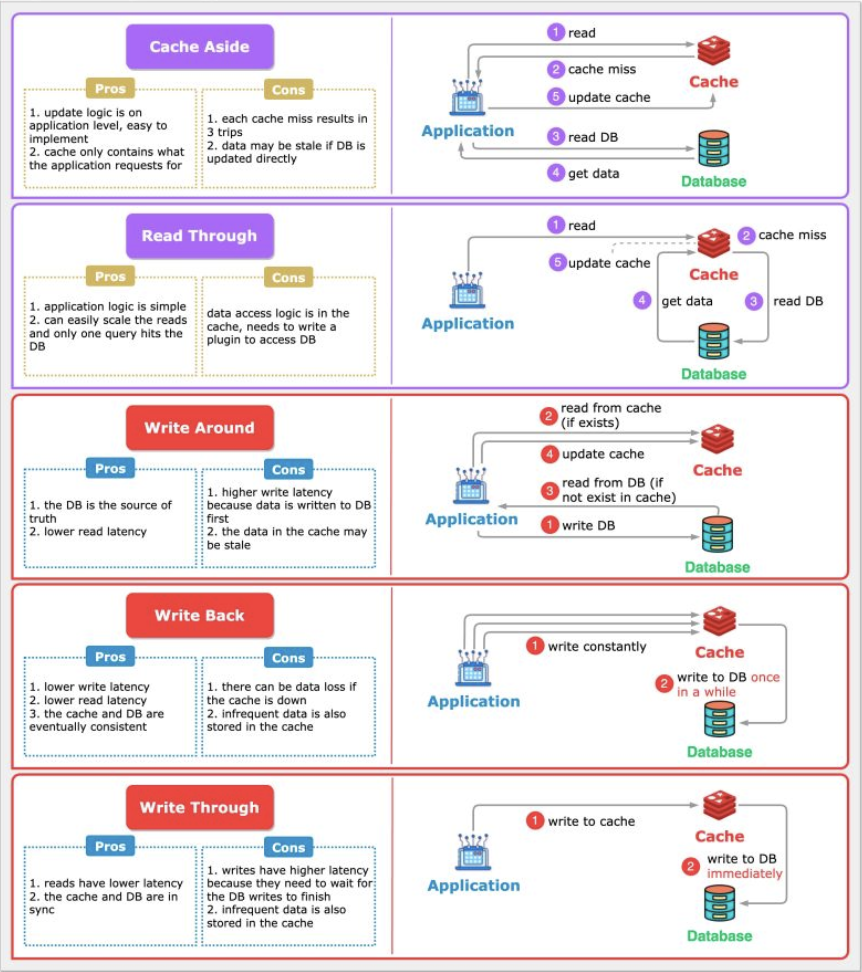
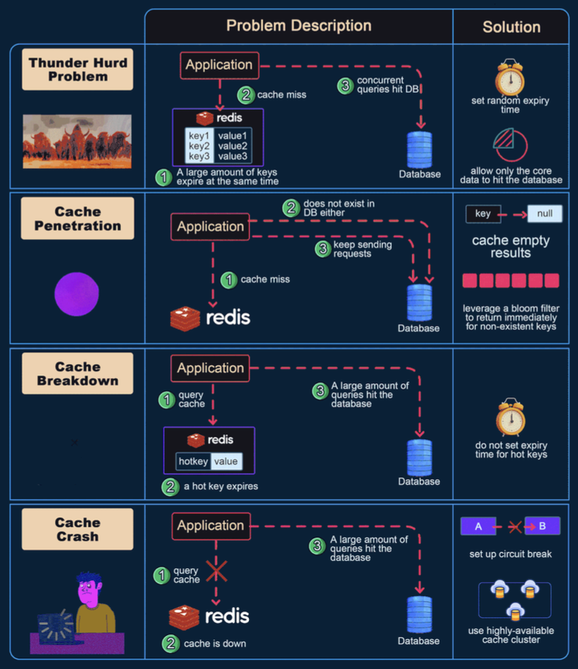

Hey performance seekers and system architects! We all know that caching is like a magic wand for application speed. By keeping frequently accessed data closer to where it's needed, we can slash response times and reduce the load on our precious databases. But just like with any magic, the real power lies in *how* and *where* you wield it. It's not just about *if* you cache, but *what your caching strategy is*, *where you place your caches*, and also being aware of how things can go wrong!

When we introduce a cache into our architecture, decisions about its placement and how data stays synchronized with the database become critical challenges. Today, let's explore the different layers where caching can occur, then dive into the top caching strategies for reading and writing data, and finally, critically examine common pitfalls that can turn your caching dream into a performance nightmare.

## Why Caching Strategies & Placement Matter

Before diving into the specifics, why this focus?
* **Placement Impacts Latency:** Caching data closer to the user or application drastically reduces access times.
* **Strategies Impact Consistency & Performance:** Different read/write strategies offer varied trade-offs between data freshness, write speed, and system complexity.
* **Diverse Needs:** Applications have diverse needs – some are read-heavy, others write-heavy; some need strong consistency, others can tolerate staleness for speed.

Choosing the right approach can make a world of difference.

*(Image depicts read/write strategies discussed later)*

## Where Does Caching Happen? Layers of Speed
Caching isn't a single entity; it's a multi-layered approach. Data can be cached at various points between the user and the source of truth (usually the database). Each layer offers different benefits. Let's explore these common caching locations:

### 1. Client Cache (Browser/Mobile App)
* **Location:** Right on the user's device – within their web browser or mobile application.
* **What it Caches:** Previously fetched resources like images, CSS files, JavaScript scripts, and even API responses.
* **Purpose:** To store data locally on the client's machine to avoid making repeated requests to the server for the same information.
* **Benefits:**
    * **Fastest Perceived Speed:** Reduces network requests entirely for cached items, leading to very fast load times for repeat views.
    * **Reduced Server Load & Bandwidth:** Fewer requests hit your servers.
* **Considerations:** Cache size is limited, cache control headers (like `Cache-Control`, `Expires`, `ETag`) are crucial for managing freshness.

### 2. Content Delivery Network (CDN) Cache
* **Location:** A geographically distributed network of proxy servers (PoPs - Points of Presence) located close to end-users around the world.
* **What it Caches:** Primarily static content like images, videos, CSS, JavaScript, fonts. Some CDNs also support caching for dynamically generated content or API responses.
* **Purpose:** To serve content from a server geographically closer to the user, reducing latency.
* **Benefits:**
    * **Drastically Reduced Latency:** Especially for global user bases.
    * **Offloads Origin Server:** Significantly reduces the load on your main application servers.
    * **Increased Availability:** Content can still be served from the CDN even if the origin server is temporarily down.
    * **Handles Traffic Spikes:** Absorbs large amounts of traffic for cached content.

### 3. Load Balancer Cache
* **Location:** Some advanced load balancers (especially Application Load Balancers - Layer 7) have built-in caching capabilities.
* **What it Caches:** Frequently accessed responses from the backend application servers.
* **Purpose:** To serve common responses directly without forwarding the request to an application server.
* **Benefits:**
    * **Reduced Load on Application Servers:** Fewer requests reach the application tier.
    * **Improved Response Times:** For cached content.
* **Considerations:** Cache capacity might be limited compared to dedicated caching tiers.

### 4. Service Layer Caching (Application Level)
This is where caching is implemented within or alongside your application services.
* **a. Distributed Cache (e.g., Redis, Memcached):**
    * **Location:** An external, shared caching service that multiple instances of your application servers can access.
    * **What it Caches:** Frequently queried data from databases, results of expensive computations, user session states, API response caches.
    * **Purpose:** To provide a fast, shared data store that reduces database load and improves service performance and scalability.
    * **Benefits:** Highly scalable, shared across application instances, can store more complex data structures. Netflix's EVCache (built on Memcached) is a prime example, used as a lookaside cache, for transient data, and even as a primary store for pre-computed data.
* **b. Service Cache (In-Memory Cache within a Service Instance):**
    * **Location:** Within the memory of each individual application server instance.
    * **What it Caches:** Very hot (extremely frequently accessed) data specific to that instance or small lookup tables.
    * **Purpose:** Provides the absolute fastest access for that instance as there's no network hop.
    * **Benefits:** Extremely low latency for cache hits.
    * **Cons:** Cache is not shared across instances (data duplication). Consistency can be a major challenge if data changes frequently, as each instance's cache needs to be updated or invalidated. Limited by the memory of the instance.

### 5. Database Layer Caching
Databases themselves employ various caching mechanisms.
* **a. Database Cache (e.g., Buffer Pool, Query Cache):**
    * **Location:** Within the database management system itself, in memory.
    * **What it Caches:** Frequently accessed data blocks from disk, query execution plans, and sometimes even the results of common queries.
    * **Purpose:** To minimize slow disk I/O operations and speed up query processing.
    * **Benefits:** Transparent to the application, managed by the DBMS.
* **b. Database Connection Pool:**
    * **Location:** Typically managed by the application or an application server.
    * **What it Caches:** Not data, but active database *connections*.
    * **Purpose:** Establishing database connections is an expensive operation. A connection pool maintains a set of open connections that the application can reuse, significantly reducing the overhead of creating and tearing down connections for each database query.
    * **Benefits:** Faster database interactions for the application, reduced load on the database server from connection management.

Understanding these layers helps in deciding *where* to implement caching for maximum impact. Often, a multi-layered caching strategy is the most effective.

## Read Strategies: Getting Data to Users Faster

These strategies focus on how data is loaded into the cache when an application needs to read it.

### 1. Cache Aside (Lazy Loading)
*(Content as in previous version: How it works, Analogy, Real-world Example, Pros, Cons)*

### 2. Read Through
*(Content as in previous version: How it works, Analogy, Pros, Cons)*

## Write Strategies: Keeping Cache and Database in Sync

These strategies dictate how data writes are handled to maintain consistency (or a desired level of consistency) between the cache and the database.

### 3. Write Through
*(Content as in previous version: How it works, Analogy, Pros, Cons)*

### 4. Write Back (or Write Behind)
*(Content as in previous version: How it works, Analogy, Pros, Cons)*

### 5. Write Around
*(Content as in previous version: How it works, Analogy, Pros, Cons)*

## Combining Strategies for Optimal Results

It's important to note that these caching strategies are not always mutually exclusive and can often be used in combination. For instance, a common pattern is to use **Write Around** for write operations coupled with **Cache Aside** for read operations. This keeps the cache from being burdened by writes while still benefiting from caching frequently read data.

## The Dark Side of Caching: Common Pitfalls and How to Avoid Them

While caching is a powerful performance booster, it's not without its perils. If not implemented carefully, cache systems can go wrong and sometimes even degrade performance or lead to inconsistencies. Let's look at some common issues and their solutions:

### 1. Cache Penetration
* **The Problem:** This occurs when an application queries for a key that **does not exist in the cache AND does not exist in the database either**. If many such requests are made (e.g., by a malicious user or a bug), every request will miss the cache and hit the database, potentially overwhelming it.
* **Impact:** Defeats the purpose of the cache, high load on the database for fruitless lookups.
* **Solutions:**
    * **Cache Empty/Null Results:** When a DB lookup yields no data for a key, store a special "null" or "empty" marker in the cache for that key with a short Time-To-Live (TTL). Subsequent requests for this key will hit the null cache entry and avoid the DB.
    * **Bloom Filters:** Use a Bloom filter to keep track of all valid keys that *do* exist in the database. Before querying the cache/DB, check the Bloom filter. If it says the key "definitely does not exist," return immediately without hitting cache or DB.

### 2. Cache Avalanche (Cache Stampede)
* **The Problem:** This happens when a large number of cache keys expire at roughly the same time, or if the cache server itself fails. As a result, a massive flood of concurrent requests for these (now expired or unavailable) keys all miss the cache and simultaneously hit the underlying database, potentially overwhelming it.
* **Impact:** Sudden, extreme load on the database, leading to slow responses or even database failure.
* **Solutions:**
    * **Randomize Expiration Times:** Add a small random jitter to the TTL of cache keys to prevent many of them from expiring at the exact same moment.
    * **Use a Robust Cache with Pre-fetching/Early Expiration:** Some advanced caching systems can detect popular items nearing expiration and proactively refresh them before they actually expire.
    * **Mutex Lock / Distributed Lock for Cache Rebuild:** For a given key that expires, allow only one request to go to the database to regenerate the value, while other requests wait or get a slightly older (stale) version if acceptable.

### 3. Cache Breakdown (Hotspot Key Invalidation/Failure)
* **The Problem:** This occurs when a very popular (hotspot) key in the cache is updated or invalidated (deleted). Immediately after invalidation, all the numerous concurrent requests for this popular key will miss the cache and directly hit the database simultaneously, causing a spike in load.
* **Impact:** Similar to cache avalanche, but focused on a single or few highly popular items.
* **Solutions:**
    * **Global Lock for Updates:** Use a distributed lock (e.g., via Redis or Zookeeper) so that only one process can update/repopulate the cache for a specific hotspot key at a time. Other requests might serve a slightly stale version or wait.
    * **Set a Short TTL for Hotspot Keys:** Even after an update, if the key is extremely popular, ensure it gets back into the cache quickly and perhaps has a shorter TTL to reflect its volatile nature or to force more frequent updates from the source if consistency is key.

### 4. Data Inconsistency
* **The Problem:** The data in the cache and the data in the database become out of sync. This can happen if the database is updated directly, bypassing the cache update mechanism, or in a Write-Back cache if the cache fails before successfully writing the pending changes to the database.
* **Impact:** Users see stale or incorrect data, leading to confusion and potential errors in application logic.
* **Solutions:**
    * **Choose Appropriate Write Strategy:** For data that requires strong consistency, **Write-Through** caching is often preferred as it updates both cache and DB simultaneously.
    * **Effective Cache Invalidation:** Implement robust mechanisms to invalidate or update cache entries when the corresponding data in the database changes. This can be done through time-based expiration (TTL), event-driven invalidation (e.g., DB triggers or application events signaling changes), or explicit API calls to clear cache entries.
    * **Read-Through/Cache-Aside with TTLs:** Rely on TTLs to ensure data is refreshed from the DB periodically.

### 5. Cache Eviction Policy Issues: Making Space Wisely
* **The Problem:** Cache memory is finite. When it's full and a new item needs to be added, an existing item must be **evicted** (removed). Choosing the *wrong* eviction policy for your application's data access patterns can lead to a poor cache hit rate (more misses than hits), drastically reducing the cache's effectiveness.
* **Impact:** Low cache hit ratio, meaning more requests go to the database, negating many of the benefits of caching.
* **Common Eviction Policies & Their Nuances:**

    * **a. LRU (Least Recently Used):**
        * **How it works:** Discards the item that hasn't been accessed for the longest time. Assumes recently used items are likely to be used again soon.
        * **Pros:** Simple to understand, often performs well for general-purpose caching with temporal locality (recent items are re-accessed).
        * **Cons:** Can perform poorly if access patterns involve scanning large sets of data that won't be reused (e.g., a one-time full table scan could evict genuinely "hot" items). Susceptible to "polluting" by occasional scans of cold data.
        * **Use Cases:** General-purpose caching, web page caching.

    * **b. MRU (Most Recently Used):**
        * **How it works:** Discards the item that was accessed most recently. This seems counterintuitive but is useful when older items are more likely to be re-accessed.
        * **Pros:** Good for specific access patterns where the most recent item is least likely to be needed again soon (e.g., cyclical access or when you expect to access older data after processing new data).
        * **Cons:** Performs poorly for workloads with strong temporal locality where recent items *are* likely to be reused.
        * **Use Cases:** Scenarios where you repeatedly scan a dataset and are unlikely to need the just-accessed items again immediately.

    * **c. SLRU (Segmented Least Recently Used):**
        * **How it works:** Divides the cache into two segments: a "probationary" segment and a "protected" segment. New items enter the probationary segment (using LRU). If an item in the probationary segment is hit, it moves to the protected segment. Eviction happens from the tail of the probationary segment first, then from the tail of the protected segment.
        * **Pros:** More resistant to cache pollution from scans of rarely accessed items compared to simple LRU. Protects frequently accessed items better.
        * **Cons:** More complex to implement than simple LRU. Requires tuning the segment sizes.
        * **Use Cases:** Databases, caches where some items are known to be more valuable or frequently accessed over longer periods.

    * **d. LFU (Least Frequently Used):**
        * **How it works:** Discards the item that has been accessed the fewest times. Tracks access counts for each item.
        * **Pros:** Keeps popular items in cache even if they haven't been accessed very recently.
        * **Cons:** Can keep "stale" items that were popular in the past but are no longer needed. Requires tracking access frequencies, which can add overhead. A newly added item starts with a low frequency and might be evicted quickly even if it becomes popular.
        * **Use Cases:** Caching data where access frequency is a good predictor of future access, but needs mechanisms to handle new popular items (e.g., LFU with dynamic aging).

    * **e. FIFO (First-In, First-Out):**
        * **How it works:** The oldest item in the cache (the one that was added first) is the first one to be evicted, regardless of how often or how recently it was accessed. Implemented like a queue.
        * **Pros:** Very simple to implement, low overhead.
        * **Cons:** Often performs poorly as it doesn't consider access patterns or recency. Frequently accessed items might be evicted if they were added early.
        * **Use Cases:** Simple caches where performance is not extremely critical or where access patterns are truly sequential.

    * **f. RR (Random Replacement):**
        * **How it works:** When the cache is full, a random item is selected for eviction.
        * **Pros:** Extremely simple to implement, no need to track access times or frequencies.
        * **Cons:** Performance is unpredictable and generally not as good as more intelligent policies. Doesn't leverage any information about access patterns.
        * **Use Cases:** Can be a baseline or used in some specific theoretical analyses, but rarely optimal for production caches.

    * **g. TTL-based Eviction (Time To Live):**
        * **How it works:** This isn't strictly an eviction policy for when the cache is *full*, but rather a mechanism for proactive expiration. Each cached item is assigned a TTL. When the TTL expires, the item is considered stale and is removed from the cache or marked for removal.
        * **Pros:** Ensures data doesn't remain stale beyond a certain period. Simple way to manage cache freshness.
        * **Cons:** Doesn't directly help when the cache is full due to new items being added; it needs to be combined with another policy like LRU or LFU for space management. Setting appropriate TTLs can be challenging.

    * **h. Two-Tiered Caching (often a strategy rather than a single eviction policy):**
        * **How it works:** Involves using multiple levels of caching, typically a small, very fast L1 cache (e.g., in-memory within the application) and a larger, slightly slower L2 cache (e.g., a distributed cache like Redis). Items might be promoted from L2 to L1 on access. Eviction policies can be different for each tier.
        * **Pros:** Can provide a good balance of speed and capacity. Frequently accessed items stay in the fastest L1 cache.
        * **Cons:** Increased complexity in managing two cache layers and their consistency.
        * **Use Cases:** High-performance systems needing both ultra-low latency for hottest data and larger capacity for warm data.

* **Solutions for Eviction Policy Issues:**
    * **Understand Data Access Patterns:** Deeply analyze how your data is typically accessed. Is it recent data (LRU might be good)? Is it consistently popular data (LFU might be better)? Are there scans that pollute the cache?
    * **Select Appropriate Policy:** Choose an eviction policy (or a combination) that aligns with your observed access patterns.
    * **Monitor Cache Performance:** Continuously monitor key cache metrics like hit rate, miss rate, and eviction counts. This data will help you tune your eviction policies or cache size if needed. Modern cache systems like Redis offer various eviction policies to choose from.

## Key Takeaways

* Effective caching involves not only *if* you cache but also *where* you place your caches (Client, CDN, Load Balancer, Service Layer, Database Layer) and *what strategies* you employ.
* **Read strategies** like Cache Aside and Read Through focus on how data is loaded into the cache.
* **Write strategies** like Write Through, Write Back, and Write Around dictate how updates are propagated to both the cache and the database.
* Caching is not a silver bullet; be aware of common pitfalls like Cache Penetration, Avalanche, Breakdown, Data Inconsistency, and sub-optimal Eviction Policies, and implement solutions to mitigate them.
* A well-thought-out, multi-layered caching approach, with appropriate strategies and safeguards, is a cornerstone of high-performance, scalable applications.

The best approach always depends on the specific access patterns and consistency requirements of your application. Careful design and ongoing monitoring are key!