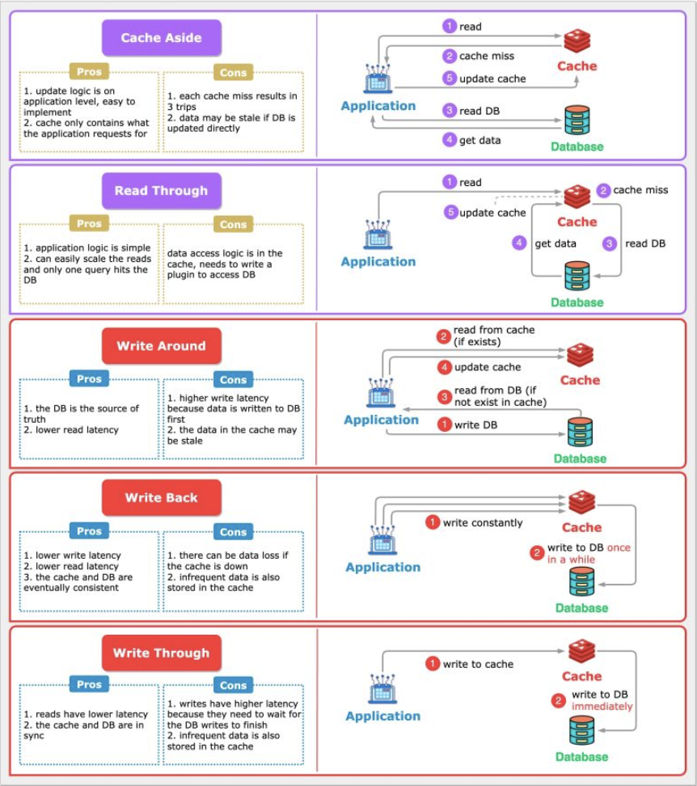

Adding a cache is easy. The two decisions that decide whether it helps are less obvious: *where* it sits between the user and the database, and *how* a write reaches both copies of the data without leaving them disagreeing.

This covers the layers a request passes through and which one is worth caching at, then the read and write strategies — how data gets into the cache, and how an update propagates — and which combinations suit a read-heavy versus a write-heavy service. The failure modes that show up once a cache is under load are a [separate post](/citadel/interview/cache-pitfalls).

## The layers a request passes through

A request from browser to database crosses several points where a copy of the answer can live. Each removes work from everything downstream of it.

| Layer | Caches | Win | Watch out for |
| --- | --- | --- | --- |
| Client (browser, app) | fetched assets, some API responses | no network call at all on a repeat | small budget; freshness rides on `Cache-Control`, `ETag` |
| CDN edge | static files, sometimes dynamic responses | served from a nearby city, origin offloaded | invalidation lag; not for per-user data |
| Load balancer (L7) | common backend responses | app tier never sees the request | capacity smaller than a dedicated tier |
| In-process cache | very hot keys, small lookup tables | no network hop, lowest possible latency | not shared between instances; each copy drifts |
| Distributed cache (Redis, Memcached) | query results, computed values, sessions | one fast store shared by every instance | a network hop; another system to run and size |
| Database buffer pool | recently read disk pages, plans | skips disk I/O, transparent to the app | managed by the DB, limited knobs |

A connection pool sits alongside these. It caches open database *connections* rather than data, because opening one costs a TCP handshake plus authentication that you do not want to pay per query.

Most real systems cache at more than one layer: a CDN for assets, a distributed cache for query results, the buffer pool underneath. The distributed cache is where application-level strategy choices apply, so the rest of this post is about that layer. Netflix's EVCache, built on Memcached, is a large example — used as a lookaside cache, for transient data, and as a primary store for pre-computed values.

## Read strategies

**Cache-aside (lazy loading).** The application owns the logic. It asks the cache; on a hit it returns the value, on a miss it reads the database, writes the result back into the cache, and returns it. The cache only ever holds keys something has actually asked for.

- *Cost:* a miss is three hops (cache, database, cache-fill), and the first request for any key is always slow.
- *Staleness:* if a writer updates the database without touching the cache, readers see the old value until the entry expires or is invalidated.
- This is the default pattern for Redis and Memcached in front of a database.

**Read-through.** The application always asks the cache and nothing else. The cache itself is configured with a loader that fetches from the database on a miss and populates itself. Application code has one call path instead of two.

- *Cost:* the same cold-miss penalty as cache-aside; you also need a cache that supports a read-through provider.
- *Benefit:* read logic lives in one place, so every caller scales the same way and only one query per key reaches the database on a miss.

## Write strategies

**Write-through.** The application writes to the cache; the cache writes synchronously to the database and only then acknowledges. Cache and database are never out of step, and a read right after a write is a hit.

- *Cost:* every write pays the database's write latency. Data that is written often but read rarely still takes cache space.

**Write-back (write-behind).** The application writes to the cache, which acknowledges immediately and flushes to the database later, usually batched. Write latency is as low as it gets, and bursts are absorbed.

- *Cost:* if the cache node dies before a flush, those writes are lost. The database is only eventually consistent with the cache, and the flush machinery adds complexity.

**Write-around.** The application writes straight to the database and does not touch the cache. The entry is populated later, on a read miss, by whatever read strategy is in place. Write-heavy data that is never read back never displaces useful entries.

- *Cost:* a read immediately after a write is a miss, so freshly written keys have higher read latency for a while.

## Which pairing to use

Read and write strategies compose. Two combinations cover most cases:

- **Write-around + cache-aside** — writes go to the database and stay out of the cache; reads populate it on demand. Good when writes are frequent and only a fraction of written data is read back soon. Accept that a read just after a write can be stale.
- **Write-through + read-through** — both paths go through the cache, which keeps it consistent with the database. Good for read-heavy data that must not be served stale, at the price of slower writes.

Write-back is the specialist choice: reach for it when write throughput is the binding constraint and a small window of data loss on a crash is tolerable — metrics ingestion, activity counters, buffered logs.

## The choice is a bet about the workload

Picking a strategy is really stating two things about the data: the read-to-write ratio, and how much staleness a reader can tolerate. Read-heavy and staleness-sensitive points at write-through; write-heavy with reads that can miss points at write-around plus cache-aside. Get those two facts wrong and the cache still "works" — it just quietly returns a low hit rate or the occasional stale row. What happens when that same cache is hit hard, loses a node, or fills up is [its own set of failure modes](/citadel/interview/cache-pitfalls).
