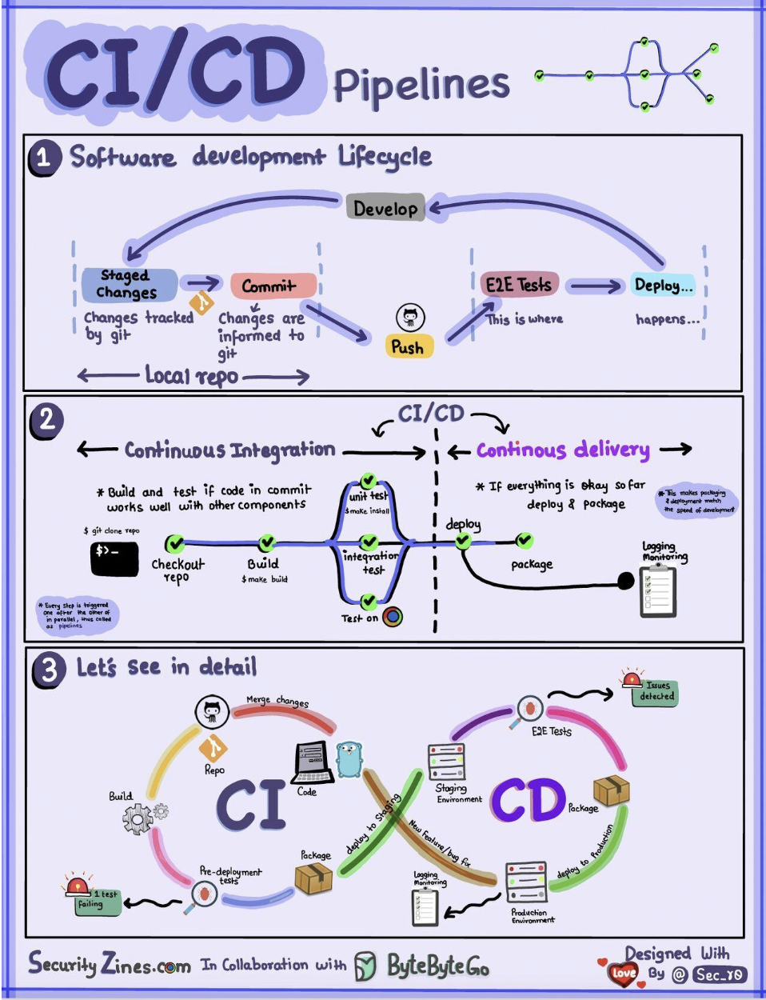

Hey everyone, and welcome back! In the lightning-fast world of software development, the pressure to deliver new features and updates quickly, frequently, and reliably is immense. Gone are the days of long, arduous release cycles. Today, the mantra is agility, and the engine powering this agility is **CI/CD** – Continuous Integration and Continuous Delivery/Deployment.

You've likely heard these terms, but what do they *really* mean? How does a piece of code written by a developer make its way smoothly and safely into the hands of users? Today, we're taking a deep dive into the CI/CD pipeline, exploring its stages, benefits, the tools that make it happen, and how companies like Netflix and Uber leverage these practices at scale.

## What is CI/CD? Decoding the Acronyms

CI/CD is a cornerstone of modern DevOps practices, representing a culture, a set of operating principles, and a collection of practices that enable application development teams to deliver code changes more frequently and reliably. Let's break down the two main components:

### Continuous Integration (CI)

* **Definition:** Continuous Integration is a development practice where developers frequently merge their code changes into a central, shared repository – often multiple times a day.
* **Process:** Each of these integrations (merges) triggers an automated build and a series of automated tests (like unit tests and integration tests). The primary goal is to detect integration issues, bugs, and conflicts as early as possible in the development cycle.
* **Goals:** CI encourages more frequent commits of smaller changes, which leads to easier integration and allows for rapid feedback to developers on the health of their code.

### Continuous Delivery (CD)

* **Definition:** Continuous Delivery is an extension of CI. It automates the release of the successfully integrated and tested software to various environments, such as staging or pre-production, and ultimately, makes it ready for production deployment.
* **Process:** With Continuous Delivery, you ensure that your software can be reliably released at any time through automated workflows. This often includes automating infrastructure changes and the deployment process itself.
* **Manual Gate (Optional):** Continuous Delivery *can* still involve a manual approval step before the final push to production, especially for business-critical decisions. The key is that the software is *always* in a deployable state after the CI phase.

### Continuous Deployment (often also abbreviated as CD)

* **Definition:** This is a step further than Continuous Delivery. With Continuous Deployment, *every* change that passes all stages of your automated testing pipeline is automatically deployed to your production environment.
* **Process:** There's no manual intervention in the deployment to production; if the pipeline is green, the code goes live. This requires a very high degree of confidence in your automated testing and release processes.

The overall Software Development Life Cycle (SDLC) – encompassing development, testing, deployment, and maintenance – is significantly streamlined and accelerated by CI/CD automation.

## The Anatomy of a CI/CD Pipeline: A Step-by-Step Journey

A CI/CD pipeline is a series of automated steps that take code from version control all the way to deployment. While specifics vary, a typical pipeline often looks like this:

1.  **Plan & Code (Source Stage):**
    * Developers work on new features or bug fixes, often based on user stories or tasks (e.g., managed in JIRA ).
    * They commit their code changes to a version control system, typically Git, usually working on feature branches.

2.  **Version Control & Trigger (Commit Stage):**
    * Code is pushed to a central Git repository (like GitHub, GitLab).
    * Developers create Pull Requests (or Merge Requests) for their feature branches to be reviewed and merged into a main development branch (e.g., `develop` or `main`).
    * This merge event (or a direct push to certain branches) typically triggers the CI server (e.g., Jenkins, GitHub Actions) to start the pipeline.

3.  **Build Stage:**
    * The CI server checks out the latest code from the repository.
    * It then compiles the source code and builds the application, packaging it into a deployable artifact (e.g., a JAR file, a WAR file, or a Docker image).

4.  **Test Stage (Automated Testing is Key!):**
    This is arguably the most critical part of CI for ensuring quality. Various automated tests are run:
    * **Unit Tests:** Verify individual functions, methods, or classes in isolation.
    * **Integration Tests:** Check if different parts or modules of the application work correctly together.
    * **Code Analysis / Static Analysis:** Tools like SonarQube are used to analyze the source code for potential bugs, code smells, security vulnerabilities, and adherence to coding standards without actually executing it.
    * **Security Scanning:** Automated tools scan the code and its dependencies for known security vulnerabilities.
    * Test results are reported back to developers, providing fast feedback on any issues introduced by their changes. A build failing at this stage prevents bad code from moving further.

5.  **Artifact Repository (Store Stage):**
    * If the build is successful and all initial automated tests pass, the build artifacts (e.g., Docker images, compiled binaries) are versioned and stored in a dedicated artifact repository (e.g., Docker Hub, JFrog Artifactory, Nexus). This ensures that deployable units are centrally managed and versioned.

6.  **Deploy to Staging/QA Environments (Deploy Stage - Pre-Production):**
    * The packaged application (artifact) is automatically deployed to one or more pre-production environments, such as Development (Dev), Quality Assurance (QA), or User Acceptance Testing (UAT) environments. Companies might have multiple QA environments for independent feature testing.

7.  **Further Testing in Staging Environments:**
    More comprehensive and often longer-running tests are performed in these controlled environments:
    * **End-to-End (E2E) Tests:** Validate the entire application flow from a user's perspective.
    * **Performance and Load Testing:** Assess how the application behaves under expected and peak load conditions.
    * **User Acceptance Testing (UAT):** Product owners or actual users might test the application to ensure it meets business requirements.

8.  **Release to Production (Deploy Stage - Production):**
    * After the application has passed all tests in the pre-production environments and has received any necessary approvals (in Continuous Delivery), the CD system deploys the approved changes to the live production environment.
    * Various **deployment strategies** are employed at this stage to minimize risk and downtime, such as Blue-Green deployment, Canary releases, or A/B testing (often managed with feature toggles).

9.  **Monitor & Operate:**
    * Once deployed, the application is continuously monitored in production for performance, errors, and availability by Site Reliability Engineering (SRE) or Operations teams.
    * Monitoring tools (e.g., Prometheus, Grafana, ELK Stack, New Relic, Datadog) provide insights and trigger alerts if issues arise. This operational feedback then loops back into the planning stage for future improvements.

## Benefits of CI/CD

Implementing a robust CI/CD pipeline offers numerous advantages:

* **Faster Release Cycles & Increased Velocity:** Automating the build, test, and deploy process significantly speeds up the delivery of new features and fixes.
* **Improved Code Quality:** Early and frequent automated testing catches bugs sooner, making them easier and cheaper to fix.
* **Reduced Risk:** Smaller, incremental changes are less risky than large, infrequent releases. Automated testing and controlled deployment strategies further minimize the chance of production issues.
* **Enhanced Developer Productivity:** Developers can focus more on writing code and less on manual build and deployment tasks. Fast feedback loops also help them iterate quickly.
* **Better Reliability and Stability:** Consistent and repeatable automated processes reduce the likelihood of human error during releases.
* **Avoiding Anti-Patterns:** It helps avoid the anti-pattern of manual, error-prone deployments that impede speed and frequency of releases.

## Key Tools in the CI/CD Ecosystem

A rich ecosystem of tools supports CI/CD pipelines:

* **Version Control Systems:** Git (with platforms like GitHub, GitLab, Bitbucket).
* **CI Servers/Services:** Jenkins, GitLab CI, GitHub Actions, CircleCI, Travis CI, Azure DevOps, AWS CodePipeline.
* **Build Tools:** Maven, Gradle (Java); npm, Yarn (JavaScript); Bazel (multi-language).
* **Containerization & Orchestration:** Docker (for packaging), Kubernetes (for deploying and managing containerized applications).
* **Artifact Repositories:** JFrog Artifactory, Docker Hub, Nexus, AWS ECR, Google Artifact Registry.
* **Configuration Management & IaC:** Ansible, Chef, Puppet, Terraform, AWS CloudFormation.
* **Testing Frameworks & Tools:** JUnit, TestNG (Java); Selenium, Cypress, Playwright (Web UI); JMeter, Gatling (Performance).
* **Monitoring & Logging:** Prometheus, Grafana, ELK Stack (Elasticsearch, Logstash, Kibana), Datadog, Splunk.
* **Deployment & Release Orchestration Tools:** Spinnaker (used by Netflix and Uber ), Argo CD (for GitOps).

## Evolving CI/CD: GitOps and DevSecOps

The CI/CD landscape continues to evolve:

### GitOps

* This is a modern operational framework and a way to do CI/CD for cloud-native applications.
* **Git is the single source of truth** for both application code and infrastructure configurations, which are defined declaratively (e.g., Kubernetes manifests).
* **Automated delivery is triggered by changes in Git repositories**.
* Tools like **Argo CD** or Flux continuously monitor the Git manifest repositories and automatically synchronize the live state in Kubernetes clusters to match the desired state defined in Git. Key features include version control, automated delivery, and an immutable infrastructure approach.

### DevSecOps

* DevSecOps is an evolution of DevOps that emphasizes integrating security practices throughout the entire software development lifecycle, especially within the CI/CD pipeline ("shifting security left").
* It involves automating security checks like:
    * SAST (Static Application Security Testing)
    * DAST (Dynamic Application Security Testing)
    * IAST (Interactive Application Security Testing)
    * Container image security scanning
    * Secret management
    * Threat modeling earlier in the design phase
    * Vulnerability management and dependency checking within the automated pipeline.

## CI/CD at Scale: Examples from Netflix and Uber

Large tech companies have heavily invested in sophisticated CI/CD practices:

* **Netflix:** Uses JIRA and Confluence for planning. Primarily a Java shop, they use Gradle for builds and package applications into AMIs. Testing emphasizes a "production culture" with tools for chaos engineering. They employ **Spinnaker** for canary rollout deployments, with monitoring via Atlas and Kayenta for anomaly detection, and PagerDuty for incidents.
* **Uber:** Also uses JIRA for planning and Spring Boot for backend services. They have a Monorepo and use Bazel for builds. They've developed internal tools for code issues like NullAway. Testing includes SLATE for test environments and Shadower for load testing. uBuild (powered by Buildkite) packages services into containers. Like Netflix, Uber uses **Spinnaker** for deployments, and has custom monitoring (uMetric, uMonitor) and operational tooling (Peloton for capacity planning, Crane for multi-cloud cost optimization).

## Key Takeaways

* CI/CD is a crucial set of practices and automations that enable teams to deliver software changes faster, more reliably, and with higher quality.
* A typical pipeline involves stages for source control, building, automated testing (unit, integration, security, etc.), artifact storage, and deployment to various environments.
* A rich ecosystem of tools supports each stage of the CI/CD pipeline.
* Modern approaches like GitOps and DevSecOps are further enhancing the efficiency, reliability, and security of software delivery.

Ultimately, CI/CD is more than just tools; it's a cultural shift towards automation, collaboration, and continuous improvement, essential for thriving in today's fast-paced software landscape.
