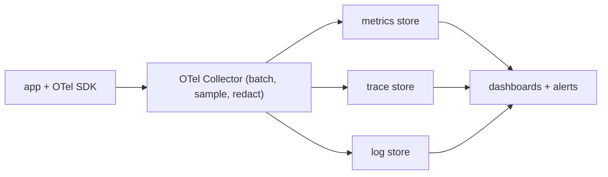

Your service's error rate just tripled. **Monitoring** told you that — you had a dashboard and an alert for it. Now you need to know *which* endpoint, *which* dependency, *which* code path, and *why* — questions you didn't pre-build a dashboard for. Being able to answer them without shipping new code is **observability**: the system emits enough high-quality signal that you can slice it however the incident demands.

The three signal types — metrics, traces, logs — each answer a different question, and the discipline is knowing which one to reach for and keeping the cost of all three under control.

## Metrics: is something wrong

A **metric** is a number measured over time, with labels. Four types:

- **Counter** — only goes up (requests served, errors, bytes sent). You look at its *rate* (`rate(http_requests_total[5m])`), not its value.
- **Gauge** — goes up and down (queue depth, memory in use, active connections).
- **Histogram** — bucketed distribution (request latency into `<10ms`, `<50ms`, `<100ms`, …). Lets you compute percentiles.
- **Summary** — client-computed quantiles; less flexible than histograms because you can't aggregate percentiles across instances (you can't average two p99s).

Metrics are cheap (a few bytes per data point, aggregated before storage), so they're your always-on health signal and what alerts fire on. Two framings for *what* to measure:

- **RED** (for services) — **R**ate, **E**rrors, **D**uration, per endpoint.
- **USE** (for resources) — **U**tilization, **S**aturation, **E**rrors, per resource (CPU, disk, pool).

**Percentiles, not averages.** An average latency of 40 ms can hide a p99 of 3 seconds affecting the 1% of users with the biggest carts. Always chart p50/p90/p99, and remember you can't average percentiles across instances — aggregate the histogram buckets, then compute the quantile.

### Cardinality

A metric's cost is roughly (number of label combinations) × (retention). Put a user ID or a request ID in a label and you get millions of unique time series — this is how you blow up a Prometheus. Labels should be low-cardinality (endpoint, status class, region), never unbounded identifiers. High-cardinality context belongs in traces and logs.

## Traces: where is it slow or failing

A **distributed trace** follows one request across every service it touches. It's a tree of **spans**, each a timed operation (`HTTP GET /checkout`, `SELECT orders`, `POST payments`) with a start, duration, parent, and attributes.

The mechanism is **context propagation**: the entry point creates a `trace_id` and a root `span_id`, and every outbound call carries them in a header (the W3C `traceparent` standard). Each service creates child spans under the received context. Reassembled, you get a flame graph showing exactly where the 3 seconds went — 2.8 of them in one slow database call three services deep.

**Sampling** controls cost, since storing every span is expensive:

- **Head-based** — decide at the entry point (keep 1%), before you know if the request was interesting. Simple, but you miss most errors.
- **Tail-based** — buffer all spans for a trace, decide after it completes (keep it if it errored or was slow). Catches the interesting ones; needs a component that holds spans until the trace finishes.

## Logs: why

A **log** is a timestamped record of a discrete event. Logs carry the detail metrics and traces don't — the actual exception, the input that broke, the branch taken.

- **Structured** (JSON, key-value) beats free text — you can query `level=ERROR AND user_tier=premium AND endpoint=/checkout` instead of grepping.
- **Correlate** — put the `trace_id` on every log line so you can jump from a slow trace to its logs and back.
- **Levels** — `ERROR`/`WARN` always on; `INFO` for significant events; `DEBUG` sampled or toggled, because it's the volume that costs.
- **Sample** high-volume repetitive logs (log 1 in N of a hot path) and never log secrets or full PII.

Logs are the most expensive signal per byte (little aggregation, high volume), so they're where cost discipline matters most: retention tiers (7 days hot, 90 days cold in object storage), sampling, and dropping noisy loggers.

## OpenTelemetry: one pipeline

Historically each signal had its own SDK and vendor. **OpenTelemetry** (OTel) is the vendor-neutral standard: one set of SDKs and auto-instrumentation libraries emit all three signal types in a common format (OTLP), sent to the **OTel Collector** — a pipeline process that receives, processes (batching, redaction, tail sampling, adding resource attributes), and exports to whatever backend you use (Prometheus/Mimir for metrics, Tempo/Jaeger for traces, Loki/Elasticsearch for logs, or a SaaS). Instrument once; switch backends by changing the Collector config.

## SLIs, SLOs, and error budgets

Turn signals into a reliability contract:

- **SLI** (indicator) — a measured ratio of good events to total: successful requests / all requests, or requests under 200 ms / all requests.
- **SLO** (objective) — the target: "99.9% of requests succeed, measured over 28 days."
- **Error budget** — `1 − SLO` = 0.1% of requests may fail. If you've spent the budget, stop shipping risky changes and fix reliability; if you have budget to spare, you're being too cautious.

**Alert on burn rate**, not raw errors: page when the budget is being consumed fast enough to exhaust it soon (e.g. 2% of a 30-day budget in an hour), and alert on *symptoms the user feels* (elevated latency, error rate) rather than *causes* (high CPU) — CPU being high isn't a problem if users are fine.

## The one idea to keep

Metrics tell you *something is wrong* and are cheap enough to run always — keep labels low-cardinality and chart percentiles, not averages. Traces tell you *where*, by propagating a trace ID across services so you get a flame graph of one request; sample by the tail so you keep the errors. Logs tell you *why*, structured and stamped with the trace ID; they're the priciest signal, so sample and tier them. OpenTelemetry is the one pipeline that carries all three, and SLOs with burn-rate alerts turn the signals into a decision about whether to ship or to stabilize.
