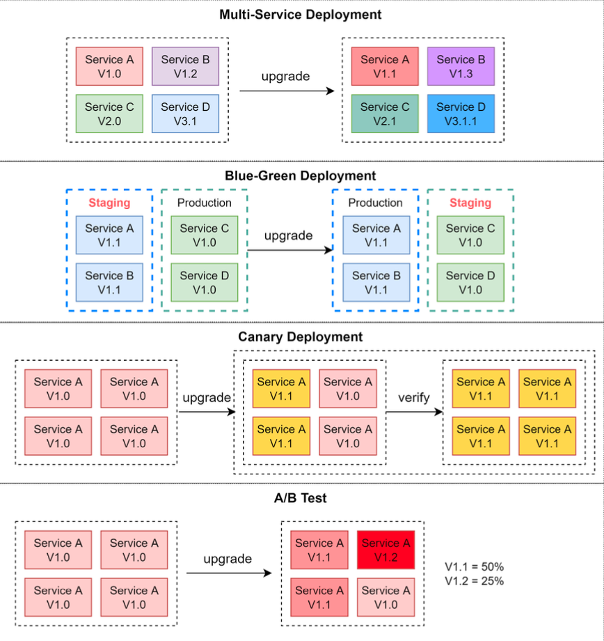

Hey everyone, and welcome back to the blog! If you're involved in software development, you know that the moment of truth – deploying your new code to production – can be both exciting and nerve-wracking. A lot can go wrong, from unexpected bugs to system overloads. Deploying or upgrading services is inherently risky. Fortunately, we have a toolkit of **deployment strategies** designed to mitigate these risks, minimize downtime, and ensure a smoother transition for users.

Today, let's explore some of the most common and effective deployment strategies that teams use to ship code with confidence. Think of these as different game plans for introducing changes to your live environment.

## Why Bother with Deployment Strategies?

Before diving into the "how," let's briefly touch on the "why." The core goals of using a well-thought-out deployment strategy are:

* **Minimizing Downtime:** Keeping the application available to users during updates.
* **Reducing Risk:** Limiting the impact of potential bugs or performance issues introduced by new code.
* **Ensuring a Smooth Transition:** Providing a seamless experience for users.
* **Allowing for Testing:** Validating the new version under real-world conditions, sometimes with a subset of users.
* **Facilitating Rollbacks:** Having a clear and quick way to revert to the previous stable version if things go south.

Now, let's look at the strategies!

## Exploring Common Deployment Strategies

When it comes to deploying new versions of services, there are several strategies you can employ. Each has its own strengths and weaknesses, and the best choice often depends on your specific application architecture, team capabilities, and business needs.

Here are some of the common approaches, each with its own set of pros and cons:

### 1. Multi-Service Deployment (The "All-at-Once" Approach)

* **Description:** In this model, new changes are deployed to multiple services simultaneously. Imagine updating all components of your application in one go.
* **Pros:**
    * This approach is generally easy to implement.
* **Cons:**
    * Since all the services are upgraded at the same time, it is hard to manage and test dependencies.
    * It's also hard to rollback safely if an issue arises across multiple updated services.

### 2. Blue-Green Deployment (The "Identical Twin" Strategy)

* **Description:** With blue-green deployment, you maintain two identical production environments, often called "blue" (the current live version) and "green" (the new version). The staging (green) environment is one version ahead of production (blue). Once the green environment is fully tested and ready, user traffic is switched from the blue environment to the green environment. The green environment then becomes the new production, and the blue environment can serve as a standby or for the next deployment.
* **Pros:**
    * Rollback is simple and fast: if issues occur in the new (green) environment, you can quickly switch traffic back to the old (blue) environment.
* **Cons:**
    * Having two identical production-quality environments could be expensive, as it essentially doubles your resource requirements for a period.
    * Managing database schema changes or other stateful components can be challenging.

### 3. Canary Deployment (The "Test the Waters" Strategy)

* **Description:** A canary deployment involves upgrading services gradually, rolling out the new version to a small subset of users or servers (the "canaries") first. If this small group encounters no issues, the new version is progressively rolled out to a larger portion of the infrastructure and user base.
* **Pros:**
    * It is generally cheaper than a full blue-green deployment as you don't need a complete duplicate environment.
    * It's relatively easy to perform a rollback by redirecting traffic away from the canary instances if problems are detected.
    * Allows for real-world testing with a limited blast radius.
* **Cons:**
    * Since there is no separate staging environment for the canaries, testing effectively happens on production infrastructure and with real user traffic.
    * This process is more complicated because it requires careful monitoring of the canary deployment while gradually migrating more and more users away from the old version. This often involves sophisticated monitoring and feature flagging.

### 4. A/B Testing (The "Experimentation" Strategy)

While A/B testing is often associated with feature experimentation, the underlying mechanism of routing users to different versions can also be considered a deployment strategy for new service versions.

* **Description:** In the A/B test model, different versions of services (or features within a service) run in production simultaneously. Each version runs an "experiment" for a subset of users. Data is collected on how each version performs against certain metrics.
* **Pros:**
    * It's a cheap and effective method to test new features or changes in a production environment and gather real data on their impact or user preference.
* **Cons:**
    * You need to control the deployment process carefully to ensure features are not accidentally pushed to unintended users or that poorly performing experiments are quickly halted.
    * Requires infrastructure for routing users to different versions, collecting metrics, and analyzing experiment results.
    * Can introduce complexity in managing multiple active versions.

## Choosing the Right Strategy for Your Mission

There's no single "best" deployment strategy; the right choice depends on various factors:

* **Risk Tolerance:** How much risk can your application and business tolerate?
* **Cost:** What are the infrastructure and operational cost implications?
* **Application Architecture:** Is your application monolithic or microservices-based? Is it stateful or stateless?
* **Team Maturity & Tooling:** Does your team have the expertise and tools to manage more complex strategies like canary deployments?
* **Need for Experimentation:** Do you need to gather user feedback or performance data on new versions before a full rollout?

Often, teams might use a combination of these strategies or variations tailored to their specific needs.

## Key Takeaways

* Deploying new software versions introduces risks, but well-defined deployment strategies can significantly mitigate them.
* Common strategies include Multi-Service, Blue-Green, Canary, and A/B Testing, each with distinct advantages and disadvantages.
* The choice of strategy should align with your application's needs, your team's capabilities, and your business's risk appetite.

Ultimately, a smart deployment strategy is a cornerstone of reliable and agile software delivery, helping you innovate faster while keeping your users happy.
