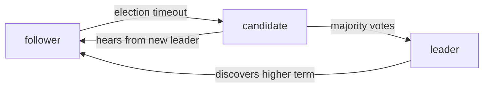

Five servers need to agree on who the leader is, or on the order of writes to a replicated log, and they have to keep agreeing while any two of them are down and the network is dropping and reordering messages. That's the **consensus** problem, and it's the hard core under etcd, ZooKeeper, Consul, CockroachDB, and every system that claims "strongly consistent and highly available."

It's genuinely hard: the **FLP result** proves that in a fully asynchronous system (no bound on message delay) with even one possible crash, no algorithm can guarantee consensus in bounded time. Real systems get around this by assuming *partial synchrony* — messages usually arrive quickly — and using timeouts and majority **quorums**. This post is the two algorithms that do it.

## What consensus has to guarantee

- **Agreement** — no two correct nodes decide different values.
- **Validity** — the decided value was proposed by some node.
- **Termination** — every correct node eventually decides (this is the one FLP says you can't *guarantee*, only achieve in practice).

The trick that makes agreement possible despite failures is the **majority quorum**: any decision requires acknowledgement from more than half the nodes. Any two majorities of a 5-node cluster share at least one node, so a new decision can always "see" the previous one through that overlap. This is why clusters are odd-sized (3, 5, 7) — an even size gives no better fault tolerance and risks split votes.

## Paxos, briefly

Leslie Lamport's Paxos decides a single value. Roles: **proposers** propose, **acceptors** vote, **learners** observe. It runs in two phases:

1. **Prepare.** A proposer picks a ballot number `n` (globally unique, increasing) and sends `prepare(n)` to acceptors. An acceptor that hasn't seen a higher ballot replies `promise` — "I won't accept anything below `n`" — along with any value it has already accepted.
2. **Accept.** If the proposer gets promises from a majority, it sends `accept(n, v)`, where `v` is the value from the highest-ballot promise it received, or its own value if none. Acceptors that still haven't seen a higher ballot accept it. A value accepted by a majority is **chosen**.

The safety argument: because phase 1 forces a proposer to adopt any already-accepted value it learns about, once a value is chosen, every future proposal converges on it. Agreement holds even with concurrent proposers and crashes.

Plain Paxos decides *one* value; **Multi-Paxos** runs an instance per log slot and keeps a stable leader to skip phase 1 in the common case. Paxos is correct and notoriously hard to implement — the paper leaves the practical details as an exercise, and real systems that "use Paxos" have all diverged from it.

## Raft: the one you implement

Raft targets the same problem (a replicated log) but is designed to be **understandable**, decomposed into three sub-problems.

### Leader election

Time is divided into **terms**, each starting with an election. Every node is `follower`, `candidate`, or `leader`. A follower that hears nothing from a leader for a randomized **election timeout** becomes a candidate, increments the term, votes for itself, and asks the others for votes. A node grants its vote (once per term) if the candidate's log is at least as up-to-date as its own. A candidate with a majority becomes leader and starts sending heartbeats. Randomized timeouts make split votes rare and self-correcting.

### Log replication

Clients send commands to the leader. The leader appends the command to its log and sends `AppendEntries` to followers. Once a majority have stored an entry, the leader marks it **committed** and applies it to its state machine; followers apply it when they learn it's committed. The leader tracks a `nextIndex` per follower and, on a mismatch, walks it back until the logs agree, then overwrites the follower's tail — so all logs converge on the leader's.

### Safety

Two rules make it correct:

- **Election restriction** — a node won't vote for a candidate whose log is behind its own, so a leader always has every committed entry.
- **Commit rule** — a leader only counts an entry as committed once an entry *from its own term* is replicated to a majority (this avoids a subtle case where an old entry could be overwritten after appearing committed).

### Membership changes

Adding or removing servers safely uses **joint consensus** — a transitional configuration requiring majorities in *both* the old and new sets — so there's never a moment when two disjoint majorities could each elect a leader.

## Where it's used, and the cost

- **etcd, Consul** — Raft directly, exposing a consistent key-value store used for service discovery and coordination.
- **ZooKeeper** — ZAB, a protocol very close to Raft in spirit.
- **CockroachDB, TiKV** — one Raft group per data range, thousands of groups per cluster.
- **Kafka (KRaft mode)** — Raft for cluster metadata, replacing ZooKeeper.

The cost of consensus: every committed write waits for a majority round trip (so latency is bounded by your slowest-of-the-fastest-majority node — put replicas close), and throughput is capped by the leader. You pay this for **linearizability** — the cluster behaves as if there were one copy. Systems that can tolerate weaker guarantees ([Dynamo-style stores](/citadel/system-design/key-value-store)) skip consensus on the write path entirely and stay available during partitions.

**Byzantine** consensus (PBFT, and blockchain protocols) tolerates nodes that lie, not just crash — it needs `3f + 1` nodes to survive `f` liars and far more messages. Raft and Paxos assume nodes are honest but may crash, which is the right model inside one organization's datacenter.

## The one idea to keep

Consensus is impossible to *guarantee* in a fully asynchronous system with failures (FLP), so real algorithms assume messages usually arrive fast and lean on majority quorums — any two majorities overlap, so a new decision always sees the last one. Paxos proves this is safe; Raft packages it as an understandable replicated log: elect one leader with randomized timeouts, replicate each entry to a majority before committing, and use the election restriction so a leader never lacks a committed entry. Reach for it when you need one consistent source of truth; skip it when availability during a partition matters more.
