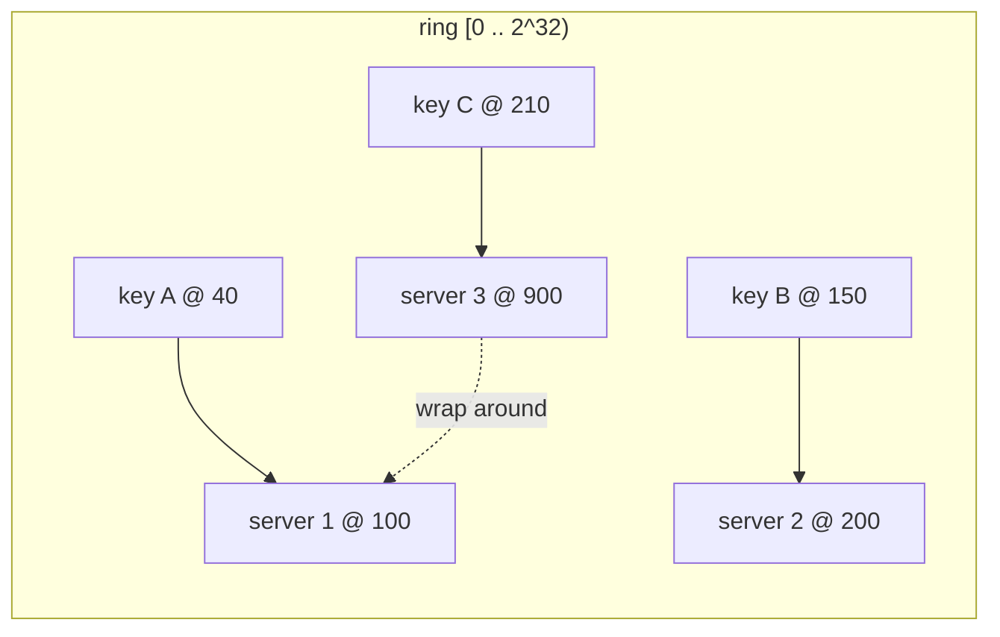

You have `n` cache servers and you route each key to `hash(key) % n`. It works perfectly until `n` changes. Add one server — now it's `% (n+1)` — and the target server changes for *almost every key*, because the modulus shifted. For a cache that means a near-total miss storm against the database; for a data store it means moving nearly the whole dataset over the network. The resize itself is the outage.

**Consistent hashing** is the fix: a scheme where adding or removing a server remaps only about `1/n` of the keys, and only from one neighbour. It's the partitioning layer under Dynamo-style [key-value stores](/citadel/system-design/key-value-store), [distributed caches](/citadel/system-design/distributed-cache), CDNs, and sharded load balancers.

## The ring

Hash the servers *and* the keys into the same space — picture it as points on a circle, `[0, 2³²)`.

- Each server hashes to a point on the ring.
- Each key hashes to a point on the ring.
- A key belongs to the **first server encountered walking clockwise** from the key's position.

Now change the server set:

- **Add server 4 at point 500.** It becomes responsible for the arc from server 2 (200) to itself (500). Every key in that arc moves *from server 3 to server 4*. Servers 1 and 2, and all their keys, are untouched. Roughly `1/n` of keys moved, from one place.
- **Remove server 2.** Its arc (100–200) passes to the next server clockwise, server 3. Again, one neighbour absorbs one arc; nobody else changes.

That's the whole property. `hash(key) % n` couples every key to the exact count `n`; the ring couples each key only to *which server is next clockwise*, which barely changes when the set does.

## Fixing uneven load with virtual nodes

One point per server gives lumpy arcs. Three servers might, by hash luck, own 20% / 30% / 50% of the ring. Worse, when a server dies, its *entire* arc dumps onto a single neighbour, which can then fall over — a cascading failure.

**Virtual nodes**: give each physical server many points on the ring (a few hundred), scattered by hashing `server-id#0`, `server-id#1`, …. Consequences:

- Arcs even out — the law of large numbers smooths the distribution as you add points.
- A failed server's load spreads across *many* other servers (one per virtual node), not one.
- Heterogeneous capacity is easy: give a machine with twice the RAM twice as many virtual nodes.

The cost is a bigger ring structure (a sorted map of `point → server`) and more memory, both trivial for a few hundred points per server.

Looking up a key is a binary search in that sorted map for the first point `≥ hash(key)` (wrapping to the first entry if past the end) — O(log V) for `V` total virtual nodes.

## Replication on the ring

To keep `R` copies of each key, store it on the key's owning server *plus the next `R−1` distinct physical servers clockwise*. "Distinct physical" matters — skip virtual nodes that map back to a server already in the list, or all your replicas could land on one machine.

## Bounded loads

Even with virtual nodes, a single viral key or an unlucky hash can overload one server. **Consistent hashing with bounded loads** caps any server at `(1 + ε)` times the average load; a key that would push its owner over the cap spills to the next server clockwise that has room. It preserves the minimal-movement property while guaranteeing no server is more than a small factor above average.

## The alternative: rendezvous hashing

**Rendezvous hashing** (highest random weight) skips the ring. For a key, compute `hash(key, server)` for *every* server and pick the highest-scoring one. Adding or removing a server only changes the winner for keys where that server would have won or did win — same minimal-disruption property, no ring to build or rebalance, and weighting is a simple multiplier on the score. The cost is O(n) per lookup instead of O(log V), which is fine for tens of servers and gets expensive for thousands. It's used in some CDNs and by Kafka's older partition assignment.

**Jump consistent hash** is another ringless option — a tiny function mapping a key and a bucket count to a bucket in O(ln n) with no per-server state — but it only supports adding/removing buckets at the *end*, so it fits "resize a shard count" better than "an arbitrary server left."

## The one idea to keep

`hash(key) % n` ties every key to the server count, so changing the count moves everything. Consistent hashing ties each key only to *which server is next clockwise on a shared ring*, so adding or removing a server reassigns just that server's arc — about `1/n` of keys, from one neighbour. Always use virtual nodes (many ring points per server) so load is even and a failure spreads across the whole fleet instead of crushing one machine. When `n` is small, rendezvous hashing gets you the same property with less machinery.
