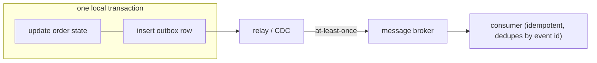

Place an order: charge the customer, decrement inventory, create a shipment. Three services, three databases. You want all-or-nothing — charge without inventory is a refund headache, inventory without charge is lost money. But there's no `BEGIN TRANSACTION` that spans three databases owned by three teams.

The honest first answer in an interview is: **avoid needing this.** Model aggregates so that a single business operation touches a single service's data. When you genuinely can't, the tools are two-phase commit (atomic but blocking), sagas (available but not isolated), and the transactional outbox (so your events and your state don't drift apart).

## Why not just distributed 2PC everywhere

**Two-phase commit** has a coordinator and participants:

1. **Prepare** — the coordinator asks every participant "can you commit this?" Each does the work, writes it durably in a *prepared* (not yet committed) state, locks the affected rows, and votes yes or no.
2. **Commit** — if all voted yes, the coordinator tells everyone to commit; any no, and it tells everyone to abort.

It gives real atomicity. The problems:

- **Blocking.** Between prepare and commit, participants hold locks. If the coordinator crashes after some participants prepared, those rows stay locked until it recovers — the participants can't safely decide alone. This is the "blocking" in "2PC is a blocking protocol."
- **Coordinator is a single point of failure**, and making *it* fault-tolerant means running consensus, at which point you've built [Raft](/citadel/interview/consensus).
- **Latency and coupling.** Every participant must be up for the transaction to proceed; you've tied the availability of the whole operation to the availability of all parts.

3PC adds a phase to reduce blocking and is essentially never used. 2PC is fine *within* one database's storage engine or across a small, co-located, homogeneous set (XA transactions). Across microservices, it's usually the wrong tool.

## Sagas

A **saga** is a sequence of local transactions, one per service, where each step has a **compensating action** that semantically undoes it. There is no global rollback — if step 4 fails, you run the compensations for steps 1–3.

`reserve inventory → charge payment → create shipment`
compensations: `release inventory ← refund payment ← cancel shipment`

Two coordination styles:

- **Choreography** — each service listens for the previous step's event and emits its own. "OrderCreated" → payment service charges, emits "PaymentCompleted" → inventory service reserves, emits "InventoryReserved" → …. No central coordinator; the flow is implicit in who subscribes to what. Simple for short sagas; hard to follow and to change once it's more than a few steps (there's no one place that describes the whole flow).
- **Orchestration** — a saga orchestrator (a state machine) explicitly calls each service and decides the next step, including which compensations to run on failure. One place to read the flow, easier to add steps and timeouts; the orchestrator is another service to build and run.

**Compensation is semantic, not physical.** You can't "un-send" an email — you send a correction. You can't roll back a captured payment — you issue a refund, which is a new transaction that leaves a trail. Design each step so it *can* be compensated (capture payment late, or authorize-then-capture so a failure just releases the hold).

**Sagas have no isolation.** Between step 2 and its compensation, the world can see the intermediate state — inventory decremented for an order that will be cancelled. Countermeasures: a *pending* status on records so readers know it's not final (semantic lock), commutative updates (increment/decrement rather than set), or a pessimistic ordering of steps that minimizes the exposed window.

## The dual-write problem and the outbox

A service needs to do two things atomically: update its own database **and** publish an event ("PaymentCompleted") for the next saga step. If it writes the DB then publishes and crashes in between, the event is lost — the saga stalls. If it publishes then writes and crashes, there's an event for a state change that didn't persist. Writing to two systems is not atomic.

The **transactional outbox** fixes it: in the *same local transaction* that changes the business data, insert a row into an `outbox` table describing the event. Both commit together or neither does. A separate relay process then reads the outbox and publishes to the message broker, marking rows sent (or using [change data capture](/citadel/tech/kafka) — Debezium tailing the DB's write-ahead log — to publish outbox inserts automatically).

The relay is **at-least-once** — it can publish a row twice (crash after publish, before marking sent) — so consumers must be **idempotent**: dedupe on the event ID, or use an **inbox** table (record processed event IDs, skip duplicates). The mirror of the outbox on the consuming side.

## Idempotency is the foundation

Everything above assumes retries. An idempotency key on each operation (the order ID, a client-generated UUID) plus a store of "keys I've already processed" turns *at-least-once delivery* into *exactly-once effect*. Design every saga step and every event handler this way and the whole thing becomes robust to the redeliveries that distributed systems guarantee you'll get.

## The one idea to keep

You can't wrap two services in a database transaction, and 2PC across microservices blocks on the coordinator and couples everyone's availability. So use a saga — local transactions with semantic compensations, orchestrated by a state machine for anything non-trivial — and accept that it has no isolation, mitigating with pending-status flags. Publish the saga's events with the transactional outbox (event row committed in the same transaction as the state change, relayed separately), and make every step idempotent so at-least-once delivery produces exactly-once effects.
