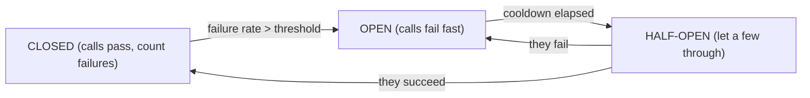

Your service calls a payment provider. One day the provider gets slow — responses that took 50 ms now take 30 seconds. Your service has a fixed thread pool; each request to it now holds a thread for 30 seconds waiting on the provider; the pool fills; *every* request to your service, including ones that don't touch payments, starts timing out. One slow dependency took down the whole service.

That's a **cascading failure**, and the patterns here exist to stop it. None of them make the payment provider work — they contain the blast radius so your service degrades instead of dying.

## Timeouts

Never make a network call without a timeout. A call with no timeout inherits the *other* side's failure modes: if they hang, you hang.

- **Connect** timeout (getting a TCP connection) and **read/request** timeout (waiting for the response) are separate — set both.
- Set them from the dependency's real latency, not a round number. If p99 is 200 ms, a 2-second timeout gives huge margin; a 30-second one just lets threads pile up during a slowdown.
- **Deadline propagation** — pass a remaining-time budget down the call chain (gRPC does this natively). If the client already waited 800 ms of a 1 s budget, downstream calls should time out at 200 ms, not start a fresh 5 s clock.

Timeouts are the foundation — without them, everything below can't work, because there's no bounded failure to react to.

## Retries with backoff and jitter

A timeout or a `503` might be transient. Retrying can recover — or make things much worse.

- **Only retry idempotent operations**, or operations carrying an idempotency key. Retrying a non-idempotent `POST` can double-charge.
- **Never retry a `4xx`** (except `429`) — the request is wrong; retrying just repeats the error.
- **Exponential backoff** — wait `base · 2^attempt` between tries, capped. A fixed short retry interval turns a blip into a hammering.
- **Jitter** — add randomness to the backoff. Without it, a thousand clients that failed at the same instant all retry at the same instant — a synchronized **retry storm** that DDoSes the recovering service. "Full jitter" (`random(0, base · 2^attempt)`) or "decorrelated jitter" spreads them out.
- **Retry budget** — cap retries as a fraction of total requests (e.g. 10%). If more than that are failing, the dependency is down, not flaky; retrying harder won't help and adds load.
- **Bound the attempts** — 2–3, not "until it works."

## Circuit breaker

If a dependency is *down* (not just slow), every call is going to fail after the full timeout. A circuit breaker stops making the doomed calls.

- **Closed** — calls pass through; the breaker tracks the recent failure rate (or count).
- **Open** — the failure rate crossed a threshold. Calls **fail immediately** without touching the dependency (return a fallback, a cached value, or an error) for a cooldown period. This frees threads and takes load off the struggling dependency so it can recover.
- **Half-open** — after the cooldown, let a trickle of calls through. If they succeed, close; if they fail, open again.

The point is *failing fast*: an open breaker turns a 30-second timeout into an instant response, which is what stops the thread pool from filling.

## Bulkhead

Named after a ship's watertight compartments: a hull breach floods one compartment, not the whole ship. In software, **isolate resources per dependency** so one dependency's problems can't consume all of them.

- Separate thread pools (or semaphores) per downstream: payments get 20 threads, search gets 20, recommendations get 10. Payments hanging exhausts *its* 20 threads; the other 30 keep serving.
- Separate connection pools per database or per external API.
- At the deployment level, separate service instances for critical vs best-effort traffic.

Bulkheads and circuit breakers complement each other: the bulkhead limits how much damage a slow dependency can do while the breaker is still closed; the breaker then stops the calls entirely.

## Load shedding and backpressure

When *your* service is the one overwhelmed:

- **Load shedding** — past a concurrency or queue-depth limit, reject new requests immediately with `503` + `Retry-After` rather than accepting work you can't finish. A request you'll drop in 30 seconds is worse than one you reject now.
- **Prioritize** — shed low-value traffic first (keep checkout, drop analytics).
- **Backpressure** — signal upstream to slow down (bounded queues that block or reject, gRPC flow control, TCP's own window). Don't let an unbounded in-memory queue absorb a spike until you OOM.

## Graceful degradation

When a dependency is unavailable, serve something useful:

- stale data from a cache (with a "last updated" note),
- a default or partial response (product page without the recommendations widget),
- a feature toggle that disables the non-essential path.

## Testing it

These patterns are only real if exercised. **Fault injection** (Toxiproxy, service-mesh fault rules) and **chaos engineering** (deliberately killing instances, adding latency, in production, with a hypothesis and a blast-radius limit — Netflix's Chaos Monkey) verify that the breaker trips, the bulkhead holds, and the fallback works — before a real outage does the testing for you. Run **game days**: schedule a controlled failure and watch the team and the system respond.

Libraries: Resilience4j (JVM), Polly (.NET), and service meshes (Istio, Linkerd) that apply timeouts, retries, and breakers at the sidecar without app code.

## The one idea to keep

A slow dependency takes your service down by holding its threads until the pool is empty. Bounded timeouts (sized from real latency, with deadline propagation) give you a failure to react to. Retries recover transient errors *only* with exponential backoff, jitter, and a budget — otherwise they're a self-inflicted DDoS. A circuit breaker fails fast when a dependency is truly down, freeing your threads and easing its load. Bulkheads cap how many resources any one dependency can consume. Test all of it with fault injection, because an untested fallback is a fallback that doesn't work.
