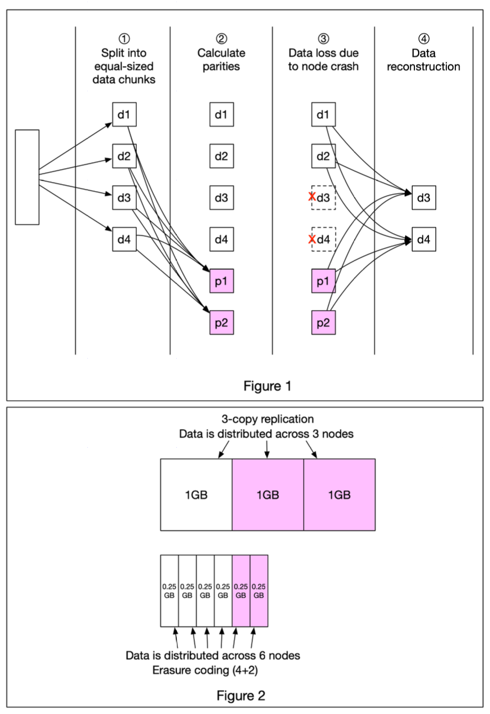

Hey data defenders and storage gurus! When we entrust our precious data to large-scale storage systems, like AWS S3 or other cloud object stores, one of the biggest concerns is **durability**. How do these systems ensure our data doesn't just vanish if a disk fails, or even if an entire server goes offline? While simple replication (making multiple copies) is one way, a more sophisticated and efficient technique often used is **Erasure Coding**.

You might have heard that object storage services like S3 boast incredible durability figures, like "11 nines" (99.999999999%). Erasure coding is a really cool technique that plays a key role in achieving this, often more efficiently than just making several full copies of your data. Let's take a look at how it works.

## What is Erasure Coding?

At its heart, **erasure coding** is a method of data protection where data is broken down into fragments, expanded and encoded with redundant data pieces (parities), and then stored across different locations or storage media. The magic is that if some of the original data or parity fragments are lost or corrupted, the original data can be reconstructed using the remaining fragments.

It deals with data durability differently from simple replication. Instead of making, say, three full copies of your file, erasure coding chunks the data into smaller pieces, calculates some additional parity pieces, and spreads all these pieces across different servers or disks.

## How Does Erasure Coding Work? Chunks and Parities

Let's illustrate with a common example, known as **(k+m) erasure coding**, where `k` is the number of original data chunks and `m` is the number of additional parity chunks. For instance, a (4+2) erasure coding scheme means we take 4 data chunks and create 2 parity chunks.

Here's a simplified breakdown based on the process described in the figure:

1.  **Split into Data Chunks:** The original data (e.g., a file) is first divided into `k` equal-sized data chunks. In our (4+2) example, we'd have four data chunks: d1, d2, d3, and d4.
2.  **Calculate Parity Chunks:** Using mathematical formulas (often involving Reed-Solomon codes or similar algorithms), `m` parity chunks are calculated from the `k` data chunks. In our (4+2) example, two parity chunks, p1 and p2, are calculated.
    * A much-simplified (and not cryptographically accurate, but illustrative) example of how parities might be derived could be:
        * `p1 = d1 + 2*d2 - d3 + 4*d4`
        * `p2 = -d1 + 5*d2 + d3 - 3*d4`
3.  **Distribute Chunks:** All `k` data chunks and `m` parity chunks (so, `k+m` total chunks) are then distributed and stored across different physical storage devices (e.g., different disks or servers). In our (4+2) example, we'd have 6 chunks stored across 6 nodes/disks.
4.  **Data Loss Scenario:** Now, imagine some of these storage devices fail. For instance, let's say the nodes holding data chunks d3 and d4 crash, and those chunks are lost.
5.  **Data Reconstruction:** The system can still reconstruct the lost data! In our (4+2) example, even if we lose any 2 out of the 6 total chunks (whether they are data chunks or parity chunks), we can use the remaining 4 chunks and the mathematical formulas to reconstruct the original lost data (d3 and d4 in this case). As long as at least `k` chunks out of the `k+m` chunks are available, the original data can be fully recovered.

## Storage Overhead: Erasure Coding vs. Replication

One of the significant advantages of erasure coding is its storage efficiency compared to simple replication for achieving similar levels of durability.

* **Erasure Coding (e.g., 4+2):** For every 4 chunks of data, we generate 2 parity chunks. This means we store 6 chunks in total for 4 chunks of actual data. The storage overhead is (m/k) = 2/4 = 50%. If you have 1GB of data split into four 0.25GB chunks, you'd store these plus two 0.25GB parity chunks, totaling 1.5GB of physical storage for 1GB of logical data.
* **3-Copy Replication:** To protect 1GB of data, you would store three full 1GB copies. The storage overhead is 200%.

Clearly, erasure coding can provide high durability with significantly less storage space.

## Durability Gains

Does erasure coding actually increase data durability compared to replication? Yes, significantly, especially when considering the same amount of storage overhead or for higher levels of protection.

Let's assume a single storage node (or disk) has a 0.81% annual failure rate. According to calculations:
* **Erasure coding** (depending on the k+m scheme) can achieve extremely high durability, often cited as "11 nines" (99.999999999%) or even higher.
* **3-copy replication**, with the same node failure rate, might achieve around "6 nines" (99.9999%) of durability.

This means your data is far less likely to be lost permanently with erasure coding.

## Key Takeaways

* Erasure coding is a data protection method that breaks data into fragments, adds redundant parity fragments, and distributes them across multiple storage locations.
* It allows for the reconstruction of original data even if some fragments are lost, offering high durability.
* It is significantly more space-efficient than traditional N-copy replication for achieving comparable or even better levels of durability.
* Commonly used in large-scale object storage systems like AWS S3 to provide robust data protection without excessive storage overhead.

Erasure coding is a clever and powerful technique that ensures our ever-growing digital world remains safe and accessible, even when bits and pieces of hardware inevitably fail!
