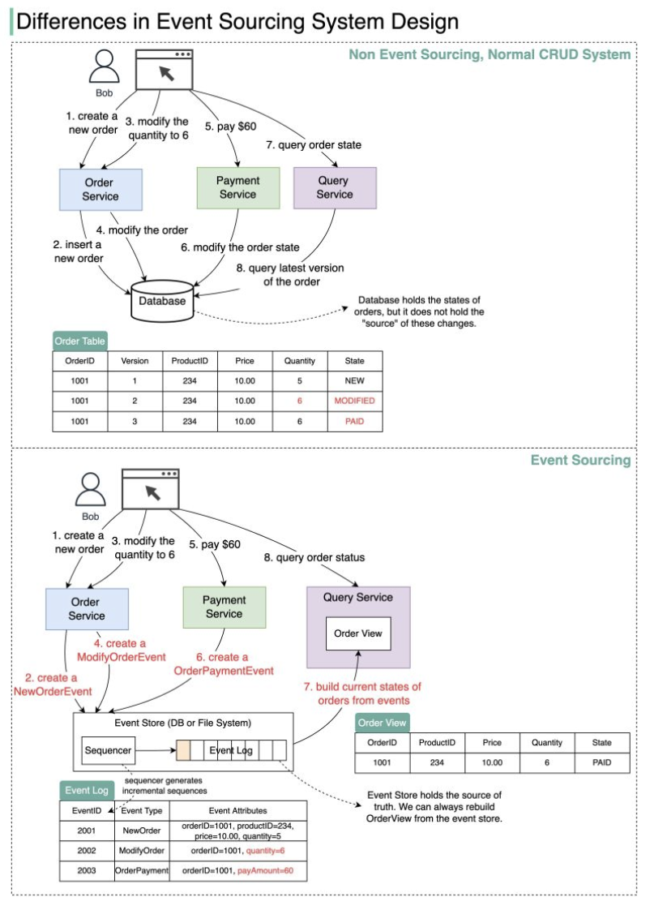

Hey everyone, and welcome back to the blog! When we design systems, a primary concern is how we manage and persist data. The traditional approach, which many of us are familiar with through **CRUD (Create, Read, Update, Delete)** operations, is to store only the *current state* of our entities. If a customer changes their address, we `UPDATE` the address field in the customer table, and the old address is typically gone (unless we have separate, often complex, audit logging mechanisms).

But what if, instead of just knowing the present, we could have a complete, immutable history of *everything* that ever happened to our data? What if every change was a story in itself? This is the core idea behind **Event Sourcing**, a powerful architectural pattern that fundamentally changes the programming paradigm from persisting states to persisting a sequence of state-changing events. It's about capturing the full narrative of your data.

## What is Event Sourcing? Beyond Storing Just the Current State

**Event Sourcing** is an architectural pattern where all changes to an application's state are captured and stored as a sequence of immutable "events". Instead of persisting the current state of an entity (like an order or a user profile), you persist the history of events that led to that state. Each event represents a significant business occurrence or a state transition.

### The Event Store: The Immutable Source of Truth
The heart of an event-sourced system is the **Event Store**.
* This is an **append-only log** where all these state-changing events are persisted. Once an event is written to the store, it is considered immutable – it is never deleted or modified.
* To guarantee their ordering, events in the store must be **sequenced**, often with incremental numbers (event IDs) or precise timestamps.
* The event sourcing paradigm is used to design a system with **determinism**; given the same initial state and the same sequence of events, you will always arrive at the exact same final state. The event store *is* the source of truth.

## How Event Sourcing Works: A Shift in Perspective (CRUD vs. Events)

To truly grasp event sourcing, it’s enlightening to compare it directly with the traditional CRUD approach.

### Traditional CRUD Design: Storing Current State
* **Order Created:** An `INSERT` statement adds a new row to the `Orders` table. This row contains the *current state* of the order (e.g., `OrderID: 1, CustomerID: Bob, Product: Pants, Quantity: 5, Status: Created`).
* **Quantity Changed:** Bob wants to change the quantity from 5 to 6. An `UPDATE Orders SET Quantity = 6 WHERE OrderID = 1` statement modifies the order record directly in the database. The previous quantity (5) is overwritten.
* **Payment Made:** Bob pays. An `UPDATE Orders SET Status = 'Paid' WHERE OrderID = 1` statement updates the order's status.
* **Query Order:** To get the order details, an application queries the `Orders` table (`SELECT * FROM Orders WHERE OrderID = 1`) and retrieves the latest, current state of that order.

### Event Sourcing Design: Storing a Sequence of Facts
* **Order Created:** Bob wants to buy a product. A `NewOrderEvent` is created (e.g., `{ eventID: 2001, orderID: 1, customerID: 'Bob', product: 'Pants', quantity: 5, timestamp: ... }`). This event is sequenced and stored (appended) in the event store.
* **Quantity Changed:** Bob wants to change the quantity from 5 to 6. A `ModifyOrderEvent` is created (e.g., `{ eventID: 2002, orderID: 1, newQuantity: 6, timestamp: ... }`) and appended to the event store. Note that different event types will have different event attributes relevant to the change.
* **Payment Made:** Bob pays $60 for the order. An `OrderPaymentEvent` is created (e.g., `{ eventID: 2003, orderID: 1, amountPaid: 60.00, paymentMethod: 'CreditCard', timestamp: ... }`) and appended to the event store.

### Rebuilding State (Projections / Read Models / Views)
Since the event store only contains a log of what happened, how do we get the current state of an order in an event-sourced system?
* The current state of any entity is derived by **replaying its sequence of events** from the event store, from the beginning (or a snapshot) up to the desired point (usually the latest).
* This derived state is often materialized and maintained in a separate, optimized read model or "View" (e.g., an `OrderView` in our example). This view listens to new events as they are published from the event store and updates its representation of the latest state accordingly by applying the events one by one.
* This `OrderView` can be stored in various forms – in memory, a cache (like Redis), or even a traditional relational or NoSQL database that is optimized for the specific queries it needs to serve. Crucially, this view does **not necessarily need to be persisted with the same durability guarantees as the event store** itself, because it can always be completely recovered and rebuilt by replaying events from the event store, which remains the ultimate source of truth.
* When a user queries for the current order state (e.g., via an `OrderService`), the service queries this pre-computed `OrderView` rather than replaying events on every query.

## Why Choose Event Sourcing? Key Benefits

Adopting event sourcing can bring several powerful advantages:

* **Complete Audit Log & History:** The event store inherently provides a full, immutable history of every significant change made to the system. This is invaluable for auditing, compliance requirements, debugging, and understanding system behavior over time. You don't just know the current state; you know *how it got there*.
* **Temporal Queries & State Reconstruction:** Since all changes are stored as events, you can reconstruct the state of an entity at *any point in time* by replaying events up to that specific time. This is incredibly powerful for historical analysis, business intelligence, or understanding past system states.
* **Debugging and Root Cause Analysis:** If something goes wrong, replaying events in a test environment can help diagnose issues precisely and understand how a system reached an erroneous state. The sequence of events tells a story.
* **Improved Resilience & Fault Tolerance:** The append-only nature of the event store can simplify backup and recovery strategies. Read models (projections) can be rebuilt from the event store if they become corrupted or if new types of views are needed in the future.
* **Flexibility in Projections (Read Models):** You can create multiple different read models from the same stream of events. Each projection can be tailored and optimized for specific query needs or different parts of your application, without affecting the core event log. This naturally supports patterns like **CQRS (Command Query Responsibility Segregation)**, where the model used for writes (commands generating events) is separate from the models used for reads (queries on projections).
* **Foundation for Event-Driven Architectures (EDA):** Event Sourcing is a natural fit for EDAs. The domain events captured in the event store can be published to an event bus or message broker, allowing other microservices or components to react to these business-significant occurrences in a decoupled manner.

## Use Cases of Event Sourcing in the Wild

Event sourcing is not just a theoretical concept; it's used effectively in various real-world scenarios:

1.  **Content Management Systems (CMS) - e.g., The New York Times:**
    * the New York Times website stores every article, image, and byline published since its inception in 1851 as a sequence of events in an event store.
    * This raw event data is then used to build various "views" or projections (e.g., denormalized content for search). These views are then fed into systems like ElasticSearch to power the website's search functionality.

2.  **Change Data Capture (CDC):**
    * In CDC systems, changes made to traditional databases (inserts, updates, deletes) can be captured from transaction logs and transformed into events.
    * These events are then typically pushed to an event streaming platform like Apache Kafka, which can act as an event channel or even an event store.
    * Various downstream systems ("sinks") such as other databases, caches, or analytics platforms (like ElasticSearch) can consume these events from Kafka to stay synchronized or react to the changes.

3.  **Microservice Integration & Communication:**
    * Event Sourcing provides a robust paradigm for enabling asynchronous communication and data sharing among microservices.
    * For example, a `ShoppingCartService` might generate events like `ItemAddedToCartEvent`, `ItemRemovedFromCartEvent`, or `OrderCheckoutStartedEvent`.
    * An event broker like Kafka can act as the event store or the channel through which these events are published.
    * Other microservices, such as a `FraudDetectionService`, `BillingService`, or `EmailService`, can subscribe to and consume these events to perform their respective tasks.
    * A key benefit here is that since the events themselves are the source of truth about what happened, each consuming service can interpret these events to build and maintain its own specific domain model or view of the data it needs, promoting loose coupling.

## Challenges and Considerations

While powerful, event sourcing comes with its own set of challenges and design considerations:

* **Initial Complexity:** Implementing event sourcing can be more complex initially compared to traditional state-based persistence, especially for teams new to the pattern. It requires a shift in thinking from "current state" to "sequence of changes."
* **Schema Evolution for Events ("Event Versioning"):** Events, once written to the event store, are immutable. If the structure or meaning of an event type needs to change over time (e.g., adding new fields, renaming old ones, splitting an event), you need robust strategies for event versioning. This might involve techniques like upcasting (transforming old event versions to new ones on the fly when reading) or having consumers be aware of multiple event versions.
* **Querying Current State & Projections:** Directly querying the current state of an entity from just the event log can be inefficient if it involves replaying a large number of events every time. This is why building and maintaining projections (read models) is crucial. However, rebuilding these projections from scratch can be time-consuming for entities with very long event histories if not optimized.
* **Eventual Consistency:** If read models are updated asynchronously based on events from the event store (which is a common pattern for scalability and decoupling), there will be a period of eventual consistency. This means there might be a slight delay between when an event is stored and when all read models fully reflect that change. This delay needs to be acceptable for the specific use case.
* **Snapshotting:** For entities with a very long history of events (aggregates), replaying all events from the beginning of time to reconstruct the current state can become slow. **Snapshotting** is a common optimization technique. Periodically, the full current state of an entity is saved as a "snapshot." To get the current state, the system then only needs to load the latest snapshot and replay the events that have occurred *after* that snapshot was taken, significantly reducing processing time.
* **Idempotency of Event Handlers:** Consumers processing events must often be idempotent to handle potential redelivery of events without causing incorrect side effects.

## Key Takeaways

* Event Sourcing fundamentally changes data persistence from storing the current state (like in CRUD) to storing an immutable sequence of all state-changing events in an event store.
* The current state of an entity is derived by replaying its historical events, often materialized into optimized read models (projections).
* This pattern offers significant benefits, including a complete audit trail, the ability to perform temporal queries, robust debugging capabilities, and a natural fit for Event-Driven Architectures and CQRS.
* While powerful, it introduces considerations around event versioning, the complexity of querying current state (necessitating projections), and managing eventual consistency.

Event Sourcing offers a profound shift in how we think about data—from just knowing *what is* to understanding *everything that happened* to get there. For the right kind of system, particularly those requiring strong auditability, historical analysis, or complex state transitions, this historical perspective can be incredibly valuable and transformative.
