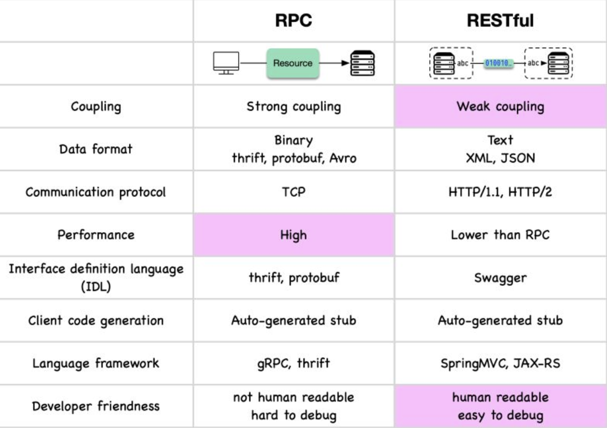

Hey everyone, and welcome back to the blog! In the world of distributed systems and microservices, efficient and reliable communication between services is paramount. While REST APIs over HTTP/1.1 have been the workhorse for a long time, modern applications, often demand something faster, more strongly typed, and better suited for internal service-to-service chatter. Enter **gRPC**.

gRPC, which stands for **Google Remote Procedure Call**, is a high-performance, open-source, universal RPC (Remote Procedure Call) framework. It allows a client application to directly call methods on a server application running on a different machine (or in a different process) as if it were a local object call, abstracting away the complexities of network communication. Let's unpack what makes gRPC so powerful and when you might choose it.

## What is gRPC? Beyond Traditional REST APIs

At its core, gRPC enables a client to execute a procedure (a function or method) on a remote server seamlessly. Instead of crafting HTTP requests with JSON payloads and parsing responses manually (as often done with REST), gRPC aims to make remote interactions feel like local function calls.



It's designed to be:
* **High-performance:** Leveraging modern technologies for speed and efficiency.
* **Language-agnostic:** Define your service once and generate client/server code in many popular languages.
* **Feature-rich:** Supporting various communication patterns beyond simple request-response.

## The Magic Behind gRPC: How It Works

The typical workflow and underlying mechanisms of gRPC involve a few key steps and technologies:

1.  **Define Your Service (The Contract with Protocol Buffers):**
    * You start by defining your service interface and the structure of your message data (request and response types) in a `.proto` file using **Protocol Buffers (Protobuf)**. Protobuf is Google's language-neutral, platform-neutral, extensible mechanism for serializing structured data.
    * In this `.proto` file, you specify service methods (the RPCs), their input parameters (request messages), and their return types (response messages).

    ```protobuf
    // Example service definition in a .proto file
    syntax = "proto3";

    service Greeter {
      rpc SayHello (HelloRequest) returns (HelloReply);
    }

    message HelloRequest {
      string name = 1;
    }

    message HelloReply {
      string message = 1;
    }
    ```

2.  **Code Generation (The Stubs and Skeletons):**
    * The gRPC framework uses a Protobuf compiler (`protoc`) along with a gRPC-specific plugin for your chosen programming language(s).
    * This compilation process automatically generates:
        * **Client-side stubs (or client libraries):** These provide methods that your client application can call directly. These stubs handle the serialization of requests and deserialization of responses.
        * **Server-side skeletons (interfaces or base classes):** These define the service interface that your server application needs to implement with the actual business logic.

3.  **Client Makes a "Local" Call:**
    * Your client application uses the generated stub. Calling a method on this stub feels like calling a local function, e.g., `response = greeter_stub.SayHello(request_object)`.

4.  **gRPC Handles the Heavy Lifting:**
    * **Client-Side:** When the client calls a stub method:
        * The gRPC client library takes the request parameters (which are Protobuf message objects) and **marshals** (serializes) them into the compact Protobuf binary format.
        * It then sends this binary payload over the network to the server using **HTTP/2** as the underlying transport protocol.
    * **Server-Side:** When the gRPC server receives the request:
        * The gRPC server library receives the HTTP/2 request containing the binary Protobuf payload.
        * It **unmarshals** (deserializes) the Protobuf message back into language-specific objects.
        * It then invokes the actual service method implementation (that you wrote on the server) with these deserialized request objects.
    * **Response Path:**
        * The server-side method executes its logic and returns a response (as a Protobuf message object).
        * The gRPC server library marshals this response object into Protobuf binary format and sends it back to the client over the same HTTP/2 connection.
        * The gRPC client library on the client side receives the response, unmarshals it into a language-specific object, and returns it to the client application code.

This entire process of serialization, network communication, and deserialization is largely abstracted away from the developer by the gRPC libraries and generated code.

## Core Pillars of gRPC's Power

Three key technologies contribute significantly to gRPC's efficiency and capabilities:

### 1. Protocol Buffers (Protobuf): Efficient Data Serialization
* **Definition:** Protocol Buffers are Google's language-neutral, platform-neutral, extensible mechanism for serializing structured data. Think of them as a more efficient, smaller, and faster alternative to JSON or XML for data exchange.
* **Efficiency:** Data is defined with a strong schema in `.proto` files. Messages are then serialized into a compact binary format. This binary representation is typically much smaller and faster to parse than text-based formats like JSON or XML. Some benchmarks suggest Protobuf with gRPC can be up to 5 times faster than JSON/REST for message processing.
* **Schema-Driven:** The `.proto` file acts as a contract, ensuring type safety and clear message structures.

### 2. HTTP/2: Modern and Efficient Transport
gRPC is built on top of HTTP/2, which provides several significant advantages over the older HTTP/1.1 standard used by many traditional REST APIs:
* **Multiplexing:** Allows multiple requests and responses to be sent concurrently over a single TCP connection without head-of-line blocking between them. This significantly reduces latency for applications making many parallel requests.
* **Bi-directional Streaming:** HTTP/2 natively supports sending multiple messages in both directions (client-to-server and server-to-client) over a single, long-lived connection.
* **Header Compression (HPACK):** Uses HPACK compression for HTTP headers, reducing the overhead of transmitting metadata with each request/response.
* **Binary Protocol:** HTTP/2 frames are binary, making them more efficient to parse than HTTP/1.x's textual format.
* **Flow Control:** Provides more granular mechanisms for managing data flow.

### 3. Rich Streaming Capabilities
Thanks to HTTP/2, gRPC has first-class, built-in support for various communication patterns beyond simple request-response:
* **Unary RPC (Simple Request-Response):** The client sends a single request message, and the server sends back a single response message. This is like a traditional RPC or a typical REST API call.
* **Server Streaming RPC:** The client sends a single request message, and the server sends back a stream of multiple response messages. This is useful for scenarios where the server needs to send a large dataset or a sequence of notifications to the client.
* **Client Streaming RPC:** The client sends a stream of multiple messages to the server. Once the client has finished sending its stream, the server processes all the messages and sends back a single response. This is useful for scenarios like uploading large files or streaming client-side data for aggregation.
* **Bi-directional Streaming RPC:** Both the client and the server can send a stream of messages to each other independently over the same persistent HTTP/2 connection. This is ideal for highly interactive applications like real-time chat, collaborative tools, or online gaming.

## Pros of Using gRPC: Why Choose It?

Opting for gRPC can bring several significant advantages to your system:
* **High Performance:** The combination of Protobuf for efficient serialization and HTTP/2 for efficient transport results in significantly lower latency and higher throughput compared to many traditional REST/JSON APIs.
* **Excellent Streaming Capabilities:** Native support for unary, server-streaming, client-streaming, and bi-directional streaming offers great flexibility for different communication needs.
* **Strongly Typed & Schema-Driven:** Using Protocol Buffers for defining services and messages enforces a clear contract and data types. This helps catch errors at compile time rather than runtime and improves API reliability.
* **Automatic Code Generation:** The gRPC framework automatically generates client stubs and server skeletons in many popular programming languages from the `.proto` service definition. This simplifies development, reduces boilerplate code, and ensures consistency between client and server.
* **Language Agnostic:** gRPC supports a wide range of programming languages, including Java, C++, Python, Go, Node.js, Ruby, C#, PHP, and more, making it excellent for polyglot microservice environments.
* **Built for Microservices:** Its low latency, high throughput, and support for streaming make it exceptionally well-suited for efficient inter-service communication within a microservices architecture. Many companies, including Uber, leverage gRPC extensively.

## Cons of Using gRPC: Potential Challenges

Despite its strengths, gRPC also comes with some considerations:
* **Limited Direct Browser Support:** Directly calling gRPC services from a web browser client is challenging. Browsers don't fully expose the low-level HTTP/2 controls that gRPC relies on (like HTTP trailers). To bridge this gap, **gRPC-Web** was developed. gRPC-Web allows browser clients to communicate with gRPC services, typically via a proxy (like Envoy or a dedicated gRPC-Web proxy) that translates gRPC-Web requests into standard gRPC requests for the backend.
* **Non-Human Readable Payload:** Protobuf's binary format is not human-readable like JSON or XML. This can make debugging (e.g., inspecting network traffic with standard browser developer tools or `curl`) more difficult without specialized tools that can decode Protobuf messages.
* **Steeper Learning Curve:** Compared to crafting simple REST/JSON APIs, getting started with defining services in `.proto` files, managing the code generation process, and understanding the nuances of HTTP/2 and different streaming types can have a steeper learning curve for developers.
* **Less Mature Ecosystem (Compared to REST in some areas):** While the gRPC ecosystem is growing rapidly, the range of tools for testing, mocking, API gateways, general developer support, and community resources might still be perceived as less extensive or mature than that for traditional REST APIs in some specific niches.

## Common Use Cases for gRPC

Given its characteristics, gRPC shines in several areas:
* **Microservices Communication:** This is a primary use case. It's ideal for low-latency, high-throughput, and strongly-typed communication between internal backend services.
* **Mobile Clients to Backend Services:** Protobuf's efficiency in terms of payload size and parsing speed can be particularly beneficial for mobile applications, which often operate on networks with higher latency or limited bandwidth and on devices with constrained battery life.
* **IoT (Internet of Things) Devices:** Well-suited for communication between resource-constrained IoT devices and backend servers due to its performance and efficiency.
* **Polyglot Systems:** When you have services written in different programming languages that need to communicate effectively and reliably.
* **Real-time Applications:** Its bi-directional streaming capabilities make it a good fit for applications requiring real-time data exchange.

## Key Takeaways

* gRPC is a modern, high-performance, open-source RPC framework developed by Google.
* It uses **Protocol Buffers** for efficient, schema-driven data serialization and **HTTP/2** for fast, multiplexed transport.
* Offers robust support for various **streaming** patterns (unary, server, client, bi-directional).
* Key benefits include high performance, strong typing, code generation, and language interoperability, making it excellent for microservices.
* Challenges include limited direct browser support (addressed by gRPC-Web), non-human-readable payloads, and a potentially steeper learning curve than REST.

gRPC represents a significant step forward in how distributed applications can communicate, offering a compelling alternative to traditional REST APIs, especially when performance and strong contracts are paramount within your internal network of services.
