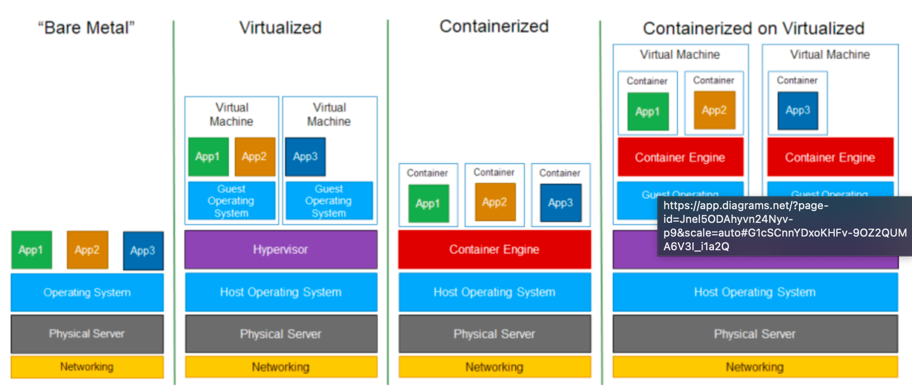

Hey tech enthusiasts and system architects! When it comes to running our applications, we're often looking for the sweet spot of performance, isolation, efficiency, and manageability. This quest has led to several powerful technologies, primarily **Virtualization** (creating Virtual Machines) and **Containerization** (like Docker). But these don't exist in a vacuum! It's helpful to understand the full spectrum, starting from running directly on **Bare Metal** to even combining these approaches, like running **Containers on VMs**.

## The Spectrum of Application Hosting

Let's explore these approaches, from running directly on hardware to layered abstractions. The diagram llustrates these distinct layered architectures well.

### 1. Bare Metal: Direct Hardware Power

* **What it is:** This is the most traditional approach. Your operating system and applications run directly on the physical hardware (the "bare metal") of a server. There's no virtualization layer in between.
* **How it Works (Layered Look):**
    1.  Physical Server (Hardware)
    2.  Operating System
    3.  Applications (with their Bins/Libs)

* **Characteristics:**
    * **Maximum Performance:** Applications have direct access to hardware resources, offering the highest potential performance and lowest overhead.
    * **Full Control:** You have complete control over the hardware and OS.
    * **Less Flexibility & Resource Utilization:** It can be harder to run multiple disparate applications or different OS environments on a single server. Resource utilization might be suboptimal if a single application doesn't use all the server's capacity.
    * **Manual Configuration:** Setting up and managing environments can be more manual.

### 2. Virtualization: Creating Virtual Hardware (VMs)

This is where we introduce a layer to simulate hardware, allowing multiple operating systems to run on a single physical machine.

* **Definition:** Virtualization is a technology that allows you to create multiple simulated environments or dedicated resources from a single, physical hardware system.
* **How it Works (The Layered Look):**
    1.  Physical Server (Hardware)
    2.  Host Operating System (optional, for Type 2 hypervisors)
    3.  **Hypervisor** (Virtual Machine Monitor - VMM): This software layer creates an abstraction over the physical hardware. It allows multiple, isolated guest operating systems to run concurrently.
    4.  On top of the hypervisor, you run multiple **Virtual Machines (VMs)**. Each VM includes:
        * Its own complete **Guest Operating System** (e.g., Windows, Linux).
        * Its own set of virtualized hardware (CPU, RAM, disk, network interfaces).
        * The necessary binaries, libraries, and finally, the application itself.

* **Characteristics:**
    * **Strong Isolation:** Each VM is fully isolated with its own OS kernel.
    * **OS Flexibility:** Can run different operating systems on the same physical hardware.
    * **Mature Technology:** Considered the first generation of cloud computing.
    * **Resource Intensive:** Each VM includes a full OS, consuming more resources (CPU, memory, disk space) and typically having slower boot times than containers.

### 3. Containerization: Lightweight OS-Level Virtualization (e.g., Docker)

Containerization offers a more lightweight form of isolation by virtualizing the operating system rather than the hardware.

* **Definition:** Containerization is the packaging together of software code with all its necessary components like libraries, frameworks, and other dependencies so that they are isolated in their own "container". All resources needed to run the application or microservice are packaged together, so that the applications can run anywhere.
* **How it Works (The Layered Look):**
    1.  Physical Server (Hardware)
    2.  Host Operating System
    3.  **Container Engine** (e.g., Docker Engine): This runs on top of the host OS.
    4.  The application code, along with its binaries and libraries, is packaged into a **Container**. Multiple containers run on the same host, sharing the host OS kernel.

* **Characteristics:**
    * **Lightweight & Fast:** No Guest OS per container means less overhead and near-instant startup times. Faster resource provisioning is a key benefit.
    * **High Density:** More containers can run on a single host compared to VMs.
    * **Portability:** Containers bundle the application and its dependencies, ensuring consistency across different environments ("build once, run anywhere").
    * **OS-Level Isolation:** Achieved using host OS kernel features like Linux namespaces (for resource isolation) and cgroups (for resource limits).

### 4. Containerized on Virtualized: The Hybrid Approach

This strategy combines the strengths of both virtualization and containerization.

* **How it Works (The Layered Look):**
    1.  Physical Server (Hardware)
    2.  Host Operating System
    3.  Hypervisor
    4.  Virtual Machine (running its own Guest OS)
    5.  Inside the VM's Guest OS, a **Container Engine** is installed.
    6.  Containers (with their Apps and Bins/Libs) then run on this container engine, within the VM.

* **Characteristics & Benefits:**
    * **Enhanced Isolation & Security:** You get the strong hardware-level isolation of VMs for different tenants or environments, and then the application-level isolation of containers within those VMs.
    * **Resource Management:** VMs can provide dedicated resource pools (CPU, memory) to groups of containers.
    * **OS Heterogeneity for Containers:** While containers share their host OS kernel (the Guest OS in this case), this model allows you to run a Linux Guest OS on a Windows Host OS (via the hypervisor) and then run Linux containers inside that Linux VM. This is common for Docker Desktop on Windows or macOS.
    * **Cloud Environments:** Many managed Kubernetes services in the cloud run containerized workloads on worker nodes that are themselves VMs.

## Comparing the Approaches

Here's a quick summary of how these stack up:

| Feature               | Bare Metal                                     | Virtualization (VMs)                                   | Containerization (e.g., Docker)                            | Containerized on VMs                          |
| :-------------------- | :--------------------------------------------- | :----------------------------------------------------- | :--------------------------------------------------------- | :-------------------------------------------- |
| **Primary Abstraction** | None (Direct Hardware)                       | Hardware (via Hypervisor)                            | Operating System (via Container Engine)                    | Hardware (VM) + OS (Container in VM)        |
| **Operating System** | Single OS per server                         | Each VM runs its own Guest OS                     | Containers share the Host OS kernel                        | Containers share Guest OS kernel within VM  |
| **Resource Overhead** | Lowest                                         | Higher (full OS per VM)                                | Lower (shared kernel)                                      | Medium (VM overhead + container lightness)    |
| **Startup Time** | OS Boot Time                                   | Slower (boots an entire OS)                   | Faster (starts a process)                                  | VM Boot + Container Start                     |
| **Isolation** | None between apps (OS provides)                | Strong (kernel-level between VMs)            | Good (process-level within Host OS)              | Strong (VM) + Good (Container within VM)    |
| **Density** | Depends on application                         | Lower (fewer VMs per host)                             | Higher (more containers per host)                          | Medium (fewer VMs, but many containers/VM) |

## Key Takeaways

* **Bare Metal** offers maximum performance but lacks workload flexibility and isolation.
* **Virtualization (VMs)** provides strong isolation and the ability to run multiple, different operating systems on a single physical host, but with higher resource overhead.
* **Containerization (e.g., Docker)** offers lightweight, OS-level isolation, leading to fast startups, high density, and excellent portability by packaging applications with their dependencies.
* **Running Containers on VMs** is a common hybrid approach that combines the strong isolation and mature management of VMs with the agility and efficiency of containers.

The "best" choice always depends on your specific requirements—balancing the need for isolation, performance, resource efficiency, security, and operational manageability.
