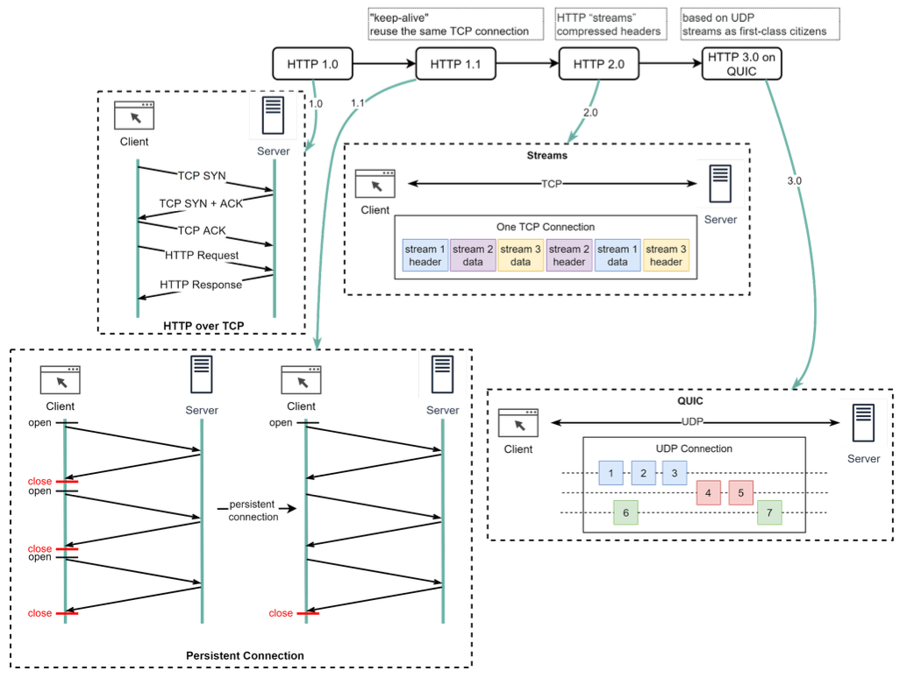

Hey everyone, and welcome back to the blog! Every time you open a web browser, click a link, or load a webpage, you're witnessing a fundamental protocol of the internet in action: **HTTP (Hypertext Transfer Protocol)**. It's the invisible language that your browser uses to "talk" to web servers, requesting information and receiving it. HTTP is truly the foundation of any data exchange on the Web, operating on a client-server model.

But HTTP isn't a static relic; it has evolved significantly over the years, always in pursuit of a faster, more efficient, and more responsive web experience. Today, let's take a journey through the world of HTTP, from its basic request-response cycle to its latest iterations.

## What is HTTP? The Foundation of Web Communication

At its core, HTTP is a protocol designed for fetching resources, such as HTML documents, images, videos, or any other file. When you type a URL into your browser, your browser (the client) sends an HTTP request to a web server, which then sends back an HTTP response containing the requested resource (or an error message).

### The Stateless Nature of HTTP (and a little help from Cookies)

One key characteristic of HTTP is that it's **stateless**. This means each request from a client to a server is treated as an independent transaction, unrelated to any previous requests. The server doesn't inherently remember anything about past interactions with a particular client.

So, how do websites remember your login status or shopping cart? This is where **HTTP Cookies** come into play. Cookies are small pieces of data that a server sends to the client's browser. The browser then stores these cookies and sends them back with subsequent requests to the same server, allowing the server to "remember" information about the session or user.

## Anatomy of an HTTP Exchange: Requests and Responses

An HTTP interaction always involves a request from the client and a response from the server.

### The HTTP Request

When your browser wants something, it crafts an HTTP request, which typically includes:

* **URL (Uniform Resource Locator):** This specifies the resource being requested. A URL like `http://example.com/product/electric/phone` is composed of:
  * Scheme (e.g., `http`)
  * Domain (e.g., `example.com`)
  * Path (e.g., `/product/electric`)
  * Resource (e.g., `phone`)
* **HTTP Method (or "Verb"):** This indicates the action the client wants to perform on the resource. Some common methods include:
  * `GET`: Retrieves a resource.
  * `POST`: Submits data to be processed to create a new resource.
  * `PUT`: Updates an existing resource or creates it if it doesn't exist.
  * `DELETE`: Removes a resource.
  * `PATCH`: Applies partial modifications to a resource.
  * `HEAD`: Similar to `GET`, but only retrieves the headers, not the body.
  * `OPTIONS`: Describes the communication options for the target resource.
  * `CONNECT`: Used to establish a tunnel to the server, often for SSL connections.
  * `TRACE`: Echoes back the received request, useful for diagnostic purposes.

| Request Method | Request Payload? | Response Payload? | Safe | Idempotent | Cacheable |
|----------------|------------------|-------------------|------|------------|-----------|
| GET            | Optional         | Yes               | Yes  | Yes        | Yes       |
| HEAD           | Optional         | No                | Yes  | Yes        | Yes       |
| POST           | Yes              | Yes               | No   | No         | Yes       |
| PUT            | Yes              | Yes               | No   | Yes        | No        |
| DELETE         | Optional         | Yes               | No   | Yes        | No        |
| CONNECT        | Optional         | Yes               | No   | No         | No        |
| OPTIONS        | Optional         | Yes               | Yes  | Yes        | No        |
| TRACE          | No               | Yes               | Yes  | Yes        | No        |
| PATCH          | Yes              | Yes               | No   | No         | No        |

* **Safe:** A method is considered safe if it doesn't modify the resource. `GET`, `HEAD`, `OPTIONS`, and `TRACE` are safe methods.
* **Idempotent:** A method is idempotent if making the same request multiple times has the same effect as making it once. `GET`, `PUT`, and `DELETE` are idempotent, while `POST` is not.
* **Cacheable:** A method is cacheable if responses can be stored and reused. `GET` and `HEAD` responses are typically cacheable, while `POST` responses are not.

* **HTTP Headers:** These provide additional information about the request, such as:
  * `Accept`: Specifies the media types that are acceptable for the response (e.g., `Accept: text/html, application/json`).
  * `Accept-Encoding`: Indicates the content encodings that are acceptable (e.g., `gzip`, `deflate`).
  * `Cookie`: Contains stored cookies that the client sends to the server (e.g., `Cookie: sessionId=abc123`).
  * `Cache-Control`: Directives for caching mechanisms in both requests and responses (e.g., `Cache-Control: no-cache`).
  * `Content-Type`: Indicates the media type of the resource being sent (e.g., `Content-Type: application/json` for JSON data).
  * `Content-Length`: The size of the request body in bytes (e.g., `Content-Length: 348`).
  * `Referrer`: The URL of the page that linked to the resource being requested (e.g., `Referer: https://example.com/page`).
  * `User-Agent`: Identifies the client software making the request (e.g., `User-Agent: Mozilla/5.0 (Windows NT 10.0; Win64; x64)`).
  * `Authorization`: Contains credentials for authenticating the client to the server (e.g., `Authorization: Bearer token12345`).
* **Query Parameters (Optional):** These are additional parameters appended to the URL, often used to filter or modify the request. They follow a `?` in the URL and are separated by `&` (e.g., `?search=phone&sort=price`).
* **Request Body (Optional):** For methods like `POST` or `PUT`, the body contains the data being sent to the server (e.g., form data, JSON payload).

### The HTTP Response

After processing the request, the server sends back an HTTP response, which includes:

* **HTTP Status Code:** A three-digit number indicating the outcome of the request. These are grouped into classes:
  * **1xx (Informational):** Request received, continuing process.
  * **2xx (Success):** The action was successfully received, understood, and accepted (e.g., `200 OK`, `201 Created`).
  * **3xx (Redirection):** Further action needs to be taken by the client to complete the request (e.g., `301 Moved Permanently`).
  * **4xx (Client Error):** The request contains bad syntax or cannot be fulfilled (e.g., `400 Bad Request`, `401 Unauthorized`, `404 Not Found`).
  * **5xx (Server Error):** The server failed to fulfill an apparently valid request (e.g., `500 Internal Server Error`).
* **HTTP Headers:** Provide additional information about the response, such as:
  * `Access-Control-Allow-Origin`: Specifies which origins are allowed to access the resource (e.g., `Access-Control-Allow-Origin: *`).
  * `Alt-Svc`: Indicates alternative services available for the resource (e.g., `Alt-Svc: h3=":443"; ma=2592000`).
  * `Cache-Control`: Directives for caching mechanisms in responses (e.g., `Cache-Control: no-store`).
  * `Content-Length`: The size of the response body in bytes (e.g., `Content-Length: 1234`).
  * `Content-Type`: Indicates the media type of the resource being returned (e.g., `Content-Type: text/html` for HTML content, `Content-Type: application/json` for JSON data).
  * `Date`: The date and time when the response was generated (e.g., `Date: Fri, 03 May 2024 12:00:00 GMT`).
  * `Location`: Used in redirection responses to indicate the URL to redirect to (e.g., `Location: https://example.com/new-page`).
  * `Server`: Information about the server software handling the request (e.g., `Server: Apache/2.4.41 (Ubuntu)`).
  * `Set-Cookie`: Used to set cookies in the client's browser (e.g., `Set-Cookie: sessionId=abc123; HttpOnly`).
* **Response Status Line:** Contains the HTTP version, status code, and a reason phrase (e.g., `HTTP/1.1 200 OK`).
* **Response Body (Optional):** Contains the actual resource requested (e.g., HTML content, JSON data, an image file), or an error message.

## The Evolution of HTTP: A Quest for Speed and Efficiency

HTTP hasn't stood still. It has evolved significantly to meet the demands of the modern web.

### HTTP/1.0 (Circa 1996)

* The early days. A key characteristic was that **every request to the same server required a separate TCP connection**. This was inefficient due to the overhead of establishing new connections for each resource (HTML, CSS, images, etc.).

### HTTP/1.1 (Circa 1997)

This version brought crucial improvements:

* **Persistent Connections:** It introduced the concept of **"keep-alive,"** allowing a single TCP connection to be left open and reused for multiple requests to the same server. This significantly reduced latency.
* **Pipelining:** Allowed clients to send multiple requests over a persistent connection without waiting for each response. However, servers still had to send responses back in the same order requests were received.
* **Head-of-Line (HOL) Blocking (Application Layer):** Despite improvements, HTTP/1.1 still suffered from HOL blocking at the application layer. Browsers typically limited the number of parallel TCP connections to a single domain (e.g., 6-8). If one request on a connection was slow to receive its response, it could block subsequent requests on that same connection.

### HTTP/2 (Circa 2015)

HTTP/2 was a major overhaul aimed squarely at improving performance and efficiency:

* **Binary Framing Layer:** HTTP/2 encodes messages into a binary format, breaking them down into smaller, manageable units called **frames**. This is more efficient to parse than HTTP/1.x's plaintext.
* **Multiplexing:** This is a game-changer. HTTP/2 allows multiple requests and responses to be sent and received concurrently (interleaved) over a **single TCP connection**. It introduces the concept of **"streams,"** where each request/response pair is an independent stream of frames. This effectively eliminates the application-layer HOL blocking seen in HTTP/1.1. Streams don't need to be sent or received in strict order.
* **Stream Prioritization:** Clients can indicate to the server which streams are more important, allowing the server to allocate resources accordingly.
* **Server Push:** Servers can proactively send resources to the client's cache that it anticipates the client will need, even before the client explicitly requests them.
* **HPACK Header Compression:** Reduces the overhead of HTTP headers, which can be quite repetitive across requests, using a more efficient compression algorithm than previous methods.
* **Persistent TCP HOL Blocking:** While HTTP/2 solved HOL blocking at the application (HTTP stream) level, it still runs over TCP. If a TCP packet is lost, all HTTP/2 streams multiplexed on that single TCP connection must wait for that packet to be retransmitted, leading to HOL blocking at the transport layer.

### HTTP/3 (QUIC - Standardized after ~2020)

The latest evolution, HTTP/3, fundamentally changes the transport layer:

* **Built on QUIC (Quick UDP Internet Connections):** Instead of TCP, HTTP/3 uses QUIC as its underlying transport protocol. QUIC itself is built on top of UDP (User Datagram Protocol).
* **Eliminates Transport Layer HOL Blocking:** This is a major advantage. QUIC introduces **streams as first-class citizens at the transport layer**. These QUIC streams share the same QUIC connection (so no additional handshakes or slow starts are needed to create new ones), but crucially, they are delivered independently. This means that packet loss affecting one stream generally doesn't stall others.
* **Faster Connection Establishment:** QUIC combines the connection and encryption (TLS 1.3) handshakes, reducing the number of round trips needed to establish a secure connection.
* **Improved Congestion Control:** QUIC has its own more advanced congestion control mechanisms.
* **Connection Migration:** Allows connections to persist even if the client's IP address changes (e.g., when a mobile device switches from Wi-Fi to cellular data).

## Key Takeaways

* HTTP is the client-server protocol that forms the bedrock of data communication on the World Wide Web.
* It has evolved significantly from HTTP/1.0's inefficient connection-per-request model to HTTP/1.1's persistent connections.
* HTTP/2 brought major performance gains with multiplexing over a single TCP connection and header compression, solving application-layer HOL blocking.
* HTTP/3, using QUIC over UDP, further enhances performance by eliminating transport-layer HOL blocking and speeding up connection establishment.

Each version of HTTP has built upon the last, driven by the relentless need for a faster, more efficient, and more resilient web experience.
