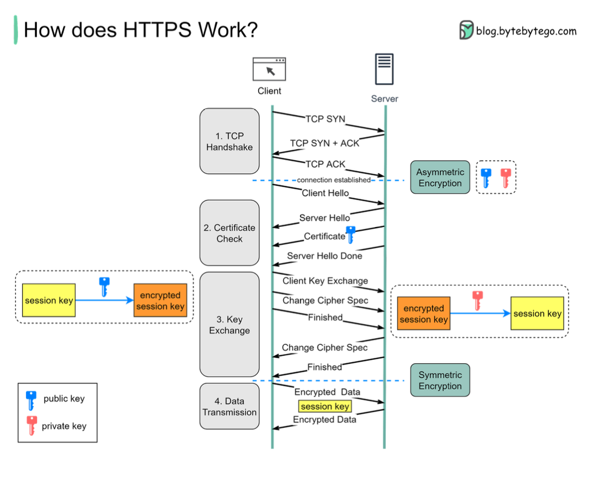

Hey everyone! When you're Browse the web, shopping online, or logging into your bank account, have you ever noticed the little padlock icon next to the website address, or that the URL starts with `https://` instead of just `http://`? That "S" and that padlock are your visual cues that you're on a secure connection, all thanks to **HTTPS (Hypertext Transfer Protocol Secure)**.

In an age where we share so much personal information online, understanding how HTTPS works to protect our data is more important than ever. It's the guardian that ensures your sensitive information – like passwords, credit card numbers, and personal messages – doesn't fall into the wrong hands. Let's demystify the magic behind this essential web security protocol!

## What is HTTPS? The 'S' Stands for Secure!

HTTPS is essentially an extension of the Hypertext Transfer Protocol (HTTP). The crucial difference is that HTTPS transmits encrypted data using a protocol called **Transport Layer Security (TLS)** (or its predecessor, Secure Sockets Layer - SSL). This encryption means that if any data you send or receive is intercepted by a hijacker, all they'll get is unreadable binary code. HTTPS safeguards your data from eavesdroppers and potential breaches.

## The Handshake: How HTTPS Sets Up a Secure Channel

Before any actual data (like your login details or the webpage content) is exchanged securely, your browser (the client) and the website's server need to perform a "handshake." This is a series of steps where they introduce themselves, verify identities, agree on an encryption method, and securely exchange the secret keys needed for that encryption.

Here's a breakdown of the typical TLS handshake process:

### Step 1: The TCP Handshake

First things first, before any secure communication can happen, your browser and the server need to establish a basic communication pathway. This is done via the standard **TCP (Transmission Control Protocol) handshake**. This ensures both sides are ready to talk.

### Step 2: The "Hello" Exchange and Certificate Check

Once the TCP connection is up, the TLS handshake begins:

1. **Client Hello:** Your browser sends a "Client Hello" message to the server. This message contains important information, including the TLS versions it supports and a list of encryption algorithms (cipher suites) it can use.
2. **Server Hello:** The server picks the strongest TLS version and cipher suite that it also supports from the client's list and sends back a "Server Hello" message.
3. **Server Sends its Certificate:** The server then sends its SSL/TLS Certificate to your browser. This digital certificate is like the server's ID card. It contains crucial information such as:
   * The server's **public key**.
   * The domain name(s) it's valid for.
   * Expiration dates.
   * Information about the Certificate Authority (CA) that issued and digitally signed the certificate.
4. **Client Validates the Certificate:** Your browser now meticulously checks this certificate:
   * Is it issued by a trusted Certificate Authority (CA)? Browsers have a built-in list of trusted CAs.
   * Has it expired?
   * Does the domain name on the certificate match the website you're trying to connect to?
   * Can it verify the CA's digital signature?

### Step 3: Key Exchange - Creating the Secret Session Key

If the certificate checks out, the next crucial step is for the client and server to agree on a secret key for this specific session, called the **session key**.

1. **Client Generates Session Key:** Your browser generates a random secret key (the session key).
2. **Client Encrypts Session Key:** It then encrypts this newly generated session key using the server's **public key** (which it got from the server's SSL certificate).
3. **Client Sends Encrypted Key:** The encrypted session key is sent to the server.
4. **Server Decrypts Session Key:** The server receives this encrypted package and uses its **private key** (which only it possesses and corresponds to its public key) to decrypt the session key.

### Step 4: Secure Data Transmission Begins!

Abracadabra! Both your browser and the server now secretly share the same session key. From this point onwards:

* They switch from **asymmetric encryption** (which used the public/private key pair for the session key exchange) to **symmetric encryption** using this shared session key.
* All application data (the actual HTTP requests and responses) exchanged between your browser and the server for the rest of the session is encrypted and decrypted using this unique session key. This creates an encrypted tunnel for data transmission.

## Why the Switch from Asymmetric to Symmetric Encryption?

You might wonder why the handshake uses the slower public/private key (asymmetric) encryption just to exchange a session key, and then switches to symmetric encryption. There are two main reasons:

1. **Performance/Server Resources:** Asymmetric encryption is computationally intensive due to the complex mathematics involved. It's great for securely exchanging a small piece of data like a session key, but it's not suitable for encrypting and decrypting large amounts of data or for long, ongoing communication sessions. Symmetric encryption, on the other hand, is much faster and more efficient for bulk data.
2. **Security for Bi-directional Communication:** While the client uses the server's public key to encrypt the session key and send it securely, using asymmetric encryption continuously for all data could have complexities. For instance, if the server tried to send encrypted data back to the client using only its private key (for signing) and the client's public key (for encryption, if available and exchanged), it's different from how the session key itself is established. The session key, once securely shared, allows for efficient, dedicated two-way encrypted communication where only the client and server know this secret. (Based on interpretation of  regarding the one-way nature of public key encryption for data sent to the public key holder). The established symmetric session key is known only to the client and server for that session.

## Key Takeaways

* HTTPS is HTTP with an added layer of security provided by TLS/SSL encryption.
* The TLS handshake is a critical process where the client and server verify each other (via certificates), agree on encryption methods, and securely generate a shared session key.
* This handshake uses asymmetric encryption (public/private keys) to securely exchange the session key.
* Once the session key is established, all further communication for that session uses faster symmetric encryption with this shared key.
* This entire process ensures your data is confidential (cannot be read by eavesdroppers) and has integrity (cannot be tampered with during transit).

So, the next time you see that padlock icon, you'll know there's a sophisticated cryptographic dance happening behind the scenes to keep your online interactions safe!
