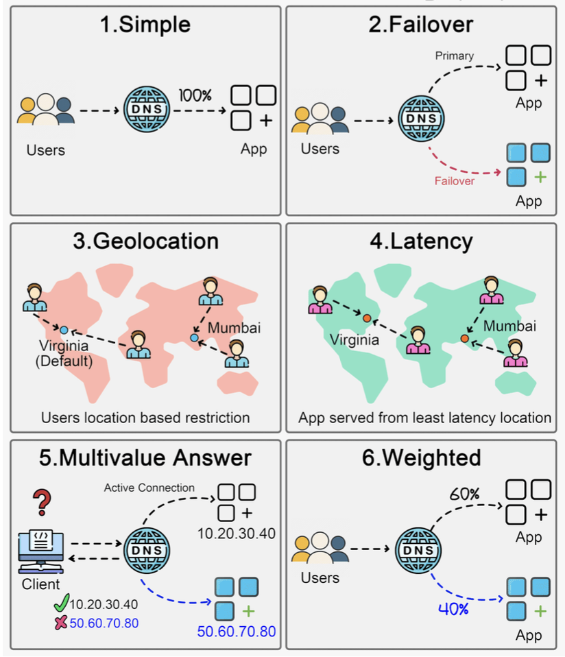

Hey everyone, and welcome back to the blog! When you type a website address into your browser, say from your desk here in Bengaluru to access a global service, how does the internet "know" which specific server to connect you to, especially if that service has multiple servers spread across the world? It's not always a simple one-to-one mapping. Behind the scenes, a set of sophisticated **internet traffic routing policies**, often implemented at the DNS (Domain Name System) level, are working to direct your request efficiently and reliably.

These policies play a crucial role in managing and directing network traffic, aiming to optimize performance for users, ensure high availability of services, provide localized experiences, and manage the load on backend infrastructure. Let's take a look at some of the common DNS routing policies that help orchestrate this complex global dance.

## What are Internet Traffic Routing Policies (DNS Policies)?

At a high level, internet traffic routing policies are rules that determine how user requests are directed to different endpoints (servers, data centers, or other resources) hosting an application or website. In the context of DNS, when your browser asks a DNS resolver "What's the IP address for `www.example.com`?", these policies influence which IP address(es) the DNS resolver ultimately provides.

The goals are manifold:

* **Optimize Performance:** Send users to the server that can respond fastest to them.
* **Ensure High Availability:** Route traffic away from unhealthy or overloaded servers to healthy ones.
* **Provide Localized Experiences:** Direct users to servers that can offer content or services tailored to their geographic region.
* **Manage Load:** Distribute traffic effectively across available resources.

## Exploring Common DNS-Based Routing Policies

Here are six common types of DNS routing policies that cloud providers and DNS services often offer:

### 1. Simple Routing Policy

* **Description:** This is the most basic policy. It directs all traffic for your domain (or a specific subdomain) to a single, specific endpoint, typically by returning a single IP address in response to a DNS query.
* **How it works:** It's a straightforward DNS record (like an A record pointing to an IP address) without any special conditions, health checks, or logic involved in the DNS response.
* **Use Cases:** Ideal for applications hosted on a single server or when you have one primary endpoint you want all users to reach.
* **Pros:** Very easy to configure and understand.
* **Cons:** Offers no fault tolerance if that single endpoint goes down. Doesn't optimize for latency, load distribution, or geographic targeting.

### 2. Failover Routing Policy

* **Description:** This policy is designed to enhance availability. It routes traffic to a primary endpoint but automatically switches to a secondary (backup or standby) endpoint if the primary becomes unavailable or unhealthy.
* **How it works:** Requires configuring health checks on the primary endpoint. If these health checks fail for a defined period, the DNS service will start responding to queries with the IP address of the secondary endpoint.
* **Use Cases:** Critical applications requiring high availability, disaster recovery (DR) setups where you have a standby environment.
* **Pros:** Significantly improves application availability by automatically redirecting users during outages of the primary resource.
* **Cons:** The secondary endpoint might be underutilized (and still incurring costs) most of the time unless it's part of an active-active setup configured with other policies. Failover might involve some delay due to DNS propagation and caching, though low TTLs can mitigate this.

### 3. Geolocation Routing Policy

* **Description:** This policy distributes traffic and directs users to specific endpoints based on the geographic location of the DNS query source. The location is usually inferred from the IP address of the user's DNS resolver, which provides an approximation of the user's actual location.
* **How it works:** You define rules mapping geographic regions (e.g., countries, continents, states) to specific server IP addresses. For example, users querying from India might be routed to a server in Mumbai, while users from Europe are routed to a server in Frankfurt.
* **Use Cases:**
  * Providing localized content (different languages, currencies, or culturally relevant material).
  * Complying with data sovereignty regulations (keeping user data within specific geographic boundaries).
  * Reducing latency by serving users from geographically closer servers.
* **Pros:** Enables personalized and compliant user experiences, can significantly reduce latency for global users.
* **Cons:** Accuracy depends on the geolocation database used for IP addresses. Users employing VPNs or certain corporate DNS setups might be misidentified geographically and routed suboptimally.

### 4. Latency Routing Policy

* **Description:** This policy directs traffic to the endpoint that provides the lowest network latency for the requester, aiming to enhance user experience with faster response times.
* **How it works:** DNS providers that offer latency-based routing typically maintain a network of measurement points and continuously collect latency data between various internet regions and their own server locations (or your configured endpoint regions). When a DNS query arrives, the system determines the user's general network location (from the resolver's IP) and responds with the IP address of the server region that has the best measured latency to that user's region.
* **Use Cases:** Global applications where minimizing response time is paramount for user satisfaction and engagement (e.g., gaming, real-time applications).
* **Pros:** Can significantly improve application responsiveness for a globally distributed user base.
* **Cons:** Latency conditions on the internet are dynamic. The effectiveness relies on the DNS provider having accurate, comprehensive, and up-to-date latency measurements.

### 5. Multivalue Answer Routing Policy

* **Description:** This policy allows you to configure DNS to respond to queries with multiple IP addresses (e.g., up to eight healthy records) for a single domain or resource.
* **How it works:** When a client (like a web browser) receives multiple IP addresses from a DNS query, it typically selects one at random (or based on its own internal logic) to connect to. Health checks can often be associated with each IP address, so only healthy endpoints are returned in the DNS response.
* **Use Cases:** Simple client-side load balancing, improving availability by providing multiple alternative endpoints.
* **Important Note:** Multivalue answer routing should **not be considered a replacement for a proper server-side load balancer**. It relies on client behavior, doesn't offer sophisticated load distribution algorithms, and lacks features like session persistence.
* **Pros:** Provides a simple way to distribute some load across multiple endpoints. Can improve resilience if health checks are used and some endpoints become unhealthy.
* **Cons:** Load distribution is client-dependent and often random, so it might not be perfectly even. Lacks advanced load balancing features.

### 6. Weighted Routing Policy

* **Description:** This policy allows you to distribute traffic across multiple endpoints based on weights that you assign to each endpoint. You can specify what proportion of your traffic goes to each resource.
* **How it works:** For example, you could configure a policy to send 80% of traffic to version A of your application and 20% to version B (a new version). The DNS server will then return IP addresses in that proportion over a period.
* **Use Cases:**
  * **A/B testing:** Routing a small percentage of users to a new feature or design.
  * **Canary releases / Blue-Green deployments:** Gradually shifting traffic from an old version to a new version of your application.
  * **Distributing load based on differing server capacities:** Sending more traffic to more powerful servers.
* **Pros:** Provides fine-grained control over traffic distribution. Excellent for phased rollouts, testing new versions with limited exposure, and managing capacity.
* **Cons:** Requires careful planning and monitoring of the weights and the performance of each weighted endpoint.

## Choosing the Right Policy (It's All About Context!)

There's no single "best" routing policy. The optimal choice, or combination of choices, depends heavily on your specific application requirements:

* **Availability needs:** How critical is uptime? (Failover, Multivalue).
* **Global user base:** Do you need to optimize for users in different geographic locations? (Geolocation, Latency).
* **Performance goals:** Is minimizing latency the top priority? (Latency, Geolocation).
* **Testing and deployment strategies:** Are you doing A/B testing or canary releases? (Weighted).
* **Cost and complexity:** Simpler policies are easier to manage.

Often, sophisticated global applications use a combination of these policies. For example, you might use Geolocation routing to send users to the nearest regional cluster, and then within that cluster, use Latency routing or Weighted routing combined with load balancers.

## Key Takeaways

* Internet traffic routing policies, often implemented at the DNS level, are powerful tools for managing how users connect to your application's endpoints.
* Common policies like Simple, Failover, Geolocation, Latency, Multivalue Answer, and Weighted Routing each offer different benefits and trade-offs.
* Understanding these policies allows architects to design systems that are more resilient, performant, and tailored to user needs.
* The choice of policy depends on specific application requirements, including availability, performance targets, and global reach.

These routing strategies are essential cogs in the massive machine that is the internet, helping to ensure that data flows smoothly and efficiently to users around the world.
