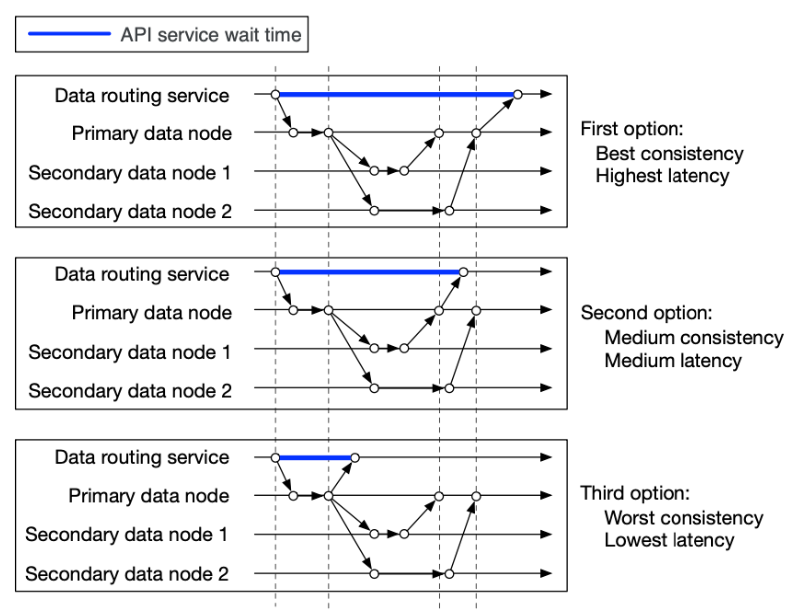

Hey everyone, and welcome back to the blog! If you've ever designed or worked with distributed systems, you've inevitably wrestled with critical, often conflicting, goals: ensuring **low latency** (quick responses), maintaining **strong consistency** (everyone sees the same data), and handling network failures (partition tolerance). It's like trying to have a cake that's both incredibly rich, surprisingly light, and can also survive a bumpy ride – achieving all perfectly at the same time is a real challenge!

In my journey as a system designer, I've found that understanding and navigating the trade-off between how quickly a system responds, how up-to-date and uniform its data is, and how it behaves when parts of the network fail, is one of the most fundamental and fascinating aspects of our craft. There's rarely a perfect answer, only the best compromise for a given situation.

## Defining Our Terms: What are Latency and Consistency?

Before we dive into the dance, let's make sure we're on the same page with these terms:

* **Latency:** Simply put, latency is the delay before a transfer of data begins following an instruction for its transfer. In user-facing applications, this translates to how long a user has to wait for a response after taking an action. Low latency is crucial for a good user experience. As Amazon famously found, "every 100ms of latency cost them 1% in sales"  – a powerful reminder of its impact!

* **Consistency (in Distributed Systems):** This refers to the guarantee that all clients or nodes in a distributed system see the same data at the same time, no matter which node they connect to. However, consistency comes in different flavors:
    * **Strong Consistency:** This is the ideal state where every read operation receives the most recent write or an error. Data updates are immediately reflected and visible to all subsequent accesses.
    * **Eventual Consistency:** This model guarantees that, if no new updates are made to a given data item, all accesses to that item will *eventually* return the last updated value. Updates are propagated through the system, and replicas might be temporarily inconsistent, but they will converge over time. The BASE (Basically Available, Soft state, Eventual consistency) principle, often associated with NoSQL databases, leans into this, choosing availability and accepting that states will eventually be consistent.

## The Inevitable Trade-off: Introducing the CAP Theorem

In a distributed system, ensuring that every node has the absolute latest piece of data (strong consistency) often requires coordination. This coordination – making sure all nodes agree on the data before an operation is considered complete – takes time, thereby increasing latency. Conversely, if you want to respond to a user as quickly as possible (low latency), you might have to serve them data that isn't guaranteed to be the absolute latest version across all parts of your system.

This tension is famously formalized by the **CAP Theorem**. The CAP theorem states that any distributed data store can only provide **two** of the following three guarantees simultaneously:

1.  **Consistency (C):** Every read receives the most recent write or an error. (Note: This definition of consistency in CAP is specifically about linearizability or a strong form of consistency).
2.  **Availability (A):** Every request receives a (non-error) response – without the guarantee that it contains the most recent write.
3.  **Partition Tolerance (P):** The system continues to operate (responds to requests) despite an arbitrary number of messages being dropped (or delayed) by the network between nodes (i.e., a network partition).

**Why Partition Tolerance is Usually Non-Negotiable:**
Network faults (partitions) are a fact of life in distributed systems; they are guaranteed to happen. Therefore, for any practical distributed system, partition tolerance (P) is a must. This means that during a network partition, a system must choose between being:
* **CP (Consistent and Partition Tolerant):** The system will remain consistent even during a partition. To achieve this, it might have to sacrifice availability (e.g., by returning errors or not responding to requests that cannot be guaranteed to be consistent).
* **AP (Available and Partition Tolerant):** The system will remain available even during a partition. To achieve this, it might have to sacrifice strong consistency (e.g., different nodes might return different versions of the data).

It's worth noting that the CAP theorem has been criticized for being too narrow or sometimes oversimplified for modern distributed systems, as "availability" and "consistency" can be nuanced. Martin Kleppmann, for example, wrote an article titled "Please stop calling databases CP or AP" suggesting a more nuanced view. However, CAP still provides a valuable framework for understanding fundamental trade-offs.

## Illustrating the Latency-Consistency Dance: A Data Replication Example

Let's consider a common scenario in distributed systems: data replication, where data written to a primary node is copied to one or more secondary (replica) nodes for durability and read scalability. The trade-off between latency and consistency becomes very clear here, as illustrated in the figure.

Imagine an API service writing data to a primary data node, which then replicates to two secondary nodes. When is the write operation considered "successful" from the client's perspective?

* **Scenario 1: Prioritizing Strong Consistency (Resulting in Higher Latency)**
    * The API service considers the data successfully saved only after *all three nodes* (the primary and both secondary replicas) acknowledge that they have stored the data.
    * **Outcome:** This provides the best consistency because any subsequent read from any node will see the latest data. However, the API service (and thus the client) has to wait for acknowledgments from all three nodes, leading to the highest latency for the write operation.

* **Scenario 2: A Balanced Approach (Medium Consistency, Medium Latency)**
    * The API service considers the data successfully saved after the *primary node and at least one of the secondary replicas* have stored the data.
    * **Outcome:** This offers medium consistency; one secondary replica might temporarily lag behind. The latency is also medium, as it waits for fewer acknowledgments than in the first scenario. This is a form of eventual consistency.

* **Scenario 3: Prioritizing Low Latency (Resulting in Weaker/Eventual Consistency)**
    * The API service considers the data successfully saved as soon as *only the primary node* has persisted the data.
    * **Outcome:** This offers the lowest latency for the write operation from the client's perspective, as the API service can respond quickly. However, it provides the "worst" (or weakest) consistency because if a client immediately tries to read from a secondary replica, it might get stale data until the replication catches up. This is also a form of eventual consistency.

## Why This Matters: My Personal Take on Real-World Implications

Understanding this trade-off isn't just an academic exercise; it has profound implications for system design. I've seen firsthand how different applications, make different choices based on their core requirements:

* **Banking and Financial Systems:** These almost always demand strong consistency. You can't afford for a user to see an incorrect account balance or for a transaction to be partially applied. A little extra latency is usually acceptable to ensure data integrity.
* **Social Media Feeds or E-commerce Product Views:** For these, eventual consistency is often perfectly fine. If a new "like" or a comment takes a few seconds (or even a bit longer in some cases) to appear for all users globally, it's usually not a critical issue. Prioritizing availability and low latency for a smooth user experience often takes precedence.
* **Inventory Management:** This is a tricky one! Showing a customer an item is in stock when it just sold out (due to eventual consistency) leads to a bad experience. This might require stronger consistency for the "checkout" part of the inventory update, even if Browse relies on slightly delayed replicas.

In my experience, there's rarely a one-size-fits-all "right" answer. The key is to consciously evaluate the needs of your specific use case and make an informed decision about where on the latency-consistency spectrum your system needs to lie.

## Strategies to Mitigate (Not Eliminate) the Pain

While the trade-off is fundamental, engineers have developed various strategies to help manage it:

* **Caching:** Can dramatically reduce read latency by serving data from a fast, local cache. However, this introduces its own set of challenges around cache consistency and invalidation.
* **Asynchronous Processing:** For operations that don't require immediate feedback to the user (like sending a notification email after an order), offloading them to background processes can improve the perceived latency of the primary user interaction.
* **Tunable Consistency Levels:** Many modern distributed databases offer tunable consistency levels, allowing developers to choose the right balance per operation or per data type.
* **Optimistic Concurrency Control:** Allows operations to proceed and then checks for conflicts, which can sometimes offer better performance than pessimistic locking in low-contention scenarios.

## Key Takeaways

* Latency (speed of response) and Consistency (data uniformity) are two critical but often competing goals in distributed system design.
* The CAP Theorem provides a framework for understanding these trade-offs, stating that a distributed system must often choose between strong consistency and high availability when faced with network partitions.
* The way data replication is handled (e.g., how many replicas must acknowledge a write) directly illustrates the latency-consistency trade-off.
* The "right" balance depends entirely on the specific requirements of your application – from banking systems needing strong consistency to social media feeds tolerating eventual consistency.

Making deliberate, informed choices about this fundamental trade-off is a hallmark of good system design. It requires a deep understanding of your application's needs and the behavior of the underlying technologies.
