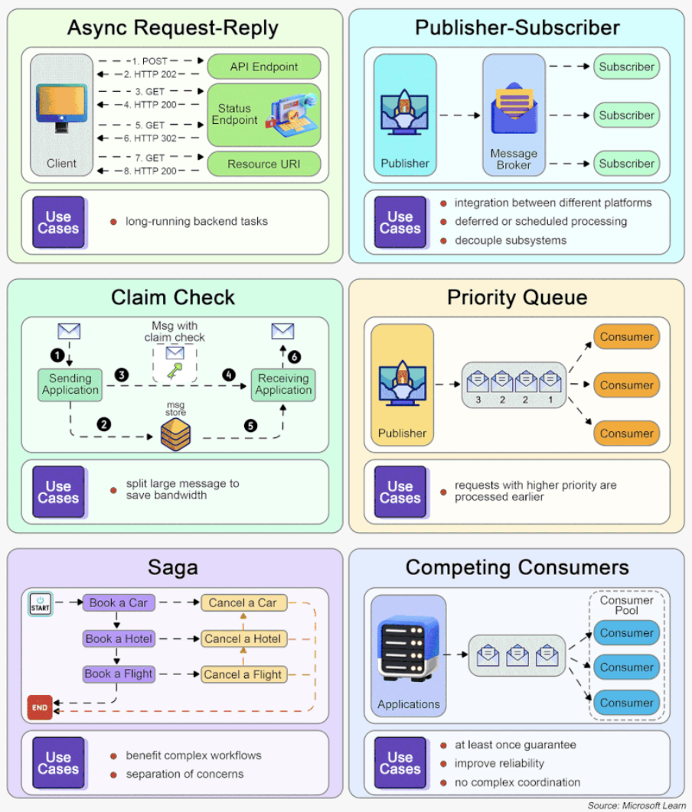

Hey everyone, and welcome back to the blog! In the complex world of modern distributed systems, especially in fast-paced tech environments, making sure different software components can communicate reliably and efficiently without stepping on each other's toes is a massive challenge. How do you send a notification without slowing down your main application? How do you process a surge of orders without overwhelming your backend? The answer, very often, lies in **Message Queues**.

These are the unsung heroes that act like highly organized digital post offices or sophisticated relay race tracks for data. They enable asynchronous communication, decouple services, and provide the resilience needed to build robust, scalable applications. Today, let's take a deep dive into message queue architectures, their evolution, core concepts, crucial delivery semantics, and common patterns that leverage them.

## What are Message Queues and Why Do We Need Them? The Unsung Heroes of Decoupling

A **Message Queue** is a form of asynchronous service-to-service communication used in serverless and microservices architectures. Messages are stored on the queue until they are processed and deleted. Each message is processed only once, by a single consumer. Message queues can be used to decouple heavyweight processing, to buffer or batch work, and to smooth spiky workloads. Think of it like a post office: it helps computer programs communicate in an organized manner.

### Key Benefits of Using Message Queues:

Message brokers (which implement message queues) offer several compelling advantages for system design:

* **Decoupling:** This is perhaps the most significant benefit. Message queues decouple **Producers** (applications sending messages) from **Consumers** (applications receiving messages). Producers don't need to know where the consumers are, if they are currently available, or how they process the message. This promotes independent development, deployment, and scaling of different system components. It also makes maintenance and troubleshooting easier because components are less intertwined.
* **Asynchronous Communication:** Message queues enable asynchronous communication. A producer can send a message to the queue and immediately continue with other tasks without waiting for the consumer to process it or even acknowledge receipt. This improves system efficiency and responsiveness, especially for long-running tasks.
* **Buffering & Persistence (Reliability):** Queues act as buffers, holding messages until consumers are ready to process them. This helps to smooth out spiky workloads or handle situations where producers generate messages faster than consumers can process them. Many message queues also offer **message persistence** (storing messages on disk), ensuring that messages are not lost even if a consumer or the broker itself experiences a failure.
* **Scalability:** Message queues can manage a high volume of messages and are often designed to scale horizontally by adding more broker instances. Consumers can also be scaled independently to match the message processing load.
* **Load Leveling/Smoothing:** By temporarily storing messages during peak loads, queues allow backend services to process them at a more consistent and sustainable pace, preventing them from being overwhelmed.

## Core Concepts in Message Queue Architectures

While implementations vary, some core concepts are common:

* **Message:** The actual unit of data that is transmitted through the queue. It often contains a payload (the data itself) and headers (metadata about the message).
* **Producer (or Publisher):** The application component that creates and sends messages to a queue or a topic on the message broker.
* **Consumer (or Subscriber):** The application component that connects to the queue or topic, retrieves messages, and processes them.
* **Broker:** The message queue software (the "post office") that manages the receipt, storage, routing, and delivery of messages.
* **Queue (Point-to-Point):** In this model, messages are typically delivered from the queue to *one* consumer from a pool of available consumers. Each message is usually processed by only a single consumer.
* **Topic (Publish-Subscribe or Pub/Sub):** In this model, messages are published to a "topic." Multiple consumers can subscribe to a topic, and *each* subscriber receives a copy of every message published to that topic. This is excellent for broadcasting information.
* **Exchange (e.g., in RabbitMQ):** A component that receives messages from producers and is responsible for routing them to the appropriate queues based on predefined rules, routing keys, and the exchange type (e.g., direct, topic, fanout).

## Guaranteed Delivery? Understanding Message Delivery Semantics

A critical aspect of message queue architecture is the guarantee provided for message delivery. There are three main semantics:

* **At-Most-Once:**
    * As the name suggests, a message will be delivered not more than once.
    * This means messages may be lost under certain failure conditions but are never redelivered.
    * **Use Cases:** Suitable for scenarios where occasional message loss is acceptable, such as collecting monitoring metrics or non-critical logging, where losing a few data points doesn't break the system.

* **At-Least-Once:**
    * With this semantic, it's acceptable to deliver a message more than once, but the guarantee is that **no message should be lost**.
    * While messages won't be lost, the same message might be delivered multiple times to a consumer (e.g., if an acknowledgment fails and the message is redelivered).
    * **Use Cases:** Good for many scenarios where data duplication is not a major issue, or where the consumer can handle duplicates (idempotent processing). For example, if each message has a unique key, the consumer can reject duplicate data when writing to a database.

* **Exactly-Once:**
    * This is the most desirable and often the most difficult delivery semantic to implement effectively. It guarantees that each message is delivered and processed precisely once.
    * It's very user-friendly in terms of data correctness but often comes with a higher cost in terms of system performance and complexity.
    * **Use Cases:** Crucial for financial-related applications (like payments, trading, accounting) where message duplication is not acceptable and downstream services or third parties might not support idempotent operations.

## The Evolution of Message Queue Architectures: From MQ to Streaming Platforms

Message queue technology has evolved significantly:

* **IBM MQ (formerly MQSeries, established 1993):**
    * One of the pioneers in commercial messaging middleware, IBM MQ became a very successful product widely used in the financial sector and other enterprises requiring robust, reliable messaging.

* **RabbitMQ (AMQP-based):**
    * RabbitMQ's architecture, while also a mature message broker, introduced concepts often seen as more flexible than traditional MQ systems, with some similarities to Kafka's topic-based ideas.
    * Producers publish messages to an **exchange**, which then routes them to bound queues based on the exchange type (e.g., direct, topic, fanout) and routing keys. Consumers then receive messages from these queues.

* **Apache Kafka (established 2011):**
    * Originally developed at LinkedIn and later open-sourced, Kafka revolutionized the space by positioning itself as a **distributed event streaming platform**.
    * It's highly optimized for write throughput and low-latency handling of real-time data feeds. Kafka uses a distributed, partitioned, append-only **event log** (called a topic, split into partitions) to enable high-volume event streaming.
    * Key components include Producers, Brokers (forming a cluster), Topics (with Partitions), and Consumers (often in consumer groups). Its design emphasizes simplicity, fault tolerance (through replication of partitions), and scalability, allowing it to often replace older message queue technologies in high-data-volume scenarios. Kafka typically retains messages until a configured expiration time and allows consumers to pull messages at their own pace.

* **Apache Pulsar (originally from Yahoo):**
    * Pulsar is designed as an all-in-one messaging and streaming platform, often seen as a modern alternative to Kafka.
    * It boasts a more cloud-native architecture, offering potentially better support for features like cluster scaling, multi-tenancy, and partition migration compared to early Kafka versions.
    * A key architectural differentiator is its **two-layer design**: a stateless **serving layer** composed of brokers that handle message routing and a stateful **persistent layer** (typically Apache BookKeeper) that handles message storage.
    * Pulsar natively supports **tiered storage**, allowing older messages to be offloaded to cheaper object storage systems (like AWS S3) for long-term retention without impacting the performance of real-time data.

## Common Messaging Patterns

Message queues are foundational to many distributed system design patterns:

* **Asynchronous Request-Reply:** For long-running backend tasks, this pattern decouples the frontend client from the backend processing. The client makes a synchronous call to an API, which triggers an asynchronous task via a message queue and quickly returns an HTTP 202 (Accepted) status. The client can later poll for results or receive a callback.
* **Publisher-Subscriber (Pub-Sub):** This pattern strongly decouples message senders (publishers) from message receivers (subscribers) through an intermediary broker or topic. Publishers don't need to know who the subscribers are, and subscribers receive messages they are interested in without knowing the publishers.
* **Claim Check:** When dealing with very large messages, instead of putting the entire payload onto the queue (which can strain the broker), the payload is stored in an external data store (like S3 or a database). Only a reference (the "claim check") to this payload is sent through the message queue. The consumer uses this claim check to retrieve the full payload.
* **Priority Queue:** This pattern allows messages to be processed based on their priority. Requests with a higher priority are received and processed by consumers more quickly than those with a lower priority.
* **Saga Pattern:** Used to manage data consistency across multiple services in distributed transactions, especially in microservices where each service owns its database. It involves a sequence of local transactions, with compensating transactions to undo work if a step fails. Messages queues often coordinate the steps in a saga.
* **Competing Consumers:** This pattern enables multiple instances of a consumer to process messages from the same queue concurrently. This improves throughput and processing speed. However, it typically does not guarantee message ordering across different consumers processing from the same queue.

## Key Takeaways

* Message Queue architectures are essential for building modern, scalable, and resilient distributed systems by enabling asynchronous communication and decoupling services.
* Core benefits include improved system responsiveness, fault tolerance through buffering and persistence, and independent scaling of producers and consumers.
* Understanding message delivery semantics (at-most-once, at-least-once, exactly-once) is crucial for ensuring the desired level of reliability for your application.
* The technology has evolved significantly, from traditional message brokers like IBM MQ and RabbitMQ to powerful event streaming platforms like Apache Kafka and Apache Pulsar, each with unique architectural strengths.
* Message queues are fundamental to implementing various powerful messaging patterns like Pub-Sub, Saga, and Competing Consumers.

Whether you're designing a system to handle e-commerce orders, process real-time analytics, or coordinate microservices, message queues are likely to be a critical part of your architectural toolkit.
