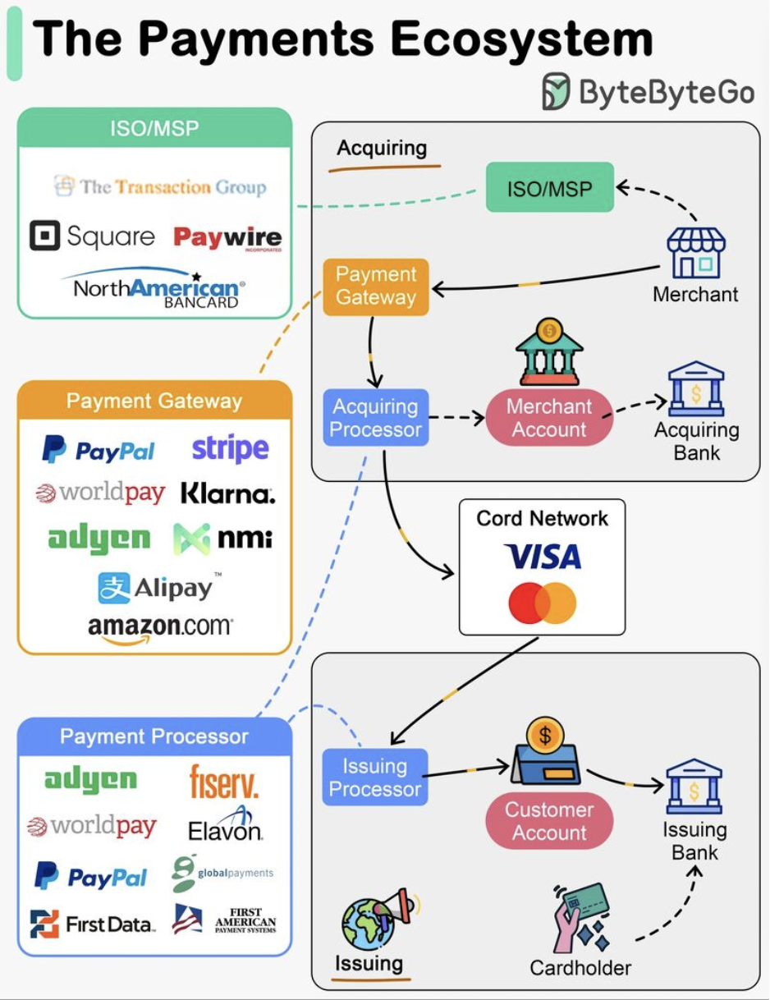

Hey everyone! Ever wondered what happens in those few seconds after you tap your card, swipe it at a terminal, or click "Buy Now" online? It seems instantaneous, but behind that seamless experience lies a complex network of players and processes known as the **Payment Ecosystem**. This intricate dance ensures that money moves from the buyer to the seller securely and efficiently.

Understanding this ecosystem isn't just for finance gurus; it's crucial for anyone building e-commerce platforms, fintech solutions, or any system that involves transactions. Knowing the roles and the flow can help in designing more resilient, secure, and innovative payment systems. So, let's pull back the curtain!

## The Core Participants in the Payment Dance

Several key players collaborate to make a payment transaction happen. Think of them as the cast of characters in this financial play:

* **Cardholder:** That's you and me! The individual making a purchase using a credit or debit card issued by their bank.
* **Merchant:** The business, big or small, selling goods or services and accepting card payments.
* **Issuing Bank (Issuer):** The cardholder's bank. This institution issues the credit or debit card to the cardholder and is ultimately responsible for paying the merchant (via the acquirer) for the transaction. They validate and operate the customer's account.
* **Acquiring Bank (Acquirer):** The merchant's bank. It contracts with merchants to accept and process card payments. The acquirer often provides the Point of Sale (POS) terminal or integrates with online payment gateways. It also manages the merchant's account during the settlement process.
* **Card Network (Card Scheme):** These are the big names like Visa, Mastercard, American Express, RuPay, etc. They act as the communication highway, facilitating the transaction between the issuing bank and the acquiring bank. They establish the rules and technical standards for payments and perform the crucial step of clearing transactions.
* **Payment Processor:** These are specialized companies that handle the technical aspects of processing transactions. They work with acquirers (and sometimes directly with large merchants) to route transaction data, ensure security, and manage communication with the card networks. The acquiring processor is responsible for sending transactions to the card network.
* **Payment Gateway:** For online transactions, the payment gateway is the digital equivalent of a POS terminal. It securely captures payment details from the merchant's website or app and transmits them to the payment processor or acquirer.
* **Independent Sales Organization (ISO) / Member Service Provider (MSP):** These are third-party companies that partner with acquiring banks to sign up merchants for card processing services.

## The Journey of a Single Transaction: Two Key Flows

A typical card transaction involves two main stages: Authorization and Clearing & Settlement.

### 1. Authorization: The "Is This Okay?" Check

This happens in near real-time when you use your card:

1.  **Initiation:** The cardholder presents their card (physically or virtually) to the merchant to make a purchase.
2.  **To the Acquirer:** The merchant's POS terminal or e-commerce payment gateway captures the card details and transaction amount and sends an authorization request to their acquiring bank or payment processor.
3.  **To the Card Network:** The acquirer/processor forwards this request to the respective card network (e.g., Visa).
4.  **To the Issuer:** The card network routes the request to the cardholder's issuing bank.
5.  **Issuer's Decision:** The issuing bank checks various things: Does the cardholder have sufficient funds/credit? Is the card valid? Are there any fraud flags? Based on this, it approves or declines the transaction and typically places a hold (freezes) on the transaction amount in the cardholder's account if approved.
6.  **Response Back:** The issuer's decision (approval or denial) travels back through the card network to the acquirer, and finally to the merchant's POS/gateway, which then informs the cardholder. This whole process usually takes just a few seconds!

### 2. Clearing and Settlement: The Actual Money Movement

Authorization confirms the transaction, but no money has actually moved between banks yet. That happens during clearing and settlement, typically done in batches.

1.  **Merchant Batch:** At the end of the day (or another set period), the merchant "captures" all authorized transactions, creating a batch file.
2.  **Acquirer Submission:** The merchant sends this batch to their acquiring bank/processor.
3.  **Card Network Clearing:** The acquirer submits the batch file to the card network. The card network performs **clearing**, a process where it aggregates transactions from all its acquirers, nets out mutual obligations between issuing and acquiring banks, and determines the net amounts owed. It then sends clearing files to the respective issuing banks.
4.  **Issuer Confirmation & Settlement:** Issuing banks review the clearing files. Then, the actual transfer of funds happens. This **settlement** often involves settlement banks (like central banks) where issuing banks transfer the net amounts to the acquiring banks' accounts.
5.  **Merchant Funding:** Once the acquiring bank receives the funds, it credits the merchant's bank account for the transactions, minus any agreed-upon fees (like the merchant discount fee ).

It's important to note the **separation of the information flow (authorization, clearing details) and the fund flow (actual money movement)**. The information might make it seem like money moves instantly, but the actual settlement between banks is usually a batched, end-of-day (or multi-day) process.

## Why Does Understanding This Ecosystem Matter?

* **Spotting Fintech Opportunities:** Knowing the players and processes helps identify gaps and areas for innovation within the payment landscape. Many fintech startups thrive by improving specific parts of this chain.
* **Building Resilient Systems:** When designing payment gateways or services, understanding the dependencies and potential points of failure (e.g., timeouts, retries for external PSP calls ) is crucial for building robust systems.
* **Ensuring Security:** Each step in the payment process has security implications. Knowledge of the ecosystem helps in implementing appropriate security measures, such as tokenization, encryption, and fraud detection.
* **Understanding Costs:** Fees like interchange fees (set by card networks) and merchant discount fees (set by acquirers) are integral to the ecosystem's economics.

## Key Takeaways

* The payment ecosystem is a collaborative network involving cardholders, merchants, issuing banks, acquiring banks, card networks, payment processors, and payment gateways.
* A card transaction typically involves two main phases: a real-time **Authorization** flow and a batched **Clearing and Settlement** flow.
* Card networks (like Visa and Mastercard) are central to routing transactions and establishing the rules of engagement.
* There's a distinction between the information flow (data about the transaction) and the fund flow (the actual movement of money between banks).
* Understanding this ecosystem is vital for innovation, security, and building reliable payment-related applications.
