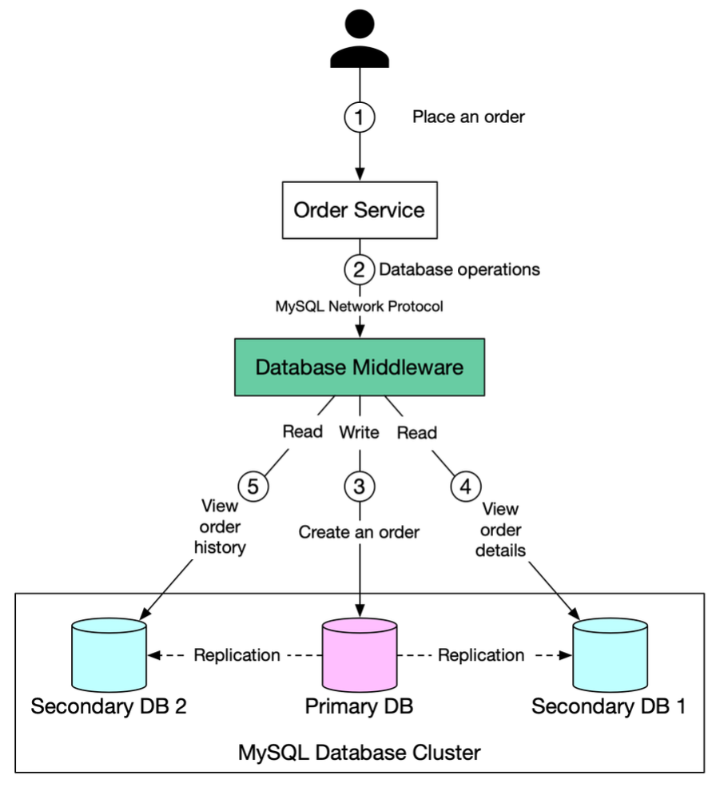

Hey everyone, and welcome back to the blog! As applications grow and attract more users, the database often becomes a critical performance bottleneck, especially when handling a large volume of read requests. How do you ensure your application remains responsive without overwhelming your primary database? A very common and effective solution is the **Read Replica Pattern**.

This simple yet powerful database design pattern is a go-to for scaling out read-heavy workloads. Today, let's explore what read replicas are, the different ways to implement this pattern, its benefits, and the crucial challenge of replication lag.

## What is the Read Replica Pattern?

The Read Replica pattern is a database setup where:
* All data-modifying commands—such as `INSERT`, `UPDATE`, or `DELETE`—are directed to a **primary** (often called master) database instance.
* Read operations (queries using `SELECT`) are offloaded to one or more **secondary** database instances, known as **read replicas** (or slaves).

Data is continuously replicated from the primary database to its read replicas, usually in an asynchronous manner. The primary goal is to significantly improve read performance, reduce the load on the primary database (allowing it to focus on writes), and enhance availability for read operations.

## Implementing the Read Replica Pattern: Two Main Approaches

There are generally two common ways to implement the read replica pattern and direct traffic accordingly:

### Approach 1: Application-Level Routing Logic

In this approach, your application code itself contains the intelligence to decide whether a database query should go to the primary database or to a read replica.

* **How it Works:**
    * **Writes:** When a user performs an action that modifies data (e.g., Alice places an order on an e-commerce site), the application's Order Service sends the `INSERT` (or `UPDATE`/`DELETE`) query directly to the primary database.
    * **Replication:** The primary database then replicates this new data to its connected read replicas.
    * **Reads:** When a user requests data (e.g., Alice views her order details or recent order history), the Order Service routes the `SELECT` query to one of the available read replicas.

* **The Big Challenge: Replication Lag**
    This is a major consideration with application-level routing and asynchronous replication. **Replication lag** occurs when the data on the read replicas is not yet up-to-date with the data on the primary. Under certain circumstances, such as network delays, high write volume on the primary, or heavy load on the replicas, this lag can be anywhere from milliseconds to seconds, or even minutes in severe cases.

    * **The Problem it Causes:** Imagine Alice places an order. Her write request goes to the primary. If she immediately tries to view her order status, and that read query hits a replica that hasn't yet received the new order data due to replication lag, she might not see her order at all! This can lead to a confusing and frustrating user experience. This scenario highlights the need for **"read-after-write" consistency** in certain situations.

* **Solutions to Mitigate Replication Lag Issues:**
    1.  **Route Latency-Sensitive Reads to Primary:** For reads where up-to-the-minute accuracy is critical, direct those queries to the primary database.
    2.  **Read Your Own Writes from Primary:** A common strategy is to ensure that reads immediately following a user's own writes are routed to the primary database. This way, users always see the changes they just made.
    3.  **Check Replica Sync Status:** Many relational database systems provide a way to check if a replica is caught up with the primary (e.g., by examining replication log positions). If the replica is up-to-date, query the replica; otherwise, you might choose to fail the read request, read from the primary, or implement a short wait and retry.

### Approach 2: Using Database Middleware

An alternative to embedding routing logic in every application service is to use a dedicated database middleware layer.

* **How it Works:**
    * The database middleware sits between your application services (like the Order Service) and your database cluster (primary + replicas).
    * The application sends all its database queries to this middleware, which then provides transparent routing to the appropriate database instance.
    * **Customizable Routing Logic:** This middleware can be configured with sophisticated rules to route queries. For example, it can automatically send all `SELECT` statements to read replicas and all `INSERT`, `UPDATE`, `DELETE` statements to the primary. It can also route based on the user, the database schema being accessed, or even specific SQL statement patterns.
* **Example Flow (e.g., e-commerce order service with middleware):**
    1.  Alice places an order; the application's Order Service sends the database query (e.g., an `INSERT` statement) to the database middleware.
    2.  The middleware intelligently routes this write operation to the primary database. The primary database then replicates the data to its replicas.
    3.  Later, Alice views her order details (a read operation). The Order Service sends the `SELECT` query to the middleware, which, based on its rules, routes it to an available read replica.
* The database middleware typically acts as a proxy and often communicates using standard database network protocols (e.g., the MySQL network protocol). This means any MySQL-compatible client can connect to the middleware easily.
* **Pros of Using Middleware:**
    * **Simplified Application Code:** The application doesn't need to be aware of the underlying database topology (which server is primary, which are replicas) or manage the complex routing logic itself. This makes the application code cleaner and easier to maintain.
    * **Better Compatibility & Easier Migration:** Since the middleware uses standard database protocols, different clients and even different application services can connect consistently. This can also simplify database migrations or changes to the replica setup.
* **Cons of Using Middleware:**
    * **Increased System Complexity:** The database middleware is itself a complex distributed system. It needs to be carefully configured, managed, monitored, and made highly available to avoid becoming a new single point of failure.
    * **Additional Network Latency:** Introducing an extra layer between the application and the database inevitably adds some network latency. Therefore, the middleware needs to be extremely performant.

## Why Use Read Replicas? The Benefits Summarized

Regardless of the implementation approach, the read replica pattern offers significant advantages:

* **Improved Read Scalability:** Distributes the read load across multiple servers, dramatically increasing the number of read queries your system can handle.
* **Reduced Load on Primary:** Frees up the primary database to focus its resources on handling write operations efficiently.
* **Enhanced Availability for Reads:** If one read replica fails, other replicas (or the primary) can still serve read requests, improving the overall availability of your application for read-heavy tasks.
* **Simpler than Sharding (for some scenarios):** For read-heavy workloads where the dataset can still be managed by a single primary writer, read replicas are often a much simpler and easier-to-maintain scaling solution compared to the complexities of database sharding.

## Key Takeaways

* The Read Replica pattern is a powerful and widely used technique for scaling database read operations by directing reads to replica databases and writes to a primary database.
* Implementations can either embed routing logic within the application or use a dedicated database middleware for transparent routing.
* **Replication lag** is a critical challenge to address, especially when application-level routing is used, as it can lead to stale data reads. Solutions involve routing critical reads to the primary or checking replica sync status.
* Database middleware can simplify application code but adds another layer of complexity and potential latency to the system.

Choosing to use read replicas, and how to implement them, depends on your application's specific read/write patterns, consistency requirements, and tolerance for complexity.
