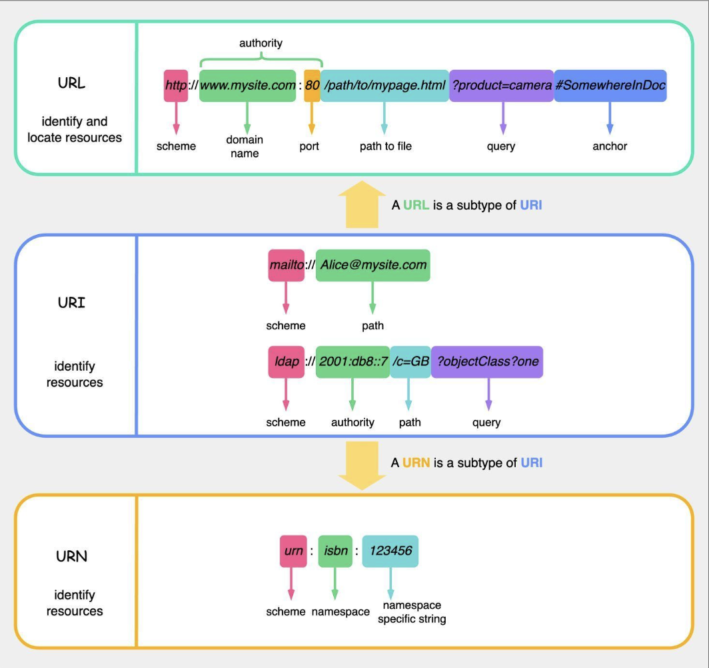

Hey everyone, and welcome back to the blog! Every single day, whether we're Browse in bustling Bengaluru or anywhere else in the world, we interact with URLs – those familiar strings starting with `http://` or `https://` that take us to our favorite websites. But have you ever encountered the terms URI or URN and wondered how they fit into the picture? It's easy to get them confused, but they each have a distinct role in the grand architecture of the web.

Today, let's demystify these fundamental web identifiers. Understanding the nuances between URI, URL, and URN isn't just academic; it helps us appreciate the precision involved in how resources are named and located on the internet.

## The Big Umbrella: URI (Uniform Resource Identifier)

Let's start with the broadest term: **URI**.

* A URI, or **Uniform Resource Identifier**, is a compact string of characters used to identify a name or a resource on the internet. Think of it as a generic term for any type of name or address that refers to something on the web, be it a webpage, an image, a book, or even an abstract concept.
* Crucially, **both URLs and URNs are specific types (subtypes) of URIs**. So, every URL is a URI, and every URN is a URI.
* The general syntax for a URI often looks like this:
  `scheme:[//authority]path[?query][#fragment]`
  * **Scheme:** The first part of the URI, defining the protocol or system being used (e.g., `http`, `https`, `ftp`, `mailto`, `file`, `urn`).
  * **Authority (Optional):** Typically includes user information (rarely used now), a host (domain name or IP address), and an optional port number. Preceded by `//`.
  * **Path:** Identifies the specific resource within the scope of the scheme and authority.
  * **Query (Optional):** Starts with a `?` and contains a string of attribute-value pairs (parameters) providing additional information to the resource.
  * **Fragment (Optional):** Starts with a `#` and identifies a secondary resource or a specific part within the primary resource (e.g., a section on a webpage).

## The Web Address: URL (Uniform Resource Locator)

This is the one we're most familiar with!

* A **URL**, or **Uniform Resource Locator**, is a specific type of URI that not only identifies a resource but also specifies *how to locate that resource* and the mechanism for retrieving it (its network address). It's the address of a unique resource on the web.
* URLs are a key concept of HTTP (Hypertext Transfer Protocol)  but can also be used with other protocols like FTP (File Transfer Protocol) and JDBC (Java Database Connectivity).
* A URL is a subtype of URI.

### Detailed Breakdown of URL Components

Let's break down a common URL structure, for example: `http://www.mysite.com:80/path/to/mypage.html?product=camera#SomewhereinDoc`.

* **Scheme (or Protocol):** `http`. This tells the browser which protocol to use to access the resource (e.g., `http`, `https`, `ftp`).
* **Authority:** This part typically includes:
  * **Domain Name (or Host):** `www.mysite.com`. This is the human-readable name of the site or server where the resource is located.
  * **Port (Optional):** `:80`. This is the specific "door" on the server to connect to. Web servers often use default ports (80 for HTTP, 443 for HTTPS), so it's often omitted if the default is used.
* **Path to Resource:** `/path/to/mypage.html`. This specifies the exact location of the resource (like a file or a service endpoint) on the server.
* **Query Parameters (Optional):** `?product=camera`. This part starts with a question mark `?` and consists of key-value pairs (e.g., `product=camera`). Multiple parameters are separated by ampersands (`&`). They are used to pass additional data to the server when requesting the resource.
* **Fragment (or Anchor) (Optional):** `#SomewhereinDoc`. This part starts with a pound sign `#` and identifies a specific section or location *within* the retrieved resource. For HTML pages, browsers use this to scroll to a particular element. Importantly, the fragment is typically processed only by the client (browser) and is not sent to the server.

## The Persistent Name: URN (Uniform Resource Name)

URNs are less commonly encountered by everyday web users but play an important role in resource identification.

* A **URN**, or **Uniform Resource Name**, is another specific type of URI that aims to provide a **persistent, location-independent name** for a resource.
* Its purpose is to *name* a resource uniquely and globally, regardless of where it might be located or if it even exists anymore. URNs cannot be directly used to locate a resource.
* A URN is also a subtype of URI.
* URNs always use the `urn` scheme.

### Structure of a URN

A simple example of a URN is `urn:isbn:123456`. It typically has three parts:

1. **Scheme:** Always `urn`.
2. **NID (Namespace Identifier):** `isbn` in the example. This specifies the syntactic system or context for the identifier that follows (e.g., "isbn" for International Standard Book Numbers, "uuid" for Universally Unique Identifiers).
3. **NSS (Namespace Specific String):** `123456` in the example. This is the actual unique identifier for the resource *within that particular namespace*.

The idea is that a URN should remain globally unique and persistent, providing a stable identifier for a resource even if its location (URL) changes over time.

## The "Aha!" Moment: URI vs. URL vs. URN – Key Differences Summarized

Let's put it all together:

* **URI (Uniform Resource Identifier):** The broadest category. It's a string that identifies a resource, either by name, location, or both.
* **URL (Uniform Resource Locator):** A type of URI that specifies *where* a resource is located and *how to access it*. It's an address. **All URLs are URIs.**
* **URN (Uniform Resource Name):** A type of URI that provides a unique, persistent *name* for a resource, irrespective of its location. **All URNs are URIs.**

**Think of it this way:**

* Your name (e.g., "Aditi Rao") is like a **URN** – it identifies you uniquely.
* Your home address (e.g., "123 MG Road, Bengaluru, Karnataka") is like a **URL** – it tells someone how to find you.
* The general concept of "your personal identifier" could be a **URI**, which could be your name *or* your address.

A resource can have multiple URLs if it's accessible from different locations, but ideally, it should have only one URN. While the distinction can seem subtle, especially since most URIs we encounter in daily web Browse are URLs, understanding these terms helps in appreciating the structured way resources are identified and accessed across the vast internet. The W3C provides further clarification for those wanting to dive even deeper.

## Key Takeaways

* **URI** is the overarching term for identifying resources.
* **URL** specifies the *location* of a resource and how to get to it.
* **URN** provides a persistent, location-independent *name* for a resource.
* Both URLs and URNs are types of URIs.
* Understanding these components is fundamental to web development and system design.

These identifiers are truly the signposts and addresses of the digital world, ensuring we can find and interact with the information and services we need.
