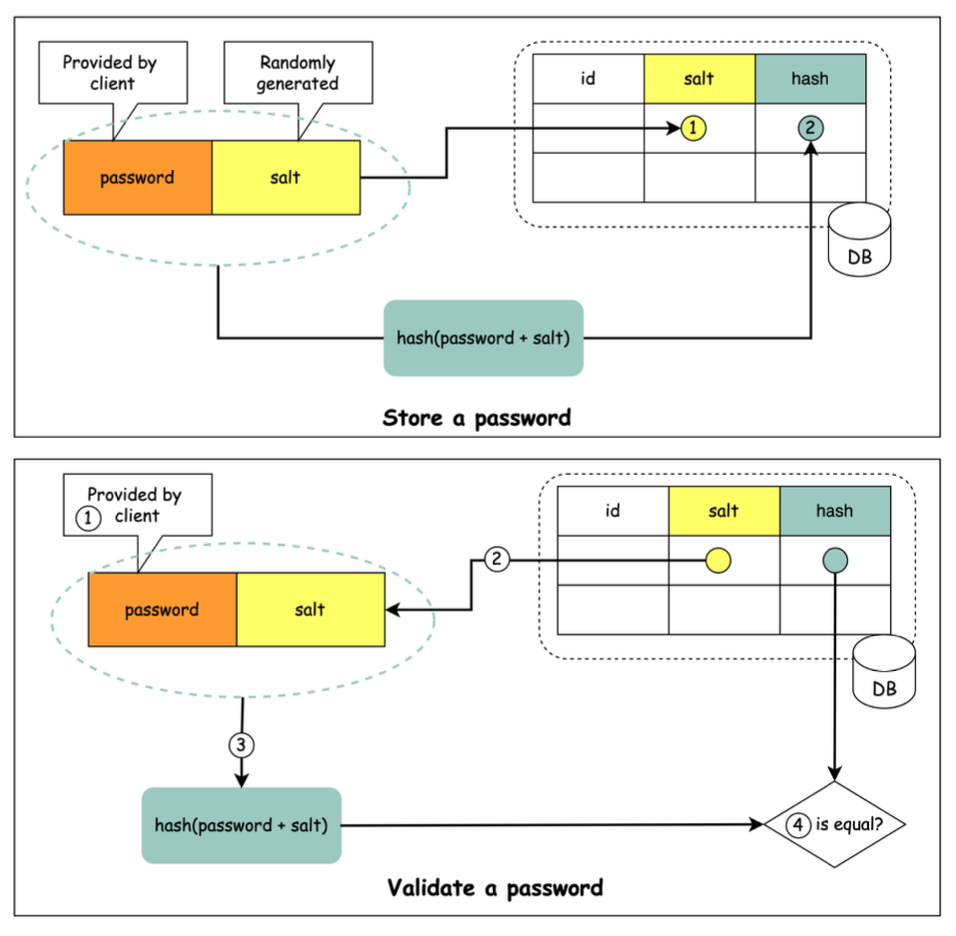

Hey security-savvy readers! We all know that passwords are the first line of defense for our digital lives. But how do services actually protect these critical secrets behind the scenes? If you think simply "hashing" a password is good enough, you might be in for a surprise. Today, we're spicing things up and talking about a fundamental technique in password security: **salting**.

Let's face it, storing passwords is a tricky business. We absolutely should *not* be doing certain things, and understanding why leads us directly to the importance of salting.

## The Password Predicament: Why Plain Hashes Aren't Enough

First, the absolute no-go: **storing passwords in plain text is not a good idea** because anyone with internal access to the database could see them. That's a recipe for disaster!

So, the next logical step is hashing, right? Hashing converts a password into a fixed-length string of characters that *should* be irreversible. Great! But **storing password hashes directly is not sufficient** on its own. Why? Because of precomputation attacks, most notably **rainbow tables**. These are essentially giant lookup tables of precomputed hashes for common passwords. If an attacker gets your database of hashes, they can compare them against their rainbow table and quickly crack many common passwords.

This is where our culinary-themed hero comes in! **To mitigate precomputation attacks, we salt the passwords**.

## Enter the Salt: Adding Flavor to Your Password Security

### What is Salt?

No, we're not seasoning our databases for better taste! In cryptographic terms, according to OWASP guidelines, **"a salt is a unique, randomly generated string that is added to each password as part of the hashing process"**.

### Why Salt? The Purpose Behind the Seasoning

The primary goal of salting is to ensure that every password hash is unique, even if multiple users choose the same password. This has two major benefits:

1. **Defeats Rainbow Tables:** Since each password is combined with a *unique* salt before hashing, precomputed rainbow tables become ineffective. An attacker would need a separate rainbow table for every possible salt, which is computationally infeasible.
2. **Unique Hashes for Same Passwords:** If two users, Alice and Bob, both choose "password123" as their password, without salt, their stored hashes would be identical. With unique salts, `hash(Alice's_salt + "password123")` will be completely different from `hash(Bob's_salt + "password123")`. This prevents an attacker from identifying users with identical passwords. The salt is used to ensure the hash result is unique to each password.

## How Salting Works in Practice: The Recipe

Let's break down the process with the help of the typical flow illustrated in system design diagrams for password storage.

### Storing a New Password (with Salt)

When a user signs up and creates a password, the system performs the following steps:

1. **Generate a Unique Salt:** For each new user (or each new password), a cryptographically strong, random salt is generated. This salt should be unique per password.
2. **Combine Password and Salt:** The unique salt is typically appended to (or prepended to, or otherwise combined with) the user's plain-text password.
3. **Hash the Combination:** The combined string (password + salt) is then fed into a strong cryptographic hash function (e.g., SHA-256, bcrypt, scrypt, Argon2).
4. **Store Salt and Hash:** Both the generated salt (which can be stored in plain text) and the resulting hash (`hash(password + salt)`) are stored in the database for that user.

It's crucial to remember that **a salt is not meant to be secret and it can be stored in plain text in the database** alongside the hash. Its security benefit comes from its uniqueness per password, not its secrecy.

### Validating a User's Password During Login

When a user tries to log in, the validation process is as follows:

1. **User Enters Password:** The user provides their username and password.
2. **Retrieve Stored Salt:** The system fetches the corresponding salt for that user from the database.
3. **Combine and Hash:** The system takes the password entered by the user, combines it with the retrieved salt in the exact same way it was done during storage, and then hashes this new combination using the same hash function. Let's call this newly computed hash `H1`.
4. **Compare Hashes:** The system compares `H1` with the hash `H2` that is stored in the database for that user.
5. **Grant or Deny Access:** If `H1` and `H2` are identical, the password is correct, and the user is authenticated. Otherwise, authentication fails.

### Why is this Approach More Secure?

By using a unique salt for every password:

* Attackers cannot use pre-computed rainbow tables effectively. They would need to generate a rainbow table for each specific salt, which is prohibitively expensive.
* Even if an attacker compromises the database and gets all the hashes and their corresponding salts, they must attempt to crack each password individually by applying the salt and trying various password guesses. This drastically slows down the cracking process for any single password and makes mass password cracking much harder.

## Key Takeaways

* Storing passwords directly, even as simple hashes, is vulnerable to attacks like rainbow tables.
* **Salting** involves adding a unique, random string to each password *before* hashing.
* The salt itself is not secret and is stored alongside the hash, but its uniqueness per password is key.
* Salting ensures that even identical passwords will have different hashes, rendering precomputed hash tables ineffective and forcing attackers to crack each password individually.

Salting is a fundamental and non-negotiable practice for secure password storage. While it's a great start, it's often combined with other techniques like using strong, slow hashing algorithms (like bcrypt or Argon2) and pepper for even more robust security.
