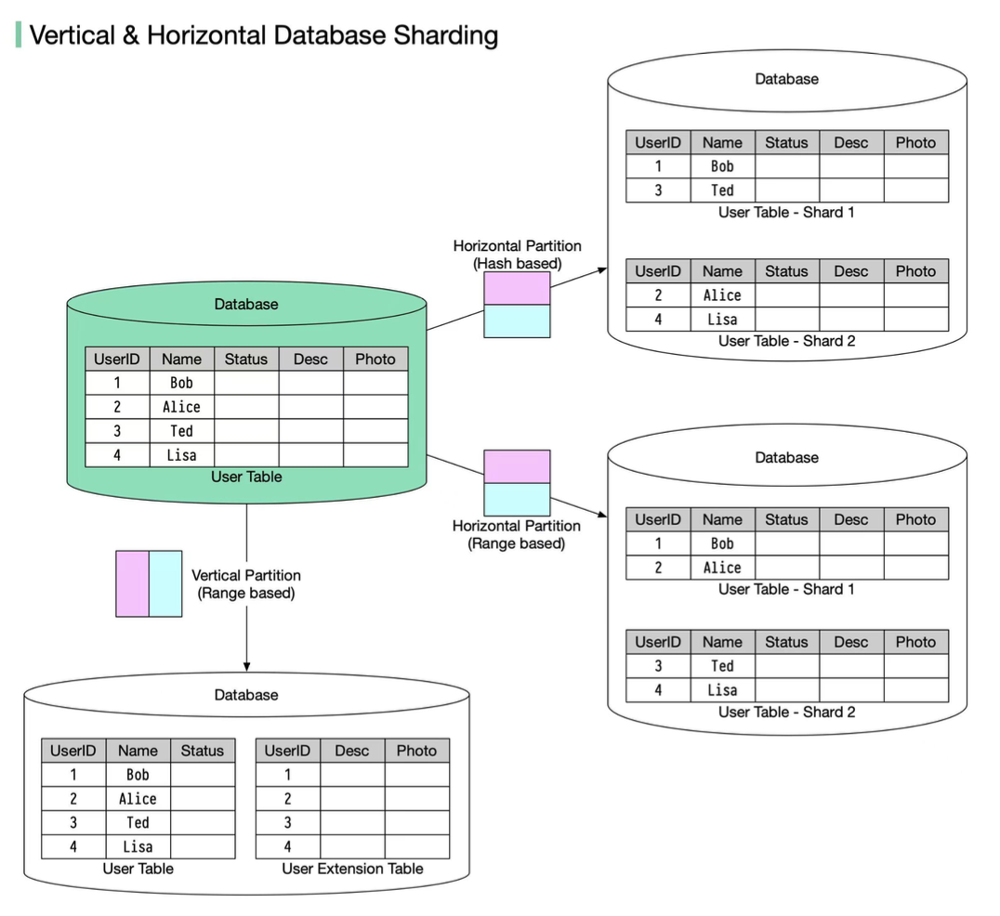
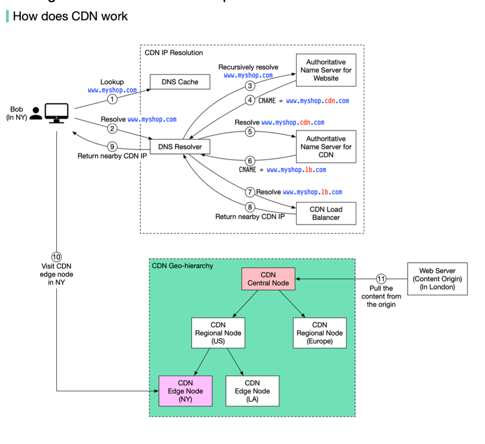

Hey everyone, and welcome back! Imagine this: you've built an amazing application. It starts small, but suddenly, word gets out, and users start flocking to it. Exciting, right? But then, the dreaded slowdowns begin, pages take forever to load, and some users even get errors. This nightmare scenario is often a symptom of an application struggling to scale.

**Scalability** is a critical attribute of any successful application. It's the system's ability to gracefully handle an increasing amount of work or users by adding resources, all while maintaining performance. Today, let's explore what application scalability truly means and dive deeper into the common strategies engineers use to ensure their creations can grow without crumbling, with a special focus on how databases, often the trickiest part, can be scaled using techniques like sharding.

## What is Application Scalability (And Why Should I Care)?

At its core, application scalability ensures your application can handle more load without compromising performance. It's about designing your system so it can quickly and easily extend to accommodate more volume (horizontal scalability) or more functionalities (vertical scalability). Often, we monitor metrics like response time to decide when it's time to scale up our resources.

There are two primary dimensions to scaling:

1.  **Horizontal Scalability (Scaling Out):** This involves adding *more machines* or servers to your resource pool to distribute the load. Think of adding more cashiers at a busy supermarket.
2.  **Vertical Scalability (Scaling Up):** This means adding *more resources* (like CPU, RAM, or storage) to an existing server, making it more powerful. This is like giving one cashier a super-fast scanner and a bigger counter.

Why is scalability so crucial?
* **User Experience:** Slow or unavailable applications lead to frustrated users.
* **Business Continuity:** Ensures your service remains operational even as demand grows.
* **Cost Efficiency:** Well-designed scalable systems can also scale *down* during off-peak hours, saving costs (especially with auto-scaling).

## Core Strategies for Scaling Your Application

Achieving scalability isn't about a single magic bullet; it's about employing a combination of well-thought-out strategies. Let's delve deeper into each:

### 1. Load Balancing

A load balancer acts like a traffic cop for your application, distributing incoming network or application traffic across multiple servers.
* **How it Works:** It sits in front of your application servers and routes client requests to available servers based on various algorithms.
* **Key Functions & Benefits:**
    * **Traffic Distribution:** Prevents any single server from becoming overwhelmed.
    * **High Availability:** Enhances system availability by performing health checks on servers and rerouting traffic away from failed or unhealthy ones to healthy ones, ensuring uninterrupted service.
    * **Improved Performance & Scalability:** By distributing the load, it allows the application to serve more users and handle more requests than a single server could. It facilitates horizontal scaling by managing the increased traffic across newly added servers.
    * **SSL Termination:** Load balancers can offload SSL/TLS encryption and decryption tasks from backend servers, reducing their workload.
    * **Session Persistence (Stickiness):** For applications requiring a user's session to be maintained on a specific server, load balancers can ensure subsequent requests from that user are sent to the same server.
* **Types of Load Balancers:** These can be hardware devices, software applications, or cloud-based services. They can operate at different network layers:
    * **Layer 4 (Transport Layer):** Make decisions based on IP addresses and TCP/UDP ports.
    * **Layer 7 (Application Layer):** Make more intelligent decisions based on HTTP headers, cookies, or message content.
* **Common Algorithms:** Include Round Robin (sequential distribution), Sticky Round Robin (maintaining session persistence), Weighted Round Robin (prioritizing servers with more capacity), IP/URL Hash (routing based on request attributes), Least Connections (sending to server with fewest active connections), and Least Response Time (sending to server with fastest response).

### 2. Horizontal Scaling (Scaling Out)

This strategy involves adding more server instances to your application cluster to distribute the workload.
* **How it Works:** As traffic increases, new servers are added to the pool, and the load balancer distributes requests among them.
* **Key Enabler - Stateless Services:** Designing your application services to be **stateless** is crucial for effective horizontal scaling. A stateless service doesn't store any client-specific session data on the server instance itself. Any session state required is typically stored in an external shared store (like a distributed cache or database).
    * **Why Statelessness is Key:**
        * **Interchangeability:** Any server instance can handle any client request, simplifying load balancing.
        * **Elasticity:** Easy to add or remove instances based on demand without losing session data.
        * **Resilience:** If one instance fails, requests can be seamlessly routed to other healthy instances without data loss.

### 3. Vertical Scaling (Scaling Up)

This involves increasing the resources (CPU, RAM, disk capacity, network bandwidth) of your existing servers.
* **How it Works:** You upgrade the hardware or resource allocation for a server to make it more powerful.
* **Pros:**
    * Can be simpler to implement initially, especially for monolithic applications, as it doesn't necessarily require changes to the application architecture to handle distributed logic.
    * Can improve the performance of resource-intensive single-threaded applications.
* **Cons:**
    * **Hard Limits:** There's a physical and practical limit to how much you can scale up a single server.
    * **Cost:** High-end server hardware can be very expensive, and costs often increase non-linearly.
    * **Single Point of Failure:** If that single, powerful server fails, the entire application can go down unless it's part of a high-availability setup (e.g., with a standby server).
    * **Downtime for Upgrades:** Scaling up might require downtime to upgrade hardware.

### 4. Caching

Caching involves storing frequently accessed data in a faster, temporary storage layer (the cache) to reduce latency and lessen the load on slower backend systems, particularly databases.
* **How it Works:** When data is requested, the system first checks the cache. If the data is present (a "cache hit"), it's served quickly from the cache. If not (a "cache miss"), the data is fetched from the primary data store (e.g., database), served to the client, and also stored in the cache for future requests.
* **Impact & Benefits:**
    * **Reduced Latency:** Reading from an in-memory cache (like Redis) is significantly faster than reading from a disk-based database.
    * **Reduced Database Load:** Offloads read requests from the database, allowing it to handle more writes or more complex queries.
    * **Increased Throughput:** The overall system can handle more concurrent users and requests.
* **Cache Locations:** Caching can occur at multiple levels: client-side (browser cache), CDN, load balancer, application server memory, dedicated distributed cache services (e.g., Redis, Memcached), and even within the database itself (e.g., bufferpool, materialized views ).
* **Challenges:** Cache invalidation (ensuring stale data is removed or updated), cache eviction policies (deciding what to remove when the cache is full), and maintaining cache consistency with the source of truth.

### 5. Database Scaling Strategies

Databases are often the most critical and challenging components to scale.
* **Read Replicas (Database Replication):** For applications with significantly more reads than writes, creating one or more read-only copies (replicas) of the primary database is a common strategy.
    * Write operations go to the primary database.
    * Read queries are distributed across the read replicas, reducing the load on the primary and improving read throughput.
    * **Challenge:** Replication lag – there might be a slight delay before changes written to the primary are reflected in the replicas, leading to potential eventual consistency issues for reads. Solutions include routing sensitive reads or read-after-write to primary.
* **Database Sharding (Horizontal Partitioning):** For very large datasets or extremely high write loads that a single primary database cannot handle, sharding involves dividing a large database into smaller, more manageable pieces called shards, and distributing them across multiple database servers. Each shard is a separate data store and contains the same number of columns but fewer rows.
    * **How:** Data is partitioned based on a **shard key** (e.g., user ID, geographic region). The routing algorithm decides which shard stores the data. Common sharding algorithms include:
        * **Range-Based Sharding:** Partitions data based on a range of values of the shard key (e.g., User IDs 1-1000 on Shard 1, 1001-2000 on Shard 2).
        * **Key/Hash-Based Sharding:** Applies a hash function to a shard key (e.g., customer ID) to determine which shard the data belongs to. This tends to distribute data more evenly but requires a good hash function to avoid collisions.
        * **Directory-Based Sharding:** Uses a lookup table (directory) that maps shard keys or attributes to specific shards. The client or a routing tier queries this directory to find the correct shard.
        * **Virtual Bucket Sharding (Consistent Hashing Extension):** Data is mapped to virtual buckets, which are then mapped to physical shards. This two-level mapping allows for more flexible shard management and rebalancing with minimal data movement when shards are added or removed. Consistent Hashing is an extension of hash-based sharding aimed at reducing the impact of adding/removing shards.
    * **Benefits:** Distributes data and load, enabling scaling of both read and write operations. Can improve query performance by reducing the amount of data scanned per query.
    * **Challenges:** Adds significant complexity to the application (query routing, joins across shards), database management (re-sharding, schema changes), and can lead to uneven data distribution or hotspots if the shard key isn't chosen carefully (a drawback of sharding ). The order by operation becomes more complicated.
* **Vertical Partitioning (of Data):** This strategy involves dividing a table into smaller tables by splitting its columns or moving specific, heavily accessed tables (or groups of tables related by function) to their own dedicated database servers.
    * **Example:** Separating frequently accessed user profile information from less frequently accessed archival data, or moving an "Orders" table to a separate database from a "Products" table.
    * **Benefits:** Can reduce I/O for queries that only need a subset of columns and can isolate workloads if tables are moved to different servers. Each table contains the same number of rows but fewer columns after partitioning.

### 6. Asynchronous Processing & Decoupling (Message Queues)

Not all tasks require an immediate, synchronous response to the user.
* **How:** Long-running, resource-intensive, or non-critical operations (e.g., sending notification emails, generating complex reports, processing uploaded images) can be offloaded to background worker services. A message queue (e.g., Apache Kafka, RabbitMQ) acts as a buffer between the main application and these worker services. The application publishes a "message" (representing a task) to the queue. Worker services independently consume messages from the queue and process them.
* **Benefits:**
    * **Improved Frontend Responsiveness:** The main application threads are freed up quickly to handle new user requests.
    * **Increased Resilience:** If a worker service fails, messages remain in the queue and can be processed later when the service recovers.
    * **Independent Scaling:** Worker services can be scaled independently of the main application based on the queue length or processing demand.

### 7. Microservices / Service-Oriented Architecture (SOA)

For complex applications, decomposing a monolithic system into a collection of smaller, independent, and deployable microservices can significantly improve scalability.
* **How:** Each microservice focuses on a specific business capability (e.g., user management, product catalog, order processing).
* **Benefits:**
    * **Independent Scaling:** Each microservice can be scaled horizontally or vertically based on its individual load and resource needs, without affecting other services.
    * **Technology Diversity:** Different microservices can potentially be built with different technology stacks best suited for their specific tasks.
    * **Fault Isolation:** Failure in one microservice is less likely to bring down the entire application.
    * **Improved Development Agility:** Smaller, focused teams can develop, deploy, and maintain their respective microservices independently.

### 8. Content Delivery Network (CDN)

A CDN is a geographically distributed network of proxy servers and their data centers.

* **How:** CDNs cache static content (like images, videos, CSS, JavaScript files) at "edge locations" closer to end-users. When a user requests content, it's served from the nearest CDN edge server rather than the origin server. The DNS resolution process often involves routing the user to the optimal CDN edge server based on their location. If an edge CDN server cache doesn't contain the content, it goes upward to regional or central CDN servers, or even to the origin server.
* **Benefits:**
    * **Reduced Latency:** Users experience faster load times due to content being served from a nearby location.
    * **Offloading Origin Servers:** Reduces the load on your application's origin servers, freeing them up to handle dynamic requests.
    * **Global Reach & Availability:** Improves content availability and resilience against traffic spikes or regional outages.

### 9. Auto-Scaling

This is the capability of a system to automatically adjust the amount of computational resources allocated to an application based on its current load or other defined metrics (e.g., CPU utilization, memory usage, network traffic, queue length).
* **How:** Cloud platforms and orchestration tools (like Kubernetes) provide auto-scaling features. You define policies that trigger scaling actions.
    * **Scale-Out:** Automatically adding more instances when load increases.
    * **Scale-In:** Automatically removing instances when load decreases.
* **Benefits:**
    * **Maintains Performance:** Ensures the application has sufficient resources to handle peak loads without degradation.
    * **Cost Optimization:** Saves money by reducing allocated resources during periods of low demand.
    * **Improved Availability:** Can help recover from instance failures by automatically launching new instances.

## The Journey: From One Server to Millions of Users

The path to scaling often follows an evolutionary pattern, applying these strategies as needed:

1.  **Start Simple:** A monolithic application with a local database on a single server might suffice initially.
2.  **Separate Concerns:** The first logical step is often to separate the application server from the database server.
3.  **Handle More Traffic:** As user numbers grow, deploy a cluster of application servers and introduce a load balancer to distribute requests.
4.  **Alleviate Database Bottlenecks:** Implement database read replicas to offload read queries from the primary.
5.  **Further Database Scaling:** If the database is still a bottleneck, consider adding a caching layer or, for more significant loads, implementing database partitioning/sharding.
6.  **Modularize for Agility & Scale:** For complex systems, break down the monolith into more manageable, independently scalable microservices or a service-oriented architecture.

This journey underscores that different scalability strategies become relevant at different stages of an application's growth and complexity.

## Key Takeaways

* Application scalability is crucial for handling growth, maintaining user experience, and ensuring business continuity.
* A rich set of strategies exists, including load balancing, horizontal/vertical scaling, aggressive caching, various database scaling techniques (replication, sharding, partitioning), asynchronous processing via message queues, and architectural patterns like microservices, complemented by CDNs and auto-scaling.
* Designing for statelessness and leveraging automation (like auto-scaling) are powerful enablers for elastic scalability.
* There's no one-size-fits-all solution; the right approach involves a thoughtful combination of these strategies tailored to your application's specific bottlenecks and growth patterns.

Scalability isn't a feature you just bolt on at the end; it's a fundamental aspect of system design that demands ongoing consideration, monitoring, and adaptation as your application evolves.
