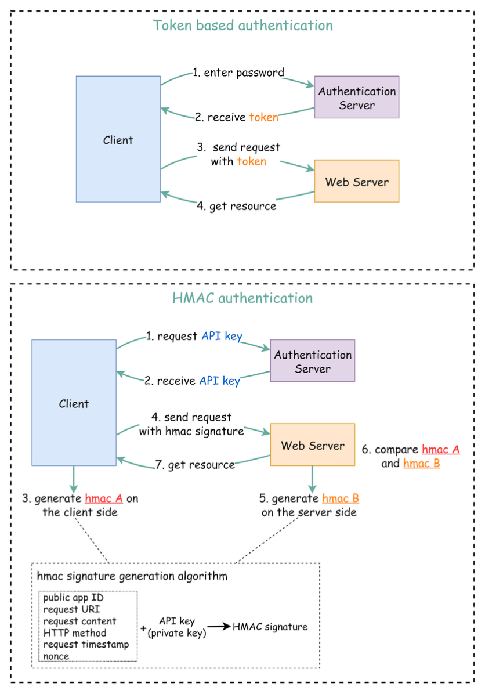
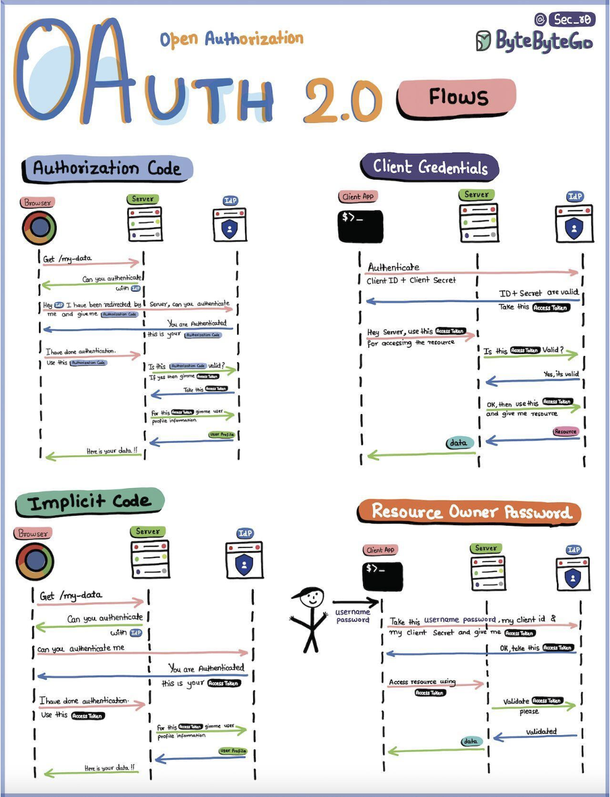

Hey everyone, and welcome back to the blog! In today's interconnected digital world, Web APIs (Application Programming Interfaces) are the essential bridges that allow different software systems to communicate and exchange data. They power everything from our mobile apps and single-page web applications to complex microservice architectures. But as these digital doorways open up powerful functionalities and valuable data, they also become prime targets for attackers.

Designing APIs that are not only functional and efficient but also robustly secure is no longer an afterthought—it's a fundamental requirement. When we open web API access to users, we need to make sure each API call is authenticated; this means the user must be who they claim to be. So, let's dive into some core strategies and best practices to fortify your APIs.

## Why API Security Matters More Than Ever

APIs, by their nature, expose business logic and data to clients, whether they are internal services or external third-party applications. A compromised API can lead to:

* Data breaches and theft of sensitive information.
* Unauthorized access to systems and functionalities.
* Service disruption or denial-of-service (DoS) attacks.
* Damage to reputation and loss of user trust.

Clearly, robust security is non-negotiable.

## Foundational Principles for Secure API Design

Before we jump into specific mechanisms, let's touch on some guiding principles:

* **Defense in Depth:** Security shouldn't rely on a single mechanism. A layered approach, where multiple security controls are implemented, is much more effective.
* **Principle of Least Privilege:** Grant only the minimum necessary permissions for a user or service to perform its intended function.
* **Secure by Design:** Integrate security considerations into the API design process from the very beginning, rather than trying to bolt them on later. Even clear API design, like choosing proper resource names and path patterns, can aid in applying security policies consistently.

## Core: Authentication - Verifying "Who Are You?"

The first step in securing an API is **authentication**: ensuring that the client (be it a user or another application) is genuinely who it claims to be. Every API call should be authenticated. Let's look at some common methods.

### 1. Token-Based Authentication

This is a very popular approach, especially for web and mobile applications.

* **The Flow:**
    1.  A user enters their credentials (e.g., username and password), and the client application sends these to a dedicated Authentication Server.
    2.  The Authentication Server validates the credentials. If successful, it generates an access token (often a JSON Web Token - JWT) which typically has an expiry time.
    3.  This token is returned to the client. The client then includes this token in the HTTP `Authorization` header (usually as a "Bearer" token) for all subsequent requests to the API server.
    4.  The API server, upon receiving a request, validates the token (e.g., checks its signature, expiry, and any claims) to grant or deny access. This access is valid until the token expires.

### 2. HMAC (Hash-based Message Authentication Code) Authentication

HMAC is another robust mechanism for securing API access, particularly useful for server-to-server communication. It uses a cryptographic hash function (like SHA256 or MD5) along with a shared secret (an API Key) to generate a signature for each request.

* **Key Setup:**
    * The server generates two keys for the client: a Public APP ID (which is like a public key) and a secret API Key (which is like a private key).
* **Client-Side Signature Generation:**
    1.  The client collects various attributes from the request it's about to send. These attributes typically include the public app ID, the request URI, the request content (body), the HTTP method, a current request timestamp, and a nonce (a random, unique string for each request).
    2.  It then creates a standardized string from these attributes and generates an HMAC signature (let's call it `hmac A`) by hashing this string using its secret API key.
* **Sending the Request:** The client sends the API request along with this `hmac A` signature, usually in an HTTP header.
* **Server-Side Signature Verification:**
    1.  The server receives the request and extracts the same set of attributes from it.
    2.  Using the API key stored on its side (which is the same secret shared with the client), the server independently generates its own HMAC signature (`hmac B`) for the received request attributes, using the exact same algorithm.
    3.  The server then compares `hmac A` (from the client) with `hmac B` (generated by the server).
    4.  If the signatures match, the server considers the request authentic and processes it. If not, the request is rejected.

* **Why is HMAC effective?**
    * **Data Integrity:** Including elements like the `request content` in the signature helps ensure that the message payload hasn't been tampered with during transit.
    * **Replay Attack Prevention:** The inclusion of a `request timestamp` and a `nonce` in the signature generation process is crucial for preventing replay attacks. The timestamp ensures the request is "fresh" (within an acceptable time window), and the nonce ensures that each request is unique and cannot be reused by an attacker.

### 3. API Key Authentication

This method involves assigning unique, secret strings (API keys) to client applications or users. The client then includes this key in its API requests, typically in a custom HTTP header (e.g., `X-API-Key: <your_key>`) or as a query parameter.

* **How it Works & Key Generation:**
    * When a client application registers to use an API, the API provider generates one or more API keys for that client.
    * It's good practice to generate a **unique app ID** for each client. This app ID might be public and used to identify the application making the request.
    * Along with the app ID, you can generate **different pairs of public keys (access keys) and private keys (secret keys)** to cater to different authorization levels or environments. For example, a client might have one key pair for read-only access to certain resources and another, more privileged key pair for read-write access. The "public key" part might be sent with the request, while the "private/secret key" is used to sign requests (similar to HMAC if signing is involved) or is the key itself if it's a simple bearer key.
    * The API server validates the received API key against its store of issued keys.

* **When to Use & Considerations:**
    * **Simplicity:** It's relatively straightforward to implement and use, making it convenient for straightforward access control in less sensitive environments or for granting access to certain public functionalities without needing user-specific permissions. It's often a good choice for smaller projects or internal use.
    * **Identifying Callers:** Useful for identifying the calling application for purposes like usage tracking, analytics, or applying quotas.
    * **Security Limitations:**
        * API keys are often static and long-lived. If a key is compromised, it can be misused until revoked. Regular key rotation is important.
        * Simple API key transmission (as a bearer token) doesn't inherently protect against replay attacks or ensure message integrity without additional mechanisms like HMAC.
        * They primarily authenticate the *application* making the request, not necessarily the end-user, unless the key is specifically tied to a user session (which starts to blend with token-based authentication).
    * **Leveled API Keys:** As mentioned, using different keys for different permission levels (e.g., read-only vs. read-write) enhances security by adhering to the principle of least privilege.

### 4. OAuth 2.0

OAuth 2.0 is an **open standard for access delegation**, commonly used as a way for Internet users to grant websites or applications access to their information on other websites but without giving them the passwords. It's an authorization framework, but it's often a core part of authentication flows, especially for third-party application access and enabling Single Sign-On (SSO) like experiences.

* **Core Roles in OAuth 2.0:**
    * **Resource Owner:** The user who owns the data/resource and can grant access.
    * **Client Application:** The third-party application that wants to access the Resource Owner's data.
    * **Authorization Server (IdP - Identity Provider):** The server that authenticates the Resource Owner and issues access tokens after receiving proper authorization. This is the entity the user trusts with their credentials.
    * **Resource Server:** The server hosting the protected resources (e.g., the API that serves user data). It accepts and validates access tokens.

* **How it Works (Simplified - Focusing on Authorization Code Grant, the most common flow):**
    The "Authorization Code Flow" is one of the most common and secure OAuth 2.0 grant types.
    1.  **Client Requests Authorization from User:** The Client Application (e.g., a third-party photo printing app) redirects the User (Resource Owner) to the Authorization Server (e.g., Google Photos, Facebook). The request includes the client ID, requested scopes (permissions), and a redirect URI.
    2.  **User Authenticates and Grants Consent:** The User logs into the Authorization Server (if not already logged in) and is presented with a consent screen asking if they want to grant the Client Application the requested permissions.
    3.  **Authorization Server issues Authorization Code:** If the User grants consent, the Authorization Server redirects the User's browser back to the Client Application's `redirect_uri` with an **authorization code**. This code is temporary and single-use.
    4.  **Client Exchanges Authorization Code for Access Token:** The Client Application (now with the authorization code) directly contacts the Authorization Server (this is a back-channel request, not via the user's browser) and exchanges the authorization code, along with its client ID and client secret, for an **access token** (and optionally a refresh token).
    5.  **Client Accesses Protected Resource:** The Client Application uses the obtained access token to make requests to the Resource Server (e.g., Google Photos API) to access the User's protected resources. The access token is typically sent in the `Authorization: Bearer <token>` header.
    6.  **Resource Server Validates Token:** The Resource Server validates the access token (often by checking with the Authorization Server or by validating its signature if it's a self-contained token like a JWT) and, if valid, serves the request.

* **Other OAuth 2.0 Flows (Grant Types):**
    While Authorization Code is common, other flows exist for different use cases:
    * **Implicit Grant (Legacy):** Was used by browser-based (single-page) applications. Access token returned directly to the client. Now generally discouraged in favor of Authorization Code with PKCE.
    * **Resource Owner Password Credentials Grant (Legacy):** User provides their username/password directly to the client application, which uses them to get an access token. Only used for trusted clients and generally discouraged.
    * **Client Credentials Grant:** Used for machine-to-machine authentication where the client is acting on its own behalf (not on behalf of a user), e.g., for accessing its own resources.

* **What Can an OAuth Token Do?**
    * **Single Sign-On (SSO):** OAuth tokens can facilitate SSO by allowing users to log into multiple services using one login, often via an Identity Provider that also acts as an OAuth Authorization Server.
    * **Authorization Across Systems:** Allows sharing of access rights across various systems without separate logins for each.
    * **Accessing User Profile (Scoped):** Apps get access only to the parts of a user profile that the user explicitly allows (defined by scopes).

* **When to use OAuth 2.0:**
    It's ideal for scenarios requiring controlled, delegated access to user resources by third-party applications or services without sharing the user's primary credentials. It's also a backbone for federated identity and enabling "Log in with Google/Facebook/etc." functionalities.

## Beyond Authentication: Essential Security Best Practices

Authentication is just the first step. A truly secure API incorporates multiple layers of defense:

* **Always Use HTTPS:** This is non-negotiable. Encrypt all data in transit between the client and the API server using TLS/SSL to prevent eavesdropping and man-in-the-middle attacks.
* **Strong Authorization:** Once a client is authenticated, verify that it has the necessary permissions to access the requested resource or perform the requested action. Implement the principle of least privilege. You can use leveled API keys for different access rights.
* **Input Validation:** Rigorously validate *all* incoming data—parameters, request bodies, headers—against expected formats, types, lengths, and ranges. This is your primary defense against injection attacks (like SQL injection, XSS), buffer overflows, and other malicious inputs.
* **Rate Limiting & Throttling:** Implement rate limiting to control how many requests a client can make within a specific time window. This helps protect your API from Denial of Service (DoS) attacks and abuse by misbehaving clients. Design rules based on user, action group, IP, etc..
* **Use an API Gateway:** An API Gateway can act as a single entry point for all API requests, centralizing concerns like authentication, authorization, rate limiting, request routing, logging, and monitoring.
* **Effective Error Handling:** Provide clear and helpful error messages to clients, but *never* leak sensitive internal information like stack traces, database error messages, or internal system details.
* **API Versioning:** Plan for API evolution by implementing a versioning strategy (e.g., `/api/v1/resource`, `/api/v2/resource`). This allows you to introduce breaking changes without affecting existing clients.
* **Security Headers:** Use HTTP security headers like `Content-Security-Policy`, `Strict-Transport-Security`, and `X-Content-Type-Options` to enhance browser-level security.
* **Regularly Check OWASP API Security Top 10:** The Open Web Application Security Project (OWASP) publishes a list of the most critical API security risks. Stay updated and ensure your APIs are protected against these common vulnerabilities.
* **Logging and Monitoring:** Implement comprehensive logging and monitoring to detect suspicious activities, track API usage, and diagnose issues quickly.

## Key Takeaways

* Securing web APIs is a critical, multi-faceted endeavor, essential for protecting data and business logic.
* Robust authentication (e.g., Token-based, HMAC) is the first line of defense to verify client identity.
* Beyond authentication, a defense-in-depth strategy incorporating input validation, HTTPS, authorization, rate limiting, proper error handling, and continuous monitoring is crucial.
* Leveraging tools like API Gateways and staying informed about common vulnerabilities (like those listed by OWASP) are key to maintaining a strong API security posture.

Designing secure APIs is an ongoing process of diligence and adaptation to new threats. By building security in from the start, you can create APIs that are not just powerful but also trustworthy.
