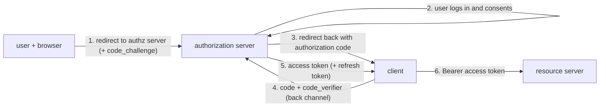

You want a photo-printing site to pull photos from your cloud drive. You could give the site your drive password — and now it can read your email too, and change your password, and you can't revoke just its access. OAuth 2.0 exists so you don't have to: you authorize the printing site for *read-only access to photos*, it gets a token scoped to exactly that, and you can revoke it without changing anything else.

OAuth is about **authorization** (what an app may do on your behalf), not **authentication** (who you are). OpenID Connect is the thin layer that adds the "who you are" part. This post is the roles, the flow you should use, the ones you shouldn't, and where it goes wrong.

## The four roles

- **Resource owner** — you, the user who owns the data.
- **Client** — the app that wants access (the printing site).
- **Authorization server** — issues tokens after you consent (the cloud drive's OAuth server, `accounts.google.com`).
- **Resource server** — the API holding the data, which accepts the token (the drive's photo API).

And two tokens:

- **Access token** — short-lived (minutes to an hour), presented to the resource server on each request (`Authorization: Bearer …`). Scoped by **scopes** (`photos.read`).
- **Refresh token** — longer-lived, presented to the *authorization server* to get a new access token without the user re-consenting. Can be revoked server-side.

## Authorization Code flow with PKCE — the one to use

This is the recommended flow for **every** client type now: web apps, single-page apps, mobile apps, desktop apps.

1. The client generates a random `code_verifier`, hashes it to `code_challenge`, and redirects the browser to the authorization server with its `client_id`, requested `scope`, a `redirect_uri`, a `state` value, and the `code_challenge`.
2. The user authenticates and approves the scopes on the authorization server's own page (the client never sees the password).
3. The authorization server redirects back to the registered `redirect_uri` with a short-lived **authorization code** and the `state`.
4. The client exchanges the code — over a direct back-channel HTTPS call, not the browser — sending the original `code_verifier`.
5. The authorization server checks that `SHA256(code_verifier) == code_challenge` and returns the access token (and optionally a refresh token).
6. The client calls the API with the access token.

**PKCE** (Proof Key for Code Exchange) is what makes this safe without a client secret: even if an attacker intercepts the authorization code (a malicious app registering the same mobile URL scheme, a leaky redirect), they can't exchange it without the `code_verifier`, which never left the client. `state` is a separate CSRF guard — the client checks the value it gets back matches the one it sent.

## Client Credentials — machine to machine

No user involved. A backend service authenticates with its own `client_id` and `client_secret` and gets an access token for its *own* access (a cron job calling an internal API). Simple; the secret must be stored securely.

## Device Code — input-constrained devices

A smart TV can't show a login form well. It displays a short code and a URL; you open the URL on your phone, enter the code, and consent there; the TV polls the authorization server until the token is ready.

## The deprecated grants, and why

- **Implicit flow** — the authorization server returned the access token *directly in the browser redirect* (in the URL fragment), skipping the code exchange. It existed because SPAs couldn't keep a client secret and CORS was immature. Now it's discouraged: tokens land in browser history, referrer headers, and logs, and there's no PKCE-style protection. Use the code flow with PKCE instead — SPAs don't need a secret with PKCE.
- **Resource Owner Password Credentials** — the user gives the *client* their username and password, and the client sends them to the authorization server. This defeats the entire point of OAuth (the client sees the password; no third-party IdP; no MFA). Only ever acceptable for a first-party app against its own auth server, and even then, prefer the code flow.

## Tokens: opaque vs JWT

- **Opaque** — a random string; the resource server calls the authorization server's **introspection** endpoint to validate it and learn its scopes. Central control (instant revocation) at the cost of a network call per validation (cacheable briefly).
- **JWT** — self-contained and signed; the resource server validates the signature and claims locally, no call. Fast, but a leaked token is valid until it expires — revocation means a short lifetime plus a deny-list. See [JWT](/citadel/interview/jwt).

Also check the **audience** (`aud`) claim — a token minted for API A must not be accepted by API B.

## OpenID Connect: the identity layer

OAuth tells the client *"this token can read photos."* It doesn't reliably tell the client *who the user is* — apps that used OAuth for "log in with Google" were bending an authorization protocol into an authentication one, with real vulnerabilities.

**OIDC** standardizes it. On top of the same code flow, the client requests the `openid` scope and gets back an **ID token** — a JWT with the user's identity claims (`sub`, `email`, `name`, plus `iss`, `aud`, `nonce`, `exp`). The client validates the ID token's signature and that its `aud` matches its own `client_id` and its `nonce` matches the one sent. There's also a `/userinfo` endpoint for more profile data, and a discovery document (`/.well-known/openid-configuration`) so clients can auto-configure.

Rule of thumb: **OAuth for "this app may call that API on my behalf"; OIDC for "log this user in."**

## Where it goes wrong

- **Redirect URI validation** — the authorization server must match `redirect_uri` exactly against a registered allowlist. Loose matching (open redirect, subdomain wildcard) lets an attacker steal the code.
- **Missing `state` / `nonce`** — CSRF and token-replay openings.
- **Token leakage** — access tokens in URLs, logs, or `localStorage` (XSS-readable). Keep them in memory or an `HttpOnly` cookie; keep them short-lived.
- **Over-broad scopes** — request the minimum; users (and reviewers) notice an app asking for `mail.write` to print photos.
- **Confused deputy / mix-up attacks** — a client that talks to multiple authorization servers must bind each response to the request it made (the `iss` parameter, RFC 9207).

## The one idea to keep

OAuth 2.0 lets you grant an app a *scoped, revocable* token to act on your behalf without sharing your password. Use the authorization-code flow with PKCE for every client type — the code is exchanged over a back channel and PKCE stops a stolen code from being redeemed — and treat the implicit and password grants as deprecated. Add OpenID Connect (the `openid` scope and an ID token) when you actually need to know who the user is, because plain OAuth only tells you what a token can do.
