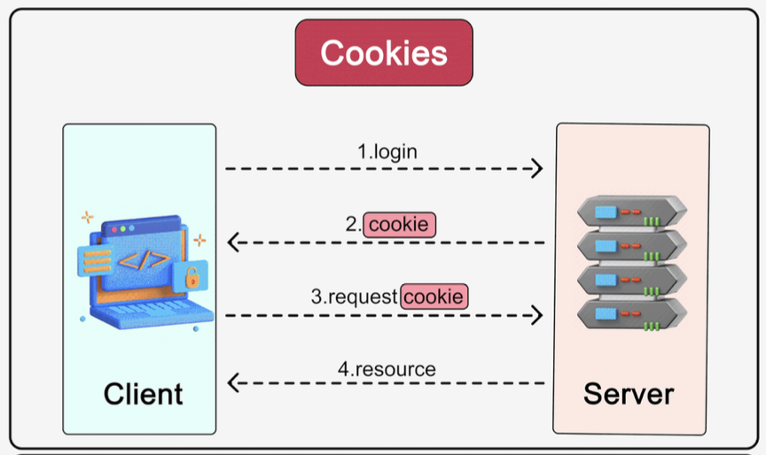
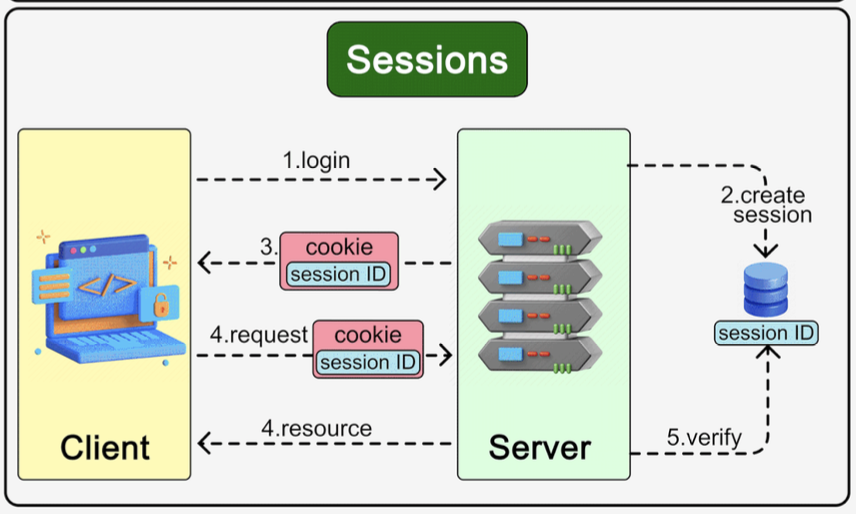

Hey everyone, and welcome back to the blog! Every time you log into a website, add items to your online shopping cart, or see personalized recommendations, you're experiencing the web's way of "remembering" you. It's a convenience we often take for granted, especially navigating the bustling digital marketplaces and services. But have you ever wondered how this "memory" works, given that the fundamental protocol of the web, HTTP, is inherently **stateless**?

The magic behind this persistence lies primarily in two concepts: **Cookies** and **Sessions**. While often used together, they play distinct roles in maintaining state and providing a continuous user experience. Let's break them down!

## The Stateless Web and the Need for Memory

HTTP, the Hypertext Transfer Protocol, is the foundation of data communication for the World Wide Web. A core characteristic of HTTP is its statelessness – each request from a client (your browser) to a server is treated as an independent transaction, completely unrelated to any previous requests. The server doesn't inherently remember anything about past interactions with a particular client.

Imagine if every time you moved to a new page on an e-commerce site, your shopping cart emptied, or you had to log in again! That would be incredibly frustrating. This is where cookies and sessions swoop in to the rescue, adding that crucial "session secret sauce" to our web interactions.

## Cookies: The Browser's Little Notepads
Cookies are small pieces of information (data) that a web server sends to a user's browser. The browser then stores these cookies on the user's device (client-side) and sends them back to the same server with each subsequent request.

* **Analogy:** Think of Bob going to his favorite coffee shop. The first time he orders, the cashier gives him a small card noting his preference: "medium-sized filter coffee, two sugars". The next time Bob visits, he shows the card to the cashier. The cashier immediately knows who he is and his coffee preference without asking again. A cookie acts much like this preference card, carrying user information between the client and server.

* **How Cookies Add State (Workflow):**
    1.  A user logs in, or a website wants to remember a preference.
    2.  The server issues a cookie containing a small amount of data (e.g., a session identifier, user preference) and sends it to the client's browser.
    3.  The browser stores this cookie locally.
    4.  On subsequent requests to the same server, the browser automatically includes the relevant cookie(s) in the HTTP headers.
    5.  The server reads the cookie data to identify the user, retrieve their session, or apply their preferences.

* **Key Cookie Attributes:** Cookies aren't just simple name-value pairs; they come with several attributes that control their behavior and security:
    * `Name=Value`: The actual data stored in the cookie.
    * `Expires=<date>` / `Max-Age=<seconds>`: Defines the cookie's lifetime. If not set, it's a "session cookie" deleted when the browser closes. If set, it's a "persistent cookie" that lasts until the expiry date/time.
    * `Domain=<domain>`: Specifies the domain(s) for which the cookie is valid. This can help in sharing cookies across subdomains (e.g., a cookie set by `example.com` could be made accessible to `api.example.com`).
    * `Path=<path>`: Defines the scope of the cookie within the domain. The cookie will only be sent for requests to URLs under this path.
    * `Secure`: If this attribute is set, the cookie will only be transmitted over an encrypted HTTPS connection, not HTTP. This is crucial for protecting sensitive cookie data.
    * `HTTPOnly`: When this attribute is set, the cookie cannot be accessed by client-side JavaScript (via `document.cookie`). This is a vital security measure to help mitigate Cross-Site Scripting (XSS) attacks where scripts try to steal cookie data.
    * `SameSite=<Strict|Lax|None>`: This attribute controls whether the cookie is sent with cross-site requests. It's a powerful defense against Cross-Site Request Forgery (CSRF) attacks.
        * `Strict`: The cookie is only sent for same-site requests.
        * `Lax`: The cookie is sent with same-site requests and top-level navigations via GET requests from other sites.
        * `None`: The cookie is sent with all requests, including cross-site ones (requires the `Secure` attribute to be set).

* **Isolation & User Control:** Browsers are designed to ensure cookie isolation, meaning cookies set by one website are not sent to another unrelated website. Users also generally have control over cookies in their browser settings, allowing them to view, delete, or even block cookies.

## Sessions: Keeping State Safe on the Server
While cookies are stored on the client-side, sessions primarily involve storing user-specific data on the **server-side**.

* **What are Sessions?**
    * When a user starts interacting with an application (e.g., logs in), the server can create a "session" to store information about that user's activity and state.
    * A unique **Session ID** is generated by the server to identify this specific session.
    * This Session ID is then sent to the client and is typically stored in a cookie on the client's browser.

* **How Sessions Work:**
    1.  User logs in or performs an action that initiates a session.
    2.  The server creates a new session, stores any relevant user data (e.g., user ID, shopping cart contents, preferences) in its session storage (which could be in-memory, a database like Redis, or a traditional database), and generates a unique Session ID.
    3.  The server sends this Session ID back to the client, usually as the value of a cookie.
    4.  On subsequent requests, the client's browser automatically sends the cookie containing the Session ID back to the server.
    5.  The server uses the received Session ID to look up the corresponding session data from its session store. This allows the server to "remember" the user's state and personalize the response.

* **Benefits of Sessions:**
    * **Enhanced Security:** Since the actual session data (which might be sensitive) is stored on the server, it's not directly exposed to or easily modifiable by the client. Only the relatively opaque Session ID is transmitted back and forth.
    * **Larger Data Capacity:** Sessions can hold much larger amounts of data compared to the typical 4KB limit for cookies, because the data resides on the server.

## Cookies vs. Sessions: Key Differences Summarized

| Feature             | Cookies                                     | Sessions                                                      |
| :------------------ | :------------------------------------------ | :------------------------------------------------------------ |
| **Primary Storage** | Client-side (user's browser)  | Server-side  (Session ID often in a client-side cookie ) |
| **Data Held** | Small pieces of data (e.g., IDs, preferences)  | Can hold complex, larger data objects on server  |
| **Size Limit** | Typically around 4KB            | Limited by server resources (much larger)                     |
| **Security** | Data visible/modifiable by client (if not HTTPOnly/Encrypted) | Data on server more secure from direct client tamper  |
| **Performance** | Data sent with every request; no server lookup if self-contained. | Requires server-side lookup based on Session ID.               |
| **Accessibility** | Can be accessed by client-side script (if not HTTPOnly) | Data not directly accessible by client-side script.         |

## Everything Around It: Related Concepts

* **Statelessness of HTTP:** Both cookies and sessions are fundamental mechanisms to add statefulness to the otherwise stateless HTTP protocol.
* **Tokens (e.g., JWTs):** For modern API authentication, particularly in Single Page Applications (SPAs) and mobile apps, token-based authentication (like JSON Web Tokens - JWTs) is often preferred over traditional server-side sessions. JWTs are self-contained tokens that carry user claims and are digitally signed, reducing the need for server-side session storage for authentication purposes. These tokens themselves can be stored in cookies or client-side storage like `localStorage`.
* **SSO (Single Sign-On):** SSO systems, which allow users to log in once and access multiple applications, often rely on a combination of cookies, sessions, and tokens to manage and propagate a user's authenticated state across different domains and services.

## Key Takeaways

* Cookies and Sessions are essential for creating stateful, personalized experiences on the stateless web.
* **Cookies** are small pieces of data stored on the client's browser, sent with requests to help servers remember information. Their behavior is controlled by various attributes like `Secure`, `HTTPOnly`, and `SameSite`.
* **Sessions** primarily store user-specific data on the server, with a unique Session ID (often stored in a cookie) linking the client to their server-side state. This generally offers better security for sensitive session data.
* The choice between using cookies directly for state or using them to carry a session identifier depends on factors like data sensitivity, size, and security requirements.

Understanding how these "memory" mechanisms of the web function is crucial for any web developer or system designer aiming to build secure and user-friendly applications.
