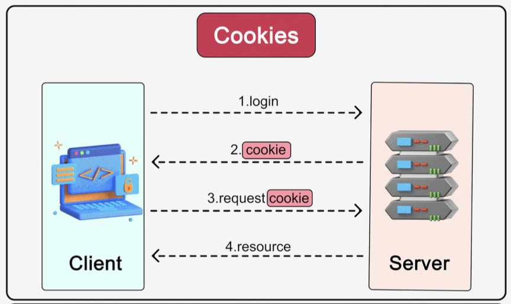

[HTTP is stateless](/citadel/interview/http) — every request stands alone, and the server remembers nothing about the last one. Yet you stay logged in, your cart survives a page change, and the site knows your preferences. Two mechanisms add that memory: **cookies** (data the browser holds) and **sessions** (data the server holds, referenced by a cookie).

## Cookies

A cookie is a small piece of data a server sends to the browser, which stores it and returns it with every subsequent request to that server.

Flow: the user logs in or sets a preference → the server issues a cookie (a session ID, a preference value) → the browser stores it → on later requests the browser attaches it automatically in the headers → the server reads it to identify the user or apply the setting.

A cookie is more than a name-value pair; its attributes control behaviour and security:

- **`Name=Value`** — the data.
- **`Expires` / `Max-Age`** — lifetime. Unset makes it a *session cookie*, deleted when the browser closes; set makes it a *persistent cookie*.
- **`Domain`** — which domains it is valid for; can widen to subdomains (`example.com` → `api.example.com`).
- **`Path`** — the URL prefix it is sent for.
- **`Secure`** — sent only over HTTPS.
- **`HttpOnly`** — not readable by JavaScript (`document.cookie`), which blocks a whole class of [XSS](/citadel/interview/secure-web-api) cookie theft.
- **`SameSite`** — whether it rides along on cross-site requests: `Strict` (same-site only), `Lax` (same-site plus top-level GET navigations), `None` (all requests, requires `Secure`). The main defence against [CSRF](/citadel/interview/secure-web-api).

Browsers isolate cookies per site and let users view, delete, or block them.

## Sessions

A session keeps the user's data on the **server**, and gives the client only an opaque **session ID** to present.

Flow: the user logs in → the server creates a session, storing the user's data (ID, cart, preferences) in a session store (in-memory, Redis, or a database) and generating a unique session ID → the ID goes to the client in a cookie → later requests return the cookie → the server looks up the session by ID and restores the user's state.

Why store server-side: sensitive data never leaves the server and cannot be tampered with by the client — only the meaningless ID is exchanged; and the data can be far larger than a cookie's ~4 KB limit.

## Side by side

| | Cookies | Sessions |
| --- | --- | --- |
| Stored | client (browser) | server (ID in a client cookie) |
| Data | small values | larger, complex objects |
| Size | ~4 KB | limited by server resources |
| Tamper resistance | client can read/modify unless `HttpOnly` + `Secure` | data on server, client sees only the ID |
| Cost per request | sent every request, no lookup | server-side store lookup |

## Where tokens fit

Modern APIs — SPAs, mobile apps — often use [JWTs](/citadel/interview/jwt) instead of server sessions: a self-contained signed token carries the user's claims, so the server verifies it without a session store lookup. The token itself lives in a cookie or in `localStorage`, each with its own [trade-offs](/citadel/interview/jwt). [SSO](/citadel/interview/sso) systems combine all three — cookies, sessions, and tokens — to carry an authenticated identity across domains.

## The choice is where the state lives

Everything here is a way to answer "who is this request from" on a protocol that will not tell you. Put the state in the cookie and the server stays stateless but the client holds (and could tamper with) the data. Put it in a server session and the data is safe but every instance needs to reach the same session store — which is why [horizontally scaled](/citadel/interview/scalability) apps externalise sessions to Redis rather than hold them in process memory.
