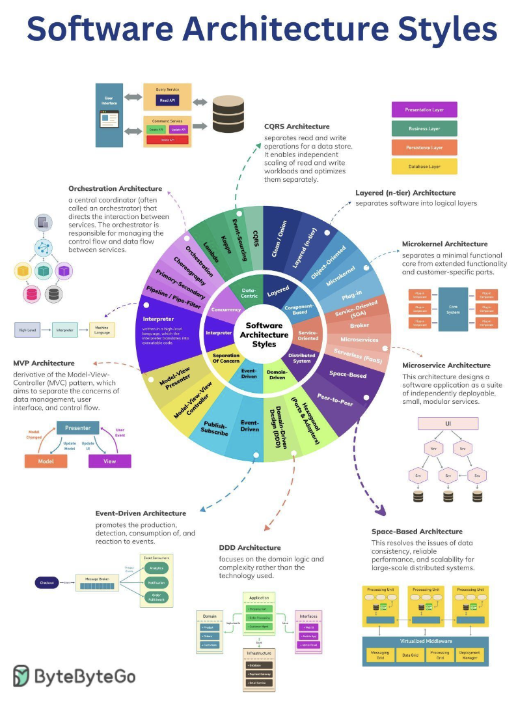

Hey everyone, and welcome back to the blog! Just like a magnificent skyscraper in Bengaluru needs a solid architectural blueprint before a single brick is laid, complex software systems require a well-thought-out **software architecture**. This isn't just about drawing boxes and arrows; it's about defining the fundamental structure, the way components interact, and the principles that guide a system's development, behavior, and evolution. The image you provided gives a fantastic overview of many common "Software Architecture Styles", and we'll touch on several of these.

Choosing the right architecture (or combination of architectures) is one of the most critical decisions in system design. It impacts everything from performance and scalability to maintainability and the speed at which new features can be delivered. Today, let's embark on an in-depth journey through various common software architectural patterns and principles, categorized for clarity.

## What Defines a Software Architecture Style?

Before we dive in, let's clarify what we mean by an "architectural style." An architectural style is a **named collection of architectural design decisions** that are applicable in a given development context. These styles **constrain architectural design decisions** for an application and result in **beneficial qualities** in each resulting system. They provide a common vocabulary and a set of established solutions to recurring problems.

## Exploring Key Architectural Styles by Category

Let's explore these styles, grouped by their overarching themes.

### A. Layered Architectures: Structuring for Clarity
This style focuses on separating software into distinct horizontal layers, each with a specific responsibility. This promotes a clear separation of concerns.

* **N-Tier Architecture:**
    * **Description:** This common approach divides an application into multiple logical tiers, or layers. A typical setup includes a Presentation Layer (UI), an Application Layer (handles business logic or coordinates tasks), and a Data Access Layer (manages data persistence). Requests generally flow from higher layers to lower layers.
    * **Pros:** Good separation of concerns, improved maintainability (changes in one layer are less likely to affect others if interfaces are stable), and testability of individual layers.
    * **Cons:** Can introduce performance overhead as requests and data pass through multiple layers. There's also a risk of creating "leaky abstractions" or unnecessary complexity if not designed carefully.
    * **Use Cases:** Web applications, enterprise applications.

* **Clean Architecture (and similar, e.g., Onion, Hexagonal):**
    * **Description:** While distinct, these share the layered philosophy with a strong emphasis on dependency inversion. Clean Architecture organizes software into concentric circles: Entities (core business objects), Use Cases (application-specific business rules), Interface Adapters (gateways, presenters, controllers), and Frameworks & Drivers (UI, DB, external devices). The key rule is that dependencies only point inwards – the core business logic knows nothing about the outer layers like UI or databases.
    * **Pros:** Highly testable core logic (independent of UI/DB), high maintainability, flexibility to change external components like databases or UI frameworks.
    * **Cons:** Can involve an initial learning curve and might seem like overkill for very simple applications.

---
### B. Component-Based Architectures: Building with Reusable Blocks
This style focuses on decomposing the design into independent, interchangeable, and reusable components.

* **Object-Oriented Design (as an influence):**
    * **Description:** While a programming paradigm, Object-Oriented principles like encapsulation (bundling data with methods that operate on that data), inheritance (allowing new classes to receive properties and methods from existing classes), and polymorphism (allowing objects to be treated as instances of their parent class) are fundamental to designing robust and modular components.
    * **Relevance:** Forms the micro-level design for how individual components in many architectures are built.

* **Microkernel Architecture (Plugin Architecture):**
    * **Description:** This pattern separates a minimal functional core (the "microkernel") from extended functionality and customer-specific parts, which are implemented as "plug-in" modules. The microkernel provides basic services and extension points, while plug-ins add specialized features.
    * **Pros:** High flexibility and extensibility (new features can be added as plugins), customizability, better isolation of features (a faulty plugin might not bring down the core).
    * **Cons:** Designing a stable and versatile microkernel API for plugins can be challenging. Performance can be a concern depending on how plugins interact with the core.
    * **Use Cases:** Integrated Development Environments (IDEs) like Eclipse or VS Code, web browsers with extensions, operating systems, enterprise applications requiring significant customization.

---
### C. Service-Oriented Architectures: Functionality as Services
This approach structures an application as a collection of distinct services that provide specific business functionalities and communicate over a network.

* **SOA (Traditional Service-Oriented Architecture):**
    * **Description:** Services in traditional SOA were often coarse-grained, representing significant business functions. Communication frequently occurred via an Enterprise Service Bus (ESB) which handled message routing, transformation, and protocol mediation.
    * **Pros:** Promotes business service reusability, interoperability between heterogeneous systems.
    * **Cons:** The ESB could become a complex bottleneck or single point of failure. Governance of many services could be challenging.

* **Broker Pattern (often used in SOA/EDA):**
    * **Description:** A central broker component (or middleware) manages the communication and coordination between otherwise decoupled service producers and consumers. It handles message routing, transformation, and can mediate different protocols.
    * **Pros:** Excellent for loose coupling, allows services to evolve independently, can improve overall system resilience.
    * **Cons:** The broker itself needs to be highly available and scalable to avoid becoming a bottleneck.

* **Microservices Architecture:**
    * **Description:** An evolution of SOA where an application is composed of many small, independent, and autonomously deployable services. Each service is typically responsible for a single business capability and often manages its own database ("database-per-service" pattern). Communication is via lightweight protocols (e.g., REST APIs, gRPC) or asynchronous messaging.
    * **Key Supporting Components:** API Gateway (single entry point for clients), Service Discovery (how services find each other), Load Balancers.
    * **Pros:** Independent scaling of services, technology diversity (different services can use different stacks), fault isolation, faster development and deployment cycles for individual services.
    * **Cons:** Increased operational complexity (managing potentially hundreds of services), challenges with distributed transactions, more complex end-to-end testing.

* **Serverless Architecture (FaaS - Function as a Service):**
    * **Description:** Developers write small, single-purpose functions that are executed in stateless compute containers managed by a cloud provider (e.g., AWS Lambda, Azure Functions, Google Cloud Functions ). Developers don't manage the underlying servers. Functions are triggered by events (e.g., an HTTP request, a message in a queue, a file upload).
    * **Pros:** Automatic scaling based on demand, pay-per-use (no cost for idle time), reduced operational overhead for server management.
    * **Cons:** Potential for vendor lock-in, cold starts (latency for the first invocation if the function isn't "warm"), limitations on execution duration and resources, challenges with state management and local testing.

---
### D. Distributed System Architectures: Spreading the Load
These architectures inherently involve components located on different networked computers, communicating and coordinating their actions by passing messages.

* **Space-Based Architecture (Cloud Architecture / Tuple Space):**
    * **Description:** This pattern is designed for high scalability and elasticity, aiming to resolve issues of data consistency, reliable performance, and scalability for large-scale distributed systems. It often utilizes a "tuple space" or a highly distributed in-memory data grid. Processing units, containing application logic and often co-located with cached data, can be dynamically added or removed. Data is replicated and partitioned across these units.
    * **Pros:** Excellent scalability to handle variable and high loads, high availability through data replication and redundant processing units.
    * **Cons:** Can be complex to design, implement, and manage distributed state and consistency.
    * **Use Cases:** High-volume transactional applications (e.g., e-commerce order processing, online bidding), applications requiring extreme elasticity.

* **Peer-to-Peer (P2P) Architecture:**
    * **Description:** A decentralized architecture where all nodes (peers) have equivalent capabilities and responsibilities. Peers communicate directly with each other to share resources (files, bandwidth, compute power) without relying on a central server.
    * **Pros:** High resilience (no single point of failure if designed well), censorship resistance, scalability by adding more peers.
    * **Cons:** Discovering peers and resources can be complex. Ensuring security and data consistency across all peers is challenging. Can be difficult to manage and monitor.
    * **Use Cases:** File-sharing applications (e.g., BitTorrent), some cryptocurrencies, certain types of distributed databases or messaging systems.

---
### E. Domain-Driven Architectures: Modeling the Business
These approaches focus on aligning the software closely with the business domain it serves.

* **DDD (Domain-Driven Design):**
    * **Description:** DDD is an approach to software development that focuses on the core domain and domain logic. It emphasizes collaboration between technical and domain experts to create a sophisticated model of the domain, using concepts like Bounded Contexts, Ubiquitous Language, Aggregates, Entities, Value Objects, Repositories, and Domain Events.
    * **Impact:** DDD strongly influences architectural decisions by defining clear boundaries for services (often from Bounded Contexts) and focusing on the core business logic.

* **Hexagonal Architecture (Ports and Adapters):**
    * **Description:** Also known as Ports and Adapters, this pattern aims to create loosely coupled application components by isolating the core application logic (the "hexagon") from external concerns such as the UI, database, messaging systems, or other external APIs. The core application defines "ports" (which are essentially interfaces defining how it wants to interact), and "adapters" are created to bridge these ports to specific external technologies or tools.
    * **Pros:** Makes the core application logic highly testable in isolation (independent of UI or database). Improves maintainability and adaptability as external technologies can be swapped out by changing adapters without affecting the core.
    * **Cons:** Can introduce an initial learning curve and might lead to some boilerplate code for adapters.

---
### F. Event-Driven Architectures (EDA): Reacting to What Happens
EDA is a paradigm where the flow of the system is determined by events—significant occurrences or changes in system state. It promotes the production, detection, consumption of, and reaction to these events.
* **Key Components:**
    * **Event Producer:** Generates and publishes an event.
    * **Event Channel (Event Broker/Message Bus):** A middleware component (e.g., Kafka, RabbitMQ) that receives events from producers and routes them to interested consumers.
    * **Event Consumer:** Subscribes to specific types of events and processes them when they occur.
* **Publish-Subscribe (Pub-Sub) Pattern:**
    * **Description:** A core messaging pattern in EDA. Publishers (event producers) emit events to topics or channels without directly knowing who the subscribers (event consumers) are. Subscribers register their interest in one or more topics and receive only the events published to those topics, typically via an event broker.
    * **Pros:** Extremely loose coupling between producers and consumers, enhances scalability (consumers can be scaled independently), allows for asynchronous communication and greater resilience.
    * **Cons:** Can make the overall system flow harder to trace and debug. Message ordering guarantees and exactly-once processing can be complex to achieve depending on the broker and design. Eventual consistency is often a characteristic.

---
### G. Separation of Concerns in UI: MVP, MVVM (User Interface Architectures)
These patterns are primarily focused on structuring applications that have a user interface, applying the Separation of Concerns principle.

* **MVP (Model-View-Presenter):**
    * **Description:** A derivative of the older Model-View-Controller (MVC) pattern, MVP aims to separate the concerns of data management (Model), user interface (View), and control flow/logic (Presenter). The View is typically passive and delegates user input events to the Presenter. The Presenter then interacts with the Model to retrieve or update data and updates the View accordingly.
* **MVVM (Model-View-ViewModel):**
    * **Description:** The View is responsible for the UI. The Model represents the application's data and business logic. The ViewModel sits between them, exposing data from the Model in a way that is easily consumable by the View (often through data binding) and handling commands from the View.
* **Pros (for both):** Improves testability (Presenter/ViewModel logic can be unit tested without the UI), better separation of responsibilities leading to more maintainable code.
* **Cons:** Can introduce additional complexity and boilerplate, especially for very simple UIs.

---
### H. Interpreter Architecture
This pattern defines a grammatical representation for a language and an interpreter to execute statements or expressions written in that language.
* **Components:** Typically involves a context (to store global information), abstract expression interfaces, and concrete expressions (terminal and non-terminal) that implement the interpretation logic.
* **Use Cases:** SQL query engines, compilers for scripting languages, regular expression parsers, business rule engines.

---
### I. Concurrency & Data Flow Patterns (Influencing Overall Architecture)
These are less about the top-level application structure and more about how control flow, data flow, and concurrent execution are managed *within* or *between* components of various architectures.

* **Orchestration:**
    * **Description:** A central coordinator (the "orchestrator") explicitly directs and manages the interactions between a set of services to achieve a larger workflow or business process. The orchestrator contains the control flow logic.
    * **Pros:** Centralized visibility and control over the workflow, often easier error handling and transaction management for complex processes.
    * **Cons:** The orchestrator can become a bottleneck or single point of failure if not designed for high availability. Can lead to tighter coupling if the orchestrator becomes too intelligent about individual services.
* **Choreography:**
    * **Description:** Services interact more autonomously based on events they publish or consume, without a central controller. Each service knows its responsibility and reacts to events from other services.
    * **Pros:** Highly decoupled services, better scalability and resilience of individual services.
    * **Cons:** Overall workflow can be harder to understand and monitor. Distributed error handling and ensuring data consistency across choreographed services can be complex.
* **Primary-Secondary (Leader/Follower):**
    * **Description:** A common pattern for achieving fault tolerance and data consistency in distributed systems. One node acts as the primary (leader), handling write operations and coordinating. Other nodes act as secondaries (followers), replicating data from the primary and ready to take over if the primary fails.
    * **Use Cases:** Databases (e.g., read replicas ), distributed consensus protocols.
* **Pipeline / Pipe-Filter Architecture:**
    * **Description:** Data flows through a sequence of independent processing steps called "filters," connected by "pipes". The output of one filter becomes the input for the next.
    * **Pros:** Simple and modular, promotes reusability of filters, easy to understand the data flow, allows for parallel processing of different data items through the pipeline or even parallel execution of some filter stages.
    * **Cons:** Can be inefficient if data needs significant transformation between incompatible filter formats. Less suitable for interactive systems.
    * **Use Cases:** Data processing and transformation pipelines (ETL), compilers (lexical analysis -> parsing -> semantic analysis -> code generation), batch processing systems.

---
### J. Data-Centric Processing Architectures (Architectures for Big Data & Analytics)
These architectures are specifically tailored for handling and processing large volumes of data, often involving distinct stages for batch and stream processing.

* **Lambda Architecture:**
    * **Description:** A data-processing architecture designed to handle massive quantities of data by taking advantage of both batch and stream-processing methods. It typically has three layers:
        * **Batch Layer:** Precomputes results from all historical data (master dataset).
        * **Speed Layer (Streaming Layer):** Processes real-time data to provide low-latency views on recent data, compensating for the latency of the batch layer.
        * **Serving Layer:** Combines outputs from the batch layer and speed layer to answer queries.
    * **Pros:** Robust, fault-tolerant, can handle a wide variety of queries on both historical and real-time data.
    * **Cons:** Can be complex to implement and maintain due to dual processing paths. Potential for code duplication between batch and speed layers.
* **Kappa Architecture:**
    * **Description:** An alternative to the Lambda architecture that aims for simplification by using a single stream processing engine for both real-time processing and reprocessing of historical data. All data is treated as a stream.
    * **Pros:** Simpler architecture with less code duplication compared to Lambda.
    * **Cons:** Reprocessing large historical datasets through a stream processor can be challenging or slow. Maturity of stream processing engines for all types of batch-equivalent tasks is a factor.
* **Event Sourcing:**
    * **Description:** Instead of storing just the current state of data, event sourcing captures all changes to an application state as a sequence of immutable "events". The current state can be reconstructed by replaying these events. The event store becomes the primary source of truth.
    * **Pros:** Provides a complete audit log of all changes, enables temporal queries (what was the state at a specific time?), makes debugging easier, can be a foundation for EDA and CQRS.
    * **Cons:** Reconstructing state by replaying many events can be slow if not optimized (e.g., with snapshots). Querying the current state can be less direct than in state-oriented systems.
* **CQRS (Command Query Responsibility Segregation):**
    * **Description:** As mentioned earlier, CQRS separates the model for updating data (Commands) from the model for reading data (Queries). This often involves using different data stores or data structures optimized for writes and reads respectively.
    * **Pros:** Allows independent scaling and optimization of read and write operations, can improve performance and security.
    * **Cons:** Increased architectural complexity, potential for eventual consistency between the read and write stores if they are physically separate and synchronized asynchronously.

## Key Takeaways

* Software architecture provides the essential blueprint for building robust, scalable, and maintainable systems.
* A rich tapestry of architectural patterns and styles exists, each designed to address specific challenges and offer distinct trade-offs. The "Software Architecture Styles" visual gives a great map of many of these.
* Understanding these patterns – from Layered and Component-Based to Service-Oriented, Distributed, Domain-Driven, Event-Driven, and Data-Centric approaches – empowers architects and developers to make informed decisions.
* Principles like Separation of Concerns and specific patterns for UI (MVP/MVVM) or data/control flow (Orchestration, Pipe-Filter) further refine how systems are structured.

No single architecture is a silver bullet. The best solutions often involve a thoughtful combination of patterns tailored to the specific context, business needs, quality attributes, and technical constraints of the project. The art of software architecture lies in choosing and adapting these blueprints to build something truly remarkable and enduring.
